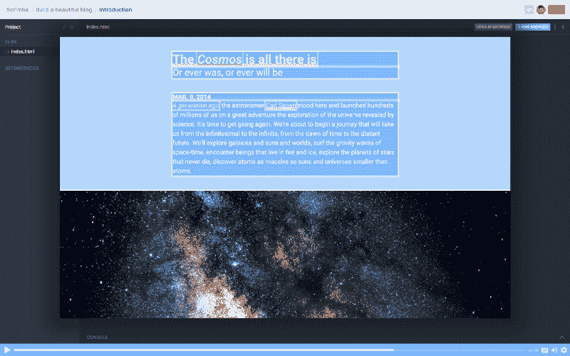
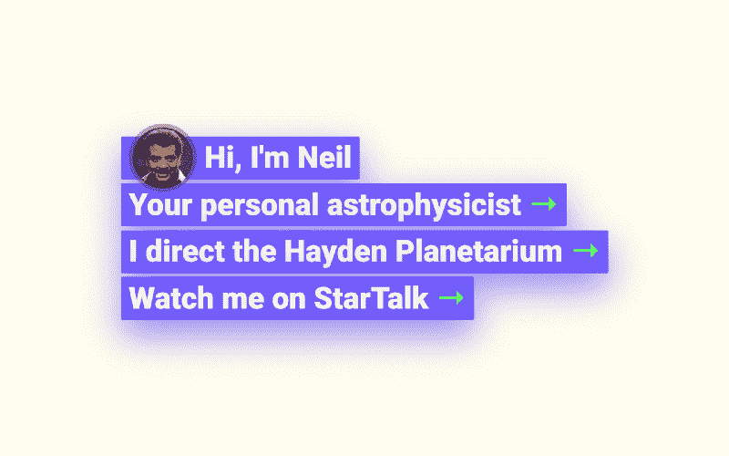
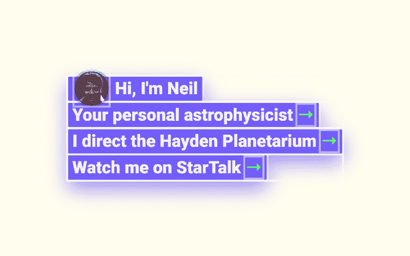
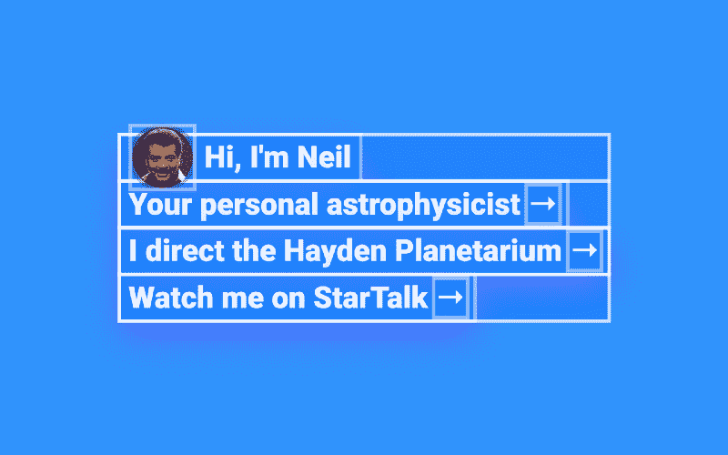
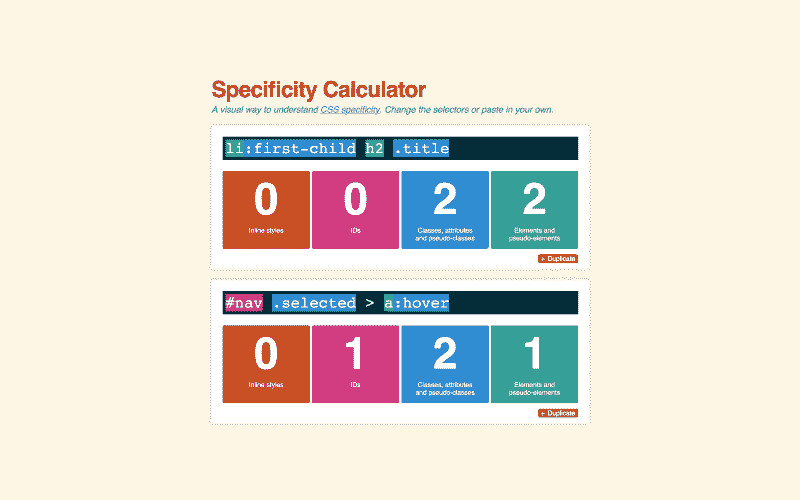
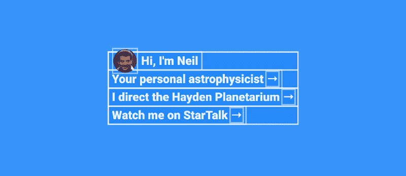
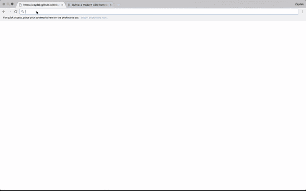

# 学这个怪怪的？调试 CSS 的技巧

> 原文：<https://www.freecodecamp.org/news/heres-my-favorite-weird-trick-to-debug-css-88529aa5a6a3/>

作者 ZAYDEK

#### 设计师讨厌他！？

# 学这个怪怪的？调试 CSS 的技巧

#### *不是点击诱饵*

在我开始写这篇文章之前，我只想分享我正在开发一个产品，我很乐意收集一些关于如何更好地为 web 开发人员服务的数据。我创建了一个[简短问卷](https://twitter.com/username_ZAYDEK/status/1103914471267790854)在阅读这篇文章之前或之后进行检查。请检查一下，谢谢！现在，回到我们的常规节目。

嗨！？我是扎德克！当我第一次开始学习如何制作网站时，它比预期的要痛苦得多。毕竟，我是一名经验丰富的平面设计师和程序员——网站怎么会这么难呢？

在本文中，我详细介绍了导致我创建 CSS 调试器的决定。



[Click here](https://scrimba.com/g/gbuildablog) to open in Scrimba

#### 我还在 Scrimba 上教授了一门免费的 HTML/CSS 课程，教你如何从零开始创建一个漂亮的博客。[点击这里报名吧！](https://scrimba.com/g/gbuildablog)？

#### Scrimba.com 是一个交互式前端平台，网站被记录为事件，而不是视频，并且可以编辑！？

### 什么是调试器？

Donald Knuth 有一句关于调试的名言。解释一下，事情是这样的。

> 有人:“最好的编程语言是什么？”

> 唐纳德·克努特:“哪个调试器最好？”

直到 CSS 我才开始欣赏这个想法。编程语言有这种合理性，逻辑超过了意见。但是 CSS 不一样，因为 CSS“感觉”固执己见。

那么我们能做什么呢？好吧，我们可以听听 Donald Knuth 的好建议，使用调试器！

如果编程语言是一种工具，调试器就是我们用来理解我们的工具——我们的代码的工具。不是所有的科幻爱好者都喜欢调试器，我理解这一点。

不要让电脑做我们不懂的事情。我认为这是有价值的，但我在这里谈论的是揭示原本看不见的结构。

采取以下措施:



[Click here](https://scrimba.com/c/c4vW9Hg) to open in Scrimba’s playground

我们怎样才能看到我们网站的结构？我知道有两种解决方案:我们可以制定一次性的 CSS 规则来强调一个元素，或者我们可以使用 Chrome、Firefox 或 Safari 的调试器工具。但这多少还是一次性的解决方案。我们需要的是一个**通用**解决方案。

### 我们的调试器

不久前我在设计这个标题，它并不简单。目的是将图像悬停在多行文本上。应该很简单吧？

CSS 是对手吗？给你。在 Photoshop 中原本简单的事情在 CSS 中可能变成英雄之旅，这让我开始尝试 o `utline:`

```
* { outline: solid 0.25rem hsla(210, 100%, 100%, 0.5); }
```



[Click here](https://scrimba.com/c/cJMVJfM) to open in Scrimba’s playground

没什么特别的——只是柔和的白色线条。然而，我们所拥有的是一个适用于所有元素的规则，只要我们使用一个`*`而不是`id`、`class`或`element`的名字。

然而,`* { … }`的推出对我来说意义深远。我想，“我哪里不想要这个？”所以我增加了几行代码，开发了一个更正式的调试器:

```
* {    color:                    hsla(210, 100%, 100%, 0.9) !important;    background:               hsla(210, 100%,  50%, 0.5) !important;    outline:    solid 0.25rem hsla(210, 100%, 100%, 0.5) !important;}
```



[Click here](https://scrimba.com/c/c9kg4fZ) to open in Scrimba’s playground

进步很多！在这里，我们为我们的网站创建了一个类似示意图的感觉。我小心翼翼地不使用纯色，而是选择柔和的颜色或带有 alpha 通道的颜色，这样嵌套的元素看起来颜色更深，用更蓝的 T2 蓝和更白的 T4 白。我还添加了`!important`，因为臭名昭著的 CSS [特异性战争](https://en.wikipedia.org/wiki/cascading_style_sheets#specificity)。

有时我们会觉得 CSS 在搞鬼的是级联如何以及何时应用。也就是，“为什么样式有时被应用，有时不被应用？”

这不是薛定谔的 CSS，是简单的数学。CSS 使用一个[简单的计算器](https://specificity.keegan.st/)来确定哪些规则更具体，结果决定是否应用 CSS。



An [implementation](https://specificity.keegan.st/) of CSS’s specificity calculator

所有特殊性的母体是`!important`，它覆盖了所有内联、id、类和元素规则。[与帝国](https://stuffandnonsense.co.uk/archives/css_specificity_wars.html)相比，这就像是死星。尽管事实上一般不鼓励使用`!important`，但它对于调试器来说是完美的——因为我们不会让我们的网站“打开”相反，我们只是在网站的设计和开发中使用调试器。

我使用调试器越多，就越意识到使用`*:not(path):noth(g)`作为选择器是更好的选择。这样，我就不会从矢量图形中得到多余的线条。我还注意到禁用`box-shadow`更干净，因为调试器不需要深度感。

这是最终的调试器:

```
*:not(path):not(g) {    color:                    hsla(210, 100%, 100%, 0.9) !important;    background:               hsla(210, 100%,  50%, 0.5) !important;    outline:    solid 0.25rem hsla(210, 100%, 100%, 0.5) !important;
```

```
 box-shadow: none !important;}
```



[Click here](https://scrimba.com/c/cRVVPSD) to open in Scrimba’s playground

我认为*我们*人类讨厌我们不了解的东西。CSS 也不例外。它被误解了，因为它被误解了。我提议:**把 CSS 当成一把双刃剑。它既可以用来构建网站，也可以用来解构网站**。没错，CSS 不是 Photoshop，但这不代表它不能做 Photoshop 做不到的事情。创建我们自己的调试器*是*我们*能*做的一件事。

### 如何使用这个调试器？

1.  前往[zaydek.github.io/debug.css](https://zaydek.github.io/debug.css)
2.  书签“调试 CSS”([源代码此处](https://gist.github.com/zaydek/6b2e55258734deabbd2b4a284321d6f6))
3.  单击书签以将其*打开*和*关闭*？



#### 别忘了 Scrimba 上的免费 HTML/CSS 课程,我在那里教你如何从头开始创建一个漂亮的博客。[点击这里报名吧！](https://scrimba.com/g/gbuildablog)？

