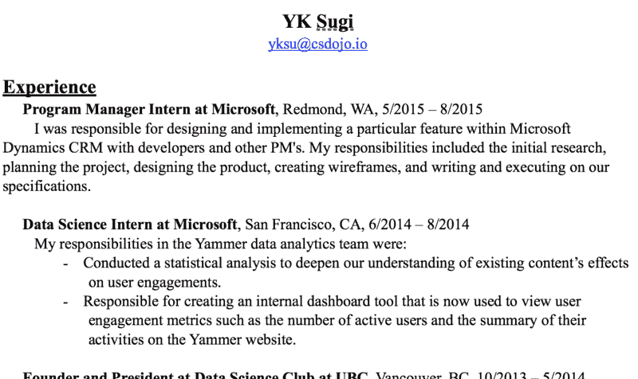
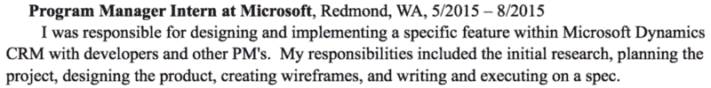
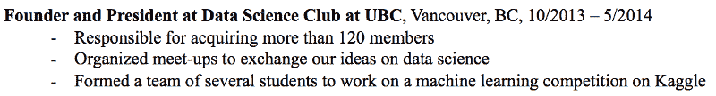
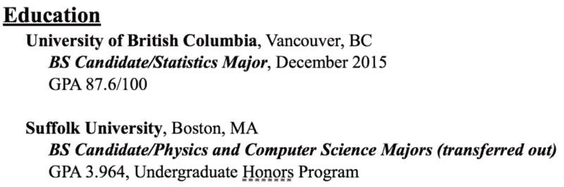

# 这是我用来在谷歌找一份软件工程师工作的简历。

> 原文：<https://www.freecodecamp.org/news/heres-the-resume-i-used-to-get-a-job-at-google-as-a-software-engineer-26516526f29a/>

作者 YK·杉

# 这是我在谷歌找到一份软件工程师工作的简历。

大家好！

在我的名为 [CS Dojo](https://www.youtube.com/csdojo) 的编程教育 YouTube 频道上，许多人要求我解释我将如何着手撰写软件工程师职位的简历。

所以，这是我关于它的文章。

在本文中，我将首先带您浏览一下我个人用来在谷歌获得软件工程师职位的简历。

然后，我会告诉你今天我会如何根据我从那时学到的东西来改变它。

我还会给你一些关于如何建立你自己的软件工程师简历的一般提示和建议。

我并不认为自己是写简历的专家，但希望我能根据我的个人经历，以及我为写这篇文章所做的一些研究，提供一些见解。

### 点击此处查看我的简历。

如果你愿意的话，你可以在这里下载我的简历来阅读这篇文章。

### 该结构

首先，让我们快速浏览一下我的简历上有哪些部分。然后，我们将依次查看每一项，更详细地讨论它们。

从顶部开始，我有:

*   经验
*   教育
*   技术
*   其他技能
*   奖金；奖品
*   项目

### 经验

这是你包括你想要展示的工作经历的部分。你不必列出你曾经担任过的每一个职位。这就是为什么我没有包括我的数学辅导职位。与我的其他技术性更强的职位相比，它没那么重要。

如果你有重要的相关非工作经验，你也可以把它放在这里。例如，如果您领导了一个编码竞赛团队，您可能希望将它包含在这里。你也可以把它放在项目部分，但是它会在经验部分更突出。

在我的经验部分，我有四个职位:

*   微软项目经理实习生
*   微软数据科学实习生
*   UBC(不列颠哥伦比亚大学)数据科学俱乐部创始人兼主席
*   Moneytree(日本的一家初创公司)的软件开发实习生

我们以第一个位置为例来看一下。

在我的简历中，是这样的:

标题的结构如下:

**<头衔>在<公司>，< Lo** 阳离子>，<日期>如:

**微软项目经理实习生，华盛顿州雷蒙德市，2015 年 5 月至 2015 年 8 月**

这是一种相当标准的格式。

然后，在它下面，我有一个我所做的事情的描述:

> 我负责与开发人员和其他项目经理一起设计和实现 Microsoft Dynamics CRM 中的特定功能。我的职责包括最初的研究，计划项目，设计产品，创建线框，编写和执行规范。

#### 今天我会如何改变它

当你写简历时，不要想当然地认为读者知道所有的专业术语，尤其是公司特有的术语。在上面的描述中，我提到了微软动态 CRM，但是很多人并不熟悉。因此，我会将其更改为以下内容:

> 我所在的团队负责 Microsoft Dynamics CRM，这是一款客户关系管理软件。我负责开发一个功能，让用户可以轻松跟踪业务支出。我的职责包括最初的研究，计划和管理项目，设计功能，创建线框，并写出我们的规格。

请注意，除了澄清术语 **Microsoft Dynamics CRM** 之外，我还添加了一个关于我具体构建了什么的快速解释。

现在，让我们来看看我在经验部分的另一个职位。

标题是:**不列颠哥伦比亚省 UBC 市数据科学俱乐部创始人兼总裁，2013 年 10 月至 2014 年 5 月**

我下面有三个要点:

*   负责收购 120 多名会员
*   组织聚会，交流我们对数据科学的想法
*   组建了一个由几名学生组成的团队，在 Kaggle 上开展机器学习竞赛

首先，注意这里项目符号的使用。有时候阅读和浏览简历会更容易。

另外，请注意我是如何在第一个要点中使用了一个特定的数字— **负责获得超过 *120 个*成员**。使用一个数字通常会让你的成就更加清晰。当然，你不会**总是**必须用一个数字。有意义的时候就用。

#### 今天我会如何改变它

我不会在这本书里做任何大的改动。只有微小的语法修改。

### 教育

当然，这是你列出相关学历的部分。

以下是我所知道的:

对于每所大学，我都有学校名称、位置、学位类型(这里是理学士学位)、专业、预计毕业日期以及列出的 GPA。

#### 关于 GPA

根据 CareerCup 上的一篇[文章，一般的经验法则是，只有当 GPA 高于 4.0 分中的 3.0 分时，才显示 GPA。我同意这个建议。](https://careercup.com/resume)

#### 今天我会如何改变它

我会让这部分保持原样。让我们进入下一部分。

### 技术

以下是我在简历的这一部分列出的内容:

*   线框图: **Balsamiq，微软 PowerPoint**
*   视觉设计: **Adobe InDesign，Photoshop，Illustrator**
*   统计分析: **R**
*   机器学习: **Python 带 NumPy 和 Pandas，Ruby，Spark(之前经验)**
*   编程技术: **SQL，MATLAB，Ruby on Rails，Java**
*   编程技术，前端: **JavaScript，HTML/CSS，LaTeX**
*   **版本控制:Git、GitHub、Bitbucket**

我想说我在这里列出了太多的事情。我会把它简化成两个:

*   数据科学: **R，带 NumPy 和熊猫的 Python，Spark(前期经验)**
*   编程技术: **SQL，MATLAB，Ruby，Ruby on Rails，Java，JavaScript，HTML/CSS**

我只列出这两个，因为其他技能在这种情况下不太相关。

另外，请注意我是如何使用***【Spark】***来表明我对 Spark 有一些经验，但我并不精通。

### **其他技能**

如果您想包含其他相关技能，可以使用本部分。我在这一节中加入了日语和公共演讲。

#### **我今天会如何改变它**

我会把这部分完全删掉，因为它与我申请的软件工程师职位没有太大关系。

### 奖项和项目

在这些区段中包括相关的奖励和项目。

“相关”这个词在这里很重要。例如，如果你在地区空手道锦标赛中获得第二名，这可能就没那么重要了。

然而，如果它真的***令人印象深刻，你可能会想把它包括进去——例如，在国家或国际级别上与空手道比赛。***

***我的简历上有一个奖项和三个项目。***

#### ***该奖项***

***这是我简历上的奖项:***

> *****TELUS / IEEE 学生创新挑战赛**
> 我们的团队在比赛中获得了第三名，我们展示了一个帮助盲人的设备的创意。我们的想法是一种将三维空间信息转换成声音的设备，这样盲人就可以通过听觉“看到”周围的环境。我们获得了 3000 美元的资助来开发一个原型。***

#### ******我将如何改变它******

***我会稍微澄清一下我的措辞，这样更容易阅读。也许类似于:***

> *****TELUS / IEEE 学生创新挑战赛**
> 在本次技术产品推介大赛上，我们展示了一个帮助盲人和视障人士的创意。我们的想法是一种将三维空间信息转换成声音的装置。它会将你面前物体的接近程度转换成声音的响度，将物体的高度转换成声音的音高。我们获得了 3000 美元的资助来开发这个想法的原型，目前我们正在开发它。***

#### ***项目***

***现在，除了这个奖项，我列出了三个我认为最令人印象深刻的项目。***

***其中一个是这个:***

> *****YamBomb！，【2014 年 8 月
> 我和我在微软的一个同事开发了一个游戏应用程序，用这个程序可以发送一个“炸弹”,这个“炸弹”会在 24 小时内“爆炸”,除非他们把它传给其他人。它从几个用户开始，在推出后一周内就有组织地增长到 70 多个用户。我们用 Ruby on Rails 和 Yammer API 开发了这个应用程序。*****

***请注意，我在这里也使用了一个特定的数字(70 个用户)。我还提到了我在这个项目中使用的技术——Ruby on Rails 和 Yammer API。(Yammer 是微软的一个网站，有点像脸书，用于公司内部交流。)***

#### *****我现在该如何改变它*****

***这里没有大的改动。***

### ***我今天会如何编辑整个简历***

***我当时用的这份简历有一个主要问题——太长了。大概有 2 页，理想情况下应该是一页。***

***让我们看看能否把它压缩到一页。***

***事实上，我可以把它压缩到一页。以下是我做的一些重大改变:***

*   ***我从体验部分拿走了 UBC 数据科学俱乐部的创始人兼主席。很好，但不如其他的相关。***
*   ***我从教育部门离开了萨福克大学。这不是太相关，因为我已经转移出来。***
*   ***我将奖项和项目部分合并成**个项目**，并且只列出了 2 个项目。***

***现在，我遗漏的信息将会是我简历上非常好的信息。只是它们没有我列出的其他事情那么令人印象深刻和相关。***

***通过省略这些信息，我的简历变得更容易、更容易阅读。***

#### ***好的，这是经过编辑的，一页长的我的简历:***

*   ***[PDF](https://www.csdojo.io/s/yk_sugi_resume_new.pdf)***
*   ***[字(。docx)](https://www.csdojo.io/s/yk_sugi_resume_new.docx)***
*   ***[页数(。页面)](https://www.csdojo.io/s/yk_sugi_resume_new.pages)***

***请随意使用它作为模板。***

### ***现在，这里有一些要点。***

#### *****1。站在招聘人员/招聘经理的角度想想。*****

***不要自动假设他们会熟悉你熟悉的每一个技术术语。想一想在你的特定领域什么是常用的，什么是不常用的。***

***此外，不断完善你的段落，使它们易于阅读。使用短句。澄清不清楚的地方。让你的一个朋友帮你读一下，以确保一切都很清楚，这可能是个好主意。***

#### *****2。省略任何不太相关的东西。*****

***说日语是一项很好的技能，但它与我申请的特定职位无关。所以，我真的没必要列出来。***

#### *****3。这不是数量的问题。这是质量的问题。*****

***如果你展示 4 个项目而不是 2 个项目，是不是总是更好？嗯，不一定。***

***简历上有更多的信息会使它变得杂乱，并且更难找到重要的信息。***

#### ***但是，你可能会说——你没有做任何一件事也能得到这份工作！***

***是的，确实如此。我认为建立一份易读的简历很重要，但更重要的是首先建立强大的技能和经验来展示在简历上。***

### ***一些额外的提示/建议***

#### ***我应该先列出学历，还是先列出工作经验？***

***一般的经验法则是，列出哪个更令人印象深刻/相关。***

***对我来说，我在微软有一些很好的经历，这比我的教育更令人印象深刻。所以我先列出来了。***

***如果你还在上学，我默认的选择是先显示你的学历。但是如果你的经历中有什么突出的地方，那么把经历部分放在第一位。***

#### ***我应该包括我的电子邮件地址，电话号码和位置吗？***

***你应该始终包括你的电子邮件地址，但除此之外，这取决于你。***

***为了简单起见，我在简历中只写了我的电子邮件地址。然而，如果你想表明你在某个地方，或者如果你想包括你的电话号码，继续这样做。***

#### ***如果我还没有那么多经验可以在简历上展示呢？***

***基本上，你应该思考到目前为止你已经获得的所有技能和经验，并思考它们可能如何导致下一步。***

***举个例子，我是这样做的:***

*   ***在我申请谷歌的前几年，我几乎没有任何经验。***
*   ***所以，我用 Ruby on Rails 搭建了一个简单的网站，这是我自己学的。***
*   ***利用这个项目，我得到了我在日本的第一份技术实习。***
*   ***利用这一点，结合我的统计学背景，我获得了微软的数据科学实习机会。***
*   ***利用这段经历和我在那里建立的关系，我获得了在微软的第二次实习机会。***
*   ***利用这些，我在谷歌找到了全职软件工程师的工作。***

***我喜欢把它想象成一个雪球。***

***开始的时候它可能很小，但是如果你继续在它的基础上发展，它就会不断成长。***

#### ***这里有一些写软件工程师简历的额外资源:***

*   ***在 CareerCup [这里](https://www.careercup.com/resume)有一个关于这个话题的很好的概述。***
*   ***我的朋友[阿智·华冲](https://www.freecodecamp.org/news/heres-the-resume-i-used-to-get-a-job-at-google-as-a-software-engineer-26516526f29a/undefined)，他是推特的一名软件工程师，在这里有一篇[关于它的好文章](https://medium.freecodecamp.org/how-to-write-a-great-resume-for-software-engineers-75d514dd8322)。***
*   ***Quincy Larson ，freeCodeCamp 的老师/创始人，也有一篇关于这个话题的好文章[在这里](https://medium.freecodecamp.org/you-in-6-seconds-how-to-write-a-r%C3%A9sum%C3%A9-that-employers-will-actually-read-fd7757740802)。***

***好吧，祝你好运，一如既往地感谢你阅读我的文章！***

***如果你对这个或其他任何事情有任何问题，请随时在下面的评论中或在 [Instagram](https://www.instagram.com/ykdojo/) 或 [Twitter](https://twitter.com/ykdojo) (两者都是@ykdojo)上告诉我。***