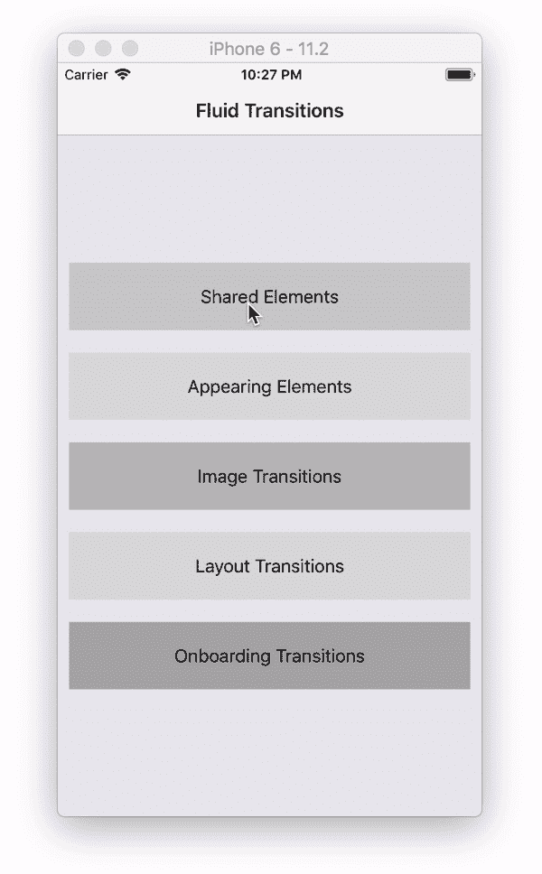
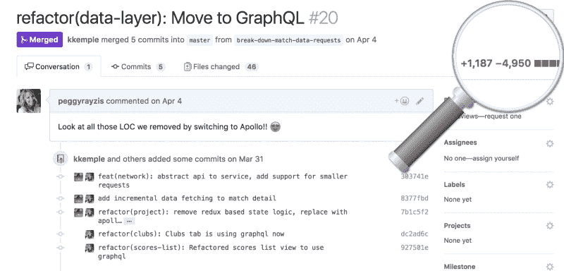

# 以下是我在世界上最大的 React 会议上学到的东西

> 原文：<https://www.freecodecamp.org/news/heres-what-i-learned-at-the-world-s-biggest-react-conference-6e97d0e8d1f8/>

杰克王子

# 以下是我在世界上最大的 React 会议上了解到的情况

4 月 13 日星期五，我和来自 [Inspire](https://www.inspire.nl/) 的三位同事参加了世界上最大的 React 大会: [React Amsterdam](https://react.amsterdam/) 。我们与来自全球的 1200 名前端和全栈开发人员齐聚欧洲的技术中心，参加了一场有超过 25 名演讲人参加的活动。

让我告诉你我在充满精彩谈话、大量咖啡，当然还有一些啤酒的一天中学到的五件事。

#### 1.反应式编程

总会有新的 JavaScript 框架需要学习。技术将继续发展和变化，开发人员将继续重写应用程序。[李美玲](https://twitter.com/ladyleet)谈到了反应式编程，它可以让你将大部分代码从一个框架复制粘贴到另一个框架。

在她的演讲中，Tracy 展示了为什么反应式编程是一种更有效的编码方式。她还讨论了它是如何被诸如网飞、Slack、微软和脸书这样的行业领导者采纳为开发应用程序的新标准的。它似乎很有前途，尤其是像 RxJS 这样的库，可以帮助开发人员用更少、更易维护的代码更快地交付复杂的特性。

越多的开发人员采用这个概念越好。

正如 Tracy 在她的博客中提到的:

> “越多的人理解反应式编程，我们作为一个现代网络就越有生产力。采用的唯一障碍是不理解范式及其周围的语言。”

我认为花一些时间学习反应式编程并不是一个坏主意，RxJS 可能是一个很好的入门库。

点击观看全文[。](https://www.youtube.com/watch?v=smBND2pwdUE&feature=youtu.be&t=23m9s)

#### 2.反应导航

当在 React 本机应用程序中实现导航时，您有两种选择:您可以使用一个为平台包装本机导航 API 的库，或者您可以使用在整个应用程序中使用的相同 React 本机原语来重新实现这些 API。在 Expo 工作的 Brent Vatne 给了他一个关于他工作的开源项目的精彩演讲: [React 导航](https://reactnavigation.org/)。

Brent 让我们清楚地了解了如何在应用中使用不同类型的导航器，如开关或堆栈导航器，让我们更好地理解了导航的工作原理。他还展示了如何使用 React 导航库实现漂亮的过渡。

除此之外，Brent 提到了选择“基于 JavaScript 的导航”而不是“基于本地”的导航的一些很好的理由。为了了解如何充分利用它，我建议阅读 React 导航库的文档，或者查看克里斯蒂安·法尔奇的这篇关于 React 导航的流畅过渡的文章。

点击观看全文[。](https://www.youtube.com/watch?v=N-X3Z5A-pW4&feature=youtu.be&t=40m5s)

[https://github.com/fram-x/fluidtransitions](https://github.com/fram-x/fluidtransitions)

#### 3.D3 和 React，一起

那天最令人印象深刻的演讲之一是关于 D3 和 React 的，作者是 Shirley Wu。D3 是一个用于构建数据可视化的库，它可以和 React 一起工作。集成 D3 和 React 的挑战在于 React 和 D3 都想控制 DOM。主要通过让 D3 做所有的计算，React 做所有的渲染，Shirley 向我们展示了如何应对这个挑战，以及为什么 D3 和 React 可以一起工作。

她还演示了这个值得一试的项目。在一大群人面前用一些现场编码结束了这次演讲，展示了为什么 Shirley Wu 是真正的交易，这也使这次演讲成为当天最有趣的演讲之一。

在[她的博客](https://medium.com/@sxywu/on-d3-react-and-a-little-bit-of-flux-88a226f328f3)上阅读更多关于这个话题的内容，或者在这里观看[的完整演讲。](https://www.youtube.com/watch?v=smBND2pwdUE&feature=youtu.be&t=2h36m)

#### 4.React 原生 VR + AR 变得简单

React 生态系统为开发人员提供了瞄准平台的机会，这些平台曾经被认为是 JavaScript 开发人员无法企及的。Nader Dabit 做了一个关于 [Viro](https://viromedia.com/) 平台的精彩演讲，该平台打开了开发增强现实和虚拟现实的大门。

如果你正在使用 [Viro React](https://github.com/viromedia/viro) ，用 React Native 创建你自己的 AR 应用实际上是非常简单和直接的。它允许你创建有趣的应用程序，如 Nader 的演示应用程序，允许用户将会议上拍摄的图片上传到虚拟房间，以及在 AR 中四处走动并与他们互动。

尽管试验这种技术很有趣，但我无法想象自己会将这种技术用于任何有用的实现。我还认为，大多数专业的 AR 和 VR 开发人员可能不会用 React Native 构建他们的东西。但是如果你有时间和足够的创造力，你可能会想看看 Viro。

点击观看全文[。](https://www.youtube.com/watch?v=N-X3Z5A-pW4&feature=youtu.be&t=2h08m30s)

[https://github.com/viromedia/viro](https://github.com/viromedia/viro)

#### 5.GraphQL 时代的反应状态管理

最后但同样重要的是，我想提一下克里斯蒂安·里斯托夫斯基(又名基茨)的精彩表演。他谈到了当 GraphQL 负责管理我们的应用程序中的数据时，状态管理库的(不)必要性。

GraphQL 是一种记录良好的数据查询语言，它为 REST 和 ad-hoc web 服务架构提供了一种替代方案。它允许您通过一个 API 调用返回复杂的数据结果。

或者像 Kitze 说的:

> “GraphQL 最终会复制 REST，但你一直告诉自己不需要学习它。”

Kitze 以一个有趣的解释开始了他愉快的谈话，解释了为什么“Rockstar-”、“Senior-”或“Ninja-”开发人员这样的术语如此愚蠢，这表明他有更多的东西要谈，而不仅仅是 GraphQL 有多棒。

他探索了所有的可能性，并比较了 React、Apollo、Redux、MobX 和 Next.js 的组合，但他没有只是称赞所有这些天才项目，而是保持真实，并谈论了实际的用例。

例如，Redux，一个被许多 react 开发人员(过度)使用的绝妙概念。连 Redux 的创造者都说:

> “肯定是炒作过度，水平低，经常不必要的使用”。

你可以从 Redux 的创造者的博客文章中了解更多，你可能不需要 Redux。

Kitz 继续并展示了一个有人在 Reddit 上问的简单问题:*“你好 Reddit，我刚刚启动了我的第一个 React 应用。我应该用什么来做网络请求？”*投票最多的答案？*“就用 redux-saga 吧。”*谁说就用 redux-saga？正如 Kitz 所说，这就像一个朋友告诉你他的房子里有一个窃听器，你告诉他使用火箭筒。

前端世界变化非常快，不同技术的战斗将永远持续下去。但问题是我们在问“什么更好？”而不是:

*   有什么适合我的 app？
*   什么适合我的团队？
*   什么适合我们的用例？

Kitz 以“当使用 GraphQL 时，我们甚至需要状态管理库吗？”这个问题结束了他的演讲答案是:可能。

这完全取决于你的项目。如果你想要一些更具体的建议，我推荐你看完整的演讲，看一些例子。

Moving from Redux to React Apollo ([https://dev-blog.apollodata.com/reducing-our-redux-code-with-react-apollo-5091b9de9c2a](https://dev-blog.apollodata.com/reducing-our-redux-code-with-react-apollo-5091b9de9c2a))

关于 Kitz 的演讲，唯一值得一提的是这些简单的建议:

*   停止寻求外部认可。
*   不要再为别人的项目寻求答案了。
*   不要对你的代码感到不安全，因为今天没有人真正知道他们在做什么。
*   看在上帝的份上:删除你的推特账号。

点击观看全文[。](https://www.youtube.com/watch?v=smBND2pwdUE&feature=youtu.be&t=5h2m44s)

#### 最后的想法

虽然除了我提到的五个演讲之外，还有很多更有趣的演讲，但并不是所有的演讲都那么吸引人和有趣。并不是每个讲座都像我们希望的那样深入，展示大量可以在网上轻易找到的文档并不能满足所有人的需求。

除此之外，大多数演讲者展示了他们的热情，总体体验非常棒！

React Amsterdam 是一个组织良好的会议，提供了很多学习的机会。希望这篇文章能让你对一些有趣的话题有所了解，你可能会想更深入地了解它们。

感谢阅读！希望这些信息是有帮助的。在 Medium 上关注我，获取更多技术相关文章，或者在 Twitter 和 Instagram @jakeprins_nl 上关注我。