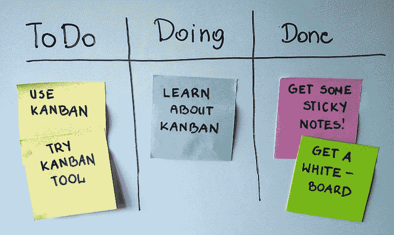

# 这是我决定成为一名自学成才的开发人员两年后的情况

> 原文：<https://www.freecodecamp.org/news/heres-where-i-am-two-years-after-deciding-to-become-a-self-taught-developer-5e8836fe2906/>

两年前，我决定将我的职业从结构工程转向软件工程。我目前的工作是开发顾问，这是我作为软件开发人员/工程师的第二份工作。我通常使用 web 应用程序。

在我转行之初，我写了[为什么转行](https://www.learnitmyway.com/2016/08/10/why-i-changed-careers/)。在这篇文章中，我将重新审视我的决定。

#### 期望和现实

科技行业正在发生许多创新。以前，我认为成为一名软件开发人员会让我更接近无人驾驶汽车和增强现实等前沿技术。开发软件应该让我的大脑适应指数变化的世界。

两年后，我没有做过任何关于自动驾驶汽车或增强现实的事情，但我肯定喜欢开发网络应用程序。我没有跟上指数级变化的世界，而是必须赶上 JavaScript。这听起来并不令人兴奋，但它确实让我的大脑保持健康！

#### 高潮和低谷

编写代码可能会令人沮丧。我最难忘的错误是用 Fortran 写论文代码的时候。不要笑！在学术界，大量的数字运算仍然在 Fortran 中进行。

在我的主管发现我在一个很长的公式中缺少括号之前，我找了六个星期。这导致操作顺序错误。

还记得 *α + β * γ* 和 *(α + β) * γ* 怎么不一样吗？

寻找 bug 一点也不好玩。不工作的软件可能非常令人沮丧，但是你从工作的软件中得到的快感胜过它。

作为开发人员，我们经常从自己编写的代码中获得即时反馈。会上瘾的。我第一次有这种感觉也是在我写论文的时候。我不得不实现一种算法，这种算法被用来使用 [MATLAB](https://www.mathworks.com/products/matlab.html) 绘制图形。我记得我第一次让它工作的时候，我是如此震惊(以一种好的方式)，以至于那天剩下的时间我都请了假。这种感觉三年后依然很牛逼。

#### 课程

对于开发者来说，学习新的东西通常是非常容易的。你可以阅读一本书，浏览媒体上的文章，完成一个教程，或者参加一个在线课程——你可以马上开始。

很高兴看到你进步的证据。我记得我刚开始实习的时候。我周五休息自学，在那里我可以学到与我正在做的项目相关的任何东西。我会在周五学到一些东西，然后在周一运用它们。太棒了，它让我很快赶上进度。

在过去的两年里，我明白了，就像任何事情一样，你越是深陷其中，你的进步就越是减速。然而，当你应用你所学的东西时，你得到的满足感仍然存在。

#### 合作

交付软件可能非常需要协作。我发现在一个敏捷团队中工作的想法特别有吸引力。我开始时没有意识到敏捷是一个多么复杂的术语！当我们与客户一起工作时，他们经常会对我们合作的紧密程度感到吃惊。

A simple Kanban board

对我们来说，[看板](https://en.wikipedia.org/wiki/Kanban)、结对编程、测试驱动开发( [TDD](https://en.wikipedia.org/wiki/Test-driven_development) )和[连续交付](https://en.wikipedia.org/wiki/Continuous_delivery)是常态，其他一切都是例外。我们还有常规的[单口相声](http://www.agiledirect.com/toolkit/glossary/#standup)、[回顾展](http://www.agiledirect.com/toolkit/glossary/#retrospective)和[展柜](http://www.agiledirect.com/toolkit/glossary/#showcase)。我期望敏捷软件开发是有效的，但是它实际上吹走了我的期望。我甚至说服了其他行业的一些朋友实施一些敏捷仪式，这也提高了他们的工作。

软件开发吸引了很多愿意与开源分享他们工作的人。有趣的是，我发现很难进入这个空间。有很多资源供开发人员提交他们的第一个拉请求，并在这里和那里做出贡献，但我仍然没有找到一个定期做出贡献的项目。然而，这并不是说我不一直使用开源软件！这确实是让我们的行业从其他行业中脱颖而出的积极因素。

#### 最后的想法

你可能知道，我对两年前做出的决定非常满意。如果你将这篇文章与我在开发人员职业生涯之初写的[为什么转行](https://www.learnitmyway.com/2016/08/10/why-i-changed-careers/)相比较，你会发现原因几乎没有变化——希望现在有更多的智慧来支持它们。

* * *

**在你离开之前……**感谢你阅读这篇文章！我写的是我作为一名自学成才的软件开发人员的职业和教育经历，所以请查看[我的博客](https://www.learnitmyway.com/)或订阅[我的时事通讯](https://learnitmyway.com/newsletter)了解更多内容。

您可能还喜欢:

*   [学习资料—软件开发](https://www.learnitmyway.com/learning-material-software-development/)是我使用过并定期更新的推荐资源列表。它从计算机科学导论开始。
*   [全栈 web 开发值得学习吗？](https://learnitmyway.com/opinion-full-stack/)
*   [将开闭原则应用于 UI 组件](https://learnitmyway.com/open-closed-ui/)