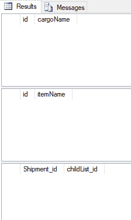
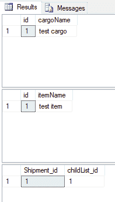
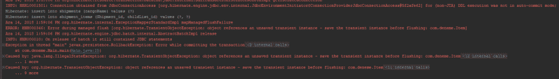
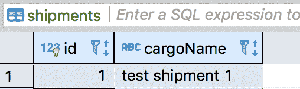
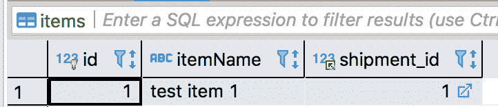

# 如何使用 Hibernate 与关系数据库交互

> 原文：<https://www.freecodecamp.org/news/hibernate-deep-dive-relations-lazy-loading-n-1-problem-common-mistakes-aff1fa390446/>

是检察官的命令

#### 处理深潜关系、惰性加载和 N+1 问题

Hibernate 是一个[对象关系映射](https://en.wikipedia.org/wiki/Object-relational_mapping)工具，它允许我们使用对象与关系数据库进行交互。它有许多特性，如代码优先建模、延迟加载、变更跟踪、缓存、审计等。

在这篇文章中，我将展示并讨论一个木偶和一个 T2 之间的关系。我们还将看到构建错误的关系或使用错误的**获取类型**的后果。我还将研究双向和单向关系。

### 不可思议

让我们从 OneToMany 单向关系开始。假设我们有一个**装运**实体，并且一个装运可能包含许多**项目**

注意:下面的代码只是向您展示实现关系的简单方法，但不建议在生产中使用。我将在代码示例的最后解释。

首先是我们的 persistence.xml:

```
<?xml version="1.0" encoding="UTF-8"?><persistence version="2.0"              xmlns:xsi="http://www.w3.org/2001/XMLSchema-instance"             xsi:schemaLocation="http://java.sun.com/xml/ns/persistence             http://java.sun.com/xml/ns/persistence/persistence_2_0.xsd">    <persistence-unit name="testConfig" transaction-type="RESOURCE_LOCAL">        <provider>org.hibernate.jpa.HibernatePersistenceProvider</provider>        <class>deneme.Shipment</class>        <class>deneme.Item</class>        <properties>            <property name="javax.persistence.jdbc.url" value="jdbc:mysql://localhost:3306/jpadb"/>            <property name="javax.persistence.jdbc.user" value="root"/>            <property name="javax.persistence.jdbc.password" value="root"/>            <property name="javax.persistence.jdbc.driver" value="com.mysql.jdbc.Driver"/>            <property name="hibernate.logging.level" value="FINE"/>            <property name="hibernate.show_sql" value="true"/>            <property name="hibernate.format_sql" value="true"/>            <property name="hibernate.ddl-generation" value="auto"/>            <property name="hibernate.hbm2ddl.auto" value="update"/>        </properties>    </persistence-unit></persistence>
```

以及我们的 pom.xml 依赖关系:

```
<dependencies><dependency>    <groupId>org.projectlombok</groupId>    <artifactId>lombok</artifactId>    <version>1.18.2</version>    <scope>provided</scope></dependency>
```

```
<dependency>    <groupId>org.hibernate</groupId>    <artifactId>hibernate-entitymanager</artifactId>    <version>5.3.3.Final</version></dependency><!-- https://mvnrepository.com/artifact/org.hibernate/hibernate-core --><dependency>    <groupId>org.hibernate</groupId>    <artifactId>hibernate-core</artifactId>    <version>5.3.3.Final</version></dependency>
```

```
<!-- https://mvnrepository.com/artifact/mysql/mysql-connector-java --><dependency>    <groupId>mysql</groupId>    <artifactId>mysql-connector-java</artifactId>    <version>5.1.6</version></dependency><dependencies>
```

以下是我们的实体:

```
@Entity@Table(name = "shipments")@Getter@Setterclass Shipment {    @Id    @GeneratedValue(strategy = GenerationType.IDENTITY)    private int id;    private String cargoName;    @OneToMany(fetch = FetchType.LAZY, cascade = CascadeType.ALL)    @JoinTable(name = "shipment_items")    private List<Item> childList;        public void addItem(Item item) {        if (childList == null) {            childList = new ArrayList();        }        childList.add(item);    }}@Entity@Table(name = "items")@Getter@Setterclass Item {    @Id    @GeneratedValue(strategy = GenerationType.IDENTITY)    private int id;    private String itemName;}
```

让我们详细说明在我们的实体中定义的注释。

@Entity 注释告诉 Hibernate 将我们的类评估为一个实体，这使得 Hibernate 在 **PersistenceContext 中跟踪它。**

@ **Table** 注释告诉 Hibernate 我们的数据库表名是什么。

@ **Getter** 和@ **Setter** 注释来自 [Lombok](https://projectlombok.org/) 以消除样板代码。

@**onet omany**(fetch = fetch type。*懒*，cascade = CascadeType。 *ALL* )注释定义了如何使用参数 FetchType.Lazy. CascadeType 从数据库中获取子对象。All 意味着它将所有操作从父级级联到子级。

@**JoinTable**(name = " shipment _ items ")注释定义了关系的所有者，即我们案例中的装运实体。它创建一个中间表来保存关系。

*因为我们只在父端使用`OneToMany`标注，所以称之为**单向**关系。因此我们不能从子端获取父对象。*

现在我们需要从 **EntityManagerFactory** 获得 **EntityManager** 来执行数据库操作。

现在我们来看看如何保存我们的实体。

```
public class Main {    public static void main(String[] args) {        EntityManagerFactory emfactory = Persistence.createEntityManagerFactory("testConfig");        EntityManager entitymanager = emfactory.createEntityManager();        Shipment shipment = new Shipment();        shipment.setCargoName("test cargo");        Item item = new Item();        item.setItemName("test item");        shipment.addItem(item);        entitymanager.close();        emfactory.close();    }}
```

当我们第一次保存实体时，Hibernate 会创建相应的表和关系。让我们看看 Hibernate 生成了哪些查询:

```
Hibernate: create table items (id int identity not null, itemName varchar(255), primary key (id))
```

```
Hibernate: create table shipment_items (Shipment_id int not null, childList_id int not null)
```

```
Hibernate: create table shipments (id int identity not null, cargoName varchar(255), primary key (id))
```

```
Hibernate: alter table shipment_items drop constraint UK_8ipo6hqqte0sdoftcqflf3hie
```

```
Hibernate: alter table shipment_items add constraint UK_8ipo6hqqte0sdoftcqflf3hie unique (childList_id)
```

```
Hibernate: alter table shipment_items add constraint FK20iu625dsmyisso2hrcc2qpk foreign key (childList_id) references items
```

```
Hibernate: alter table shipment_items add constraint FK6nronhhlbku40g81rfte2p02t foreign key (Shipment_id) references shipments
```

在我们的数据库中，当我们运行查询时:

```
SELECT * FROM shipments
```

```
SELECT * FROM items
```

```
SELECT * FROM shipment_items
```

它返回空结果:



为什么？因为我们没有将实体持久化到 entityManager 中。

让我们坚持它们:

```
shipment.addItem(item);entitymanager.persist(shipment);
```

当我们再次运行代码并检查数据库时，我们将看到仍然没有数据。那是因为我们没有开始任何交易。我们需要启动一个事务，然后在持久化之后提交它。

```
entitymanager.getTransaction().begin();entitymanager.persist(shipment);entitymanager.getTransaction().commit();
```

当我们再次运行它时，我们会看到 Hibernate 生成查询，将我们的实体保存到数据库中:

```
Hibernate: insert into shipments (cargoName) values (?)
```

```
Hibernate: insert into items (itemName) values (?)
```

```
Hibernate: insert into shipment_items (Shipment_id, childList_id) values (?, ?)
```

这里我们看到我们的数据在数据库中:



您记得我们在`OneToMany`注释中使用了`CascadeType.ALL`——那么我们为什么要使用它呢？如果我们不指定它会发生什么？

让我们将它从注释中删除:

```
@OneToMany(fetch = FetchType.LAZY)@JoinTable(name = "shipment_items")private List<Item> childList;
```

并再次坚持我们的实体:

```
entitymanager.getTransaction().begin();entitymanager.persist(shipment);entitymanager.getTransaction().commit();
```



我们在这里看到两件事:一个是 Hibernate 抛出的异常，另一个是当我们删除 cascade 类型参数时，没有生成用于保存父子关系的 SQL 语句。当然，没有数据写入数据库。

我们需要做什么？使用`CascadeType.ALL`是唯一的办法吗？当然不是，但是根据这个用例是推荐的方式。

> 关于级联类型的更多信息，请看[这里](https://vladmihalcea.com/a-beginners-guide-to-jpa-and-hibernate-cascade-types/)。

我们可以显式保存子实体，并看到我们的关系被顺利保存:

```
entitymanager.getTransaction().begin();entitymanager.persist(item);entitymanager.persist(shipment);entitymanager.getTransaction().commit();
```

现在 Hibernate 生成了正确的 insert 语句，我们可以在数据库中看到我们的数据:

```
Hibernate: insert into items (itemName) values (?)
```

```
Hibernate: insert into shipments (cargoName) values (?)
```

```
Hibernate: insert into shipment_items (Shipment_id, childList_id) values (?, ?)
```

### 处理保存的数据

好了，我们已经看到了如何将父子关系形式的实体保存到数据库中。现在是时候检索我们保存的数据了。

```
Shipment shipment = entitymanager.find(Shipment.class, 1);System.out.println(shipment.getCargoName());
```

当我们查看输出时，我们将看到生成的查询和 getCargoName()返回值:

```
Hibernate: select shipment0_.id as id1_2_0_, shipment0_.cargoName as cargoNam2_2_0_ from shipments shipment0_ where shipment0_.id=?
```

```
test cargo
```

这里没有有趣的东西。但是让我们在 shipment 对象上使用`getChildList().size()`来打印 childList 的大小。

```
Shipment shipment = entitymanager.find(Shipment.class, 1);System.out.println(shipment.getCargoName());System.out.println("Size of childList : " + shipment.getChildList().size());
```

当我们运行代码时，我们将看到一个额外的查询，它在输出中获取子对象:

```
Hibernate:
```

```
SELECTshipment0_.id AS id1_2_0_,shipment0_.cargoName AS cargoNam2_2_0_FROM shipments shipment0_WHERE shipment0_.id = ?
```

```
test cargo //the below query generated after calling getChildList() method
```

```
Hibernate:
```

```
SELECTchildlist0_.Shipment_id AS Shipment1_1_0_,childlist0_.childList_id AS childLis2_1_0_,item1_.id AS id1_0_1_,item1_.itemName AS itemName2_0_1_FROM shipment_items childlist0_INNER JOIN items item1_ON childlist0_.childList_id = item1_.idWHERE childlist0_.Shipment_id = ?
```

```
Size of childList : 1
```

这里发生的事情被称为[懒加载](https://en.wikipedia.org/wiki/Lazy_loading)。因为我们在第一次加载装运对象时定义了`fetch = FetchType.Lazy in @OneToMany`注释，所以它不会一起加载子实体。

在惰性关系中，子实体仅在您第一次访问时加载。

现在让我们来看看急切版本——我们将把 Lazy 参数改为 eager:

```
@OneToMany(fetch = FetchType.EAGER, cascade = CascadeType.ALL)
```

再次运行代码，查看输出:

```
Hibernate:
```

```
SELECTshipment0_.id AS id1_2_0_,shipment0_.cargoName AS cargoNam2_2_0_,childlist1_.Shipment_id AS Shipment1_1_1_,item2_.id AS childLis2_1_1_,item2_.id AS id1_0_2_,item2_.itemName AS itemName2_0_2_FROM shipments shipment0_LEFT OUTER JOIN shipment_items childlist1_ON shipment0_.id = childlist1_.Shipment_idLEFT OUTER JOIN items item2_ON childlist1_.childList_id = item2_.idWHERE shipment0_.id = ?
```

```
test cargoSize of childList : 1
```

我们看到没有任何额外的查询。它把所有的一切作为一个整体。(现在你可以放弃这种改变——它只是向你展示在引擎盖下发生了什么。在示例中，我们将继续使用延迟加载。)

现在让我们尝试向现有的装运添加一个项目。

```
Shipment shipment = entitymanager.find(Shipment.class, 1);Item item = new Item();item.setItemName("item to existing shipment");shipment.addItem(item);entitymanager.getTransaction().begin();entitymanager.persist(shipment);entitymanager.getTransaction().commit();
```

生成的查询:

```
Hibernate:     select        shipment0_.id as id1_2_0_,        shipment0_.cargoName as cargoNam2_2_0_     from        shipments shipment0_     where        shipment0_.id=?
```

```
Hibernate:     select        childlist0_.Shipment_id as Shipment1_1_0_,        childlist0_.childList_id as childLis2_1_0_,        item1_.id as id1_0_1_,        item1_.itemName as itemName2_0_1_     from        shipment_items childlist0_     inner join        items item1_             on childlist0_.childList_id=item1_.id     where        childlist0_.Shipment_id=?
```

```
Hibernate:     insert     into        items        (itemName)     values        (?)
```

```
Hibernate:     insert     into        shipment_items        (Shipment_id, childList_id)     values        (?, ?)
```

它选择一个装运，然后用一个连接查询获取子实体，将子实体插入到一个表中，并将 id 插入到包含关系的中间表中。

好吧，当我们考虑它时，它看起来和工作起来都像预期的那样。现在再次运行代码，将另一个商品添加到发货中。

现在仔细看看生成的查询，尤其是粗体的查询:

```
Hibernate:     select        shipment0_.id as id1_2_0_,        shipment0_.cargoName as cargoNam2_2_0_     from        shipments shipment0_     where        shipment0_.id=?
```

```
Hibernate:     select        childlist0_.Shipment_id as Shipment1_1_0_,        childlist0_.childList_id as childLis2_1_0_,        item1_.id as id1_0_1_,        item1_.itemName as itemName2_0_1_     from        shipment_items childlist0_     inner join        items item1_             on childlist0_.childList_id=item1_.id     where        childlist0_.Shipment_id=?
```

```
Hibernate:     insert     into        items        (itemName)     values        (?)
```

```
Hibernate:     delete     from        shipment_items     where        Shipment_id=?
```

```
Hibernate:     insert     into        shipment_items        (Shipment_id, childList_id)     values        (?, ?)
```

```
Hibernate:     insert     into        shipment_items        (Shipment_id, childList_id)     values        (?, ?)
```

这里发生了什么？我们在查询的末尾看到一个删除和两个插入。

*   它选择一批货物
*   用连接查询获取子节点
*   插入新项目
*   **从中间表**中删除所有以前的关系
*   **从零开始插入所有关系**

这就是为什么它会在最后生成两条 insert 语句。现在我想你可以想象如果我们有数千个子项目会发生什么。当然，我们不会使用这种技术。这是**性能**的一个**瓶颈**。

在上面的方法中，我们使用一个中间表来保存关系。正如您已经注意到的，它为插入关系生成了额外的查询。因为我们在装运实体上定义了一个`JoinTable`注释…

### 另一种方式:ManyToOne

我们如何避免这种情况？嗯，通过使用`JoinColumn`注释而不是`JoinTable.`，让我们看看如何用 JoinColumn 注释实现它。

```
@Entity@Table(name = "shipments")@Getter@Setterclass Shipment {    @Id    @GeneratedValue(strategy = GenerationType.IDENTITY)    private int id;    private String cargoName;    @OneToMany(            fetch = FetchType.LAZY,            cascade = CascadeType.ALL,            mappedBy = "shipment")    private List<Item> childList;    public void addItem(Item item) {        if (childList == null) {            childList = new ArrayList();        }        childList.add(item);        item.setShipment(this);    }}@Entity@Table(name = "items")@Getter@Setterclass Item {    @Id    @GeneratedValue(strategy = GenerationType.IDENTITY)    private int id;    private String itemName;    @ManyToOne    @JoinColumn(name = "shipment_id")    private Shipment shipment;}
```

注意:在上面的新关系模型中，有两件事需要考虑。我们向 Item 添加了 ManyToOne 和 JoinColumn 注释。我们还将 mappedBy 参数添加到 Shipment 中。

现在，为了清晰起见，让我们删除前面所有的表，重新开始。当我们第一次运行代码时，它也创建了表和关系(我把数据库从 mssql 改成了 mysql，因为我花了几天时间写了这篇文章。这就是您在下面生成的查询中看到 InnoDB 的原因):

```
Hibernate:create table items (       id integer not null auto_increment,        itemName varchar(255),        shipment_id integer,        primary key (id)    ) engine=InnoDB
```

```
Hibernate:         create table shipments (       id integer not null auto_increment,        cargoName varchar(255),        primary key (id)    ) engine=InnoDB
```

```
Hibernate:         alter table items        add constraint FKcpv8kcpjc081l551hre32f2rg        foreign key (shipment_id)        references shipments (id)
```

现在，当我们插入一个带有商品的装运时:

```
Shipment shipment = new Shipment();shipment.setCargoName("test cargo");Item item = new Item();item.setItemName("test item");shipment.addItem(item);entitymanager.getTransaction().begin();entitymanager.persist(shipment);entitymanager.getTransaction().commit();
```

Hibernate 只生成两个预期的 sql 查询:

```
Hibernate:     insert     into        shipments        (cargoName)     values        (?)
```

```
Hibernate:     insert     into        items        (itemName, shipment_id)     values        (?, ?)
```

我们的数据库记录如下所示:



从 db 选择一批货怎么样？它将如何改变我们的查询？

让我们运行下面的代码，看看我们生成的查询:

```
Shipment shipment = entitymanager.find(Shipment.class, 1);System.out.println(shipment.getCargoName());System.out.println(shipment.getChildList().size());
```

输出:

```
Hibernate:     select        shipment0_.id as id1_1_0_,        shipment0_.cargoName as cargoNam2_1_0_     from        shipments shipment0_     where        shipment0_.id=?
```

```
test cargo
```

```
Hibernate:     select        childlist0_.shipment_id as shipment3_0_0_,        childlist0_.id as id1_0_0_,        childlist0_.id as id1_0_1_,        childlist0_.itemName as itemName2_0_1_,        childlist0_.shipment_id as shipment3_0_1_     from        items childlist0_     where        childlist0_.shipment_id=?
```

首先 hibernate 从数据库中选择一个发货。然后因为我们调用了 getChildList()。size()方法，它延迟加载子实体。您是否看到在加载子实体时没有连接查询，因为没有像第一个示例中那样的中间表？

现在让我们将一个商品添加到现有的发货中，并将生成的查询与第一个示例进行比较。正如您在第一个示例中所记得的，当我们试图向现有的发货中添加一个新项目时，它会加载所有的子实体并从中间表中删除关系。然后它再次插入关系。当您处理大量数据集时，这是一个巨大的性能问题。

但是使用我们的新方法，很容易解决这个问题:

```
Shipment shipment = entitymanager.find(Shipment.class, 1);Item item = new Item();item.setItemName("item to existing shipment");shipment.addItem(item);entitymanager.getTransaction().begin();entitymanager.persist(shipment);entitymanager.getTransaction().commit();
```

它只生成了两个应该生成的查询，一个是针对发货的 select，一个是针对孩子的 insert:

```
Hibernate:     select        shipment0_.id as id1_1_0_,        shipment0_.cargoName as cargoNam2_1_0_     from        shipments shipment0_     where        shipment0_.id=?
```

```
Hibernate:     insert     into        items        (itemName, shipment_id)     values        (?, ?)
```

现在是时候向您展示使用 ORM 工具时的一个常见问题了。假设我们有 3 批货，每批货有 3 个子商品。当我们检索那些发货并试图迭代它们的子代时会发生什么？

我们插入初始数据:

```
for (int i = 1; i <= 3; i++) {    Shipment shipment = new Shipment();    shipment.setCargoName("test shipment " + i);    for (int j = 1; j <= 3; j++) {        Item item = new Item();        item.setItemName("test item " + j);        shipment.addItem(item);    }    entitymanager.getTransaction().begin();    entitymanager.persist(shipment);    entitymanager.getTransaction().commit();}
```

让我们列出数据库中的所有装运实体，并打印它们的子项目的尺寸:

```
EntityManagerFactory emfactory = Persistence.createEntityManagerFactory("Hibernate_Jpa");EntityManager entitymanager = emfactory.createEntityManager();List<Shipment> shipments = entitymanager.createQuery("select s from Shipment s").getResultList();for (Shipment shipment : shipments) {    System.out.println(shipment.getChildList().size());}entitymanager.close();emfactory.close();
```

以下是我们生成的查询:

```
Hibernate:     select        shipment0_.id as id1_1_,        shipment0_.cargoName as cargoNam2_1_     from        shipments shipment0_
```

```
Hibernate:     select        childlist0_.shipment_id as shipment3_0_0_,        childlist0_.id as id1_0_0_,        childlist0_.id as id1_0_1_,        childlist0_.itemName as itemName2_0_1_,        childlist0_.shipment_id as shipment3_0_1_     from        items childlist0_     where        childlist0_.shipment_id=?
```

```
Child item size for shipment id:1 is 3
```

```
Hibernate:     select        childlist0_.shipment_id as shipment3_0_0_,        childlist0_.id as id1_0_0_,        childlist0_.id as id1_0_1_,        childlist0_.itemName as itemName2_0_1_,        childlist0_.shipment_id as shipment3_0_1_     from        items childlist0_     where        childlist0_.shipment_id=?
```

```
Child item size for shipment id:2 is 3
```

```
Hibernate:     select        childlist0_.shipment_id as shipment3_0_0_,        childlist0_.id as id1_0_0_,        childlist0_.id as id1_0_1_,        childlist0_.itemName as itemName2_0_1_,        childlist0_.shipment_id as shipment3_0_1_     from        items childlist0_     where        childlist0_.shipment_id=?
```

```
Child item size for shipment id:3 is 3
```

这里发生的事情叫做 [**N + 1 问题。**](https://stackoverflow.com/questions/97197/what-is-the-n1-select-query-issue) 因为为选择所有发货执行了 1 个查询，为选择子实体执行了 N 个(其中 N 是发货的大小，在我们的例子中是 3)查询。

为了解决这个问题，我们有几种选择。

其中之一就是使用`BatchSize`标注。

可以调整每个查询的批处理大小。让我们将注释放在我们的关系上，并查看生成的 SQL。

```
@OneToMany(        fetch = FetchType.LAZY,        cascade = CascadeType.ALL,        mappedBy = "shipment")@BatchSize(size = 10)private List<Item> childList;
```

出于测试目的，我给出了批量大小 10。并且生成了下面的查询。

```
Hibernate:     select        shipment0_.id as id1_1_,        shipment0_.cargoName as cargoNam2_1_     from        shipments shipment0_Hibernate:     select        childlist0_.shipment_id as shipment3_0_1_,        childlist0_.id as id1_0_1_,        childlist0_.id as id1_0_0_,        childlist0_.itemName as itemName2_0_0_,        childlist0_.shipment_id as shipment3_0_0_     from        items childlist0_     where        childlist0_.shipment_id in (            ?, ?, ?        )
```

```
Child item size for shipment id:1 is 3Child item size for shipment id:2 is 3Child item size for shipment id:3 is 3
```

因为我们有 3 批货，批量是 10，所以在 where 查询中添加了 3 个货件 id。如果批量大小设置为 2，那么在 where 查询中将有 2 个装运 id。

另一个解决方案是在 jpql 中使用`fetch join`。

我们将查询改为:

```
List<Shipment> shipments = entitymanager.createQuery("select s from Shipment s join fetch s.childList").getResultList();
```

我们再次运行代码。它生成以下输出:

```
Hibernate:     select        shipment0_.id as id1_1_0_,        childlist1_.id as id1_0_1_,        shipment0_.cargoName as cargoNam2_1_0_,        childlist1_.itemName as itemName2_0_1_,        childlist1_.shipment_id as shipment3_0_1_,        childlist1_.shipment_id as shipment3_0_0__,        childlist1_.id as id1_0_0__     from        shipments shipment0_     inner join        items childlist1_             on shipment0_.id=childlist1_.shipment_id
```

```
Child item size for shipment id:1 is 3Child item size for shipment id:1 is 3Child item size for shipment id:1 is 3Child item size for shipment id:2 is 3Child item size for shipment id:2 is 3Child item size for shipment id:2 is 3Child item size for shipment id:3 is 3Child item size for shipment id:3 is 3Child item size for shipment id:3 is 3
```

哇，刚刚发生了什么？为什么打印尺寸有 9 种输出？因为 jpql 查询生成一个内部连接 SQL 查询，所以它会导致每个子查询都有重复的记录。因此，3 批货物 x 3 个孩子= 9 个重复的产出。为了避免这种重复，我们需要在 jqpl 中再添加一个关键字，即`distinct`关键字。

```
List<Shipment> shipments = entitymanager.createQuery("select distinct s from Shipment s join fetch s.childList").getResultList();
```

现在，正如预期的那样生成了输出:

```
Hibernate:     select        distinct shipment0_.id as id1_1_0_,        childlist1_.id as id1_0_1_,        shipment0_.cargoName as cargoNam2_1_0_,        childlist1_.itemName as itemName2_0_1_,        childlist1_.shipment_id as shipment3_0_1_,        childlist1_.shipment_id as shipment3_0_0__,        childlist1_.id as id1_0_0__     from        shipments shipment0_     inner join        items childlist1_             on shipment0_.id=childlist1_.shipment_id
```

```
Child item size for shipment id:1 is 3Child item size for shipment id:2 is 3Child item size for shipment id:3 is 3
```

这样我们就解决了重复的问题。

我认为这对于一个帖子来说已经足够了，因为它已经变得很长了。感谢大家阅读至此。我希望现在您已经清楚 Hibernate 是如何管理关系的，在幕后生成了哪些查询，以及如何避免一些常见的错误。

### **结论**

*   如果可以的话，我更喜欢延迟加载
*   需要时，在子实体上使用带有 ManyToOne 注释的双向关联(而不是 OneToMany)
*   尽可能把人际关系的责任交给孩子
*   为了避免 N + 1 问题，使用`BatchSize`注释或者用`fetch join`编写 jpql
*   在一对一关系上使用`JoinColumn`而不是`JoinTable`,以避免额外的连接查询

您可以在我的 github 资源库中找到示例代码: [hibernate-examples](https://github.com/mstrYoda/hibernate-examples)

**资源**

[**HIBERNATE——惯用 Java 的关系持久性**](http://docs.jboss.org/hibernate/orm/4.3/manual/en-US/html_single/#performance-fetching-batch)
[*Hibernate 不仅负责从 Java 类到数据库表的映射(以及从 Java 数据类型到 SQL 数据…*docs.jboss.org](http://docs.jboss.org/hibernate/orm/4.3/manual/en-US/html_single/#performance-fetching-batch)[**N+1 选择查询问题是什么？**](https://stackoverflow.com/questions/97197/what-is-the-n1-select-query-issue?noredirect=1&lq=1)
[*选择 N+1 通常被认为是对象关系映射(ORM)讨论中的一个问题，我理解它……*stackoverflow.com](https://stackoverflow.com/questions/97197/what-is-the-n1-select-query-issue?noredirect=1&lq=1)[**JPA 和 Hibernate 级联类型初学者指南——弗拉德·米哈尔恰**](https://vladmihalcea.com/a-beginners-guide-to-jpa-and-hibernate-cascade-types/)
[*(最后更新日期:2018 年 4 月 25 日)简介 JPA 将实体状态转换为数据库 DML 语句……*vladmihalcea.com](https://vladmihalcea.com/a-beginners-guide-to-jpa-and-hibernate-cascade-types/)