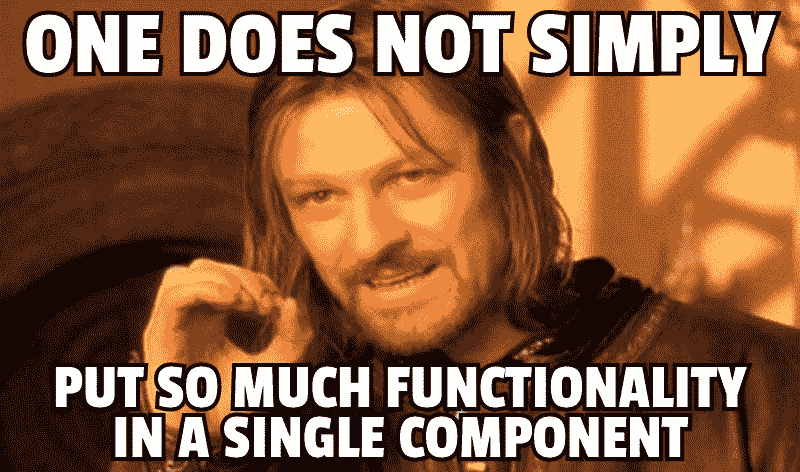

# 高阶组件:终极指南

> 原文：<https://www.freecodecamp.org/news/higher-order-components-the-ultimate-guide-b453a68bb851/>

可维护的组件结构是稳定的 React 应用程序的重要前提。您可以通过使用高阶组件(hoc)以函数方式编写代码来实现这一点。如果你坚持这种模式，你将得到可重用的组件，这些组件既可读又易于测试，因为每个组件只负责一项任务。

在本文中，我愿意分享我的经验，这样您就可以在自己的应用程序中轻松利用这种方法。你不仅将学习如何使用一个或几个 hoc 来增强你的表示组件，而且你还将理解这种模式背后的原理。

### 这个帖子为什么这么长？

当我自己开始学习 HoCs 时，我毫不费力地找到了处理这个话题的资源。然而，他们中的许多人都假定自己已经掌握了一些复杂主题的知识，比如函数式编程(FP)原理。因此，对我来说，理解引擎盖下发生的事情以及几个 hoc 的组成是如何工作的是一个挑战。

正是这一经历促使我以一种更广泛、更适合初学者的方式来写这篇文章。因此，它不仅涵盖了 hoc，还涵盖了 FP 的原理和核心思想，人们必须理解这些才能释放高阶器件的能量。

这篇文章也是基于我在慕尼黑 2017 年国际 JavaScript 大会(iJS)上的第一次技术会议演讲。你可以在 [Github](https://github.com/codinglawyer/international-javascript-conference-2017) 上找到所有的源代码。

### 入门指南

让我们从看一些代码开始:

```
const starWarsChars = [   { name:'Luke', side:'light' },   { name:'Darth Vader', side:'dark' },   { name:'Obi-wan Kenobi', side:'light'},   { name:'Palpatine', side:'dark'},]
```

```
class FilteredList extends React.Component {   constructor(props) {      super(props)      this.state = { value: this.props.defaultState }   }   updateState(value) {      this.setState({ value })   }   render() {      const otherSide = this.state.value === 'dark' ? 'light' : 'dark'      const transformedProps = this.props.list.filter(char =&gt; char.side === this.state.value)      return (         <div>            <button onClick={() => this.updateState(otherSide)}>Switch</button>            {transformedProps.map(char =&gt;               <div key={char.name}>                  <div>Character: {char.name}</div>                  <div>Side: {char.side}</div>               </div>            )}         </div>      )   }}
```

```
ReactDOM.render (   <FilteredList defaultState='dark' list={starWarsChars} />,   document.getElementById('app'))
```

是一个巨大的组件，可以做很多事情。它维护状态，并根据星战人物的侧面过滤他们的`list`。此外，它在屏幕上显示带有按钮的字符列表。

它负责所有的逻辑和表示，正因为如此，它很难被重用。

如果您决定在其他地方重用这个组件，您总是需要使用所有组件的逻辑和 UI。你不能只为某个特定的场景挑选你真正需要的功能。相反，您将被迫重写一个已经存在的行为作为一个不同的组件。



因此，这种重复的代码很难维护，尤其是在较大的应用程序中。

在本文的结尾，我们将能够使用函数式编程(FP)的原则编写出一个完全可重用的版本。

敬请关注。

### 体验函数式编程的原理

为了向您展示为什么您应该在 React 应用程序中坚持 FP 的原则，我需要谈一点关于 FP 本身的核心原则。

这个想法是将一个程序分解成简单的**可重用函数**。

所以，都是函数的问题。更准确的说，都是关于**简单函数**。这意味着每个功能应该只负责一项任务。功能越简单，可重用性越强。

#### 高阶函数

在 JavaScript 中，您可以像使用任何其他值一样使用函数。它可以作为参数传递给函数，也可以由函数返回。**返回或创建新函数**的函数称为高阶函数。

```
const numbers = [1, 5, 8, 10, 21]const createAddingFunction = number =&gt; arr => arr.map(num =&gt; num + number)const numbersPlusOne = createAddingFunction(1)console.log(numbersPlusOne(numbers))  // [2, 6, 9, 11, 22]
```

`createAddingFunctions`是高阶函数。它接受一个`number`并创建一个新函数等待数组被传递。在这个例子中，我们传递它`1`，并获得一个等待数组的新函数。我们将其存储为`numbersPlusOne`。然后我们把`numbers`数组传给它。然后，该函数遍历数组的元素，并逐个递增。

如您所见，我们正在告诉 JavaScript 引擎**我们想要做什么**——我们想要映射数组的元素。这段代码是不言自明的。你只要看到代码，马上就知道发生了什么。这样的代码被称为**声明式**。函数式编程都是关于声明性代码的。


#### 避免副作用

作为一名函数式程序员，您希望尽可能避免函数中的副作用。换句话说，一个函数不应该改变函数本身以外的任何东西。您可以在应用程序的任何地方轻松地重用这样的函数。没有副作用的函数叫**纯。给定相同的参数，它们总是返回相同的输出。**

如果你想写纯函数，你也应该避免改变你的值。这就是所谓的**不变性**原理。然而，这并不意味着你不改变你的价值观。这意味着当你想改变一个值时，你创建一个新的值，而不是改变原来的值。

然而，在 JavaScript 中，像对象和数组这样的值是可变的。为了尊重不变性原则，我们可以将值视为不可变的。

例如，遵循这个原则，您将不会意外地改变作为参数传递给函数的对象。

```
// pure functionconst numbers = [1, 5, 8, 10, 21]const createAddingFunction = number =&gt; arr => arr.map(num =&gt; num + number)const numbersPlusOne = createAddingFunction(1)console.log(numbersPlusOne(numbers))  //[2, 6, 9, 11, 22]console.log(numbers)  // [1, 5, 8, 10, 21]
```

```
// impure functionconst numbers = [1, 5, 8, 10, 21]const numbersPlusOne = numbers =&gt; {   for(let i = 0; i < numbers.length; i++) {      numbers[i] = numbers[i] + 1   }   return numbers}numbersPlusOne(numbers) // [2, 6, 9, 11, 22]console.log(numbers) // [2, 6, 9, 11, 22]
```

这里我们有一个纯函数和不纯函数的例子。在第一种情况下，我们将一个数组传递给 pure 函数并没有以任何方式影响到`numbers`数组。

然而，在第二个场景中，数组在不纯函数中发生了变异。这种行为会使您的代码变得非常不可预测。尤其是在函数式编程领域，我们希望避免这种情况。

#### 作文

现在，我们知道我们应该创建简单的纯函数。然而，如果我们需要复杂到无法存储在单个函数中的行为呢？我们可以通过使用 composition 将几个函数组合成一个新的复合函数来实现这一点。

```
const number = 15const increment = num =&gt; num + 5const decrement = num =>; num - 3const multiply = num =&gt; num * 2
```

```
const operation = increment(decrement(multiply(number)))console.log(operation)  //32
```

组合意味着我们将第一个函数调用的输出作为输入传递给第二个函数调用，将其输出传递给第三个函数，依此类推。结果，我们得到一个复合函数。

在我们的例子中，我们有一个`number`和三个函数。我们将它们包装在一起，得到一个等待`number`参数的复合函数。通过使用复合，我们不需要创建变量来存储单个函数的结果。

#### 联合的；共同的

要真正看到所有这些 FP 原则的好处，你需要将它们结合在一起。

理想情况下，您的应用程序应该由**纯函数**组成，这些函数的数据被视为**不可变的。**这意味着它们没有修改它们的上限范围，所以你可以在程序的任何部分重用它们。每个功能都应该负责一项任务，并且应该与其他功能分开。你可以直接使用它们，也可以**将它们组合在一起实现更复杂的行为。**

通过坚持 FP 原则，你将得到简单的可重用的功能，这些功能可以组合在一起。


### 函数式编程和反应

现在我们已经熟悉了 FP 的基本原理，我们可以看看如何在 React 中利用它们。

React 应用程序由组件组成。但是到底什么是组件呢？

```
// Class-based componentclass Button extends React.Component {   render(){      return <button>{this.props.title}</button>   }}
```

```
// Functional componentconst Button = (props) =>   <button>{props.title}</button>
```

因为类只是函数的语法糖，而功能组件基本上是一个函数，**组件只是函数**。这是一个函数，它接受输入数据(props)并返回一个 React 元素树(UI ),呈现在屏幕上。但是，它不需要一直返回 UI。它可以返回一个分量，就像我们后面要看到的一样。

所以 React UI 只是功能的**组合。这听起来很像 FP，对吗？**

#### 智能和演示组件

组件通常由逻辑和表示组成。然而，如果我们决定像这样编写我们所有的组件，我们将会得到几十个只有一个目的的组件。另一方面，如果我们试图[分离这些关注点](https://en.wikipedia.org/wiki/Separation_of_concerns)，我们将能够创建简单的可重用组件。按照这个想法，我们应该更喜欢将我们的组件定义为智能的(逻辑)和表示的(UI)。


表示组件负责所有的用户界面。它通常具有一个**功能**组件的形式，这只是一个呈现方法。你可以把它们想象成函数。

主要包含逻辑的组件称为**智能**。它通常处理数据操作、API 调用和事件处理程序。它通常被定义为一个**类**，因为它为我们提供了更多的功能(比如内部状态和生命周期)。

每个组件都应该负责一项任务，并且编写得非常通用，以便可以在整个应用程序中重用。这样的任务应该是逻辑(智能组件)或表示(表示组件)。应该尽量减少在单个组件中两者的组合。

*   **智能类组件**

```
class DisplayList extends Component {   constructor(props) {      super(props)      this.state = {         starWarsChars: [            { name:'Luke Skywalker', side:'light' },            { name:'Darth Vader', side:'dark' },            { name:'Obi-wan Kenobi', side:'light' },            { name:'Palpatine', side:'dark' },         ]      }   }   render() {      return (         <div>            {this.state.starWarsChars.map(char =>               <div key={char.name}>                  <div>Character: {char.name}</div>                  <div>Side: {char.side}</div>               </div>            )}         </div>      )   }}
```

```
ReactDOM.render(   <DisplayList />,   document.getElementById('app'))
```

*   **演示功能组件**

```
const starWarsChars = [   { name:'Luke', side:'light' },   { name:'Darth Vader', side:'dark' },   { name:'Obi-wan Kenobi', side:'light'},   { name:'Palpatine', side:'dark'},]
```

```
const DisplayList = ({ list }) =>   <div>      {list.map(char =&gt;         <div key={char.name}>            <div>Character: {char.name}</div>            <div>Side: {char.side}</div>         </div>      )}   </div>
```

```
ReactDOM.render (   <DisplayList list={starWarsChars} />,   document.getElementById('app'))
```

让我们来看看功能组件。它是非常可重用的，因为它只负责 UI。因此，如果您想在应用程序的其他地方显示星球大战角色的列表，您可以很容易地重用这个组件。它也没有任何副作用，因为它不会以任何方式影响它的外部范围。

您可以看到，功能组件只是一个**纯函数**，它接受 props 对象并返回相同的 UI，给出相同的 props。

React 应用程序不仅是一般功能组合，而且也可以是纯功能的**组合。**

正如我们已经知道的，纯函数是 FP 的基本构件。因此，如果我们更喜欢使用功能组件，我们将能够**应用各种 FP 技术**，比如我们代码中的高阶组件。


#### 添加更多逻辑

让我们再来看看我们的功能组件。它将《星球大战》中的角色列表作为道具，并将其呈现在屏幕上。因为它不包含任何逻辑，所以它是非常可重用的。

现在，如果我们想只显示属于黑暗面的角色呢？最简单的解决方案是过滤组件内部的`list`属性。

```
const FilteredList = ({ list, side }) =&gt; {   const filteredList = list.filter(char => char.side === side)   return (      <div>         {filteredList.map(char =&gt;            <div key={char.name}>               <div>Character: {char.name}</div>               <div>Side: {char.side}</div>            </div>         )}      </div>   )}
```

```
ReactDOM.render (   <FilteredList side='dark' list={starWarsChars}/>,   document.getElementById('app'))
```

这将达到目的。我们将`DisplayList`重命名为`FilteredList`,因为它现在包含了过滤功能。我们现在也根据哪个列表将被过滤来传递`side`属性。

然而，这是理想的解决方案吗？如您所见，`FilteredList`组件不再可重用。因为过滤功能隐藏在其中，这个组件几乎不能被重用。

如果我们想在应用程序的其他地方显示字符而不进行任何过滤，我们需要创建另一个组件。此外，如果我们想在其他组件中使用 filter 函数，我们也必须复制这个行为。

幸运的是，有一个更优雅和声明性的解决方案，让我们保持我们的表示组件可重用。我们能够在角色列表作为道具传递给`DisplayList`组件之前对其进行过滤。

```
const withFilterProps = BaseComponent =&gt; ({ list, side }) => {   const transformedProps = list.filter(char => char.side === side)   return <BaseComponent list={transformedProps} />}
```

```
const renderDisplayList = ({ list }) =>   <div>      {list.map(char =&gt;         <div key={char.name}>            <div>Character: {char.name}</div>            <div>Side: {char.side}</div>         </div>      )}   </div>
```

```
const FilteredList = withFilterProps(renderDisplayList)
```

```
ReactDOM.render (   <FilteredList side='dark' list={starWarsChars} />,   document.getElementById('app'))
```

我们重命名了我们的功能组件`renderDisplayList`,以明确它只负责 UI 渲染。

首先，我们来看看`FilteredList`组件。这个组件是通过将我们的功能组件`renderDisplayList`传递给`withFilterProps`高阶函数来创建的。当这种情况发生时，我们得到一个功能组件，并将其存储为`FilteterdList`，等待 props 对象被传递。

通过传递道具，我们在示例的最后呈现了`FilteredList`组件。它根据`side`道具从道具中过滤出角色列表。过滤后的列表作为道具传递给`renderDisplayList,`，后者随后将角色列表呈现在屏幕上。

### 引入高阶元件


现在我们来谈谈高阶函数`withFilterProps`的性质。在 React 的词汇表中，这样的函数被称为高阶组件(HoC)。正如高阶函数创建一个新函数一样，特设函数创建一个新组件。

HoC 是一个**函数**，**接受**，**一个组件**，**返回一个新的组件，该组件呈现被传递的组件**。这一新组件增加了一项功能。

```
const HoC = BaseComponent => EnhancedComponent
```

在我们的例子中，`withFilterProps` HoC 接受`renderDisplayList`组件并返回一个呈现`renderDisplayList`的新功能组件。`renderDisplayList`组件通过 filtering props 逻辑得到增强。

因为我们将所有逻辑抽象到了 HoC 中，所以我们的基本功能组件只负责 UI 呈现，并且可以再次重用。


HoC 是一种特殊类型的函数，它包装了表示性组件，并用高级功能增强了它。把它们想象成功能组件的**包装器。**

多亏了特设模式，您可以用任何您想要的逻辑来增强您的简单功能组件。这就是特设模式的力量。您可以编辑/更新/转换道具，维护内部状态，或者影响表示性组件之外的组件呈现。

坚持这种模式将使您能够在整个应用程序中只使用功能组件作为基础组件，并去掉所有的类组件。

如果我们再次考虑智能组件和表示组件之间的区别，基本组件将总是表示组件(因为它只是一个纯函数)。另一方面，HoC 将扮演一个**智能**组件的角色，因为它只处理逻辑，然后将逻辑传递给表示组件。但是，如果您不需要特定于类的行为，您也可以将 HoC 定义为一个功能组件(正如您刚刚看到的)。

既然你已经走了这么远，那我们就稍微慢一点，谈谈食物:)

#### 肉卷还是煎饼

在本文的开头，我们看到了这个难以重用的组件，它负责所有的逻辑和表示。

```
class FilteredList extends React.Component {   constructor(props) {      super(props)      this.state = { value: this.props.defaultState }   }   updateState(value) {      this.setState({ value })   }   render() {      const otherSide = this.state.value === 'dark' ? 'light' : 'dark'      const transformedProps = this.props.list.filter(char =&gt; char.side === this.state.value)      return (         <div>            <button onClick={() => this.updateState(otherSide)}>Switch</button>            {transformedProps.map(char =&gt;               <div key={char.name}>                  <div>Character: {char.name}</div>                  <div>Side: {char.side}</div>               </div>            )}         </div>      )   }}
```

```
ReactDOM.render (   <FilteredList defaultState='dark' list={starWarsChars} />,   document.getElementById('app'))
```

你可以把这个组件想象成**肉卷**。


准备烘肉卷时，你把肉、面包屑、大蒜、洋葱和鸡蛋混合在一起，把生烘肉卷放进烤箱，等它熟了。你不可能从烘肉卷中取出鸡蛋或洋葱，因为所有东西都不可避免地结合在一起。

这和一个混合了逻辑和 UI 的组件是一样的。你就是不能从中拿走什么。**你需要照原样使用它，否则根本不用。**

试着把表象成分想象成**煎饼**。


但是，简单的没有任何装饰的煎饼还是挺无聊的，反正也没人这么吃。所以你想装饰它们。你可以把枫糖浆倒在上面，或者在上面放一些浆果或巧克力。这么多可能的装饰层供您使用！


在 React 应用程序中，这些装饰层由 hoc 表示。因此，正如您根据自己的口味装饰煎饼一样，您也可以使用 HoC 用您想要的功能来装饰表示组件。因此，**您可以在应用程序**的不同地方重用特定的表示组件，并根据特定情况用您想要的 HoC 来修饰它。

但是，对于负责所有逻辑和表示的组件，您不能这样做，因为所有的东西都不可避免地组合在一起。

我希望这个比喻能让您更好地理解特设模式。如果没有，至少我让你饿了:)。

### 使所有组件再次可重用

现在，我们知道了如何创建一个特设，我们将看看如何使它可重用。

使组件可重用意味着**将它们从数据**中分离出来。这意味着它们不应该依赖于特定的道具结构。坚持使用可重用组件有助于避免不必要的重复。你只是每次传递不同的道具。

通过使用上一个示例中的 HoC 模式，我们将所有逻辑都移到了 HoC 中，只让基本组件呈现 UI。结果，我们的**表示组件变得可重用**,因为它只是接收数据作为道具，并将其呈现到屏幕上。

但是重用我们的 HoC 也很困难，因为它太具体了。

```
const withFilterProps = BaseComponent =&gt; ({ list, side }) => {   const transformedProps = list.filter(char => char.side === side)   return <BaseComponent list={transformedProps} />}
```

它仅适用于`list`和`side`道具存在的情况。您不希望在您的应用程序中有这种特殊性，因为您希望可重用的 hoc 可以在各种场景中使用。

让我们使特设可重复使用。


```
const withTransformProps = transformFunc =&gt; {   const ConfiguredComponent = BaseComponent => {      return baseProps => {         const transformedProps = transformFunc(baseProps)         return <BaseComponent {...transformedProps} />      }   }   return ConfiguredComponent}
```

```
const renderDisplayList = ({ list }) =>   <div>      {list.map(char =&gt;         <div key={char.name}>            <div>Character: {char.name}</div>            <div>Side: {char.side}</div>         </div>      )}   </div>
```

```
const FilteredList = withTransformProps(   ({ list, side }) =&gt; ({      list: list.filter(FilteredListchar =>         char.side === side)   }))(renderDisplayList)
```

```
ReactDOM.render (   <FilteredList      side='dark'      list={starWarsChars}   />,   document.getElementById('app'))
```

这段代码仍然和前面的例子做同样的事情。我们使用特设组件过滤道具，然后将它们传递给基本组件。然而，旧名称可能会产生误导，因为 HoC 不再仅限于过滤逻辑，所以我们将其重命名为`withTransformProps`。

我们也不再关心道具结构。我们正在把一个`transformFunc`作为一个**配置函数**传递给`withTransformProps`。这个函数负责道具转换。

我们来看看`FilteredList`增强组件。它是在我们将配置函数(负责 props 转换)传递给`withTransformProps`时创建的。我们得到了一个专门的 HoC，转换函数存储在闭包里。我们将其存储为`ConfiguredComponent`。它期望`BaseComponent`被通过。当`renderDisplayList`被传递给它时，我们得到一个功能组件，它正在等待道具被传递。我们将这个增强的组件存储为`FilteredList`。

当我们渲染组件`FilteredList`时，道具被传递。然后，我们之前传递的转换函数获取道具，并根据侧面过滤角色。然后，返回值被作为道具传递给`renderDisplayList`基本组件，该组件将过滤后的星球大战角色呈现到屏幕上。

然而，我们的特设语法相当冗长。我们不需要将专门化的 HoC 作为`ConfiguredComponent`存储在变量中。

```
const withTransformProps = mapperFunc =>   BaseComponent => baseProps => {      const transformedProps = mapperFunc(baseProps)      return <BaseComponent {...transformedProps} />   }
```

这种解决方案要干净得多。

这种方法背后的想法是**有一个可重用的特设，可以为任何场景**配置，其中我们希望在道具被传递到基础组件之前对它们做一些事情。这是一个强大的抽象，不是吗？

在我们的例子中，我们传递了一个定制的过滤函数，它对于每个用例都是不同的。如果我们后来决定要改变一些 HoC 的行为，我们只需要在一个可重用的组件中改变它，而不是在应用程序的许多不同地方。

```
const HoC = config => BaseComponent => EnhancedComponent
```

悬挂夹具和基础组件都是**可重复使用的**和**相互独立的**。特设不知道它的数据去了哪里，表示组件也不知道它的数据来自哪里。

编写可重用的 hoc 和表示组件将帮助您避免不必要的重复，并迫使您编写更简单的组件。结果，你将会写出更干净、可维护和可读的代码。


恭喜你！到目前为止，您应该能够自己编写可重用的高阶组件了。

在接下来的部分中，您将了解到类 HoC 和函数类之间的区别。我们还将花大量时间来理解几个高阶元件的组成是如何工作的。所有这些都将允许我们用更多的行为来增强我们的基本组件，这些行为可以在我们的应用程序中轻松地重用。

### 函数式 hoc 还是基于类的 hoc？


让我们来谈谈函数式 hoc 和基于类的 hoc 之间的区别。什么时候坚持前者更方便，什么时候应该去追求后者？

既然我们想要遵循 FP 的原则，我们应该尽可能多地使用**功能组件**。正如我们在上面看到的，我们已经用表示组件做了这件事。我们也应该对 HoCs 这样做。

#### 功能特设

一个功能性的 HoC 只是包装基础组件，在原有的基础组件上注入新的属性，然后返回一个新的组件。它不像类那样通过修改原型来改变原始组件。我们在上面看到了这样一个特设。这里有一个快速提醒:

```
const withTransformProps = mapperFunc =>   BaseComponent => baseProps => {      const transformedProps = mapperFunc(baseProps)      return <BaseComponent {...transformedProps} />   }
```

这个 HoC 没有任何副作用。它不会变异任何东西。这是一个纯函数。

创建特设时，如果可能，我们应该将其定义为功能组件。

#### 基于类的 hoc

然而，迟早，您需要访问组件中的内部状态或生命周期方法。没有类你无法实现这一点，因为这种行为是从 [React 继承的。组件](https://facebook.github.io/react/docs/react-component.html)，不能在功能组件中访问。所以，让我们定义一个基于类的 HoC。

```
const withSimpleState = defaultState =&gt; BaseComponent => {   return class WithSimpleState extends React.Component {      constructor(props) {         super(props)         this.state = { value: defaultState }         this.updateState = this.updateState.bind(this)      }      updateState(value) {         this.setState({ value })      }      render() {         return (            <BaseComponent               {...this.props}               stateValue={this.state.value}               stateHandler={this.updateState}            />         )      }   }}
```

```
const renderDisplayList = ({ list, stateValue, stateHandler })=&gt; {   const filteredList = list.filter(char => char.side === stateValue)   const otherSide = stateValue === 'dark' ? 'light' : 'dark'   return (      <div>         <;button onClick={() => stateHandler(otherSide)}>Switch</button>         {filteredList.map(char =>            <div key={char.name}>               <div>Character: {char.name}</div>               <div>Side: {char.side}</div>            </div>         )}      </div>   )}
```

```
const FilteredList = withSimpleState('dark')(renderDisplayList)
```

```
ReactDOM.render (   <FilteredList list={starWarsChars} />,   document.getElementById('app'))
```

我们新的基于类的 HoC `withSimpleState`需要一个配置参数`defaultState`,这个参数是不言自明的。它还维护一个名为`value`的状态，并定义一个可以设置状态值的事件处理程序`updateState`。最后，它将状态工具和原始道具一起传递给基本组件。

`renderDisplayList`现在包含先前存储在`withTransformProps` HoC 中的过滤逻辑，因此它不再可重用。

我们来看看`FilteredList`组件。首先，我们将配置字符串`dark`传递给`withSimpleState`，并取回一个等待基本组件的专用特设。因此，我们将`renderDisplayList`组件传递给它，并获得一个等待道具被传递的类组件。我们将这个组件存储为`FilteredList`。

在示例的最后，我们通过向组件传递道具来呈现组件。当这种情况发生时，类组件将状态`value`设置为`dark`，并将状态及其处理程序与`list`属性一起传递给`renderDisplayList`组件。

`renderDisplayList`然后根据传递的状态值过滤`list`道具，并设置`otherSide`变量。最后，它将过滤后的列表连同带有附加状态处理程序的按钮一起呈现到屏幕上。点击按钮时，状态被设置为`otherSide`变量。

#### 有关系吗？


正如您刚刚看到的，我们的新 HoC `withSimpleState`返回一个类，而不是一个功能组件。你可能会说它看起来不像一个**纯函数**，因为它包含了不纯的特定于类的行为(状态)。然而，让我们仔细看看。

没有任何副作用。它不会变异任何东西。它只是接受基本组件并返回一个新组件。尽管它包含不纯的类相关代码，但 HoC 本身仍然是一个纯函数，因为“函数的纯度是从外部判断的，[不管内部发生了什么](https://github.com/getify/Functional-Light-JS/blob/master/manuscript/ch5.md#containing-effects)我们基本上将特定于类的不纯代码隐藏在 HoC pure 函数中。

HoC (pure function)使我们能够将不纯的类相关代码封装在其中。

如果你发现自己因为需要一个与类相关的行为而无法编写一个功能组件，那么就把不纯的代码包装在 HoC 中，这是一个纯函数，就像我们在例子中所做的那样。

#### 下一步是什么？

如果你再次检查我们的例子，你会发现我们有一个新的问题。组件`renderDisplayList`不再可重用，因为我们将过滤逻辑移到了其中。

为了使它再次可重用，我们需要将逻辑移回到`withTransformProps` HoC。为了实现这一点，我们需要弄清楚如何在基本组件上同时使用`withTransformProps`和`withSimpleState` HoCs，并允许`renderDisplayList`再次只负责演示。我们可以通过组合来实现这种行为。

### 作文


我们在开头已经讲过构图原理了。它使我们能够将几个函数组合成一个新的复合函数。这里有一个快速提醒:

```
const number = 15const increment = num => num + 5const decrement = num => num - 3const multiply = num => num * 2
```

```
const operation = increment(decrement(multiply(number)))console.log(operation)  //32
```

我们有一个数字和三个函数。我们把它们包装在一起，得到一个复合函数，并把数字传递给它。

这很好。然而，如果我们想要组合更多的函数，可读性可能会变得更差。幸运的是，我们可以定义一个函数式编程`compose`函数来帮助我们。请记住，它是由从右到左的**和**组成的。

```
const compose = (...funcs) =&gt; value =&gt;   funcs.reduceRight((acc, func) => func(acc)      , value)
```

```
const number = 15const increment = num =&gt; num + 5const decrement = num =>; num - 3const multiply = num =&gt; num * 2
```

```
const funcComposition = compose(   increment,   decrement,   multiply)
```

```
const result = funcComposition(number)console.log(result)  //32
```

我们不再需要显式地将函数包装在一起。相反，我们将它们作为参数传递给`compose`函数。当我们这样做时，我们得到一个新的复合函数，等待传递参数`value`。我们将其存储为`funcComposition`。

最后，我们将`number`作为`value`传递给`funcComposition`函数。当这种情况发生时，`compose`将`value`传递给`multiply`(最右边)函数。然后将返回值作为输入传递给`decrement`函数，依此类推，直到组合中的所有函数都被调用。我们将最终值存储为一个`result`。

#### hoc 的组成


让我们来看看我们如何能够`compose`几个 hoc。我们已经知道，我们的可重用 hoc 应该只负责一项任务。然而，如果我们需要实现无法存储在单个 HoC 中的复杂逻辑，该怎么办呢？为了实现这一点，我们希望能够将几个 hoc 组合在一起，并将它们包裹在基础组件周围。

首先，让我们看看没有`compose`助手的特设组合，因为这样更容易理解发生了什么。

```
const withTransformProps = mapperFunc =>   BaseComponent => baseProps => {      const transformedProps = mapperFunc(baseProps)      return <BaseComponent {...transformedProps} />   }
```

```
const withSimpleState = defaultState =&gt; BaseComponent => {   return class WithSimpleState extends React.Component {      constructor(props) {         super(props)         this.state = { value: defaultState }         this.updateState = this.updateState.bind(this)      }      updateState(value) {         this.setState({ value })      }      render() {         return (            <BaseComponent               {...this.props}               stateValue={this.state.value}               stateHandler={this.updateState}            />         )      }   }}
```

```
const renderDisplayList = ({ list, stateHandler, otherSide }) =&gt; (   <div>      <button onClick={() => stateHandler(otherSide)}>Switch</button&gt;      {list.map(char =>         <div key={char.name}>            <div>Character: {char.name}</div>            <div>Side: {char.side}</div>         </div>      )}   </div>)
```

```
const FilteredList = withTransformProps(({ list, stateValue, stateHandler }) =&gt; {   const otherSide = stateValue === 'dark' ? 'light' : 'dark'   return {      stateHandler,      otherSide,      list: list.filter(char => char.side === stateValue),   }})(renderDisplayList)
```

```
const ToggleableFilteredList = withSimpleState('dark')(FilteredList)
```

```
ReactDOM.render (   <ToggleableFilteredList list={starWarsChars} />,   document.getElementById('app'))
```

这里没什么新鲜的。我们以前见过所有这些代码。新的事情是我们正在组成两个 hoc—`withSimpleState`为我们提供状态实用程序，而`withTransformProps`为我们提供道具转换功能。

这里我们有两个增强的组件:`FilteredList`和`ToggleableFilteredList`。

首先，我们用`withTransformProps` HoC 增强`renderDisplayList`组件，并将其存储为`FilteredList`。其次，我们使用`withSimpleState` HoC 增强新的`FilteredList`组件，并将其存储为`ToggleableFilteredList`。

是由两个 hoc 组合在一起增强的成分。

以下是对特设组合的详细描述:

1.  我们将 props 转换函数传递给`withTransformProps` HoC，并取回一个专用的 HoC，等待基本组件被传递。
2.  我们将`renderDisplayList`表示组件传递给它，并得到一个期待 props 参数的新功能组件。
3.  我们将这个增强的组件存储为`FilteredList`。
4.  我们将`dark`字符串传递给`withSimpleState` HoC，并返回一个专门的 HoC，等待基本组件被传递。
5.  我们将增强的`FilteredList`组件作为基础组件传递给它，然后我们得到一个等待道具的类组件。
6.  我们将这个**高阶成分组合**存储为`ToggleableFilteredList`。
7.  我们通过向组件传递`list`属性来呈现组件`ToggleableFilteredList`。
8.  `ToggleableFilteredList`是由`withSimpleState` HoC 增强的`FilteredList`组件。因此，道具首先被传递给由这个 HoC 返回的类组件。在其中，道具通过状态及其处理程序得到增强。这些道具和原始道具一起被传递给`FilteredList`作为基础组件。
9.  `FilteredList`是由`withTransformProps` HoC 增强的`renderDisplayList`组件。因此，道具首先被传递给由这个 HoC 返回的功能组件。在它内部，传递的`list` prop 使用转换函数进行过滤。这些道具和其他道具一起被传递给基础组件`renderDisplayList`。
10.  最后，`renderDisplayList`组件将带有切换按钮的字符列表呈现到屏幕上。

这个组合让我们用从几个 hoc 聚合的功能来增强我们的基本组件。

在我们的例子中，我们将新行为从`withSimpleState`和`withTransformProps`hoc 传递到`renderDisplayList`基础组件。

正如你刚刚看到的，**道具是 hoc 在作品**中相互交谈的唯一语言。每个 HoC 执行一个特定的动作，该动作导致道具对象的增强或修改。


#### 重构

虽然我们的特设组合工作，语法本身相当冗长。我们可以通过去掉`ToggleableFilteredList`变量来简化它，只需将 hoc 封装在一起。

```
const FilteredList = withSimpleState('dark')(   withTransformProps(({ list, stateValue, stateHandler }) =&gt; {      const otherSide = stateValue === 'dark' ? 'light' : 'dark'      return {         stateHandler,         otherSide,         list: list.filter(char => char.side === stateValue),      }   })(renderDisplayList))
```

这段代码稍微好一点。然而，我们仍然手工包装所有的组件。想象一下，你想在这篇作文中加入更多的 hoc。在这种情况下，我们的作文将变得难以阅读和理解。想象一下那些括号！

#### 使用撰写

因为这个演讲是关于 FP 原则的，所以让我们使用`compose`助手。

```
const compose = (...hocs) =&gt; BaseComponent =&gt;   hocs.reduceRight((acc, hoc) => hoc(acc)      , BaseComponent)
```

```
const enhance = compose(   withSimpleState('dark'),   withTransformProps(({ list, stateValue, stateHandler }) =&gt; {      const otherSide = stateValue === 'dark' ? 'light' : 'dark'      return {         stateHandler,         otherSide,         list: list.filter(char => char.side === stateValue),      }   }))
```

```
const FilteredList = enhance(renderDisplayList)
```

我们不再需要显式地将 hoc 包装在一起。相反，我们将它们作为参数传递给`compose`函数。当我们这样做时，我们得到一个新的复合函数，等待传递参数`BaseComponent`。我们将这个函数存储为`enhance`。然后，我们只需将`renderDisplayList`作为基础组件传递给它，`compose`将为我们完成所有的组件包装。

#### 又是煎饼

我想回到我们的**煎饼**类比。以前，我们只在煎饼上装饰一层美味。但众所周知，当你将更多的口味结合在一起时，煎饼的味道会更好。有融化的巧克力和香蕉或者有奶油和焦糖的薄煎饼怎么样？你知道我在说什么…

正如您可以根据自己的喜好使用一个或几个装饰层来装饰您的煎饼一样，您也可以使用一个或几个 hoc 来装饰您的表示组件，以获得您想要的特定用例的逻辑组合。


如果您的表示组件需要一个复杂的逻辑，您不需要将它全部存储在单个组件或单个特设中。相反，你只需将几个简单的 hoc 组合在一起，用它们来增强你的演示组件。

### 重写

到目前为止，您已经看到了一些简单的 hoc。然而，这种模式非常强大，已经在许多基于 React 的库中使用(如 React-Redux、React router、Recompose)。

我想多谈谈[重组库](https://github.com/acdlite/recompose)，它为我们提供了几十个 hoc。从状态和生命周期到条件渲染和道具操作，它都使用 hoc。

让我们使用 Recompose 中预定义的 HoC 重写我们的 HoC 合成示例。

```
import { withState, mapProps, compose } from 'recompose';
```

```
const enhance = compose(   withState('stateValue', 'stateHandler', 'dark'),   mapProps(({ list, stateValue, stateHandler }) =&gt; {      const otherSide = stateValue === 'dark' ? 'light' : 'dark'      return {         stateHandler,         otherSide,         list: list.filter(char => char.side === stateValue),      }   }),)
```

```
const FilteredList = enhance(renderDisplayList)
```

```
ReactDOM.render (   <FilteredList list={starWarsChars} />,   document.getElementById('app'))
```

我们的两个自定义 hoc`withSimpleState`和`withTransformProps`已经在 Recompose 中预定义为`withState`和`mapProps`。此外，该库还为我们提供了预定义的`compose`功能。因此，使用这些现有的实现真的很容易，而不是定义我们自己的实现。

这个即兴作品的改编版本和我们的没什么不同。只有`withState` HoC 现在更加可重用，因为它有三个参数，您可以设置状态的默认值、状态名及其处理程序的名称。`mapProps`与我们的实现方式相同。我们只需要传递配置函数。

因此，我们不需要定义 hoc，它为我们提供了一个通用的行为。

#### 更多改进

我们可以使用重新组合来改进我们的作品，因为还有一个问题我们还没有解决。

```
const renderDisplayList = ({ list, stateHandler, otherSide }) =&gt; (   <div>      <button onClick={() => stateHandler(otherSide)}>Switch</button&gt;      {list.map(char =>         <div key={char.name}>            <div>Character: {char.name}</div>            <div>Side: {char.side}</div>         </div>      )}   </div>)
```

如果我们再次检查`renderDisplayList`组件，我们可以看到每次组件重新呈现时，它的点击处理函数都会被重新创建。我们希望防止任何不必要的重新创建，因为这可能会妨碍应用程序的性能。幸运的是，我们可以将`withHandlers` HoC 添加到我们的组合中来解决这个问题。

```
import { withState, mapProps, withHandlers, compose } from 'recompose';
```

```
const renderDisplayList = ({ list, handleSetState }) =&gt; (   <div>      <button onClick={handleSetState}>Switch</button>      {list.map(char =>         <div key={char.name}>            <div>Character: {char.name}</div>            <div>Side: {char.side}</div>         </div>      )}   </div>)
```

```
const enhance = compose(   withState('stateValue', 'stateHandler', 'dark'),   mapProps(({ list, stateValue, stateHandler }) =&gt; {      const otherSide = stateValue === 'dark' ? 'light' : 'dark'      return {         stateHandler,         otherSide,         list: list.filter(char => char.side === stateValue),      }   }),   withHandlers({      handleSetState: ({ stateHandler, otherSide }) =&gt; () => stateHandler(otherSide)   }))
```

```
const FilteredList = enhance(renderDisplayList)
```

```
ReactDOM.render (   <FilteredList list={starWarsChars} />,   document.getElementById('app'))
```

HoC 将函数的对象作为配置参数。在我们的例子中，我们传递一个只有一个函数`handleSetState`的对象。当这种情况发生时，我们得到一个期望基本组件和道具被传递的特设。当我们传递它们时，被传递对象的每个键中的外部函数都接收 props 对象作为参数。

在我们的例子中，`handleSetState`函数接收`stateHandler`和`otherSide`道具。我们得到一个新的函数，这个函数被注入到 props 中，并被传递给`renderDisplayList`组件。

然后，`handleSetState`以一种不需要在每个组件的重新渲染过程中重新创建的方式附加到按钮上，因为`withHandlers`确保其处理程序的身份在渲染过程中得以保留。结果，当道具传递给`withHandlers`更改时，处理程序只重新创建**和**。

当然，对我们简单的点击处理函数进行可能的重新创建不会对性能造成太大的影响。当您需要优化大量复杂的处理程序时,`withHandlers`会更有用。

这也意味着它是存储表示组件中使用的所有处理程序的好地方。这样，任何查看您的组件的人都可以立即清楚地看到组件内部使用了哪些处理程序。因此，开发人员添加或删除特定的处理程序非常简单。这比手动搜索组件中的所有处理程序要好得多。

通过为我们提供许多可重用的 HoC，Recompose 使得 HoC 组合和 HoC 的使用更加容易，因为我们不需要自己编写所有的 HoC。

在现实世界的应用程序中，您会经常使用这些预定义的 hoc，因为它们涵盖了大多数典型的用例。如果您需要在几个组件之间共享特定的逻辑，您将自己定义一个特设。


### 结论

多亏了函数式编程的原则，我们能够从一开始就将这个不可重用的庞大组件进行转换…

```
class FilteredList extends React.Component {   constructor(props) {      super(props)      this.state = { value: this.props.defaultState }   }   updateState(value) {      this.setState({ value })   }   render() {      const otherSide = this.state.value === 'dark' ? 'light' : 'dark'      const transformedProps = this.props.list.filter(char =&gt; char.side === this.state.value)      return (         <div>            <button onClick={() => this.updateState(otherSide)}>Switch</button>            {transformedProps.map(char =&gt;               <div key={char.name}>                  <div>Character: {char.name}</div>                  <div>Side: {char.side}</div>               </div>            )}         </div>      )   }}
```

```
ReactDOM.render (   <FilteredList defaultState='dark' list={starWarsChars} />,   document.getElementById('app'))
```

…变成这个可重用、可读和可维护的组件组合。

```
import { withState, mapProps, withHandlers, compose } from 'recompose';
```

```
const renderDisplayList = ({ list, handleSetState }) =&gt; (   <div>      <button onClick={handleSetState}>Switch</button>      {list.map(char =>         <div key={char.name}>            <div>Character: {char.name}</div>            <div>Side: {char.side}</div>         </div>      )}   </div>)
```

```
const enhance = compose(   withState('stateValue', 'stateHandler', 'dark'),   mapProps(({ list, stateValue, stateHandler }) =&gt; {      const otherSide = stateValue === 'dark' ? 'light' : 'dark'      return {         stateHandler,         otherSide,         list: list.filter(char => char.side === stateValue),      }   }),   withHandlers({      handleSetState: ({ stateHandler, otherSide }) =&gt; () => stateHandler(otherSide)   }))
```

```
const FilteredList = enhance(renderDisplayList)
```

```
ReactDOM.render (   <FilteredList list={starWarsChars} />,   document.getElementById('app'))
```

我们在应用程序开发过程中经常使用这些原则。我们的目标是尽可能使用简单的可重用组件。HoC 模式有助于我们实现这一点，因为它的思想是将逻辑移到 HoC 中，并让表示功能组件负责 UI 呈现。因此，我们不再需要为我们的表示组件使用类，如果我们需要特定于类的行为，只需要为 hoc 使用类。

因此，我们的应用程序由一堆表示组件组成，我们可以在整个应用程序中重用这些组件，我们可以使用一个或几个可重用的 HoC 来增强它们，以获得特定场景所需的逻辑(例如用于数据获取的专用 HoC)。

我们方法的一个很酷的特性是，如果你看一看一个特定的特设组合，你马上就知道它使用了什么样的逻辑。你只需要检查`compose`函数，就可以看到 hoc 中包含的所有逻辑。如果您决定添加更多的逻辑，只需在`compose`函数中插入一个新的 HoC。此外，如果你想知道组件使用什么处理程序，你只需要检查一下`withHandlers` HoC。

HoCs 的另一个很酷的地方是，它们并不局限于做出反应。这意味着您可以在其他没有用 React 编写的应用程序中使用它们。


恭喜你！你做到了。

如果你喜欢这篇文章，给它几个掌声。我会非常感激，更多的人也会看到这篇文章。

这篇文章最初发表在我的博客上。

如果您有任何问题、批评、意见或改进建议，请随时在下面写下评论或通过 [Twitter](https://twitter.com/coding_lawyer) 联系我。

[**大卫科帕尔(@coding_lawyer) |推特**](https://twitter.com/coding_lawyer)
[*大卫科帕尔的最新推文(@coding_lawyer)。热情的程序员，演说家，前律师，爱学习新…*twitter.com](https://twitter.com/coding_lawyer)