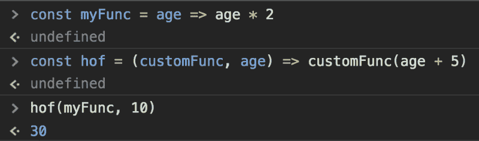
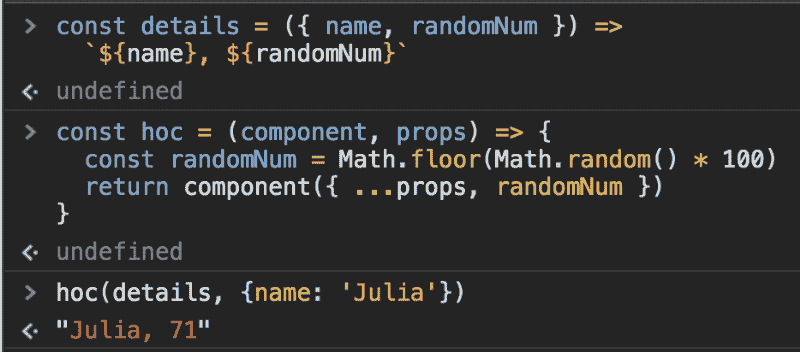

# 高阶函数:它们是什么，以及一个反应例子

> 原文：<https://www.freecodecamp.org/news/higher-order-functions-what-they-are-and-a-react-example-1d2579faf101/>

#### 技术术语系列


在科技集会和会议上，有太多的短语被抛来抛去，假设每个人都已经熟悉了这些行话。我经常不理解行话。开发人员对我缺乏一点知识感到惊讶是很常见的。

事实是，我经常不知道该用什么词来形容它。作为人类，尤其是开发人员，我们喜欢拒绝那些不“说空话”的人，所以本系列文章是关于获得一个人“应该知道”的编程概念的坚实理解。

本系列的第一个主题是高阶函数。前几天我参加了一个技术会议，我们讨论了 React 以及 React 新手进入代码有多难。我提到过，高阶元件(hoc)可能很难理解。一个回答是它们很像高阶函数，我不同意吗？我说:“我不知道那是什么。”当我要求举例时，我被告知“地图”。我开了个玩笑，说我不知道“地图”是什么，然后我们继续前行。

但还是:*什么是高阶函数？*

(注意:所有给出的例子都是 Javascript，但是这个概念适用于每一种编程语言。)

### 高阶函数:一个定义

高阶函数是指 A)将一个函数作为自变量，或者 b)返回一个函数。

如果一个函数不做这两件事，它就是一个一阶函数。

### 地图

先说给我的例子:`map`。

```
[1, 2, 3].map(num => num * 2)> [2, 4, 6]
```

在数组上调用`map`函数，并接受一个“回调”函数。它将函数应用于数组中的每一项，返回一个新数组。`[1, 2, 3]`是我们的数组，`num => num` * 2 是我们的函数。回调是传递给高阶函数的函数参数。

这个 HOF 被嵌入到语言中，在 Array ( `Array.prototype.map`)上原型化。

Hof 在 Array 上原型化的其他例子有`filter`、`reduce`和`some`。

### 自定义示例

所以我们自己写高阶函数吧。

#### 传递函数

```
const myFunc = age => age * 2
```

#### 高阶函数

现在我们写一个函数，*接受*一个函数。

```
const hof = (customFunc, age) => customFunc(age + 5) 
```

我们将传递一个数字给`hof`，它将增加 5，然后调用我们传递的函数，它将使它加倍。如果我们传递 10，我们把 15 传递给我们的第一个函数，然后这个函数加倍到 30。



Our dead-simple higher-order function running in the terminal

### 带有 React“组件”的自定义示例

正如我上面提到的，这个主题是在引用 React 的组件时出现的。由于 React 组件是一个函数，当把它传递给另一个函数时，我们就是在创建自己的高阶函数，React 称之为“高阶组件”。如果你正在使用有状态组件(并扩展 React 的`Component`)，你已经在使用 hoc 了。

#### 无状态组件

```
const details = ({ name, randomNum }) =>
  `${name}, ${randomNum}`
```

我们有一个名为`details`的函数，我们将`props`传递给它。我们正在解构它们，并把它们分配给局部变量`name`和`randomNum`。这是 ES6 语法——如果看起来不熟悉，可以谷歌一下(你会喜欢的)。

这是一个**一阶函数**——它接受一个参数(一个`props`对象)并返回一个模板文字。

#### 高阶分量

```
const hoc = (component, props) => {
  const randomNum = Math.floor(Math.random() * 100)
  return component({ ...props, randomNum })
}
```

这是一个**高阶函数**——它接受一个函数(然后调用它的`component`，传入额外的属性)。这是每个无状态 React 组件正在做什么的一个非常基本的例子。



Our super-basic “component” running in the console

您可以使用这种模式来抽象应用程序中许多组件共享的代码。

你在想能不能嵌套高阶函数？你可以！但是要小心。抽象应该使代码*更容易阅读和使用*。这里很容易出现这样的情况:你的代码非常迟钝，没有人知道如何做任何事情。

### 参考

*   [高阶函数](https://en.wikipedia.org/wiki/Higher-order_function)，维基百科
*   [高阶函数](https://eloquentjavascript.net/05_higher_order.html)，雄辩的 Javascript(第五章)
*   `[Array.prototype](https://developer.mozilla.org/en-US/docs/Web/JavaScript/Reference/Global_Objects/Array/prototype)` [MDN 文档](https://developer.mozilla.org/en-US/docs/Web/JavaScript/Reference/Global_Objects/Array/prototype)。