# 2018 年 Chrome Dev 峰会亮点

> 原文：<https://www.freecodecamp.org/news/highlights-from-chrome-dev-summit-2018-c7f1f1a7e6ae/>

作者 Chiamaka Ikeanyi

# 2018 年 Chrome Dev 峰会亮点

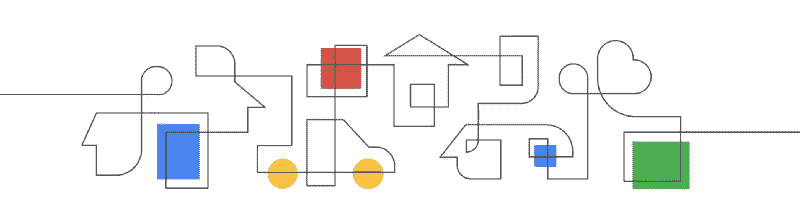

你听说过谷歌 Chrome 开发峰会吗？如果你还没听说过 Chrome，也没听说过 Chrome 工程师最近在做的很酷的东西，那么这篇文章就是为你准备的。

我是一名前端工程师，负责一个服务于数百万用户的应用程序。我还每天使用 Chrome 开发工具来调试和监控性能。因此，我发现有必要了解一些工具和技术，它们将帮助我优化我的应用程序，并有助于构建一个更好的 web。当您知道要利用的工具和要注意的指标时，调试和优化会变得更容易。

Chrome Dev Summit 让我有机会了解这些工具和技术的更新，并向我展示了改进这些工具的途径。在峰会期间，我从 Chrome 工程师那里学到了很多东西，我希望你能从这些知识中受益，这样我们就能一起打造一个令人敬畏的网络体验。

Chrome Dev Summit 为 Google Chrome 工程师和领先的 web 开发人员提供了一个机会来庆祝 web 平台，提供他们最新工作的更新，并从社区中获得反馈。

今年，来自世界各地的开发者聚集在加利福尼亚州旧金山的芳草地艺术中心，进行为期两天(11 月 12 日和 13 日)的现代网络体验探索。Chrome 工程师庆祝了谷歌 Chrome 推出 10 周年，这是最常用的网络浏览器。

该活动重点关注使用现代 web 技术和最佳实践构建快速、高质量的 web 体验意味着什么，以及关注 web 平台即将推出的令人兴奋的新功能。主要亮点总结如下。

### 绩效预算

如今，web 应用程序中越来越多的功能也在高延迟网络上使用低端设备进行访问。正因为如此，JavaScript 变得[昂贵](https://medium.com/@addyosmani/the-cost-of-javascript-in-2018-7d8950fbb5d4)从而需要[绩效预算](https://addyosmani.com/blog/performance-budgets/)。

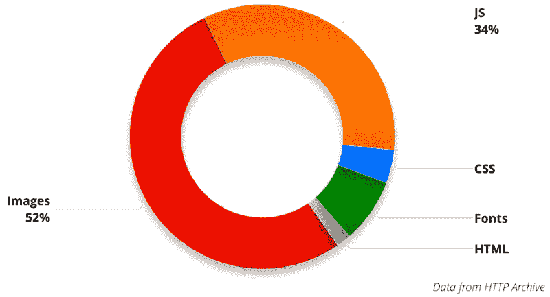

A Performance Budget is a framework that allows you to determine what changes represent progress and what changes represent regression, taking into account a set of shared metrics and budgets for each made actionable

然而，在我们能够改进它们之前，我们需要有适当的度量来测量，因为不可能测量我们不跟踪的东西。当我们关心卓越的用户体验而不考虑设备或网络条件时，[在考虑性能的情况下构建 PWA](https://developers.google.com/web/progressive-web-apps/) 成为优先考虑的事情。

为了建立高质量的网络体验，谷歌开发了 Lighthouse、PageSpeed Insights 和 Chrome 用户体验报告(CrUX)等工具，以帮助开发人员监控和增强网络平台。一个新的 lighthouse UI 在发布会上宣布了，包括 PWA 重构，lighthouse 运行时间的减少，以及新的分数桶。

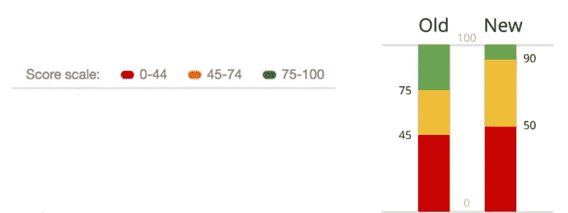

The new Lighthouse score bucketing

我们还可以[将 Lighthouse](https://github.com/ebidel/lighthouse-ci) 集成到我们的开发工作流中，这样它就可以在每次提交时运行。这有助于我们关注性能。

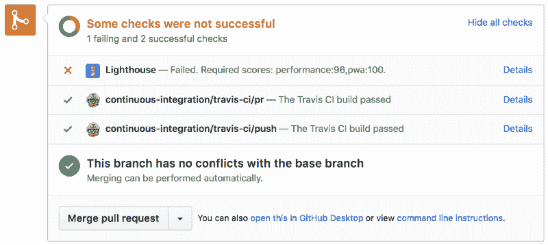

Running Lighthouse in CI

帮助监控软件包成本的工具:

*   [Webpack Bundle Analyzer](https://www.npmjs.com/package/webpack-bundle-analyzer) ,它创建了一个可视化的包内容的树形图。它有助于确定组成其大部分大小的模块。
*   [捆绑恐惧症](https://bundlephobia.com/)有助于发现向您的捆绑包添加 npm 包的成本。
*   [捆绑尺寸](https://www.npmjs.com/package/bundlesize)有助于控制您的捆绑尺寸。您可以以这样的方式集成它，一旦包的大小大于目标最大大小，PRs 就不能被合并。

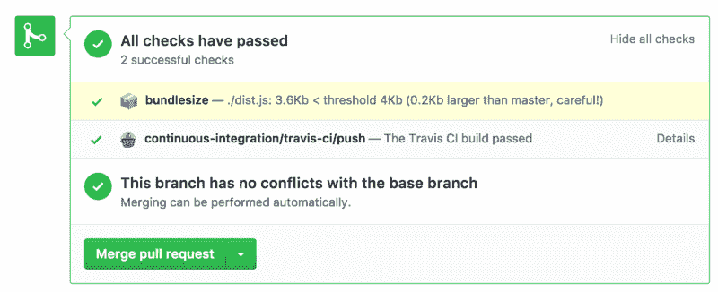

Bundle size checks in CI process

### 灯塔支持的 PageSpeed Insights

由于在衡量网站性能时从 PageSpeed Insights 和 Lighthouse 得到的结果分析各不相同，Chrome 团队引入了 PageSpeed API v5。它本质上是 Lighthouse API v1 来增强 PageSpeed Insights。这意味着不同的结果将成为历史。PageSpeed Insights 还整合了由[症结](https://developers.google.com/web/tools/chrome-user-experience-report/)提供的现场数据。

```
await fetch(`https://www.googleapis.com/pagespeedonline/v5/runPagespeed?&url=${url}`)
```

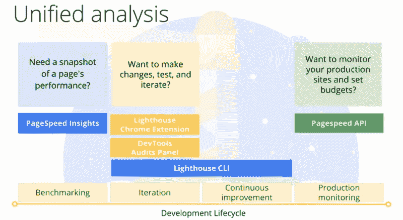

By [Paul Irish](https://www.freecodecamp.org/news/highlights-from-chrome-dev-summit-2018-c7f1f1a7e6ae/undefined) and Elizabeth Sweeny at Chrome Dev Summit

### 首次输入延迟

我们熟悉测量速度指数(SI)、第一次满意的绘画(FCP)、交互时间(TTI)、第一次 CPU 空闲(FCPI)和其他指标，您可能已经使用 [Lighthouse](https://developers.google.com/web/tools/lighthouse) 或 [WebPageTest](https://www.webpagetest.org) 看到过这些指标。为了帮助衡量用户对网站交互性和响应性的第一印象，引入了一个新的指标，叫做首次输入延迟。

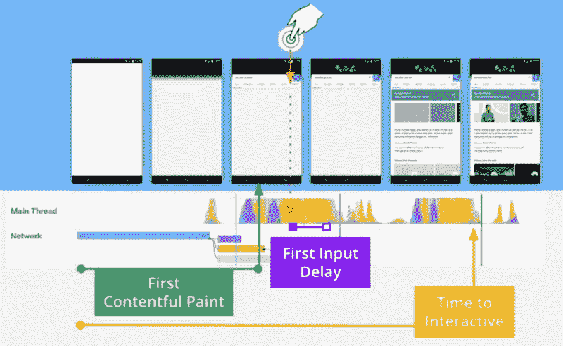

By [Paul Irish](https://www.freecodecamp.org/news/highlights-from-chrome-dev-summit-2018-c7f1f1a7e6ae/undefined) at Chrome Dev Summit

首次输入延迟(FID)测量从用户第一次与您的站点交互(即，当他们单击链接、点击按钮或使用自定义的 JavaScript 支持的控件)到主线程从正在执行的长任务中解脱出来的时间，这使得浏览器能够响应用户的交互。

你可能会问，这和 TTI 不一样吗？不，不是的。互动时间(TTI)衡量应用程序加载并快速响应用户互动所需的时间。另一方面，首次输入延迟(FID)是一个度量标准，用于测量用户在尚未交互的情况下与页面交互时所经历的延迟。

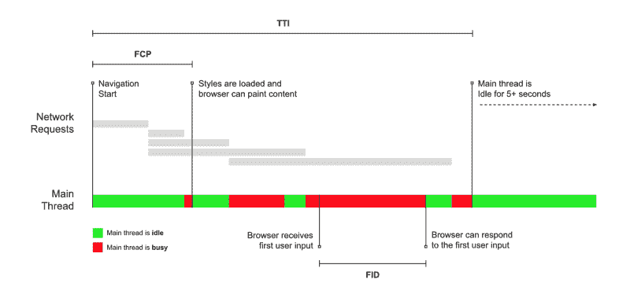

The browser receives the input when the main thread is busy, so it has to wait until it’s not busy to respond to the input. The time it must wait is the FID value for this user on this page.

FID 是一个现场指标，这意味着当实际用户真正与 web 应用程序交互时可以看到它，而 TTI 是一个实验室指标。现场指标捕捉了 Chrome 用户使用的各种真实网络条件和设备。这可以使用真实用户监测(RUM)工具来很好地衡量，如 [Chrome UX 报告](https://developers.google.com/web/tools/chrome-user-experience-report/)。

带有第三方 iframes 的服务器端渲染 JavaScript 应用程序和站点需要特别注意跟踪这个指标。它们容易受到高 FID 值的影响，尤其是在需要更长时间来解析和执行 JavaScript 的低端设备上。

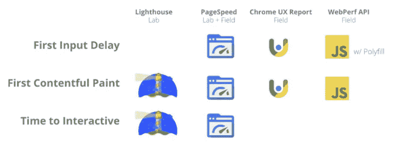

Where to gather these metrics

### WebP 图像格式

图像并不只是在飞行中变得有表现力——有适当的措施来实现这一点。您必须考虑使用正确的格式、压缩技术和图像延迟加载。随着 [WebP](https://developers.google.com/speed/webp/) 的引入，一种平均节省 30%的新图像格式，提供图像的成本——这是大多数网站的最大组成部分——降低了。

WebP 为 web 上的图像提供了卓越的有损和无损压缩，并支持透明，使 web 速度更快。由于并非所有浏览器都支持 WebP，建议使用`**<pictu**` re >元素来提供回退。该图像格式将在支持的浏览器上使用，而不支持 WebP 的浏览器将使用它们支持的格式。

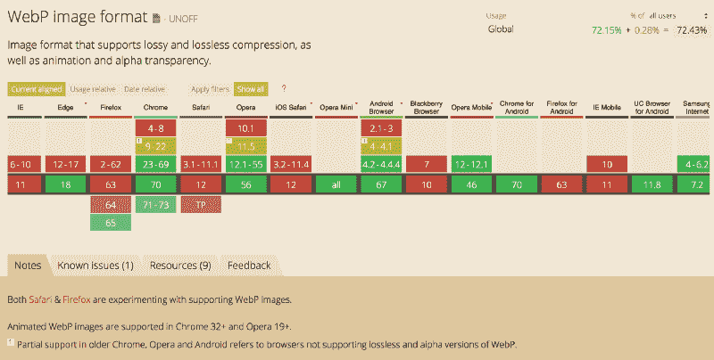

WebP support stat on [caniuse.com](https://caniuse.com/)


WebP support stat by Katie Hempenius at Chrome Dev Summit

```
<picture>  <source type="image/webp" srcset="imagename.webp">  <source type="image/jpeg" srcset="imagename.jpeg">  </picture>
```

要将图像压缩为 WebP 格式或从 WebP 格式压缩图像，可以分别使用`[**cwebp**](https://developers.google.com/speed/webp/docs/cwebp)`和`[**dwebp**](https://developers.google.com/speed/webp/docs/dwebp)`命令行工具。去 [squoosh](https://squoosh.app/) 上试试这种图像格式(上传你的图像，查看压缩率)。

### 本机延迟加载

为了改善用户的网络体验，Chrome 将引入原生的惰性加载。当添加到图像标签和跨源 iframes 时，这将推迟资源的加载，直到页面向下滚动到它们附近。它在所有 chrome 平台上都受支持——Mac、Windows、Linux、Chrome OS、Android

要延迟加载资源，请使用带有“on 或 off”值的`lazyload`属性。如果没有指定值，浏览器将决定延迟加载哪个资源。

```

```

### 网上零摩擦导航

与使用原生应用的体验相比，在网络上导航并不是无缝的。这是一种痛苦的体验，尤其是在慢速网络上使用低端设备浏览网页时，让用户盯着白色屏幕等待屏幕上显示的内容。为了拯救这些网络用户，Chrome 工程师宣布了**网络包装和门户。**

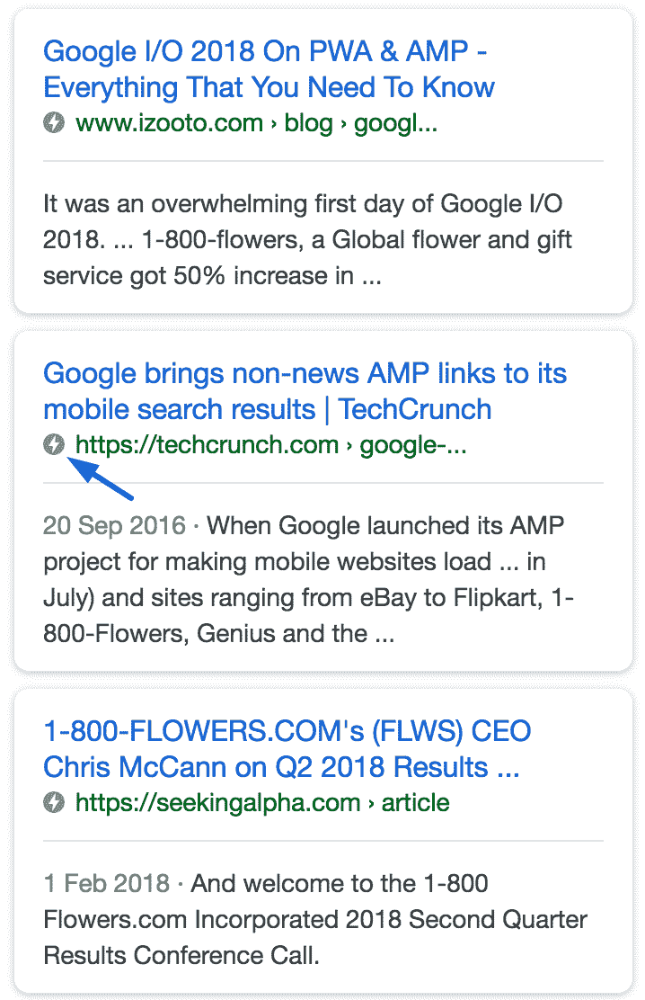

Available on mobile devices only. The icon identifies the sites that have implemented AMP

基于加速移动网页(AMP)模型，通过[签名交换](https://developers.google.com/web/updates/2018/11/signed-exchanges)， [Web Packaging](https://github.com/WICG/webpackage) 引入了使用特殊加密密钥对网页进行签名的功能，该密钥可以证明网页的原始域。然后，它创建一个可以从任何地方提供的包，浏览器将使用该包来表示支持隐私保护的即时导航的域。

门户的工作方式类似于 iframe，但是可以被导航到允许用户转换到门户的内容。它抽象了页面之间的导航，让用户感觉像是在一个单页应用程序上。

```
<portal src="https://mywebsite.com"></portal>
```

当创建的视图被点击时，添加一些动画并触发激活事件:

```
portal.activate();
```

这两项提案结合在一起，使网页在整个网络上的转换零摩擦。这仍处于开发的早期阶段，因此可能会发生变化。

### 网络开发

一个 web 平台，旨在帮助开发人员学习如何构建 web，并确保网站符合良好实践目标。 [Web.dev](https://web.dev/) 关注开发人员为什么需要关注一个给定的概念，并给出一些技巧来帮助开发人员构建一个更好的网站，保持它的快速、可发现、可访问、安全和弹性。

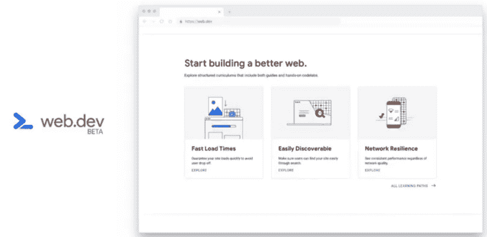

### 维苏格

VisBug 是一款考虑到可访问性的工具，可以方便工程师使用。有了这个扩展，你就可以在浏览器中浏览和调整你的站点，查看构建模块和不同设计下的外观。

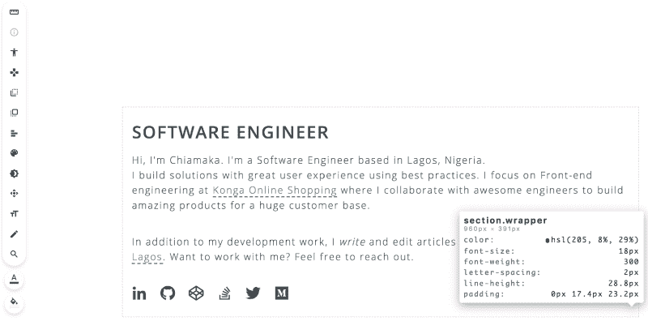

Using VisBug on my site

### Squoosh

Squoosh 是一个用 c 语言编写的 15kB JavaScript 驱动的渐进式图像压缩 web 应用程序。它是使用 [**emscripten**](https://github.com/kripken/emscripten) 编译成 web 程序集，并在浏览器中使用同类最佳的编解码器。

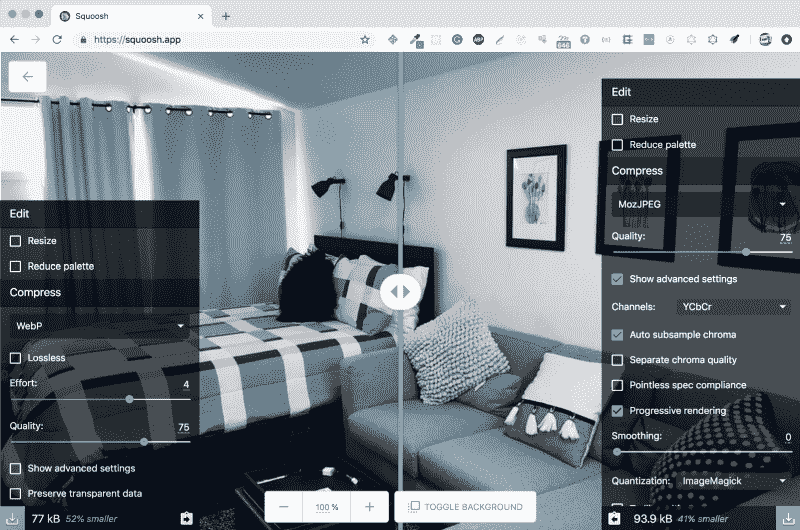

An original image size of **163kB**: Notice the compression rate of WebP compared to MozJPEG

考虑到性能，该团队按照编码和性能最佳实践，利用适当的技术来生成高性能的应用程序:

*   Preact(一个 3kB 的库)来编排 DOM
*   用于捆绑和代码分割的 WebPack
*   面向延迟加载和并发的 Web workers
*   动态模块导入
*   用于边上自定义元素聚合填充的 Web 组件(聚合物使用的较低级别图元)

正如杰克·阿奇博尔德会说的那样，[去拍一些照片。](https://squoosh.app/)

### 要点

*   性能决策应该基于数据。尊重用户、他们的数据和偏好。
*   作为开发人员，我们需要在慢速网络连接上使用低端设备进行测试。当我们在快速网络连接上使用快速设备进行 web 开发时，我们无法真正感受到用户的感受，也无法认为我们达到了性能目标。
*   性能不是工程优先考虑的问题。绩效计划的成功取决于跨职能部门的认同。影响网站的所有团队(营销、设计、工程等)之间应该有一个组织上的一致。).
*   了解服务人员如何影响您网站的性能。根据实施情况，他们可以对其产生积极或消极的影响。
*   用户重视一致的用户旅程。所以，尽量减少你的网络应用程序的摩擦。
*   使用 RAIL 模型测量应用程序—响应、动画、空闲和负载。
*   使用 HEART(快乐、参与、采纳、保留、任务成功)框架来确定您的 web 应用程序 UI 的质量。
*   这里介绍了一些已宣布的功能，更多功能在 Chrome 标志后面——Chrome://flags/

### 结论

这只是冰山一角，你不会想错过细节的。未来在网络上，性能是一切的根本。整个活动的所有录音都可以在[谷歌 Chrome 开发者频道](https://www.youtube.com/playlist?list=PLNYkxOF6rcIDjlCx1PcphPpmf43aKOAdF)上获得。该代码可在 [GitHub](https://github.com/GoogleChromeLabs) 上获得。

让我们建立一个更好的网络？