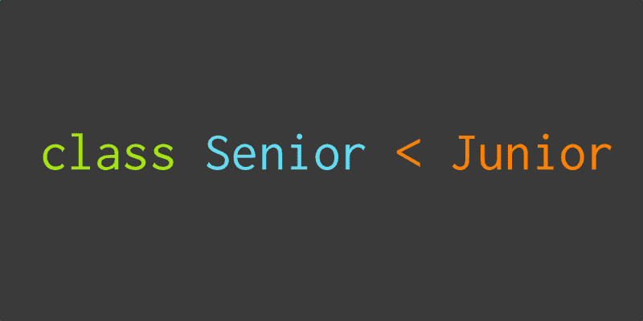
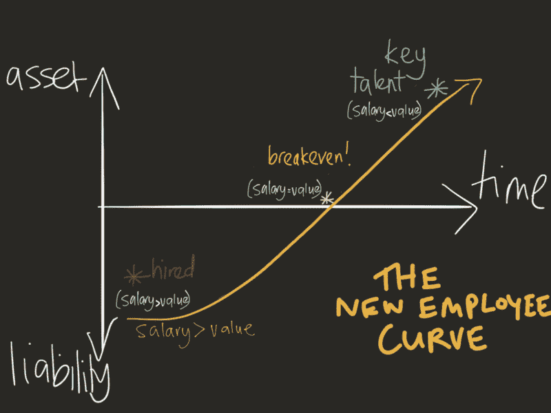
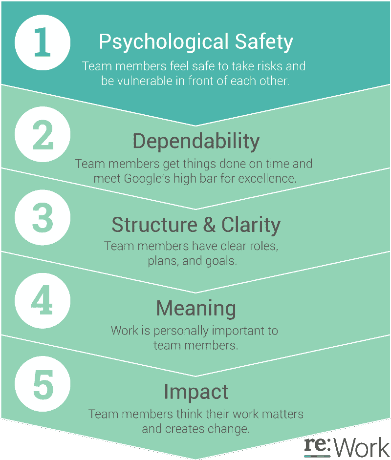

# 不要问那些没有在看的高级开发人员。开始辅导大三学生。

> 原文：<https://www.freecodecamp.org/news/hiring-juniors-52e4aaf9d778/>

瑞安·比格

# 不要问那些没有在看的高级开发人员。开始辅导大三学生。

#### “D”字

我们的社区存在多样性问题，当涉及到性别和种族等有形的东西时，这个问题已经被谈论了很多。技能的多样性——一种*无形的*事物——也是我们谈论的需要努力的事情。

虽然我不是不同性别或不同种族的人，但我是一名初级的 Ruby on Rails 开发人员。

当我开始作为一名 Rails 开发人员时，我在业余时间摆弄框架，我有很多业余时间，因为我是单身，在 Coles 随意工作，并做 PHP/Rails 自由职业者。

我听说在阿德莱德有一个 Ruby 聚会，我赶上了进城的火车，跑着去参加聚会，因为我要迟到了。

当我到了那里，人们问我做什么，我告诉他们关于 Coles，PHP 和 Rails。他们说“你不需要再为科尔斯工作了”，有三个人给了我名片，说我应该去申请一份工作。我申请了 SeaLink 的一份工作，并被接受了。

在 SeaLink，我得到了一组“资深”Rails 开发人员的指导，他们对我 19 岁时的古怪行为有着极大的耐心。我非常感谢他们花时间指导我，因为我相信这有助于为我已经做了近 10 年的职业生涯奠定基础。

墨尔本 Ruby Meetup 有很多大三学生。我知道，因为我帮助运行黑客之夜，他们中的许多人也参加。如果这个聚会上的一个大三学生告诉你他们正在积极地找工作，你会雇佣他们吗？大概不会。人们似乎很反感雇佣初级员工，主要的反感是初级员工占用了宝贵的运输时间，而不是指导时间。

在早期，缺乏可用的人才，所以公司不得不雇佣他们能找到的人。这就是为什么当时我觉得找一份 Rails 的工作很容易。我认为我们又一次到达了没有任何人才可以雇佣的地步。

我最近在 Ruby 社区进行了很多讨论，关于为什么公司似乎不愿意雇佣初级员工。相反，这些公司希望雇佣中高级开发人员，而不希望有学徒与这些中高级开发人员一起学习。

律师、机械师和许多其他职业都有学徒期，那么为什么程序员没有呢？挺奇怪的。我认为这是因为这些职业在他们的公司中有足够的人员流动，可以吸取为未来培训的教训。这仍然是一个年轻的社区，大多数人都做了不到 15 年。我们需要长期考虑这个问题:当我们离开后，谁来照看我们的代码？

#### 雇佣高年级学生

让我们看看为什么公司首先要雇用中老年人。在我工作过的公司，我们想雇用一名新的中高级人员，因为我们的工作量已经超过了我们的能力。我认为其他公司也是如此。就像我曾经工作过的地方——以及现在工作的地方——你会看到有人盯着你问什么时候会修复 bug 或者开发新功能。

为了解决这个问题，你雇佣了一个新的开发人员，或者说:你试图雇佣一个新的开发人员。你需要一个中高级开发人员，因为他们有能力在几乎没有指导的情况下直接进入你的应用程序，而且他们可以开始发布代码。

然而:诀窍是找到一个目前有空的人。在当前的环境下，几乎不可能雇佣一个中高级的 Ruby 开发人员来你的公司工作。通常发生的情况是，开发人员在公司之间被大肆挖走。

公司在招聘人员身上花了数千美元，花了大量时间在求职网站上发布信息，但回报往往很少。公司花这些钱来寻找难以捉摸的 10 倍开发商 Rockstar 独角兽，但独角兽不再在阳光明媚的草地上吃草，随时可以捕捉。他们已经在别的地方工作了，那里的工作条件非常好。

作为一个社区，我们已经耗尽了人才库。

我们已经没有免费的 Rockstar 独角兽了，所以是时候开始自己种植了。

公司沉迷于雇佣顶尖的 5%或 10%的开发人员，而忽略了其余的人。在剩下的开发团队中有很多优秀的人才，正等待着被指导。如果他们得到了这种指导，我们将能够培养我们社区最优秀和最聪明的人。如果你公司指导的下一个人成为你的下一任首席技术官会怎样？如果他们继续成为“10 倍工程师”，可以帮助团队中的任何人做任何事情，会怎么样？我真的认为，当人才不明显的时候，公司会完全忽视他们，从而错失了优秀的人才。

太多的公司都在关注航运代码的短期目标，而不是团队的长期成长。

公司雇佣精英中的精英——拥有*被证明*优秀记录的人——并让他们构建本质上是 CRUD 的应用程序，充其量只是字符串连接的花哨版本。

如果我们从雇佣钢琴演奏者的角度来说:你雇佣了乔平、巴赫、李斯特，并让他们演奏*玛丽有一只小羊羔*。

你不需要雇用高级开发人员。你需要雇佣任何技能水平的开发人员，指导他们，让他们成长为下一批优秀的开发人员。给这些人一个机会，训练他们使用真实的应用程序。这些人可能是你的公司需要的下一批优秀人才，而你却没有给他们机会。

#### 回馈社会

你可能会想:我们(作为一家公司)能从中得到什么？我认为这是倒退。思路应该是“我们从社区赚了这么多，现在是时候回报了”。如果你投资于社区的长期健康，它会有回报。从长远来看，您将拥有一个活跃的开发人才库，他们将能够维护您的应用程序。在短期内，你会用新的人才来提高团队的生产力。

你可能认为你需要雇佣这些精英中的精英，因为你的应用程序是一个巨大的不可维护的庞然大物，只有精英们才能理解它。你需要高年级学生来浏览你遗留下来的代码。事实可能确实如此。但是在每一个模块中，当一个非高级开发人员和一个高级开发人员在一起时，有一点点非高级开发人员可以随着他们的技能一起改进的功能。

雇佣非高级开发人员来开发真实的生产代码是可以的。我们已经在 Marketplacer 做到了这一点，我们仍然在做生意。你的公司不会因为你雇佣了一个初级员工而倒闭。

是的，有风险。最初，员工的成本大于他们为公司提供的东西。但是通过正确的培养，他们可以成长为你公司有史以来最好的资产。

朱莉娅·克拉文对此有一个很好的图表:

当初级员工最初被雇佣时，他们对公司的美元价值低于他们的产出。有了好的指导，他们可以得到图表的另一端，他们对公司的价值超过他们的工资。

最初的生产力会受到影响——这是事实——但如果你做得好，这种影响会在 6 个月内稳定下来。最终，不是只有一个开发人员，而是有两个开发人员。即使初级员工的工作效率只有高级员工的一半，你的团队的工作效率仍然会提高 1.5 倍。

在 Marketplacer，我们在过去的一年里雇佣了初级员工，我认为他们是团队中非常有生产力的成员，*和*他们是很好的合作伙伴。如果我们不花时间雇佣和指导这些人，而是只雇佣有 Rails 应用开发经验的资深人士，我们就会错过这些人。

你可能会想，“但是如果他们离开了呢？”对于任何技能水平的员工来说，这都是一个风险。如果有人要离开你的公司，你首先应该反思他们为什么要离开。真的是他们，还是你的公司？你的公司有让人想离开的文化吗？你的公司是专注于建立一种人们想留在其中的文化，还是他们只对运输代码感兴趣？

#### 寻找大三学生

从哪里可以找到那些大三学生开始？好吧，让我们从代码学院开始。没什么特别的——尽管图灵是我最喜欢的。代码学院解决了*部分*缺乏指导的问题。

代码学院让新程序员支付数千美元来学习交易技巧。有时，这些新程序员甚至会得到代码学院的“保证”，保证他们在课程结束后会找到工作。代码学院教授这些新手一系列编程技能。最后，新手程序员有足够的技能了解 HTML、CSS、JavaScript 和 Ruby 等基础知识，通常可以很容易地找到 Rails 应用程序。这些人非常“环保”，然后他们被挤出社区，在公司工作。

不幸的是，由于我们的资深招聘上瘾，我们不会雇用这些新面孔。代码学院培养出了优秀的人才，而我们却没有选择它。这些人在进入一家公司之前，不得不连续几个月努力发展自己的技能。我和很多处于那个位置的低年级学生谈过。

并非所有这些毕业生都有时间进行技能培养，因为他们通常有全职工作或其他责任要承担。谢天谢地，他们毕业后从代码学院得到了很多帮助。好吧，至少好的代码学院会这么做。

我很乐意看到公司打破对老年人的依赖，更积极地从这些代码学院招聘员工。更多的公司需要将师徒关系作为他们工作的一部分。从代码学院毕业的学生渴望学习，以我的经验来看，他们非常有动力。

肯定有一些没有上过代码学院的大三学生也有同样的求知欲和动力。这些人通过自己和社区里的人的指导学习。我能想到的是，在这些人当中，至少有 5 人，甚至 10 人会在公司的指导/学徒项目中成为出色的雇员。

如果我负责 Marketplacer 的招聘，我会雇佣一个有上进心的年轻人，给他们足够的薪水让他们生活，并指导他们。

阿西姆·阿斯拉姆(@chuhnk)对此也有一条很好的推文:

有一本很棒的书我鼓励你们都去读:它叫做*。正如副标题所说“伟大不是天生的。已经长大了。”这本书涵盖了如何在体育、音乐和许多其他领域培养各种技能。书中涉及的所有行业都有积极的指导和学徒计划。然而，由于前面提到的原因，编程社区并不关心这个问题:我们仍然是一个非常年轻的社区。*

*我会让你知道那本书里的秘密:对于任何人来说，要想在任何事情上做得更好，他们需要不断地练习。如果我们不雇佣低年级学生，让他们通过在真实世界的应用程序中练习来提高技能，我们怎么能指望雇佣高年级学生呢？*

*所以很多人都在谈论指导和雇用初级员工。让我们开始做吧。*

#### *师徒制*

*现在我已经(希望)说服你雇佣一个初级开发人员，你可能想知道一旦你有了一个，你会做什么。*

*我帮助运行了墨尔本 Ruby Hack 之夜，这是一个没有评判的环境，任何人都可以带着 Ruby 项目并为之工作。有些人甚至是第一次在那里了解 Ruby 本身，这很好。这些黑客之夜之所以有效，是因为这些新开发人员感到安全和受欢迎，而且没有什么问题太“蠢”而不能问。*

*你可以通过营造这种黑客之夜式的环境，开始在你的公司进行指导。举手问一个关于*任何*的问题应该是可以的。如果提问者从其他人那里得到了白眼、叹息或其他消极的攻击性信号，那么这不是一个低年级学生将要学习的环境。*

*建立这种培养环境的一个好方法是鼓励结对编程。最初和低年级学生一起完成小任务是建立他们自信的好方法。当我指导低年级学生时，我发现他们最缺乏的不是技能，而是信心。他们知道答案，但他们不确定这是否是正确的答案。他们质疑自己是否使用了正确的语法，或者是否应该以这种特定的方式编写代码。当高年级学生与低年级学生结对时，他们可以鼓励他们尝试新事物，并从他们尝试的事物中学习。如果低年级学生做错了，高年级学生可以向他们保证，做错事没关系，并引导他们回到正轨。结对是提升初级技能的最快方法，我强烈推荐。*

*当我在 GetUp 工作时，我每天都与一些开发人员配对，几个月后，他们都是自信的 Rails 开发人员，可以轻松地找到自己的 Rails 应用程序。我在其他公司也做过同样的事情，每次我都看到我指导过的大三学生有了很大的职业发展。世界上最美好的感觉之一是当一个晚辈说“啊，我明白了！”。*

*结对也有助于巩固你自己的知识。如果你不能向某人清楚地解释某事，那么你自己也不够了解它。结对对低年级学生有帮助，因为他们从中获得知识，但对高年级学生也有帮助:他们学会如何以更清晰的方式与他人分享他们的大脑。*

*你应该和你的学妹搭配什么？好吧，莉迪亚·瓜里诺对此有一些很好的推文。*

*这两点我都同意。当他们获得速赢时，低年级学生表现最好。你需要一个良好的反馈循环来保持他们的信心增长。每次他们在代码上“赢”了，他们的信心就会增加一点。*

*一旦他们建立了一点信心，你就可以让他们单独完成一项任务。这种情况何时发生没有固定的时间框架；都是学妹对自己的能力有多自信。*

*让他们在一些小事情上放松，让他们明白他们可以问任何关于他们正在做的事情的问题，并且没有错误的方法。一旦他们完成了，让他们在拉式请求中提交他们的工作——你可能需要先教他们什么是拉式请求——然后坐在一起审查。*

*坐在一起在这里很重要，因为“你为什么这样做？”用文字写出来的东西没有感情，相比之下，用肢体语言说出来的东西就没有感情了。大三学生可能会理解为“你为什么这么做？”像“啊！你为什么要这么做？”。*

*注重面对面的交流有助于在开发人员之间建立融洽的关系，这比基于文本的交流要好得多。*

*如果下级在拉动请求中犯了错误，那么你可以与他们讨论并纠正错误。这样，这个错误就永远不会出现在实际的生产环境中。*

*代码审查还允许高级人员评估低级人员在他们被分配的任务上做得如何。如果他们在 2 天的任务中做得很好，那么给他们 4 天的任务也是可以的。如果没有，那么可能需要更多的指导。*

*最终，你的导师应该让你的下属在你的团队中感到受欢迎和安全。事实上，这应该是你团队中的*每个人*正在发生的事情。谷歌运行了一个项目，他们称之为“项目亚里士多德”，其中[他们试图找到如何建立有效的团队](https://rework.withgoogle.com/blog/five-keys-to-a-successful-google-team/)。他们采访了数百名自己的员工，得出了 5 个结论:*

**

*这个清单上的第一项是“心理安全”:“团队成员觉得冒险是安全的，在彼此面前是脆弱的。”*

*谷歌并不特别。他们是由人组成的，就像你的公司是由人组成的一样。在指导你的下级，以及与团队中的其他人一起工作时，你应该记住这一点。*

*感谢阅读！如果你觉得这篇文章有帮助，请点击下面的绿色心脏。*

**

*这篇文章最初发表在我的博客上。*