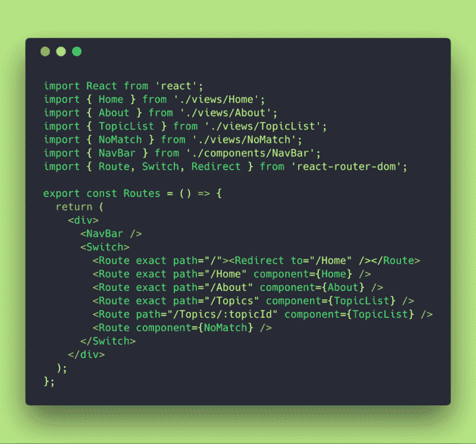
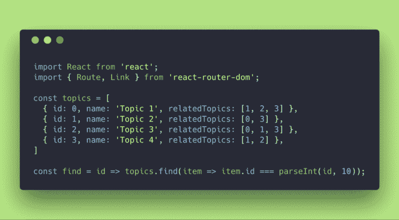
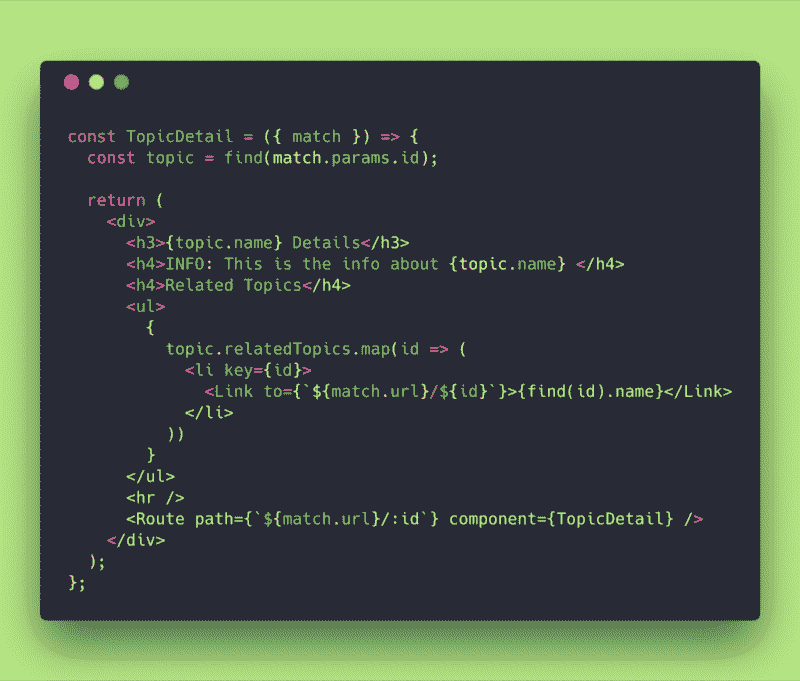
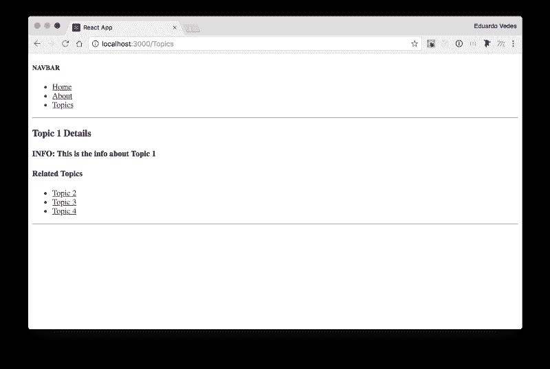
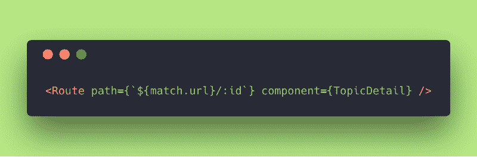
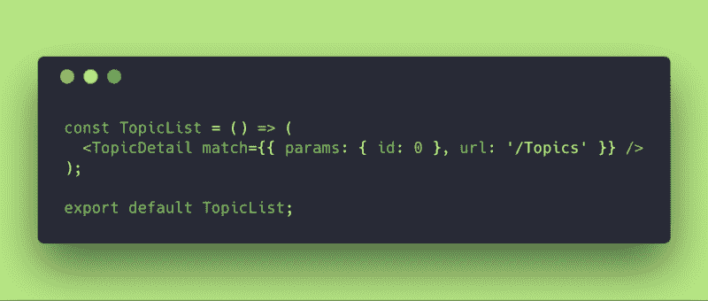

# React 路由器 v4 的搭便车指南:递归路径，通向无限甚至更远！

> 原文：<https://www.freecodecamp.org/news/hitchhikers-guide-to-react-router-v4-21c99a878bf8/>

欢迎来到 React 路由器 v4 搭便车指南的第三部分。在本文中，我们将关注递归路径。如果你错过了前两部分，你可以在这里找到第一部分[和第二部分](https://www.freecodecamp.org/news/hitchhikers-guide-to-react-router-v4-a957c6a5aa18/)[这里](https://www.freecodecamp.org/news/hitchhikers-guide-to-react-router-v4-4b12e369d10/)。

### 什么是递归路径？

递归路径只不过是由嵌套布线组成的路径，这些嵌套布线渲染同一组件以显示嵌套视图。

**举例:** `http://evedes.rockz/Topics/1/2/3/2/1`

它通常用于在网站中做“面包屑”——一种显示用户在网站有机结构中的位置的导航模式，一种社交网络朋友关系树，解决许多复杂的图形问题，分析或跟踪任何类型的取决于最后路径的信息。例如，在一个电脑游戏中，你从一个房间走到另一个房间，由于某种原因需要跟踪你到达那里的路径。

激动吗？说“是”！？

因此，让我们在应用程序中做一些更改，以测试 React 路由器 v4 中应用的模式。

### 目标

所以，这里的想法是转换我们的主题列表。

不要有一个匹配的主题列表，用户可以导航到并查看每个主题的详细信息，然后返回(参见本指南的[第一部分](https://medium.freecodecamp.org/hitchhikers-guide-to-react-router-v4-a957c6a5aa18))，让我们做一个嵌套的路径，从主题 1 开始，通过显示一个链接列表向用户显示哪些主题与其相关，单击该列表可以导航到下一个相关主题的详细信息。每次选择一个主题，您都可以导航到它，查看它的详细信息，并查看哪些主题与它相关。

### routes.js

routes.js

所以在 **routes.js** 中，除了现有的 **Route** 到 **/Topics** 之外，我们已经删除了 **TopicDetails** 组件的导入，并更正了 routes 以在路径为 **/Topics/:topicId** 时呈现 **TopicList** 组件。

两者都将呈现具有不同匹配属性的相同组件。

### TopicList.js

除了上面的小修正，我还对 **TopicList.js** 文件进行了大规模重构。让我们看看我们有什么:

fig 1.-imports and const definitions

我们已经从 **react-router-dom** 包中导入了 **Route** 和 **Link** ，因为我们将在后面的代码中调用它。

我们已经创建了一个包含主题列表的对象数组。每个主题都有一个 **relatedTopics** 数组来提升它们之间的关系。

我们已经创建了一个 **find** 函数，它接收主题的 id 作为参数，并返回与传递给它的 id 明确对应的条目或主题。

**parseInt(id，10)** 的用法确保了即使传递给 **find** 函数的参数是一个字符串，它也会变成一个以 10 为基数的整数(十进制数系统)。

注意到我们的主题 id 和相关主题值都是原始整数。

要了解更多关于 parseInt 的信息，请看这里的 T2。

fig.2-TopicDetail stateless Component

组件 **TopicDetail** 通过定义变量 **topic** 开始。这将存储函数 **find** 的结果，该函数在组件被调用时获取来自 **match** 对象(路由器)的 **id** 。然后它返回与那个 **id** 对应的**主题**对象。

随着那个**主题**对象的存储，它返回主题的**细节**并创建一个动态无序列表，其中包含相关主题 **id** 和**名称**。

让我们在浏览器中看看这个:

**Topic 1 Details (Info and Related Topics)**

不错！起作用了！

因此，当你点击其中一个链接时，它会将你带到下一个主题 **id** :

**Route to be invoked inside the TopicDetail Component**

哇！该路线在 **routes.js** 文件之外！这是新的。请注意，从技术上讲，您可以在任何组件内部创建路线。

不要忘记 **isExact** 是假的，因为 **url** 并不完全匹配之前在 **routes.js** 组件中定义的来自 **/Topics/:topicId** 的路径。

**fig.3-TopicList stateless Component**

最后，我们定义并导出了 **TopicList** 组件，该组件使用上面的匹配对象调用 **TopicDetail** 。但是，正如在 **TopicDetails** 的每个实例中，当您触发 **Route** 时， **TopicDetail** 会在每个实例中使用由 **Router** 提供的新的 **match** 属性重新呈现。

所以现在我们完成了！？

### 最后但并不是最不重要的

我想现在您已经对如何开始实现递归路由有了一个很好的想法。

我选择这个例子是因为它很容易理解，并且对一些基本的东西非常有用。

为了撰写本文，我对应用程序所做的更改可以在我的 GitHub [repo](https://github.com/evedes/ReactRouter_BoilerPlate_03) 中找到。

### 文献学

为了撰写这篇文章，我使用了 React 路由器文档，你可以在这里找到。

我使用的所有其他网站都沿着文档链接，以添加信息或提供我试图向您解释的内容的背景。

本文是“React 路由器 v4 搭便车指南”系列文章的第 3 部分

*   **[第一部分:20 分钟内 Grok React 路由器](https://www.freecodecamp.org/news/hitchhikers-guide-to-react-router-v4-a957c6a5aa18/)**
*   **[第二部分:【比赛，地点，历史】—你最好的朋友！](https://www.freecodecamp.org/news/hitchhikers-guide-to-react-router-v4-a957c6a5aa18/)**
*   **[第四部分:路由配置，定义路由配置数组的隐藏值](https://www.freecodecamp.org/news/hitchhikers-guide-to-react-router-v4-c98c39892399/)**

？非常感谢！