# React 路由器 v4 的搭便车指南:[匹配，位置，历史] —你最好的朋友！

> 原文：<https://www.freecodecamp.org/news/hitchhikers-guide-to-react-router-v4-4b12e369d10/>

### 嘿！欢迎来到 React 路由器 v4 的搭便车指南，第二部分！

既然我们已经用我们的第一个小应用程序[启动了这个球](https://medium.freecodecamp.org/hitchhikers-guide-to-react-router-v4-a957c6a5aa18)，让我们来关注你的三个旅行伙伴:**匹配**、**位置**和**历史**。

如果您在自己的 Home 组件代码中放一个 *console.log* 来检查属性，会发生什么？

**console.log(props) inside <Home /> Component**

路由器在组件中引入了以下对象:

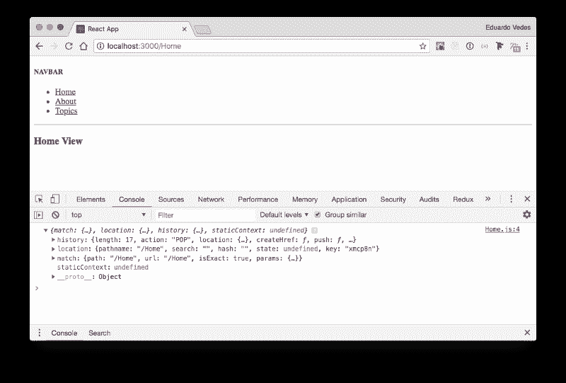

console.log(props) result in Chrome console

哇！那是从哪里来的？？

路由器包装的每个视图、组件或任何东西都有这些对象。 **<路由器/ >** 作为一个高阶组件完成它的工作，包装你的组件或视图，并把这三个对象作为道具注入其中。

那么…它们为什么在那里，我能利用它们做什么？？

他们会是你最好的朋友！相信我！？

### **匹配**

**匹配**对象包含关于 **<路线路径>** 如何匹配 URL 的信息。

*   **params** : (object)，从对应于路径动态段的 URL 解析出的键/值对
*   **isExact** : (boolean)，如果匹配了整个 URL(没有尾随字符)，则为 true
*   **路径**:(字符串)，用于匹配的路径模式。对建立嵌套路线**有用。**我们将在下一篇文章中探讨这个问题。
*   **url** : (string)，url 匹配的部分。对于构建嵌套链接非常有用。

所以在 **Home** 组件中我们有这个 **match** 对象:

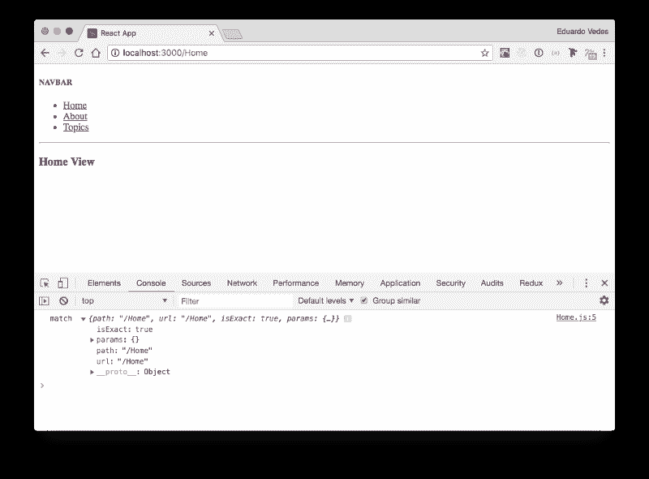

**match object inside Home Component**

**isExact** 为真，因为匹配了整个 URL， **params** 对象为空，因为我们没有向其传递任何内容，**路径**和 **url** 键值相等，这确认了 **isExact** 为真。

现在让我们来看看**主题列表视图**:

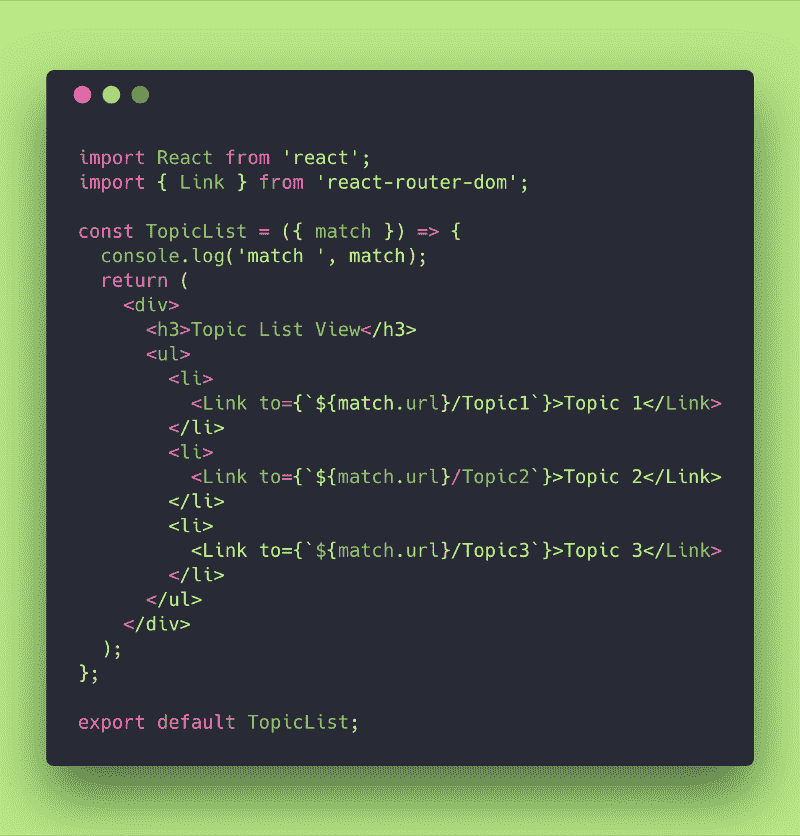

**TopicList View code**

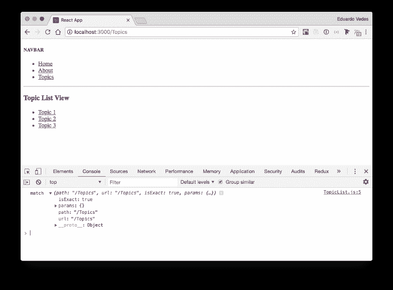

**console.log(match) inside TopicList View**

到目前为止没什么新东西，和**主页视图**中的故事一样，显示了**主题列表**的**路径**和 **url** 。

但是如果我们看一下**主题详细信息**会怎么样呢？

**TopicDetails**

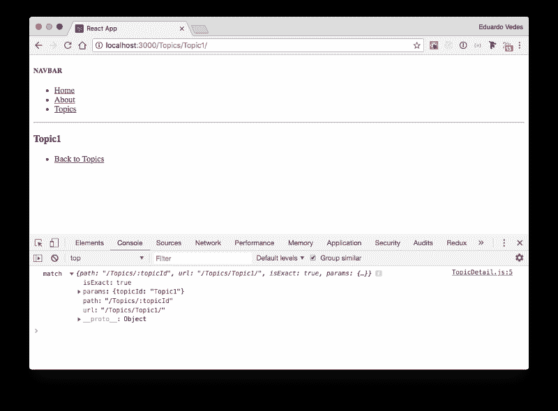

**console.log(match) inside TopicDetails**

好吧，这是什么？

**isExact** 继续为真，因为匹配了整个 URL。 **params** 对象带来了传递给组件的 **topicId** 信息。

Route for TopicDetail component in routes.js

注意 **topicId** 是一个变量。

但是它在哪里假定了**主题 1** 的值呢？

很简单，你在 **TopicList Links** 中显式地调用它。

检查我们如何使用 **TopicList** 的 **match** 来了解它的 URL。

这个链接可以是动态的。稍后我们将做一个例子，你**将**链接到一个相对路径，而你之前不知道它是**主题 1** 还是**主题 3520** 。

但是…

哪种情况下 **isExact** 为假？

嗯……我给你举个例子:

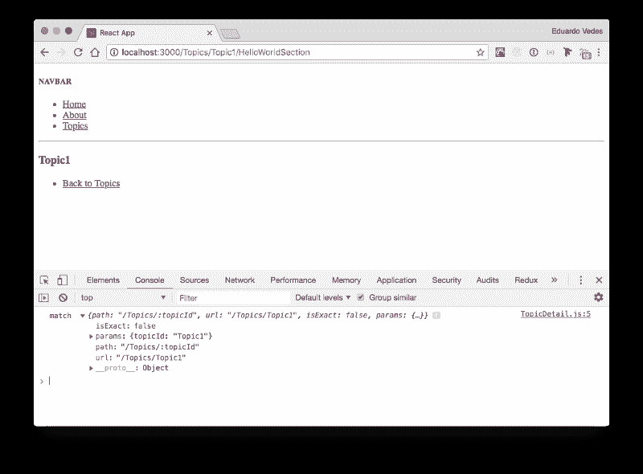

**isExact false example**

在这种情况下，我们在浏览器 URL 中引入了 **/HelloWorldSection** 。

发生的情况是路由器不知道到 **HelloWorldSection** 的完整路径，所以它会把你路由到它知道路的地方。

**isExact** 显示 false，准确地告诉你“**整个 URL 不匹配**”。

这非常有用，只要你开始用 RRv4 做 spa，你就会看到！

为了完成我们对**比赛**的介绍，看看这个:

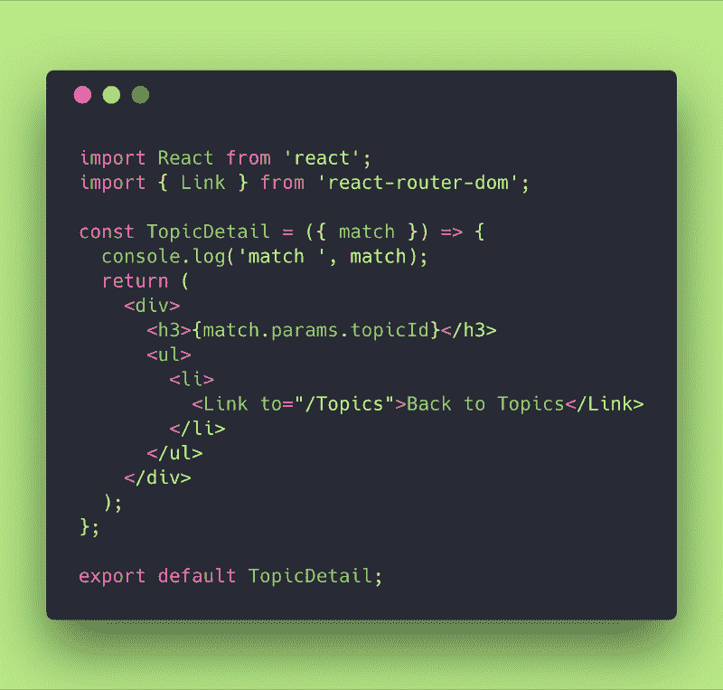

**TopicDetails code**

我们使用了 **match.params.topicId** 在屏幕上打印我们的主题名称。

这是 **match** 最常见的用法之一。

当然，它有多种应用。假设我们需要用这个 **topicId** 信息获取一个 API。？

### **地点**

**位置**对象代表应用程序现在的位置，你希望它去哪里，甚至它曾经在哪里。

它也可以在 **history.location** 中找到，但是你不应该使用它，因为它是可变的。

一个**位置**对象永远不会变异，所以你可以在生命周期挂钩中使用它来确定导航何时发生。这对于数据获取或 **DOM** 副作用非常有用。

咱们 *console.log(location)* 内**首页查看**:

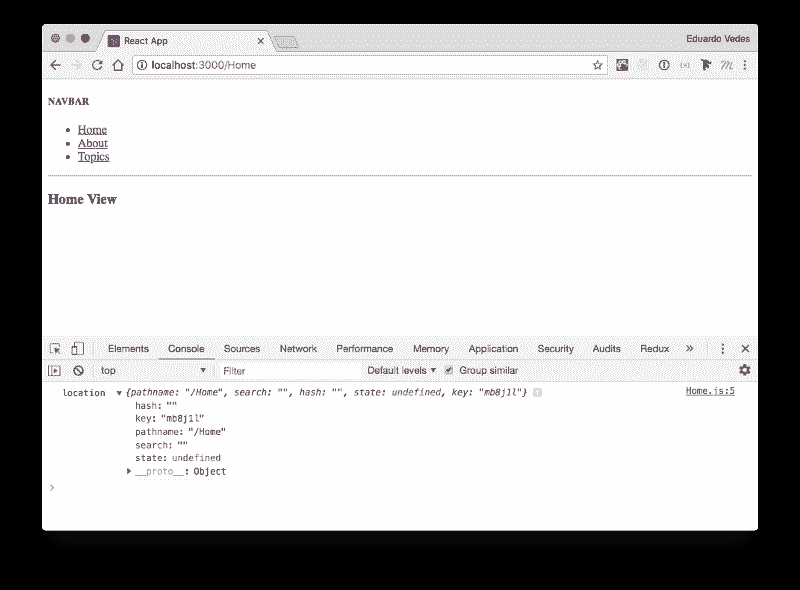

**console.log(location) inside Home View**

让我们不要深究太多，保持简单的功能。

你有**路径名**键/值。

例如，您可以使用它来检查**路径名**是否已更改:

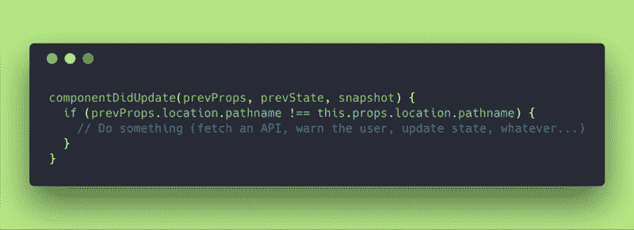

**usage of location inside lifecycle method componentDidUpdate()**

你可以 **<链接/ >** 或者 **<重定向/ >** 到它。您可以执行 history.push 或 history.replace，我们稍后会看到。

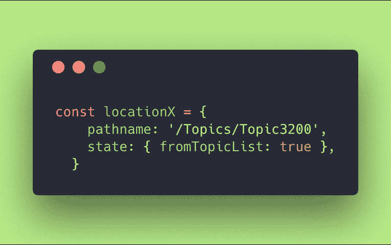

您可以创建自定义对象并使用它

*   **<重定向到={locationX} / >**
*   **<链接到={locationX}/ >**
*   **history.push(locationX)**

也可以将其传入**/</>**和**/</>/**组件。

这将阻止他们使用路由器状态中的实际位置。也许你想欺骗一个组件在一个不同于真实位置的地方渲染？

现在位置够了…

再来看**历史**！

### **历史**

**history** 对象允许您管理和处理视图或组件中的浏览器历史。

*   **length** : (number)，历史堆栈中的条目数
*   **动作**:(字符串)，当前动作(推送、替换或弹出)
*   **位置**:(对象)，当前位置
*   **push(path，[state])** : (function)，将新的条目推送到历史堆栈上
*   **replace(路径，[状态])** :(函数)，替换历史堆栈上的当前条目
*   **go(n)** :(函数)，将历史堆栈中的指针移动 n 个条目
*   **goBack()** :(函数)，相当于 go(-1)
*   **goForward()** :(函数，)相当于 go(1)
*   **阻止(提示)**:(功能)，阻止导航

因此，让我们在**主视图**中控制台. log**历史**对象，看看它显示了什么:

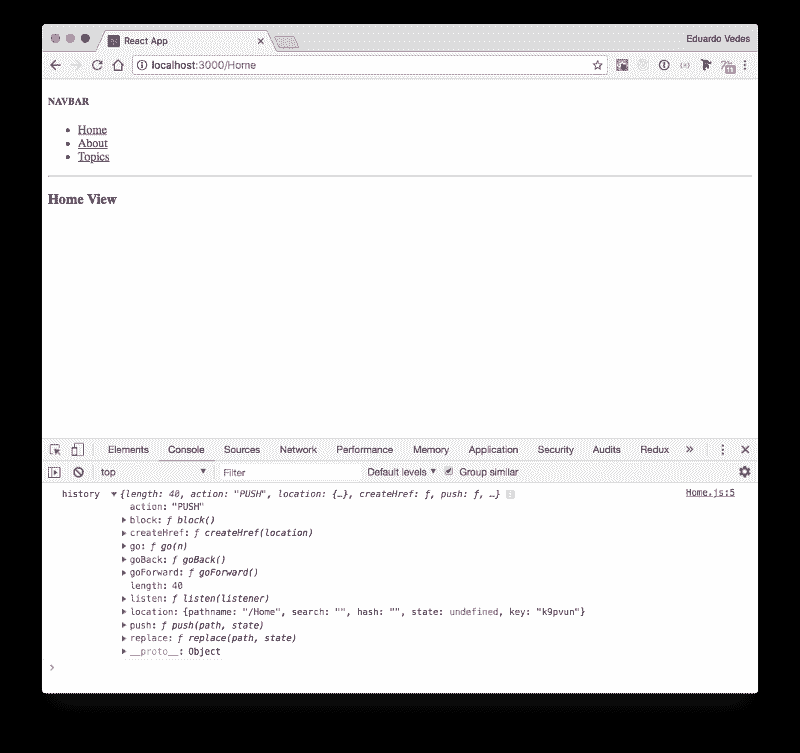

**console.log(history) inside Home View**

好吧，正如我们所料。

它告诉我们，我们已经通过一个**推**动作到达这里，对象的**长度**是 **40** (当你浏览你的应用程序**历史**增长到 **50** 并在那里停止，丢弃较旧的条目，并在应用程序每次将另一个历史条目推入对象时保持其大小)。

它给了我们**位置**的信息。

同样，**历史**对象是**可变**。因此建议从**路线**的**渲染**道具进入**位置**，而不是从**历史位置**进入。

这确保了您关于 React 的假设在生命周期挂钩中是正确的。

例如:

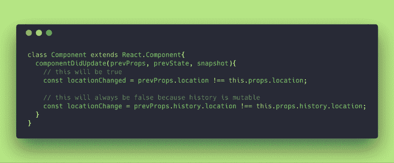

**example of the usage of location, right and wrong**

通常，您可以使用它来更改浏览器 URL 路径。

在下面的例子中，我们避开了 **<链接>** ，创建了一个历史推送按钮:

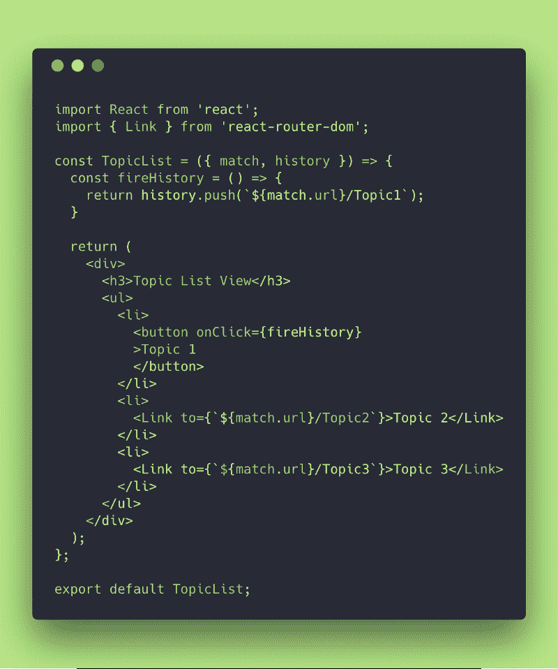

**example of history.push usage**

当然，在一些数据获取或副作用之后，您可以使用它来触发 URL 更改。

在 JSX 市中心使用它很舒服，在那里你不想调用组件。你可以简单地**返回**一个**历史推送**并触发**路由器**到**更新**浏览器 URL。

### 最后但并不是最不重要的

我想此时你已经对如何使用**匹配**、**位置**和**历史**胸有成竹了。

我没有对我们最初的样板文件做任何修改，所以可以在本指南的[第 1 部分](https://medium.freecodecamp.org/hitchhikers-guide-to-react-router-v4-a957c6a5aa18)中提供的同一个[回购](https://github.com/evedes/React-Boilerplate-01)中随意使用它。

#### **05。参考书目**

为了撰写这篇文章，我使用了 React 路由器文档，你可以在这里找到。

我使用的所有其他网站都沿着文档链接，以添加信息或提供我试图向您解释的内容的背景。

本文是“React 路由器 v4 搭便车指南”系列文章的第 2 部分

*   [第一部分:20 分钟后 Grok React 路由器](https://www.freecodecamp.org/news/hitchhikers-guide-to-react-router-v4-a957c6a5aa18/)
*   第三部分:通往无限和更远的递归路径！
*   第四部分:[路由配置，定义路由配置数组的隐藏值](https://www.freecodecamp.org/news/hitchhikers-guide-to-react-router-v4-c98c39892399/)

？非常感谢！