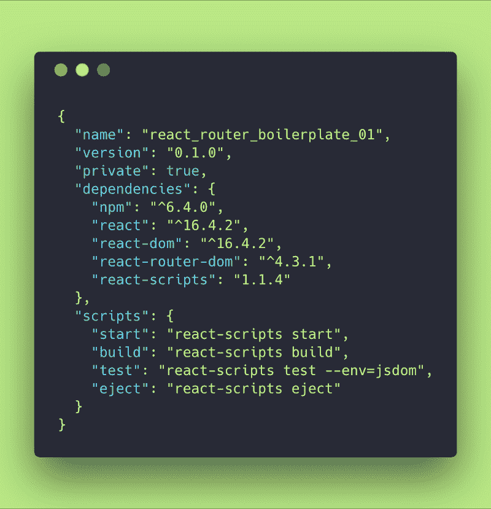
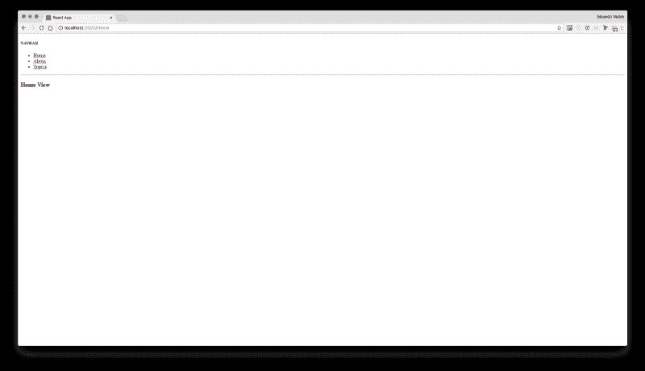
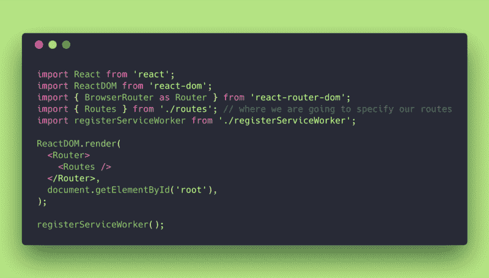
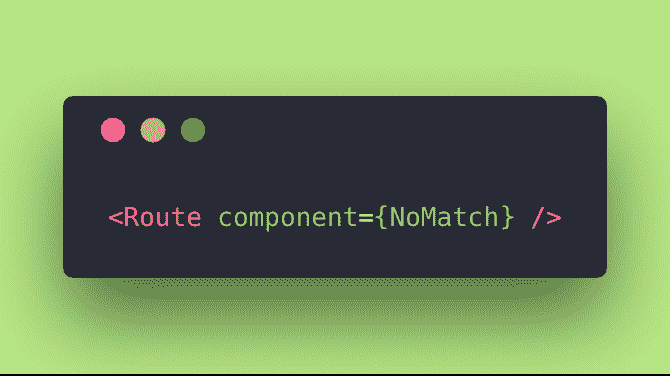
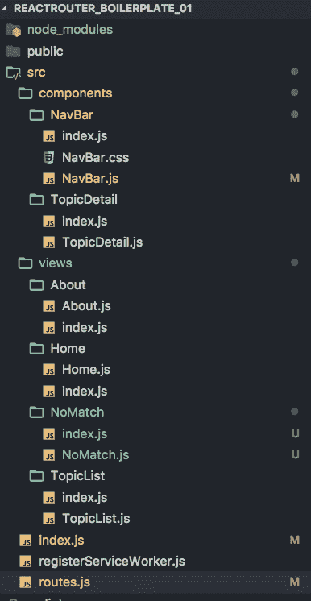
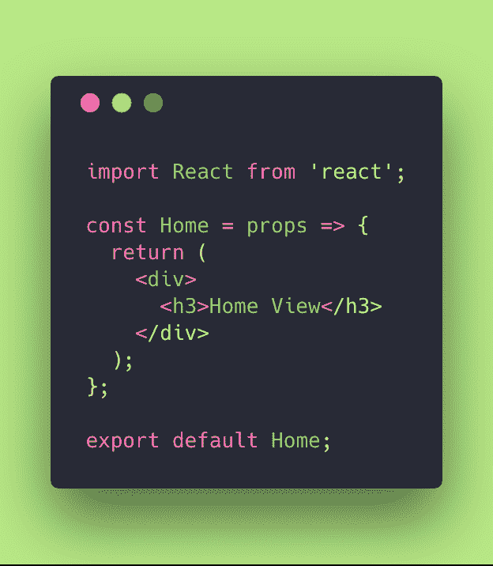
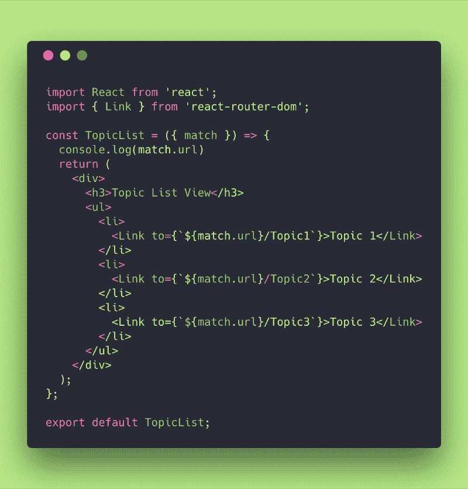
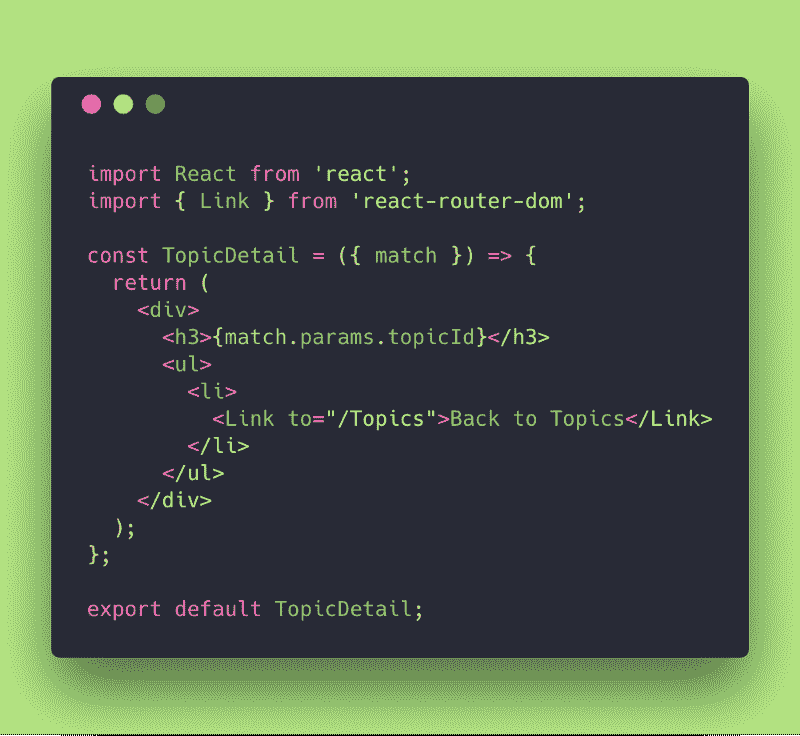
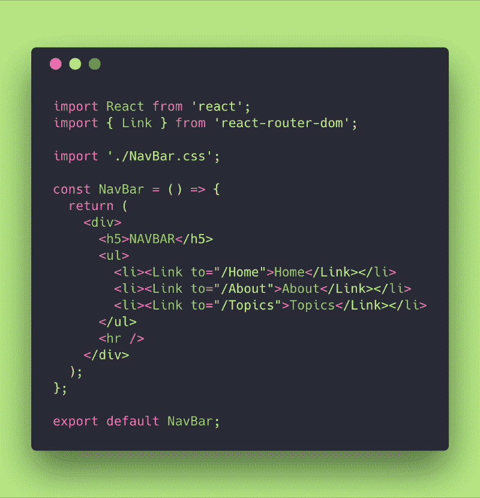

# React 路由器的搭便车指南 v4:20 分钟内搞定 React 路由器

> 原文：<https://www.freecodecamp.org/news/hitchhikers-guide-to-react-router-v4-a957c6a5aa18/>

嗨，搭便车的人！想坐进 React 路由器吗？跳进来。我们走吧！

为了理解 React 路由器背后的哲学，我们需要知道什么是单页应用程序(SPA)。

### 什么是单页应用程序？

基本上，它是一个 web 应用程序或网站，通过动态重写当前页面与用户交互，而不是从服务器加载整个新页面。

### 为什么这个这么好？！

**1。**避免连续页面之间用户体验的中断

**2。**使应用程序更像桌面应用程序

**3。**所有的代码资源都是动态加载的，并根据需要添加到页面中，通常是为了响应用户的操作

**4。因为这是一场又一场的超宽 4K 级别的比赛。？**

SPAs 现在是一个行业标准，许多公司都在寻找程序员来开发他们的项目。

### **什么是 React 路由器？**

React Router 是一个允许您处理路由的工具。

因为您正在处理一个 SPA，所以您需要一种方法来触发加载到屏幕上的内容。React 路由器引入了一个概念，叫做“动态路由”，与我们习惯的“静态路由”有很大不同。

当你处理“静态路由”时，你在任何渲染发生之前声明你的路线作为你的应用程序初始化的一部分(Rails，Express，Ember，Angular，等等)。

“动态路由”意味着路由发生在应用程序渲染时，而不是在运行的应用程序之外的配置或约定中。

React Router v4 提倡并实现基于组件的路由方法。

它根据应用和平台的需要提供不同的路由组件。

在这个具体的例子中，我们将探索 **<浏览器路由器>** ，因为我们想在“web app”环境中使用“动态路由”，而将其他的留给其他环境。

### 【React 路由器是谁创造的？

这两个了不起的人，迈克尔·杰克逊和 T2，瑞安·弗洛伦斯。他们应该得到很多很多的掌声！他们一起开始了[反应训练](https://twitter.com/reacttraining)。

如今，如果我说错了，请纠正我，他们走上了不同的道路:

迈克尔·杰克逊继续进行反应训练。

瑞安·弗洛伦斯创建了 [Reach。技术](https://reach.tech/)。

### 【React 路由器和 Redux 有什么关系吗？

不。虽然他们通常一起出现。

你确定吗？什么事？我确定吗？

它们都是伟大且不可或缺的工具，并且因为它们是更高阶的组件(基本上是接受一个组件并返回一个新组件的 JavaScript 函数)，所以经常会发现它们被“组合”在一起。

### **设置，让我们动手吧**

Photo by [Rose Elena](https://unsplash.com/@rosiet07?utm_source=medium&utm_medium=referral) on [Unsplash](https://unsplash.com?utm_source=medium&utm_medium=referral)

为了指导您完成这一过程，我们将使用 Create React App (CRA)。

最后，你将有一个干净的样板来构建简单的网站。

如果碰巧 [React](https://reactjs.org/docs/hello-world.html) 或 [Create React App](https://github.com/facebook/create-react-app) 超出了你的理解范围，我建议你先进入其中，然后带着一杯咖啡回来。

好吧，对那些和我站在一起的人:安装 CRA 之后，你需要安装 react-router 包。

如果您使用 npm，只需打开您的终端，进入您的 CRA 文件夹并键入:

*T2`npm i -S react-router-dom`*

或者

**`yarn add react-router-dom`**——*如果你用纱当你的包经理。*

*只是为了检查你的***package . JSON*****确保一切正常，下面是我的:***

******

***如你所见。此时，我们将 **react-router-dom** 作为依赖项。***

***完成，npm 或纱线开始和…***

*****砰！我们骑着马！*****

### *****我们正在开发的应用*****

***让我们做一个简单的带有导航栏的个人网站，允许用户在内容之间切换。我们的网站将有三个主要部分，称为**主页**、**关于**和**主题**。***

*****导航条**将是一个无处不在的组件，而**主页**、**关于**和**主题**将根据所选的路线呈现在下面。***

***你看到下面截图中的浏览器网址:***localhost:3000/home***了吗？***

***这意味着**家**路线被触发，并且**家**视图被渲染。***

***这将是我们的最终结果:***

******

***还有这个…？，这是个网站？***

***？是的，它是！***

***一个裸体的！试着不要偏向其他复杂的东西，比如造型等等！我不希望你们因为其他事情而分心，除了探索**实现 **React 路由器 v4** 有多简单**。***

***那么，在你从震惊中恢复过来之后？，让我们进行下一步，看看我的/src/index.js 文件。***

#### ***/src/索引. js***

***index.js 是 CRA 加载的第一个文件，它是你应用程序的初始化点。***

***让我们来看看我做了什么:***

******

***那我们在这里做什么？***

*   ***我们从已经安装的依赖项中导入了 **< BrowserRouter/ >** 组件，并声明从现在开始我们将把它命名为 **<路由器/ >** :***

*****`import { BrowserRouter as Router } from ‘react-router-dom’;`*****

*   ***我们正在导入一个由我创建的 **< Routes/ >** 组件，其中包含我们将在网站中使用的路线——现在不用担心这个组件:***

****T2`import { Routes } from ‘./routes’;`****

*****< Routes/ >** 组件取代了默认的 CRA***<App/>***组件。基本上是一样的——我只是把它叫做 **< Routes/ >** ，因为我觉得让代码变得更有意义和可读性是有意义的。***

***您不再加载一个独特的应用程序，而是加载一个 **Routes** 组件，该组件将处理路线，并触发组件的安装和渲染，这些组件将在每条路线中加载。***

*   ***我们用 **<路由器/ >** 组件拥抱 **<路由/ >** 。***

***事实上，**</路由器/ >** 作为[的高阶组件](https://reactjs.org/docs/higher-order-components.html)，只知道它未来的孩子，并在更广的范围内与他们互动，而与他们是谁、有多少无关。***

***你不必担心如何使用它。这是一个更深刻、更高级的问题。***

***只要确保你明白**和**对**的反应。DOM** 不再是**加载一个简单的 App** 。它正在加载一个名为`Router`的组件所包含的应用程序，该组件在一个更高的实例或范围内可以与它和浏览器`DOM`进行交互。***

#### *****<航线/ > Com** 组件***

******

#### ***那么基本上 *routes.js* 是做什么的呢？***

***它从导入 React 和一些组件开始，我们稍后将会看到这些组件。你就把它们想象成简单的无状态组件: **Home** ， **About** ， **TopicList** ， **TopicDetail** ， **NavBar** 和 **NoMatch** 。***

***它还从 **react-router-dom** 包中导入了我们需要调用的三个组件: **< Route/ >** 、 **< Switch/ >** 和 **< Redirect/ >** 。***

***在导入之后，我们导出无状态组件 Routes，它调用了`NavBar`(它将总是在屏幕中)和一个 **< Switch/ >** 组件。***

#### ***这个<switch>家伙是干什么的？</switch>***

***该组件基本上呈现匹配浏览器位置的第一个孩子 **<路线>** 或 **<重定向>** 。***

***它开始测试这样的东西:“浏览器 URL 在这个 **<路径/ >** 路径中吗？没有吗？好吧。”下一条路线。“浏览器 URL 是否在另一个路由路径中？没有。”***

***下一条路线。“哦，我知道了！就在这一条中，让我们触发组件渲染并完成检查(我不在乎下面的其他路线…)”***

***如果万一发生这种情况:***

******

***第二条路由永远不会被触发，因为交换机将在到达它之前跳开。他只是去喝咖啡……(我也是！！！？后退！)***

***在 **<开关/ >** 里面我们定义了每条 **<路线/ >** 。***

***每条 **<路线/ >** 都这样告诉浏览器:
“嘿浏览器 DOM！如果 **< Switch/ >** 选择我是因为你的位置(恰好)是这个，请渲染以下组件”。***

******

***或者在其他情况下，比如下面这个，它说:
“嘿，浏览器，如果通过任何实例你的**<>**选择我是因为位置是/Topics/“某物”呈现组件主题细节。当然，它会找出谁是 **this :topicId** (变量)的东西，用户要求我们匹配并相应地路由它。***

******

***好了各位。因为 **<交换机/ >** 具有检查每条路由的默认行为，所以我们需要提供一个后备，以防它不匹配任何内容:***

******

***最后一个路由只是呈现一个默认页面，声明没有匹配的路由，类似于 [HTTP 404](https://en.wikipedia.org/wiki/HTTP_404) 错误。***

***请记住，我们在这里处理的是 SPA 和“动态路由”，所以这是一个模拟，就好像我们需要到服务器的路由一样。。实际上我们不是！***

***我们只是不知道如果用户像这样在 URL 中插入一些没有不匹配的内容，应该呈现什么:http://localhost:3000/hello world。***

***由于没有定义该路由，我们提供了一个 **NoMatch** 组件来通知他们该路由不存在。***

*****< Redirect/ >** 之所以存在，是因为如果用户试图加载没有任何路由的 URL**http://localhost:3000/**，它会得到一个 **NoMatch** ，因为没有为它定义路由。因此，最好的处理方式是使用 **<重定向/ >** 并将用户推至 **/Home** 的路线，这是默认情况下我们应用程序的第一个屏幕。***

#### ***为什么这是必要的？***

***同样，因为通常用户会通过键入其通用 URL 来启动应用程序，并且没有 **< Redirect/ >** ，第一个呈现的组件将是 **< NoMatch/ >** 。我们不希望这样，我们希望用户被重定向到 **<主页/ >** 组件。***

### *****视图和/或组件*****

***在我们的指南的这一点上，我想稍微停下来区分一下视图和组件。这并不是本指南的精髓，但在我向您展示我的 *CRA* 的文件夹结构后，它将变得有意义。***

***当我们"[在 React](https://reactjs.org/docs/thinking-in-react.html) 中思考，我们开始制作一个应用程序，它开始成长，有时我们会停下来，因为我们觉得事情不在正确的地方。***

***这意味着我们需要给那些东西起名字，并把它们分开放在不同的“抽屉”或“文件夹”里。***

***视图和组件是画在屏幕上的东西。那么，是什么将两者区分开来呢？***

***而视图不是组件吗？而组件不是视图？***

***嗯，就编码语言而言，视图和组件当然是函数或类——我们用 React 行话称之为无状态组件或有状态组件。***

***那么他们的区别是什么呢？***

***嗯，一个视图有一条路线。在这个视图中，你可以渲染很多组件。***

***组件通常是一种抽象，可以在不同的视图中被多次调用。它可以是一个按钮，一个表格，一个图表。它甚至可以是一个更复杂的东西，而一个视图是唯一的，并且有一条路线。***

***这是一个非常简单的概念，必须在一开始就明白，只要我们开始做一个像个人主页这么小的 app。***

***让我们来看看我的 CRA 文件夹结构:***

***

CRA folder structure*** 

***所以，正如你所看到的，我和世界上 99%的人都喜欢把橘子和梨放在不同的篮子里。你也是！我对你有信心！我相信你！***

***关于如何组织这些东西有很多模式，当我们引入更多像 Redux 这样的包来稍微改变应用程序的架构时，或者当我们想在屏幕上绘制仪表盘、小部件、骑自行车的猪或更奇怪的东西时，就会开始很多讨论…***

***但是，为了区分概念，请仔细看看视图和组件。***

*****首页**、**关于**、 **TopicList** 和 **NoMatch** 都是观点。它们有自己合适的触发途径。***

***NavBar 是一个无处不在的组件，总是被调用。它没有路线。***

*****TopicDetails** 是一个组件，当 **TopicList/:topicId** 路由被触发时，将显示主题信息。它是一个可重用的组件，可以导入到其他地方并进行重构或扩展。它没有特定的路线。***

### *****首页/关于观点*****

***在 Home 文件夹中，我有一个 *index.js* 和一个 *Home.js* 文件。***

***用一个 *index.js* 来导出其他文件是一个很好的做法。相信我或者带点酒因为这将是一次长谈？***

***…哦，我们先把酒喝了，以后再谈！？***

***

**index.js that exports Home view***** ***

**Home.js view stateless component***** 

***这是一个简单的视图，只导出它的标题。关于的**视图等于这个。*****

***现在让我们来看看**主题列表视图**，因为它有点不同。***

### *****TopicList 和 TopicDetail 视图*****

***

TopicList View Code*** 

***所以 **TopicList 视图**有处理不同路线的细节。还记得那个 **/Topic/:topicId** route 那个 **< Route/ >** 告诉**</>**让 **TopicDetail** 处理吗？***

***我们在这里。***

*****TopicList** 收到 **{ match }** 作为道具。不要让析构特性吓到你。我们可以简单地接收道具并调用*道具。这就是现在所有酷孩子如何析构道具来提高可读性和反应流。我也很喜欢！这有点像拿起一个装有手机的盒子，或者直接拿起手机。事实上，它被保存在盒子里，但现在你只需要查看你的电子邮件？所以让盒子留在原处！上班不要带！****

***不管怎样，让我们继续关注代码。***

***在这个文件中，我们从 React 路由器导入一个名为 **{ Link }** 的组件，因为我们想要创建链接？***

***当我们点击**主题**时，我们从我们选择的路线中接收到一个匹配，并且我们呈现了一个带有 3 个选项的无序列表:**主题 1** 、**主题 2** 和**主题 3** 。***

***基本上，如果用户在屏幕中选择**主题 1 链接**，则 **<链接/ >** 会将浏览器 URL 推送到该路径**/主题/主题 1** 。***

***接下来会发生什么？ **<路由器/ >** 和 **<交换机/ >** 检测到 URL 发生了变化，并查看它们的信息以检查需要触发什么路由。所以他们发现现在触发的路由是“用于 **/Topics/:topicId** 的路由，并触发 **TopicDetail** 渲染。**主题详细信息**将呈现**主题 1** 的详细信息。***

***

TopicDetail Component*** 

*****TopicDetail** 从路由器接收 **match** 并渲染位于 **match.params.topicId** 的 **topicId** 。***

### *****导航条组件*****

***导航栏组件在这里有一个特殊的作用，因为它无处不在。***

***它的功能是允许用户浏览网站，并显示可用的路段(路线)。***

***正如你在开始看到的，它在 **<路由器/ >** 之内，但在 **<交换机/ >** 之外，所以任何视图都将由顶部的**导航栏**组成。***

***

NavBar Component Code*** 

***如你所见，它的作用是基本的。它只提供 **< Link/ >** 并告诉 **<【路由器】/ >** 请求 **<【开关】/ >** 触发所选择的 **<路由/ >** 并呈现在屏幕上。***

### *****最后但并非最不重要的*****

***我想这时候你大概已经对 React 路由器的工作原理有了基本的了解，可以用来做一个简单的网站了。***

***如果你想检查代码或者测试它，你可以在 GitHub 上找到我的回购。***

### *****参考书目*****

***为了撰写这篇文章，我使用了 React 路由器文档，你可以在这里找到。***

***我使用的所有其他网站都沿着文档链接，以添加信息或提供我试图向您解释的内容的背景。***

***本文是“React 路由器 v4 搭便车指南”系列文章的第 1 部分第 2-4 部分将在本周陆续来到 freeCodeCamp！***

*   *****[第二部分:【比赛，地点，历史】—你最好的朋友！](https://www.freecodecamp.org/news/hitchhikers-guide-to-react-router-v4-4b12e369d10/)*****
*   *****[第三部分:递归路径，通向无限和更远！](https://www.freecodecamp.org/news/hitchhikers-guide-to-react-router-v4-21c99a878bf8/)*****
*   *****[第四部分:路由配置，定义路由配置数组的隐藏值](https://www.freecodecamp.org/news/hitchhikers-guide-to-react-router-v4-c98c39892399/)*****

***非常感谢！***