# React 路由器 v4 的搭便车指南:路由配置的隐藏价值

> 原文：<https://www.freecodecamp.org/news/hitchhikers-guide-to-react-router-v4-c98c39892399/>

欢迎来到 React 路由器 v4 的搭便车指南，第四部分！

现在我们已经了解了递归路由，让我们回到最初的样板文件，以避免混淆，并了解如何创建路由配置数组。

所以，简单回顾一下我们在开始时所做的事情，让我们看看我们最初的 **routes.js** 文件:

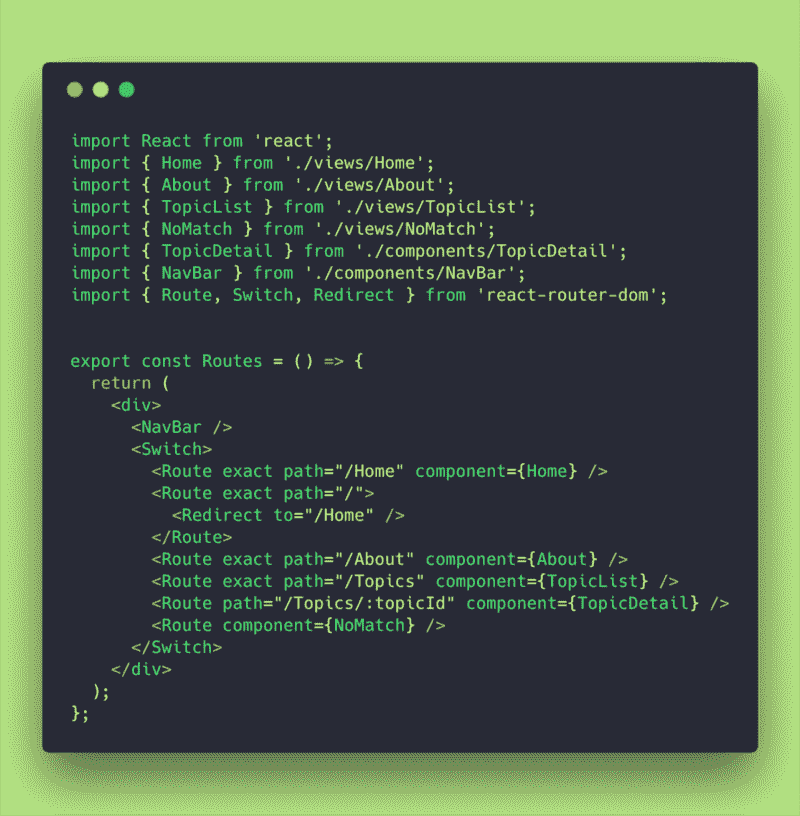

**routes.js (initial file)**

我们的 **Routes** 组件正在返回一个 **div** ，它带有一个**导航条**和一个**开关**，在这里我们定义了我们应用程序的所有路线。

在第 4 部分中，我们的第一步是定义一个 routes 数组。

### 路线数组

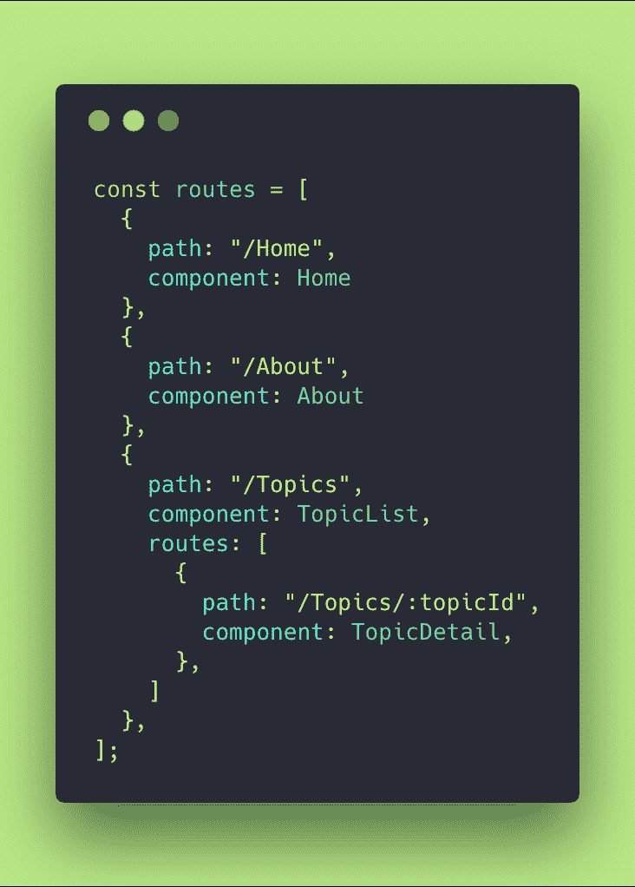

**routes config array**

我查看了我们的路由，并创建了这个数组，它定义了应用程序中的每条路由和子路由。

不错！现在怎么办？！？？

### 重构旧的硬编码路由

现在让我们清理硬编码的路由和交换机！

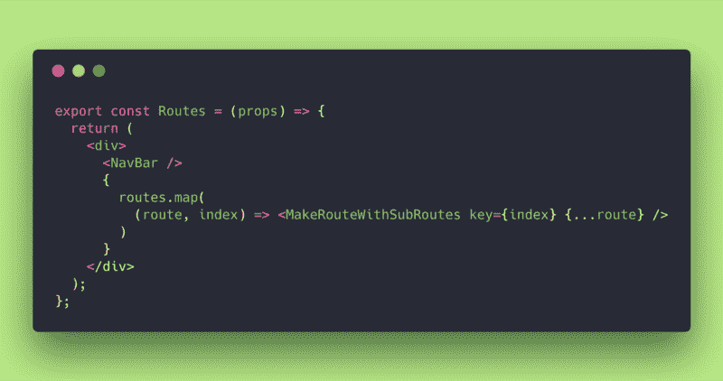

**improved Routes component**

耶！再见所有那些代码行。我们到底在做什么？

我们使用 ES6(粗箭头)回调来映射映射数组，以返回一个名为**<MakeRouteWithSubRoutes/>**的抽象组件。我们向它传递一个键(只是为了反应索引的目的)，我们也向它传播路由信息。

#### <makeroutewithesubroutes>组件</makeroutewithesubroutes>

同时，我们需要创建那个组件。我决定将它分开创建，并导入到 **routes.js** 文件中。

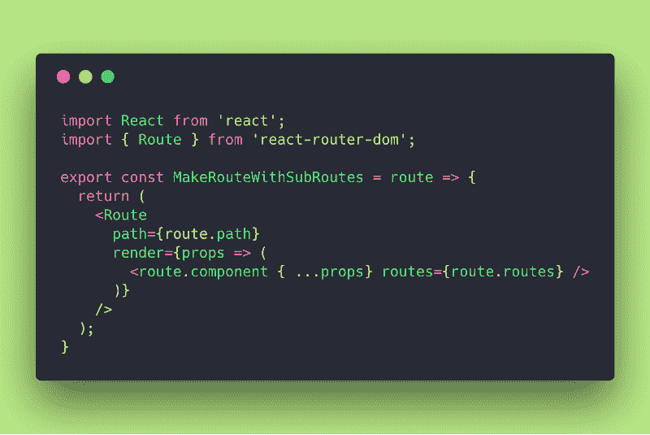

**MakeRouteWithSubRoutes Component**

好的，这个**<MakeRouteWithSubRoutes/>**组件接收您传入的每条路由，并返回一个 React Router**<Route/>**组件。

作为道具，我们有**路径**和 render 方法，它将调用您想要呈现的 **route.component** (然后向其传递传播道具和它需要知道的子路线)。

这些路由来自路由配置阵列，明白吗？不错！？

#### 主题列表(子路由)

也就是说，让我们看看 **TopicList** 组件，因为它是从路由配置数组接收子路由的组件:

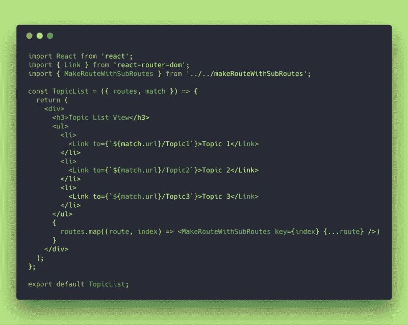

**TopicList Component with sub-routing**

那么，这里发生了什么？我们的 **TopicList** 现在正在导入**<MakeRouteWithSubRoutes/>**组件，并将其与收到的路由一起重用。

它还在子路线上做一个 **routes.map** ，并重复在 **routes.js** 文件中完成的过程。

花一分钟了解它，玩它！

#### 越来越多的子路由

正如你所看到的，这工作得很好。它是抽象的，关注点是分离的。**<MakeRoutesWithSubRoutes/>**是一个相当容易使用的无状态组件或函数，它不关心路由内容。它只是把你喂给它的东西传送出去。

如果我们想做更多的子路由呢？

很简单！只要保持增长或重新设计您的路由配置阵列！

**dynamic routes config array**

看到了吗？ **/Topics/:topicId** 的路由可能只是一个类似其父路由的数组。但是我决定做得更好，调用一个函数来调用 API 并返回一个新的路由数组(想象一下它获取 API？).

那么我们如何在应用程序中检查这一点呢？

让我们将一个 **console.log** 放入 **TopicDetail** 组件中，并检查它正在接收什么:

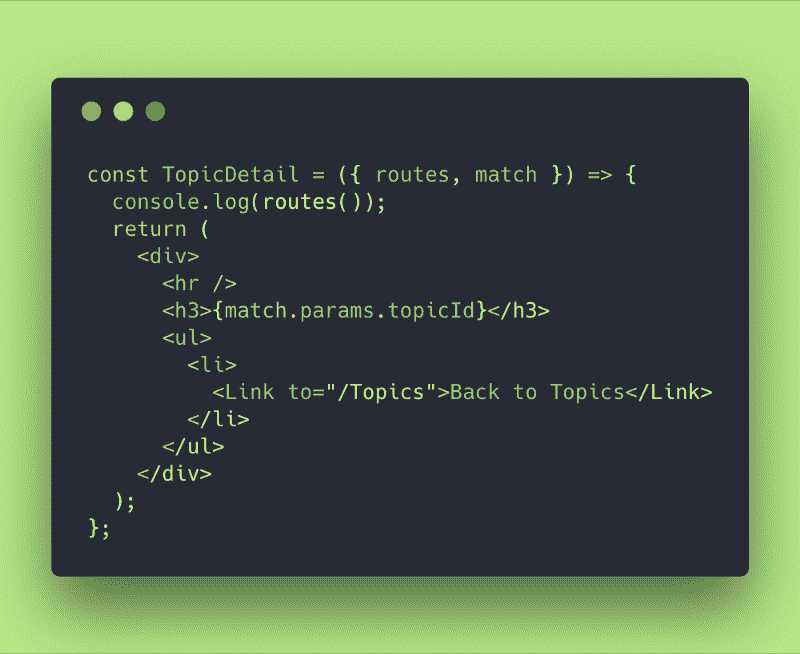

我正在调用 **console.log** 中的 **routes()** ，因为现在这个子路由是一个函数！记得吗？一切都好！？

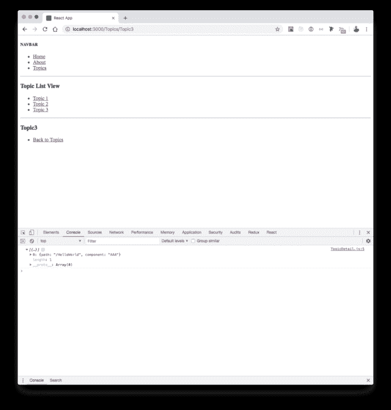

console.log(routes())

是啊，妈妈！我们做到了！我们动态地接收路由，并将其传播到我们的子路由和组件中。这太棒了！

### 没有匹配和不明确的路由

等等！我们的 **NoMatch** 组件在哪里？

好的，让我们将它引入到我们的路由配置数组中:

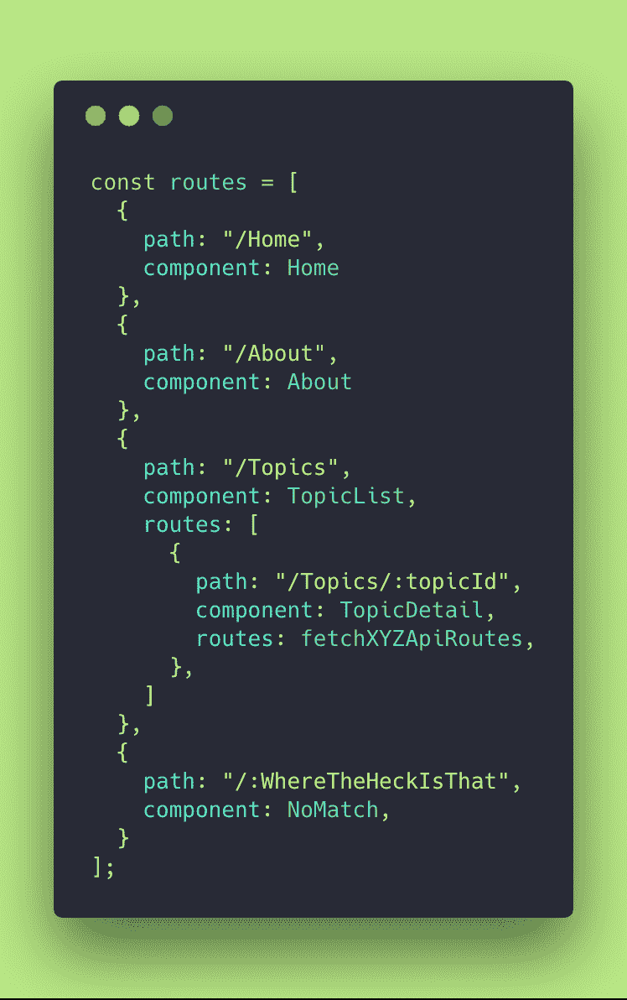

注意到**:where the checks 认为**是一个变量，因为它前面有一个冒号。

我们应该期待什么？

让我们来看看它的实际应用:

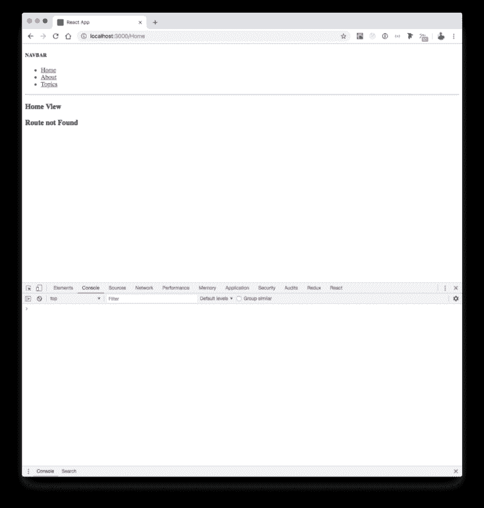

哇！事实上，它渲染了**无比赛**，但也渲染了**主视图**。为什么？

嗯，在我们最初的样板文件中，我们有一个**</>**开关，它选择了第一个与路径匹配的 **<路由/ >** ，还记得吗？

现在，由于我们没有开关，它可以同时匹配多条路径！

这些被称为模糊路由。路由器匹配了 **/Home** 并且同时匹配了**/:where the checks that**，因为它是一种接受一切的通配符。

我们如何纠正这种情况？

简单:抢 **<开关/ >** 回来！

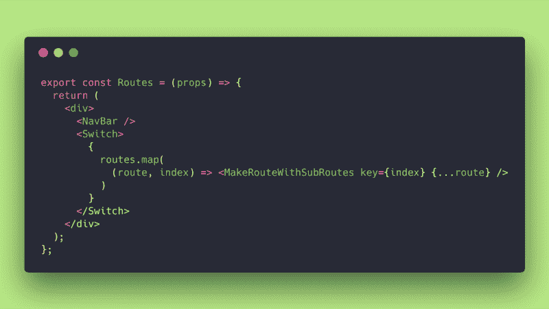

**<Switch /> is back to wrap our route.map!**

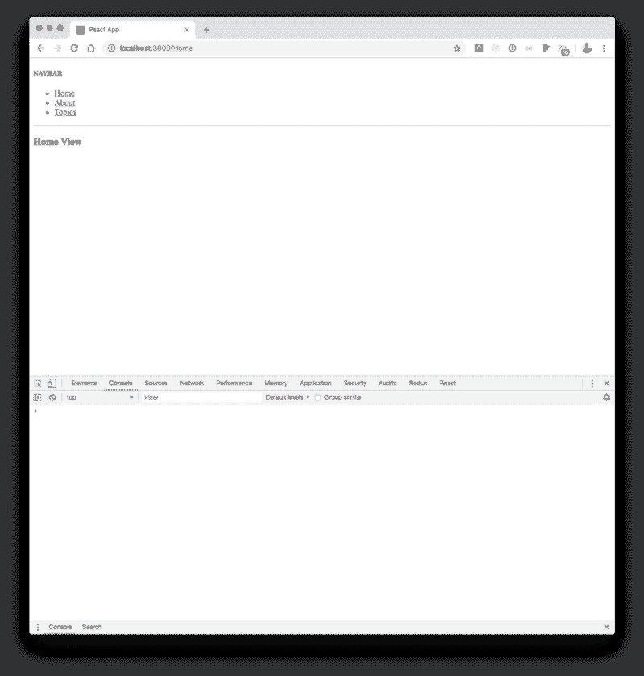

**Home component was the only match**

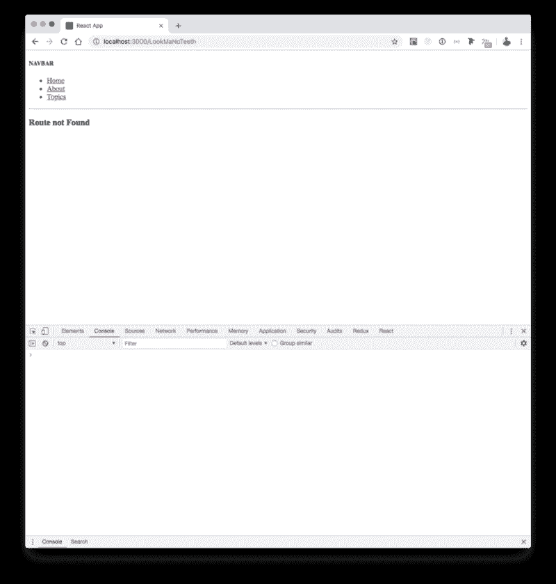

**Unknown paths trigger NoMatch component**

上面可以看到，现在 **/Home** 是单独渲染的，因为 **< Switch / >** 发现了它，马上返回了。

如果你在 URL 中放了一些未知的路径，它会触发**:/where the checks that**并默认呈现 **NoMatch** 组件。

干得好！一切都如我们预期的那样工作，现在我们有了一个**强大的路由阵列配置**，这允许我们有很大的灵活性。

这确实是拥有一个抽象和定义一个路由配置数组的隐藏价值！

### 最后但并不是最不重要的

React 路由器 4.0 版《搭车人指南》到此结束！

仍然有一些东西需要注意，但我更喜欢让你在我们已经建立的样板文件中深入一点，并在 React 路由器[网站](https://reacttraining.com/react-router/web/guides/philosophy)中寻找你需要的东西。

我在做这个指南时获得了很多乐趣，所以我想我会开始写更多的东西:)

这很好，不仅因为我能教你一些东西，还因为我在这个过程中学到了很多。

#### GitHub 回购

为了撰写本文，我对应用程序所做的更改可以在我的第 4 部分的 GitHub [repo](https://github.com/evedes/ReactRouter_BoilerPlate_04) 中找到。

#### 文献学

为了撰写这篇文章，我使用了 React 路由器文档，你可以在这里找到。

我使用的所有其他网站都沿着文档链接，以添加信息或提供我试图向您解释的内容的背景。

本文是“React 路由器 v4 搭便车指南”系列文章的第 4 部分

*   **[第一部分:20 分钟内搞定反应路由器](https://www.freecodecamp.org/news/hitchhikers-guide-to-react-router-v4-a957c6a5aa18/)**
*   **[第二部分:【比赛，地点，历史】—你最好的朋友！](https://www.freecodecamp.org/news/hitchhikers-guide-to-react-router-v4-a957c6a5aa18/)**
*   **[第三部分:递归路径，通向无限和更远！](https://www.freecodecamp.org/news/hitchhikers-guide-to-react-router-v4-21c99a878bf8/)**

？非常感谢！