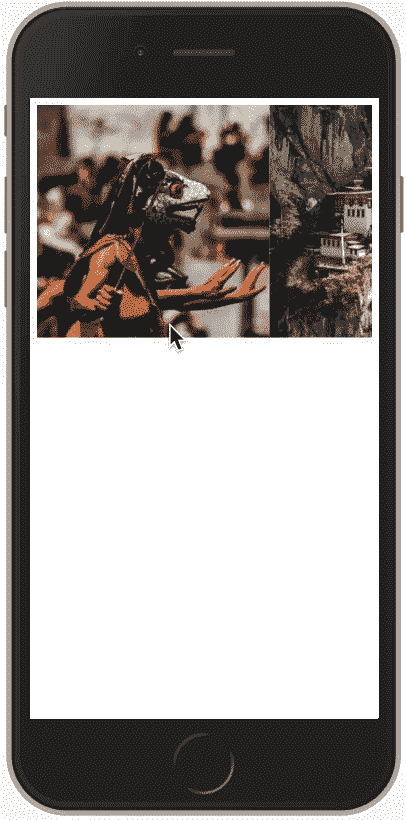
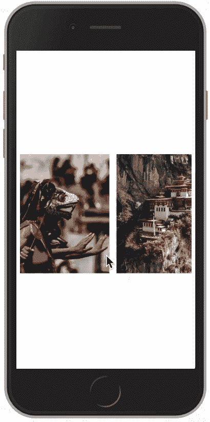

# 如何使用 Flexbox 实现水平滚动

> 原文：<https://www.freecodecamp.org/news/horizontal-scrolling-using-flexbox-f9d16817f742/>


Horizontal scrolling using Flexbox

如果你创建网站，你可能会被要求创建一个水平滚动组件。只用几行 Flexbox 就可以非常容易地实现这一点。让我告诉你怎么做。

#### 项目布局

我们需要创建一个容器来包含我们想要滚动的所有图像。代码如下:

```
<div class="container">
  
  
  
  
  
  
  
</div> 
```

#### 设计项目的样式

下一步是添加样式，使容器水平滚动。为此，我将容器显示为 Flexbox。此外，我将 overflow-x 值设置为 auto。这里是风格:

```
.container {
  display: flex;
  overflow-x: auto;
} 
```

这是水平卷轴的样子:



The initial version of our horizontal scroll

这确实提供了我们对水平滚动区域的要求。我对它的外观不满意。我想改变三件事:

*   在图像之间添加空白
*   去掉水平滚动条
*   将滚动条放在屏幕中间

这些图像很感人。让我们在它们之间添加一些空白。这是它的 CSS:

```
.container img {
  margin-right: 15px;
} 
```

接下来我想去掉水平滚动条，我可以用下面的代码来实现:

```
.container::-webkit-scrollbar {
  display: none;
} 
```

我想做的最后一个改变是将滚动中心放在屏幕的中央。默认情况下，html 的高度是元素的高度。我需要使高度为 100%的视口。Flexbox 提供了一种通过对齐项目设置来居中项目的方法。为了使用这个功能，我将把`body`转换成 Flexbox 显示。下面是我要为正文添加的代码:

```
body {
  display: flex;
  align-items: center;
  height: 100vh;
} 
```

有了这些改变，这就是我们最终的水平滚动区的样子。



### 结论

使用 Flexbox 创建一个水平滚动区非常容易。感谢阅读。

这里还有一些你可能想读的文章:

[**这里有 5 种你可以用 FlexBox 做出的布局**](https://hackernoon.com/here-are-5-layouts-that-you-can-make-with-flexbox-6ca1e941f33d)
[*CSS 灵活的盒子布局——FlexBox——为设计者和布局问题提供了一个简单的解决方案……*hackernoon.com](https://hackernoon.com/here-are-5-layouts-that-you-can-make-with-flexbox-6ca1e941f33d)

[**认为框外有 CSS 形状——框外**](https://hackernoon.com/mastering-css-series-shape-outside-44d626270b25)
[*CSS 是基于框外模型。如果你有一个你想让文字环绕的圆形图像，它会环绕……*hackernoon.com](https://hackernoon.com/mastering-css-series-shape-outside-44d626270b25)

[**通过构建计算器学习 CSS border-radius 属性**](https://medium.freecodecamp.org/learn-css-border-radius-property-by-building-a-calculator-53497cd8071d)
[*你见过网页上有圆角边的按钮吗？你见过符合…*medium.freecodecamp.org](https://medium.freecodecamp.org/learn-css-border-radius-property-by-building-a-calculator-53497cd8071d)的形象吗