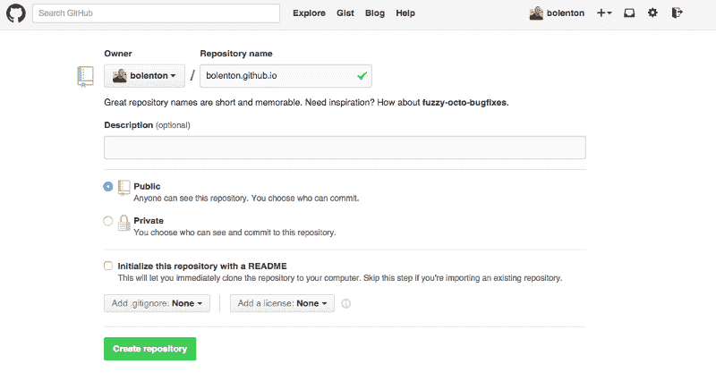

# 通过 Github 页面在你自己的域上托管你的静态网站

> 原文：<https://www.freecodecamp.org/news/hosting-custom-domain-on-github-pages-8c598248d2bc/>

由金牛座欧美佳


# 通过 Github 页面在你自己的域上托管你的静态网站

你知道 Github 将允许任何人免费托管他们的静态网页吗？最好的部分是，你甚至可以使用自己的自定义域。我们开始吧！

#### 第一步:创建你的网站

如果你已经有了一个网站，那么你可以进入第二步。

如果没有，那么今天就是开始的好日子。

我建议开个博客。博客是在网上建立更有意义的形象的好方法。你可以利用它来建立自己的[个人在线品牌](http://www.forbes.com/sites/shamahyder/2014/08/18/7-things-you-can-do-to-build-an-awesome-personal-brand/)。

不知道从哪里开始？我掩护你。Simpleprogrammer.com 大学的约翰·索姆兹有一门很棒的电子邮件课程，名为:[如何建立一个能促进你职业发展的博客](http://t.dripemail2.net/c/eyJhY2NvdW50X2lkIjoiOTUyNDk2NiIsImRlbGl2ZXJ5X2lkIjoiMjQ3MzM4MTciLCJ1cmwiOiJodHRwOi8vZGV2Y2FyZWVyYm9vc3QuY29tL2Jsb2ctY291cnNlLz9fX3M9ZTlueG9vM2RhaXBwdWVnb3l6eWpcdTAwMjZ1dG1fY2FtcGFpZ249bGVzc29uLTUtZG8teW91LWtub3ctaG93LXRvLWdldC10cmFmZmljLWZvci15b3VyLWJsb2dcdTAwMjZ1dG1fbWVkaXVtPWVtYWlsXHUwMDI2dXRtX3NvdXJjZT1ob3ctdG8tY3JlYXRlLWEtYmxvZy10aGF0LWJvb3N0cy15b3VyLWNhcmVlci1jb3Vyc2UifQ)。这是一门很棒的课程，它会带你经历整个过程。

所以你决定开一个博客。现在怎么办？有很多方法可以选择，比如 Wordpress，Tumblr，甚至 Blogger。

但是这将违背本文的目的。我们想使用 Github Pages 免费托管一个静态页面。所以我推荐使用静态博客生成器。

我个人用 [Jekyll](http://jekyllrb.com/) 来写我的博客。但是还有很多其他人。这里有一些比较流行的列表:[静态博客生成器](http://www.sitepoint.com/6-static-blog-generators-arent-jekyll/)。选择一个，阅读说明，然后建立你的博客！

#### 步骤 2:将您的站点添加到 Git 版本控制中

太好了，你做到了第二步。现在你的博客已经准备好了，让我们使用 [Git](http://git-scm.com/) 对它进行版本控制。本文假设你已经安装了[Git](http://git-scm.com/book/en/v2/Getting-Started-Installing-Git)，你有一个 github 账户，并且[可以推送它](http://guides.railsgirls.com/github/)。

*   这一步非常重要:创建一个简单的。txt 文件，并将其命名为“CNAME”。打开文件并在其中键入您的自定义域名。省省吧。


Create a simple .txt file and name it CNAME

好吧！启动你的终端，导航到你的站点所在的目录。是时候通过输入命令来初始化版本控制了。

```
$ git init
```

现在将整个项目添加到 git 跟踪下。输入:

```
$ git add .
```

让我们承诺吧:

```
$ git commit -m “first commit”
```

您的网站现在处于版本控制之下。现在好戏开始了。

#### 第三步:把你的网站推给 Github

我们终于准备好推送至 GitHub，并看到我们的网站自动在线免费运行！

1.  启动[github.com](https://github.com/)并登录。
2.  在你的主页上，点击绿色的大按钮，上面写着“+ New repository”
3.  为了让您的页面自动托管，您必须遵循特定的命名约定。将您的存储库命名为“[your-username].github.io”，其他内容保持不变，然后点击“创建存储库”。



Name your repository, don’t do anything else, hit ‘Create Repository’

现在按照 GitHub 的指示将你的博客推送到你的新存储库。

就是这样！你的新页面应该在 http://your-username.github.io 上。

如果你没有马上看到，给它几分钟，最多 10 分钟。

就是这样！对大多数人来说，这就是你需要做的一切。然而，对于那些想使用自己的自定义域的人，请继续最后一步。

#### 步骤 4:将您的自定义域名分配到您的新 GitHub pages 网站

这将取决于你在哪里注册你的域名。我有 GoDaddy，所以这些说明是专门针对那个的。但是这些步骤应该与其他域提供者类似。我是这样做的:

1.  我登录了我的 GoDaddy 账户，选择了“管理域名”。我选择了我想使用的域名，然后点击“管理连接”。
2.  在“域详细信息”页面上，我单击了“DNS 区域文件”选项卡。
3.  编辑“A-Host”并指向 192.30.252.153
4.  现在编辑“CName(别名)”的 www 部分，指向[你的-用户名].github.io。
5.  一定要保存好一切。保存后，可能需要一个小时才能完全更新。
6.  现在“[您的-自定义-域]。com”应该指向[your-username].github.io .但是如果你的用户输入“www。[您的自定义域]。com”代替？让我们修正一下，让 www 子域也指向[your-username].github.io。
7.  选择您的域并按“管理连接”，然后选择“设置”标签。
8.  在转发->域下，单击“管理”。
9.  点击“更新转发”。
10.  在“转发到:”中，键入 www。[您的自定义域]。com
11.  确保选择 301(永久),然后保存您的工作。
12.  就是这样。允许大约 1 个小时的时间来更新所有内容。

让我第一个向你祝贺。你有了一个运行中的网站，有版本控制，有自己的域名——全部免费托管！

最初发表于 www.tauruso.com。查看这篇文章的全部荣耀和更多来自[金牛座 Omejia](https://www.freecodecamp.org/news/hosting-custom-domain-on-github-pages-8c598248d2bc/undefined) 的内容，点击[这里！](http://www.tauruso.com)