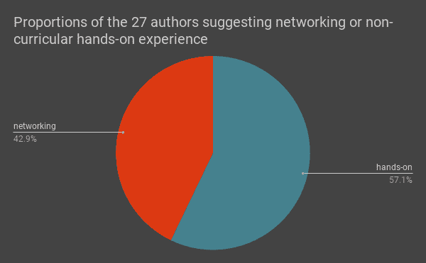
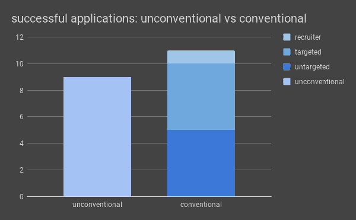
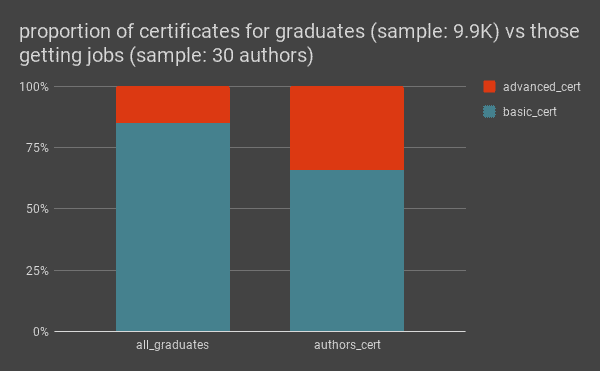
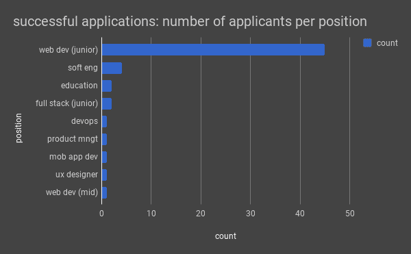
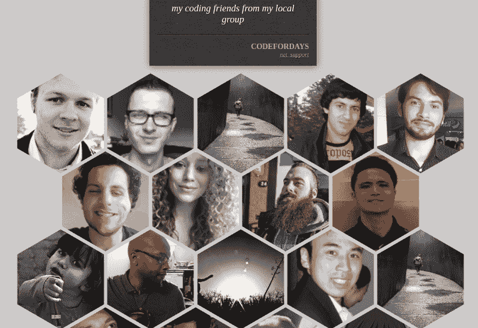

# 65 名没有编程经验的新开发人员如何获得他们的第一份工作

> 原文：<https://www.freecodecamp.org/news/how-65-new-developers-with-no-previous-coding-experience-got-their-first-jobs-103846ba640e/>

埃瓦里斯托·卡拉巴略

# 65 名没有编程经验的新开发人员如何获得他们的第一份工作

#### 剖析成功的新编码员

在 freeCodeCamp 期间，我阅读了许多以前没有编码经验的学生的帖子和文章，他们最终找到了开发人员的工作。

作为免费在线自我教育平台的坚定支持者，这些故事更加坚定了我对这种教育方式有效性的信念。

然而，仅仅将这种成功归因于平台是不完整的:这种成功的一部分取决于这些学生在学习和最终找工作时做了什么。

快速浏览一下新程序员找到工作的故事，可以发现他们做出了各种各样的决定，并采取了各种行动来增加他们的机会。那些决定和行动是什么？换句话说，我想知道:

> 自从开始学习编码以来，他们做了什么，让他们最终找到了工作？

为了这个项目，我分析了在 freeCodeCamp 的论坛和 freeCodeCamp 的媒体上找到的 65 位作者的作品来回答这个问题，主要集中在 freeCodeCamp 项目上。

这是我的发现。

### 1.不是完全从零开始

总体人口统计数据与 2016 年[和 2017 年](https://medium.freecodecamp.org/we-asked-15-000-people-who-they-are-and-how-theyre-learning-to-code-4104e29b2781)[的](https://medium.freecodecamp.org/we-asked-20-000-people-who-they-are-and-how-theyre-learning-to-code-fff5d668969)新编码器调查结果一致。

*   作者大多是男性。只有六个人提到了他们的年龄，在 20 到 35 岁之间。
*   那些提到背景的人说他们有某个方面的学位，或者曾经在某个时候工作过，无论是兼职还是全职。这表明，他们通常会因为新发现的职业、对生活方式的渴望或更好的薪水预期和工作机会而改变职业。
*   对一些人来说，这一改变是冒险的一步。他们中的一些人已经有了债务和家庭。

### 2.学习网络开发意味着处理复杂性

围绕 web 开发的[信息量](https://medium.freecodecamp.org/the-absolute-beginners-guide-to-learning-web-development-in-2018-d87ba925549b)巨大、复杂且瞬息万变。对于一些作者来说，web 开发是“T2”混乱的同义词。

一些作者认为，面对这种复杂性的最佳方式是在**基础**方面变得强大:HTML、CSS、普通 JavaScript、算法，可能还有设计。这种说法背后的一个论点是，理解基础知识将有助于处理困难的部分，并提供很大的灵活性。

几位作者还强调了开发环境工具的重要性。根据他们的观点——版本控制器、编辑器、测试器、包管理器、模块错误和其他类似的工具和基础一样重要，应该从一开始就练习。

当在学习道路上走得更远时，**聚焦** 似乎是有用的。

一大群人选择**专攻** 项目中的技术或更适合潜在就业市场的技术。

少数**通才** 认为自己适应性强。

Choosing between specialist vs generalist approach (19 authors)

一些作者也写了关于锻炼到什么程度。大多数人建议关注**最低要求**和好的**最低可行产品。**

> “功能[高于]结构[高于]性能”——patricksevat，freeCodeCamp 论坛

那些超出要求的人很可能拥有非凡的解决问题的能力并展现出才华。这最终反映在他们的投资组合中。

### 3.承诺高于一切

只有少数人提出了一个明确而深思熟虑的计划。然而，仔细阅读这些文章会发现，他们中的大多数人自己确实遵循了某种计划。该计划通常包括设定可行的目标，但不指定具体目标和(硬性)期限。

例如:目标是“尽可能多地建立关系网，参加聚会”，而不是“在接下来的 X 个月里参加 X 个聚会，建立 X 个联系。”或者“在 HackerRank 中练习算法”，而不是“完成 X 个算法，在 X 天内达到 X 个排名。”

大多数人这样计划的一个可能原因是根植于自我感知能力的不确定性，这种能力可以应对有很多未知的任务。

对于许多作者来说，成功解决不确定性的最简单方法归结为**承诺:**每天花几个小时做与任务相关的任何事情，直到达到满意的结果。奉献的时间各不相同，如基于[新编码员调查](https://medium.freecodecamp.org/new-coders-how-salary-and-time-spent-learning-vary-by-demographic-359ef1ed0da8)的分析所示。

Times each topic was mentioned in all articles and posts (65); one per reading

没有多少人强调休息的必要性:我得到的印象是，许多人选择了一种相当密集的方式。仍然有一些人承认他们在学习的时候包括了**无编码期**。

### 4.的事情(真的！)帮助了他们

几位作者强调了某种实践经验的重要性。当包括所有的论点时，我数出了 35 个不同的作者。

这些作者中有一半认为该课程足够了，因为它鼓励为项目提供**非规定性解决方案**。看起来他们在课程上的进步越大，他们就越有可能相信课程已经足够了。

27 unique authors commented about at least one of these topics

那些寻找课外经验的人变成了**建立自己的项目**、**在线投稿、**和**自由职业者**。在课程中不太先进的人似乎更喜欢第一种选择，而那些更先进的学生更喜欢第二种。

> “你想成为一名软件工程师？为某事写代码…你想成为一名成长黑客？增长黑客什么的……产品经理？运送一些东西…去做吧”——rahuldotier，Medium

网络也是一个非常重要的方面。一些人赞扬了进入在线社区的积极作用。此外，那些发现并实践面对面交流的人获得了大量的回报，如有用的信息、指导，甚至获得潜在的工作或合作项目。

许多人列出了可选择的在线学习资源。他们中的一些人鼓励其他人**保持强大的在线存在，**或**在社交平台上帮助其他程序员**巩固他们的知识。

### 5.成为问题解决者

> “web 开发商店并不真的从事编码业务，他们从事的是解决问题的业务”——ken Rogers，Medium

对于那些关注工程的人来说，上面的引用可能是显而易见的。如果你的主要焦点是设计，那也是一样的:你的角色是提出美学功能的解决方案。

几位作者证实，他们正在为成为问题解决者做准备。他们中的许多人被要求在面试过程中解决一个问题。一些人还强调，他们必须学习新的东西来解决这些问题。

### 6.寻找和获得工作

#### 应用:是否有针对性？

报告他们如何通过面试获得工作的作者中有一半是通过绕过人力资源部门和机构的不太传统的渠道获得成功的。例如，他们使用社交网络、Craigslist 或直接电子邮件，而不是传统的方法，如求职板和招聘人员。

21 authors mentioned which channel the got the job from

然而，除了五位作者之外，其他作者显然都支持通过传统渠道申请职位。

#### 投资组合是关键

为了获得这些采访，许多作者确认**投资组合**是一个非常相关的因素。

> “如果你没有投资组合，你就没有杰克”——quesurifn，freeCodeCamp 论坛

对于投资组合应该包含什么有不同的意见。例如:

*   一位作者声称它至少应该包含 [3 个项目](https://medium.freecodecamp.org/7-key-steps-to-getting-your-first-software-engineering-job-6ef80543cad9)。他们至少应该显示出进步，如果不是基于教程的就更好了。
*   另一位作者建议[只包括你做的最好的](https://forum.freecodecamp.org/t/one-year-of-fcc-gave-me-my-first-job-as-a-front-end-developer/151669)。
*   还有一个人建议新程序员在获得新技能后重做他们的作品集。

不仅投资组合的内容很重要，而且如何展示也很重要。那些强调 web 开发工程的人首先把 CodePen 项目变成了更像网站的格式。

这样的个人化程度表明**这个文件夹是用来支持申请人想要向潜在雇主展示的“个人叙述”**。

#### 还有什么？

**动机、承诺和学习能力(以及学习兴趣)**是在面试中多次提到的个人品质。

> (我的雇主说)他们可以教我编程，而(他们)不能教我努力工作、牺牲和追求梦想的动力

在谈判过程中可能起作用的其他方面是其他**个人技能**、**以前的经验、**和**背景**。似乎投资组合越简单，那些方面就越重要。

我没有仔细阅读他们写的关于技术考试、求职信和简历的内容，但我得到的印象是，一些作者认为前两项比最后一项更重要。

#### 终于有工作了！

大多数作者在完成前端认证之前就开始找工作了。然而，这一数据可能表明**没有通过认证可能会使其更难找到工作**。

这来自于将作者的证书与获得不同 freeCodeCamp 证书的学生总数的比例进行比较。

毕业时，与拥有更高级证书的学生相比，申请基础证书的学生比例非常高。但是这一比例发生了变化，在找工作时更有利于水平更高的作者。鉴于现有的数据，得出结论是不正确的。

显然，大多数人得到的职位是初级网站开发人员，假设简单描述为“开发人员”的职位是初级职位。我不能讨论雇主的实际要求和谈判的内容，留下了相似的职位包含不同描述的可能性。

Data from 60 authors

### 7.这可能需要你一年的努力，但这是可行的

几位作者承认，自学然后找工作需要很多自我激励。这并不容易，但正如许多人指出的那样，这是可行的。

> “你知道你的目标，你可以让它实现”——德罗赞 10，自由代码营论坛

根据报道的日期，从开始学习编程到找到工作的中间时间是 320 天。那些花费较少的人大约 120 天，最少 90 天，而那些花费较长的人大约 550 天或更长。

### 结论

我们应该意识到数据的特征和实施的方法可能会影响这些结果的概括。

尽管如此，我们仍然可以从这个分析中吸取一些教训。然而，与其给你一个固执己见的“成功药丸”，我建议你把这些结果作为寻找自己道路的起点。

我邀请你继续阅读类似的材料，并在社交媒体上寻求建议。选择那些更适合你的技能、兴趣和情况的解决方案。你可以从探索 [**这个项目使用的文章和帖子的完整列表**](https://evaristoc.github.io/foundjob/65-new-coders-that-found-jobs/) (谢谢，[威廉姆·普里查德](https://www.freecodecamp.org/news/how-65-new-developers-with-no-previous-coding-experience-got-their-first-jobs-103846ba640e/undefined)！).

We prepared a small site to show the posts and articles used in this project; you can follow the link provided ([https://evaristoc.github.io/foundjob/65-new-coders-that-found-jobs/](https://evaristoc.github.io/foundjob/65-new-coders-that-found-jobs/))

为了完成这个项目，我们使用由 [Neenad Ingole](https://github.com/ninadingole) 制造的授权刮刀，以编程方式搜索了论坛的部分帖子。 [Toni Shortsleeve](https://www.freecodecamp.org/news/how-65-new-developers-with-no-previous-coding-experience-got-their-first-jobs-103846ba640e/undefined) 帮我识别媒体上的相关阅读。

对内容的分析包括在视觉工具(如[这个](https://evaristoc.github.io/foundjob/examples_analysis/job_project.keywords/))支持下的[对主要观点的经典识别](https://www.youtube.com/watch?v=jFyb-LiyJ-k)勾画[总结技巧](https://arxiv.org/pdf/1707.02268.pdf)。您还可以在我的 [GitHub 库](https://github.com/evaristoc/foundjob/tree/master/examples_text_analysis_tools)中找到这些工具的例子。

编码快乐！

当我不在[数据科学室](https://gitter.im/FreeCodeCamp/DataScience)的时候，我在[论坛](http://forum.freecodecamp.org)，查看我的[推特](https://twitter.com/@ecccs_fcc)，或者研究新的课题。