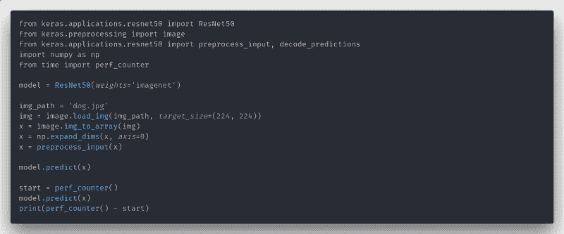
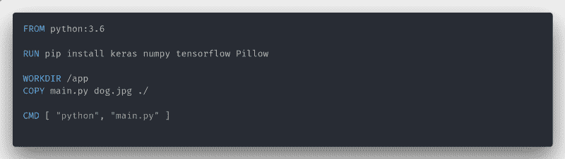
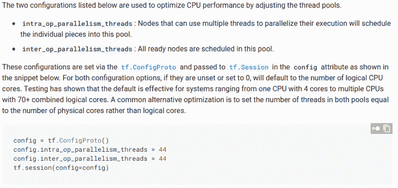
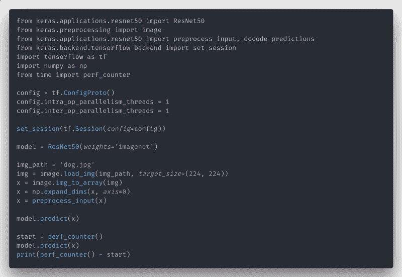

# Docker 中配置不当的 Tensorflow 为什么会比预期慢 10 倍

> 原文：<https://www.freecodecamp.org/news/how-a-badly-configured-tensorflow-in-docker-can-be-10x-slower-than-expected-3ac89f33d625/>

皮埃尔·帕西

# Docker 中配置不当的 Tensorflow 为什么会比预期慢 10 倍

TL:DR: TensorFlow 读取逻辑 CPU 核心的数量来配置自己，当您有一个有 CPU 限制的容器时，这可能是错误的。

让我们做一个简单的基准测试，比较 GPU 上的一个推断，主机上的 CPU，docker 上的 CPU，以及带有限制的 docker 上的 CPU。

Our micro benchmark

Keras/Tensorflow 似乎在第一次调用。predict()，所以不会为第一个调用计时，而是为第二个调用计时。

在我的 Nvidia 1080 上运行它将导致每张图像大约 0.01 秒的**推断时间。**

这一次，在我的 CPU 上，如果没有容器**，它需要大约 0.12 秒**。12 倍的速度比 CPU 和 GPU 慢一个数量级。请注意，我的张量流没有得到 AVX 或 MKL 的正确编译。通过使用环境变量 **CUDA_VISIBLE_DEVICES** 使 GPU 不可见。

让我们添加一个容器。

Our simple container.

注意:Pillow 是 Keras 加载图像所需的图像处理库。

运行这个容器将导致大约 0.15 秒的**推断时间。可能 Docker 的一些开销或者一些 TF 版本和我的主机不一样，但这不是本文的重点。真正的关键时刻即将到来。**

#### 解决方案

我用的是 i7 7700k，8 个逻辑内核，4 个物理内核。因此，如果我们将容器设置为仅使用 2 个逻辑核心(1 个物理核心)，它应该会慢 4 倍，因此大约 0.6 秒。限制将由 [Docker API](https://docs.docker.com/config/containers/resource_constraints/#cpu) 做出。**这实际上导致了 2.5 秒的推断——比预期慢了 4 倍！**

事实上，TensorFlow 使用逻辑核心的数量来计算一些内部性能数字。由于报告的核心数量与可用数量不同，这里会产生开销。在您的生产服务器上，它甚至可能更大。在我们的服务器上，由于至强处理器拥有更多内核，速度慢了 10 倍。

那么，我们能做什么呢？

[TensorFlow 性能指南](https://www.tensorflow.org/performance/performance_guide#optimizing_for_cpu)有答案！

使用这些新参数，我们得到以下代码:

**而现在，只需要大约 0.6s** 。这正是我们所期待的！

所以总结一下，即使 Docker 看似简化了生产环境，也要时刻小心！不要忘记使用文档中的性能指南。