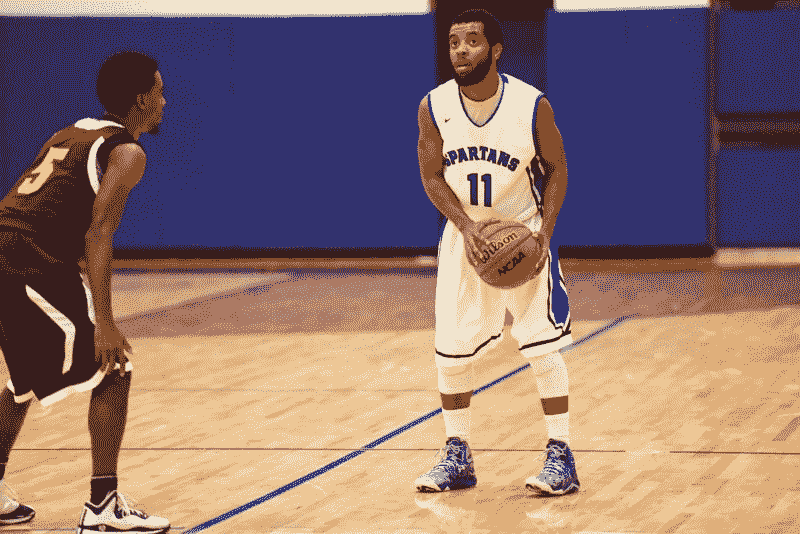

# 一个迷失的孩子如何从失败走向 iOS 开发者

> 原文：<https://www.freecodecamp.org/news/how-a-lost-kid-went-from-failure-to-ios-developer-against-all-the-odds-bfef635b9125/>

作者:乔丹·拉格罗内

# 一个迷失的孩子如何从失败走向 iOS 开发者

Before I decided to pick up coding, [I shot 44% from 3 point range my senior year](http://www.naccsports.org/sports/mbkb/2016-17/players/jordanlagronealin) playing Division III basketball.

让我先简单介绍一下我的背景。2012 年我高中毕业时，我确定了两件事:我想打大学篮球，我不知道我想在大学里学什么。

幸运的是，我继续上大学，幸运的是，我有机会打大学篮球，我下定决心要学习心理学。我过去喜欢，现在也仍然喜欢挖掘人们的智慧，试图理解是什么促使一个人做出这样的行为。

但这还不是故事的全部。

### 最好的时代

时间快进到 2017 年 5 月，突然我准备从伊利诺伊州北部的一所小学校获得学士学位。当我拿到那份被高估的复写纸时，我立刻意识到，我作为学生运动员的日子戛然而止。我现在该怎么办？

虽然获得大学文凭让我有一种小小的成就感，但这种成就感已经开始消退。我不知道我的下一步是什么。

如果我想在我的研究领域追求一个有利可图的职业，我知道我必须至少再上两年学。那不是一个选项。在大学二年级的时候，我已经完全精疲力尽了，唯一让我坚持上学和上课的事情就是篮球。如果我想继续玩下去，我必须取得不错的成绩。但我从来没有真正想过放学后篮球赛后的漫长比赛。

直到我毕业后开车回家，我才发现我可能真的有兴趣从事的事情:制作移动应用程序。我不记得是什么样的想法让我决定要做移动应用。我相信我只是在我的 iPhone 上滚动一些应用程序，这个想法就在我的脑海中闪现，“这个应用程序真方便！等等……我可以自己做 app 吗？”。

果不其然，经过几个小时的研究，我确定我确实可以创建自己的应用程序(不需要任何类型的学位)。经过深思熟虑后，我决定尝试一下，学习移动开发，看看我是否能把它作为我的职业。但是在我开始编码之前，我需要问自己的第一件事是，为了开始创建移动应用程序，我需要什么工具。

### 预示最后结果（或败局）的先兆

我很快意识到我需要三样东西:一台电脑、编写代码的能力和我想要构建的平台。

我有一台电脑，所以我马上把它从清单上划掉了。我想，既然我是苹果产品所有者，而且我认识的大多数人都使用 iPhone，那么我为 iOS 平台(iPhone 的操作系统)开发应用程序是有意义的。

但是我根本不知道怎么编码。信不信由你，我在大学三年级的时候确实上过一门计算机编程课(我想是 Java 课程)，而 ***和*** 这门课都以优异的成绩不及格。是的，你没看错，这个曾经是 iOS 开发人员的家伙(按照学术标准)在他现在非常热爱的学科上失败了。

我不仅没有通过这门课，而且我清楚地记得我非常害怕去上那门课，因为我知道那是浪费时间。从第一天起，我就迷失在听教授讲课的过程中，心里想着“什么是数组？为什么这个人一直在谈论循环和浮动？”。

最重要的是，让情况变得更糟的是，我需要通过课程才能保持打球的资格。因此，由于我没有通过这门课程，我最终不得不参加一个夏季课程来弥补它，并重新获得我的资格(幸运的是，我参加的夏季补考课程，艺术史，完全是小菜一碟，也是我得到过的最容易的“A”)。

一晃两年半过去了，大多数人会认为我试图在一个我没有背景的领域开创事业是疯狂的。但是我决心证明我的反对者，我的怀疑者，甚至我自己是错的。

所以我就这么做了。在接下来的几个月里，我把自己锁在地下室里，花了**个小时**接**个小时**甚至更多的**个小时**阅读推荐的博客和教育书籍，观看 YouTube 上的教程视频(如果你刚刚开始，我强烈推荐这个人)，听各种类型的软件开发播客，以便尽可能多地吸收信息。我把自己淹没在拥有多种移动编程资源的移动应用程序开发世界中，并获得了“要么沉要么游”的心态和先入为主的方法。

很简单:要么我去完成我学习如何开发移动应用的目标，要么我放弃，浪费我投资在自己身上的所有时间，去找一个正常的朝九晚五的工作。但是就像我之前说的，失败不是一个选项。

My brother and two of my college teammates right after receiving our diplomas.

### 我会被诅咒的

后来有一天，奇怪的事情发生了:事情开始变得明朗起来。随着时间的推移，在编译了一系列移动开发资源后，我更容易发现哪些学习技巧对我有用。

每个人的学习方式不同。有些人通过阅读学得最好，有些人通过做、观察或教学学得最好，有些人通过听学得最好。找出你学习的最佳方式对于加快你开始理解新主题的速度至关重要。我发现学习新东西的最好方法是被解释一次，然后实际尝试去做那件事。

例如，我可以花一整天的时间阅读如何在 iOS 应用程序中编写计时器，但这不会对我有什么好处，除非我自己尝试用代码实现计时器。我很快发现我学习新东西的最好方法是通过**做**和 **观察**。直到我不再试图吸收每一条信息，并实际上开始自己编码，我才完全开始理解移动开发是如何工作的。

像这样的 YouTube 视频对帮助我形成新的观点和保持积极的态度至关重要。这里的[教程](https://www.youtube.com/watch?v=fZx29HOcHzY)在我学习的早期阶段至关重要，因为它直观地实现了我在[这本书](https://www.amazon.com/iOS-Development-Dummies-Jesse-Feiler/dp/1118871057)中难以理解的教导和概念。

然后，我突然想到了我自己的初学者项目的潜在想法(结果是一个测验应用程序，这是我高度推荐的第一个项目)。

不知不觉中，我终于开始理解其他编程概念(如类型、扩展、数组、委托、自动布局和 MVC 模式)和技术。我甚至在我的应用中实现了第三方 API、BaaS 和数据库！

接下来我知道的是我开始理解源代码控制和命令行的用处。这也不是偶然的。我以前绝对没有任何编码经验。零，零，零，什么都没有。在 2017 年 7 月之前，我从未写过一行代码。那么，我是如何如此迅速地学会这些话题的呢？

所有这些新获得的关于移动开发的知识都是利用我的最佳学习方式的直接结果。在我强迫自己站在电脑屏幕前开始写一些代码之前，我无法告诉你编程中常量和变量的区别。

跳到 2018 年最后一个季度，我在苹果应用商店上有一个应用程序，目前我正在获得第二个批准。怎么会？通过收集所有相关的资源，我可以和他们一起工作，直到我发现哪些对我有用。我会第一个承认成为一个流利的读者是学习任何主题的必备技能，但是我不认为成为一个好的读者是学习中最重要的技能。*每个人学的都不一样*。

我能给那些试图学习移动开发(或任何类型的软件开发技能)的人的最重要的建议是，找出让你理解事情的方法，不仅仅是最快的方法，而是最有效的方法。

你是那种需要向你演示几次才能理解的人吗？或者你是一个善于倾听的人，能够一字不差地分解概念吗？找出哪种学习方法最适合你，然后应用它们。

> "成功包括从失败走向失败而不丧失热情."——温斯顿·丘吉尔

### 失败:成功的主要因素

生活中最有成就的人往往是那些失败的人。我最喜欢的一句话是，“你不能成为一个老板，除非你亏损了”，不难理解为什么。为了学会如何赢，你必须学会如何输。

许多人抵制进入移动开发世界的想法，因为他们害怕失败。与您分享我向移动开发转型的经验的唯一目的是向其他正在转型的人展示，您并不孤单。

每一个成功的人都曾在某个时候感到自己无能和失败，但那种绝望和挫折的感觉在整个事情中只是暂时的和微小的。你也可以学习如何在 App Store 上获得你自己的应用程序，不管你是否认为你有能力这样做，通过了解你如何学习最好，通过专注。

这最终取决于你有多渴望得到它。从一个计算机编程课失败的人那里，他曾经认为编码是只有“黑客”才能做的事情(男孩在大学期间是我小心眼的)。

我现在接受了这样一个事实，那是离真相最远的事情。编码是为那些天生渴望创造工具和产品来帮助社会更平稳运转的人准备的。

但不要认为这一切都是甜蜜的，因为这无论如何都不容易。不过没关系，因为生活中没有什么值得拥有的东西来之不易。

再说一次，我与你分享我的故事的原因是为了激励你。我的故事并不少见。事实上，许多人来自非技术相关的背景，并过渡到软件开发。

然而，我的故事是不寻常的，仅仅因为我承认失败，并且曾经怨恨我现在每天喜欢做的事情。我就是一个活生生的例子，说明早期缺乏兴趣和最初的失败是可以的！如果你想在生活的任何领域取得成功，你就必须**失败——这是不可避免的。因为失败**是**成功的先决条件。**

如果你仍然不认为失败是成功的前兆，那么[阅读这篇文章](http://www.nbcnews.com/id/44278117/ns/business-us_business/t/what-steve-jobs-taught-us-its-ok-fail/#.W9nUeS2ZPOQ)然后告诉我你是否对失败有同样的感觉。让我度过艰难时期并在失败的时刻保持坚持的是**停止*和**呼吸**。后退一步，看看你的起点和现在的位置。视角是关键。***

*据估计，只有 3.4%的高中篮球运动员继续在 NCAA 打球。我经常告诉自己，如果我能克服成为一名大学篮球运动员所需的障碍，那么我最终也能成为一名成功的移动开发者。如果我可以通过在健身房努力工作和在篮球场上不断付出最大努力来克服这些困难，那么我相信如果我实施同样的工作道德，我也可以在移动开发方面做同样的事情。*

*你也能做到。你需要做的就是识别并确定最适合你个人的有效学习方法，将这些学习方法不断应用到你渴望理解的学科中，并每天提醒自己，“你不可能成为老板，直到你亏损”。*

*我很感激你在百忙之中抽出时间来读这篇文章。*

*如果你觉得这篇文章很有启发性，请随意分享。*

*在 Twitter 上关注我的 iOS 开发者之旅[。](https://twitter.com/RideWithDaMac?lang=en)*