# 我如何设计我的第一个应用程序

> 原文：<https://www.freecodecamp.org/news/how-a-marketer-attempted-to-design-an-app-e334660a70b2/>

by Daniel Novykov

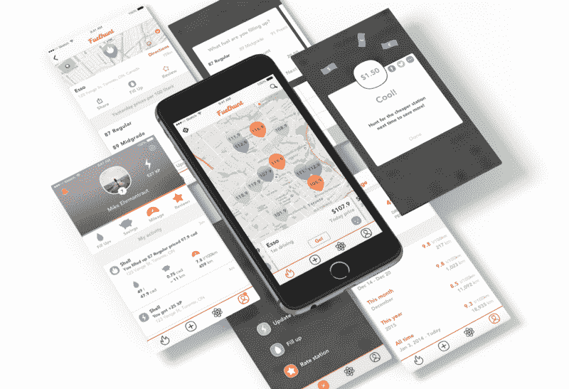

# 我如何设计我的第一个应用程序

这是一个关于制造产品的故事，是什么出了问题，以及它如何改变了我的设计生涯。

在过去的十年里，我已经建立了许多个人兼职项目。有些是小的日常工作，但有一个需要一段时间才能完成。

这个故事是关于我在 2015-2016 年开发的一个 iPhone 应用程序。这家汽车初创公司应该为司机节省油钱，减少温室气体，并让自动驾驶汽车变得更加智能。

经过多次头脑风暴和研究会议后，我组建了一个开发团队来帮助我构建 MVP(最小可行产品)。我们选择首先设计 iOS 应用程序是因为它更适合受众。

中期开发时，推出了登陆页面和社交渠道。这为等待名单和未来的测试积累了第一批 1000 人。

尽管我们在前进的道路上遇到了一些挑战，但项目进展顺利。频繁的用户测试证实了我们的工作方向是正确的。

尽管如此，就在发布 MVP 进行测试的前几天，我决定暂停开发。

我做这个决定有几个原因，包括个人的事情和资金。我仍然想分享我经历的设计过程，我学到了什么，以及它如何反映在我的职业生涯中。

### 这一切都始于个人需求

几年前，我买了第一辆车，并迷上了驾驶。舒适、快乐和自由克服了公共交通的廉价和交通混乱。但是拥有一辆车也有成本——停车罚单、保险、维护和汽油。

最困扰我的一件事是每天的燃料价格波动。它可能早上上升，晚上下降。在拐角处可能会有 10%的差别，离开泵后你就会知道了。

于是我开始在网上挖掘，为我的需求找到了一个绝妙的(我当时是这么想的)解决方案——[GasBuddy](https://gasbuddy.com/)。这是一个显示当地加油站最新燃油价格的应用程序。那天我高兴极了，想象着每个月能省下几百块油钱。

Me on that day

在接下来的几年里，我一直在使用 GasBuddy，我对他们建立的财富心存感激，但对这款应用的界面感到沮丧，这让我抓狂。混乱的界面和有限的功能是我不能再处理的事情之一。

这就是为什么，2015 年 6 月，我开始了我的副业项目。我称之为 Fuelhunt。

最初的想法是获得 GasBuddy 的数据，并围绕它建立更好的用户体验。但是他们是一家大公司，不想分享他们的任何数据，即使是一个合理的启动价格。

我努力找了另一家数据提供商，结果是 [Waze](https://www.waze.com/) 。但是他们也帮不了我。此外，即使在今天，他们的数据的准确性也相当糟糕。

Again me the other day

所以我想，嗯，我可以自己做所有的事情。为什么不呢？不眠之夜的旅程开始了。

但首先，让我们来看看为什么这一切都很重要。

### **怎么回事？**

#### 1.人们想为汽油付更少的钱

我敢打赌，你已经注意到不同加油站、不同品牌或不同地区的汽油价格不同。原因可能是房地产或品牌问题，或任何其他影响石油市场的条件，如政治或飓风。

我们很多人都不认为差价是节约。但是根据你开车的内容、方式和地点，它每年可以节省 100-200 美元甚至更多。你可能会说——那不是一大笔钱。但是你可以把省下来的钱投资在餐饮、购物甚至更多的汽油上。

任何加油站都有三个主要组成部分:

*   **便利**
    靠近工作或家，有街角小店，或其他便利。
*   **定价**
    汽油费用、商店交易或其他节省。
*   **质量**
    燃料或整体服务。

如果你知道哪些地方的燃料、价格和位置让你满意，那就太好了。如果你不在乎，需要的时候就会去买汽油，那也没关系。

与此同时，有很多人不知道宝石的位置，但想使用一个价格较低的方便点。

然而，节省一些钱可能不是最明智的想法。有害气体不是一个神话。燃料本身可以来自同一地区的同一家炼油厂，但在不同的零售点仍然不同。

一些因素可能包括没有正确维护的燃料过滤器，不寻常的添加剂，一些加油站的“旧气体”，不公平的员工可以将它与油或其他东西混合以获得更多利润，等等。所有这些都可能导致昂贵的汽车维修费用。

在寻找合适的就餐地点时，我们会使用 Yelp、谷歌地图、当地杂志，并向朋友寻求建议。那么，为什么我们不同样关心我们的汽车呢？保养良好的车辆在没有意外维护的情况下可以行驶更长时间。

#### **2。气候变化是真实的，我们需要更加关注它。**

这是我想产生影响的另一个领域。

2014 年，世界上有超过 12 亿辆汽车，并且这个数字还在快速增长。它们都会产生大量的温室污染，导致:

*   随着温室气体吸收更多热量，气温上升。你好，全球变暖！
*   极地冰盖的融化会导致海平面上升。
    你好破坏性洪水！
*   臭氧层的损耗导致有害的紫外线进入地球。你好皮肤癌！

问题是——我们能做些什么吗？

嗯，我们不能削减新车的生产，因为对它们的需求在增长。我们不能回收现有的汽车，因为它们通常在第三世界国家被重新使用。我们能换成电动的吗？算是吧。

Future is coming

电动汽车是未来。它们安静、快捷，而且操作成本低廉。它们更可靠，损坏的零件更少。最重要的是，它们不排放二氧化碳。

但这是我们许多人今天无法承受的未来。一些汽车价格太高，而其他汽车还不能提供合适的价值。

随着特斯拉的 Model 3(以及其他制造商的入门级产品)、政府对电动汽车更广泛的支持以及其他好处，一切都可能改变。但是我们还没有完全实现。

那么，我们如何利用我们今天所拥有的一切来影响环境呢——利用所有这些内燃机车来加热我们生活的世界？

### 只有我一个人在乎吗？

我的第一个问题是“有多少人和我有同样的问题和愿景？”以及“是否有足够多的潜在用户值得开发一个产品？”

我做了一些调查，并和碰巧也是司机的朋友聊了聊。我想弄清楚目标受众的需求。

以下是一些见解:

*   目标受众包括大多数车主——临时司机、经常通勤者、出租车司机和卡车司机。

选择加油站时，

*   最关键的因素是在北美市场对司机的便利和较低的燃油价格。一些东欧国家的燃料质量有所提高。
*   在北美市场的受访者中，品牌忠诚度计划似乎根本不是一个因素。这是东欧市场的一个重要因素。
*   对于所有的受访者来说，便利店、洗车和 24 小时营业等其他事情并不重要。
*   人们愿意在加油站分享好的或坏的经历。他们希望鼓励或引导其他司机在特定的地方加油(如果有的话)。
*   大多数司机不会记录他们的油费，因为这很费时间，或者他们不知道有什么简单的工具可以做到这一点。大多数人愿意以某种“自动”的方式跟踪成本和里程。
*   几乎一半的受访者表示，他们确实以某种方式关心环境，比如垃圾分类和回收。他们对减少碳足迹感兴趣。

我还想知道人们在给汽车加油时都做些什么。我想知道我能否在这个 5 分钟的活动中加入一个产品，让这个时间变得更有趣。

一些活动包括:

*   看着煤气柜台
*   盯着喷嘴
*   观察邻居
*   寻找车上新的划痕和凹痕

### 今天的司机有什么选择？

除了个人对加油站的认知和口碑之外，还有很多玩家在这个领域寻找加油泵。事实上，没有一个解决方案能匹配我的目标用户和我自己喜欢使用的产品。

我会先从次要的比赛开始，然后再转到更重要的比赛。

#### 1.内置**信息娱乐系统**

今天，即使是低端汽车也预装了信息娱乐系统。司机可以在驾驶时获得他们需要的大部分信息。他们可以消费媒体内容、查看车辆状态、在城市中导航等等。不幸的是，实时天然气价格却不是这样。只有少数几个系统提供。

理论上，信息娱乐系统应该比开车时盯着移动设备更安全。但是由于糟糕的设计，他们中的大多数实际上非常分散注意力并且[危险](https://www.eurekalert.org/pub_releases/2017-10/a-nvi100217.php)。你不能更换汽车的主机，也不能切换操作系统。此外，现代智能手机提供了更好的导航体验。

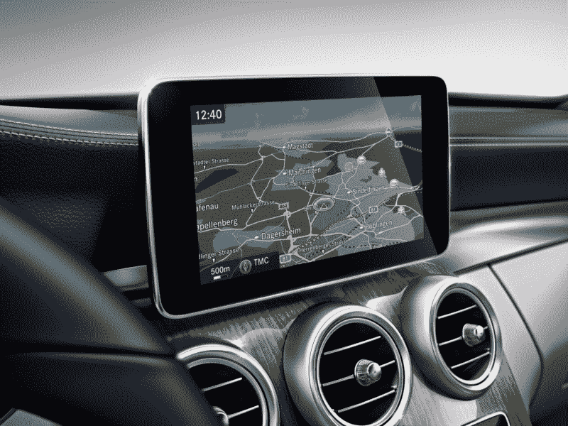

Why do the top automakers ignore the modern tech and UX?

#### **2。苹果地图**

苹果地图是数百万 iPhone 用户的首选导航选项。然而，它在许多功能上受到限制，仅提供基本信息，如联系人和方向。

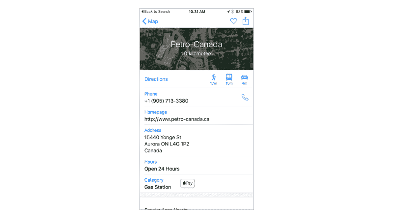

Apple Maps in 2015 — nothing but basic info.

此外，它没有显示油价，而且对世界许多地区的地图覆盖也很弱。这两个部件对驾驶员来说至关重要。

#### **3。谷歌地图**

谷歌在构建地图方面比苹果更有经验。这是迄今为止任何平台上最好的全球地图移动应用程序。

除了基本信息，它还有消费者评论、用户图片、街景，他们从 2015 年 12 月开始从 Waze 获取燃料数据！

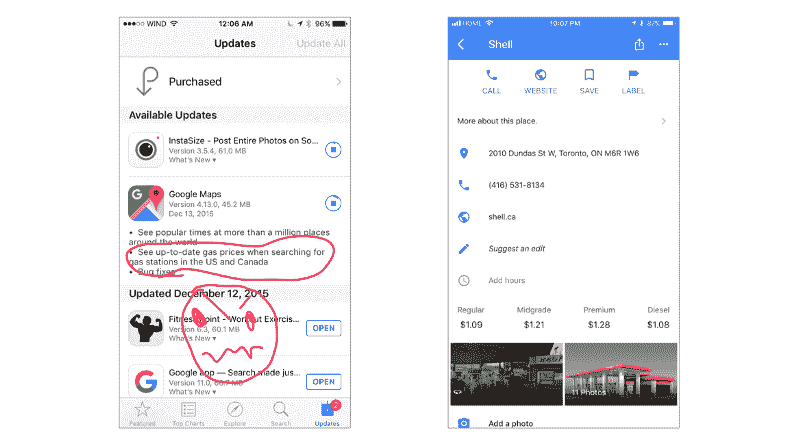

*Found this in Time Machine :)*

当你正在创建一家初创公司时，来自市场领导者的这种更新感觉就像是一场淘汰赛！但是，它只向我证明了这个功能是有需求的，或者至少谷歌的工程师是这样认为的。很明显，这是真的。

他们保持了这个简单的特性。没有过滤、用户贡献或其他社交活动。

#### 4.**场馆发现**应用

场馆发现应用包括 Foursquare、Yelp 和黄页。他们提供各种细节，如评论和交易。然而，接受调查的司机回答说，这不是他们寻找加油泵的首选解决方案。

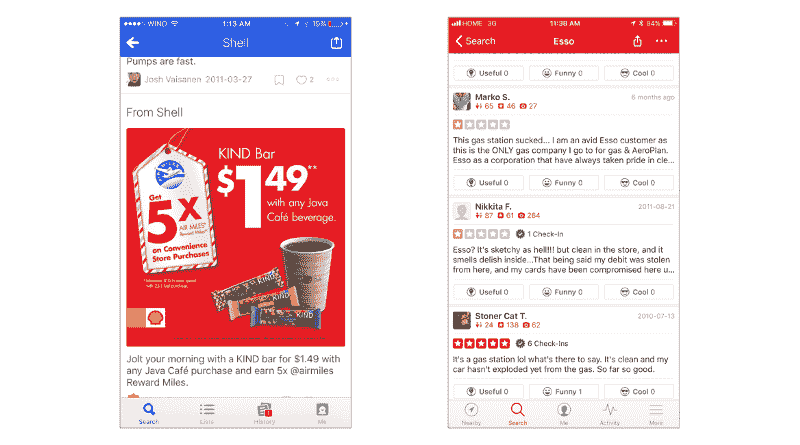

Foursquare and Yelp. Based on research, drivers don’t use them to find a gas station.

#### 5.加油站定位器

这是一件令人兴奋的事情——几乎每个国家都有获取燃料价格的来源。某些国家有单一的天然气价格，因为它是由政府控制的。但总的来说，品牌、地点和时间都不一样。

这里就不深入分析了，简而言之:

*   有些网站只供桌面使用，对移动世界没有反应。他们也往往有一个可怕的 UX。
*   绝大多数应用都不是全球性的。对于更大的“本地市场”，他们可能会覆盖一个或两个国家，如美国和加拿大。
*   有些 app 信息量不够。需要安装额外的应用程序来补充“司机的体验”

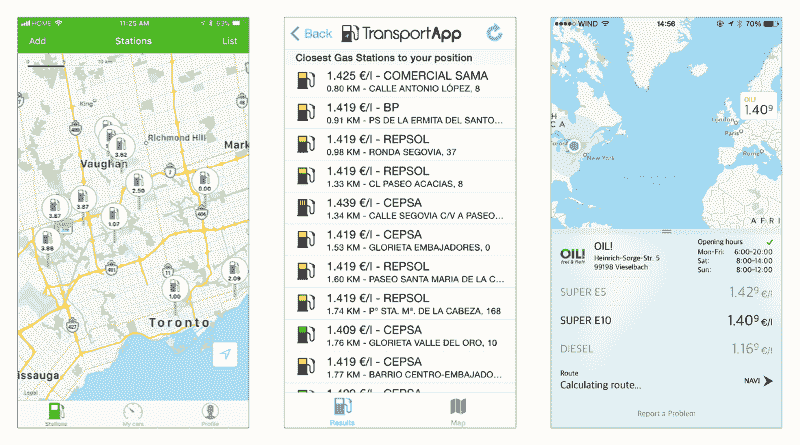

Fuelzee, TransportApp, Spritradar — apps with no soul.

*   有些情况下，应用程序没有本地化为其他语言和地区。为什么下载一个 app 需要另外一个账号？

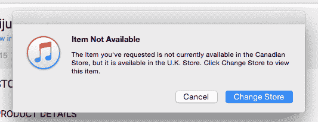

Frequent travelers aren’t happy.

*   最终，在不同的地方安装一堆应用程序并不是一个解决方案。他们都将拥有不同的用户界面、多个账户，并在设备上进行存储。

#### **6。大型石油品牌应用**

起初，我认为顶级品牌可以投入大量资金来开发自己的应用程序，并使它们变得伟大。没有。

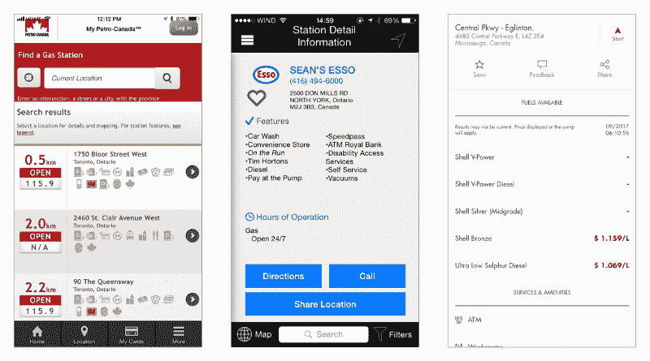

Petro-Canada, Esso and Shell. The Top Tier approach.

一些人采取了将移动网站挤进应用程序的方法。其他人认为带有不可读文字的小按钮是司机的好选择。

但是，它们中的大多数都包含汽油价格信息，并且在应用时非常准确。

#### **7。Waze**

今天谷歌旗下的 Waze 是我最喜欢的导航工具。这是一个由全球 9000 万司机组成的众包网络。它显示交通，路况，事故和警察陷阱。

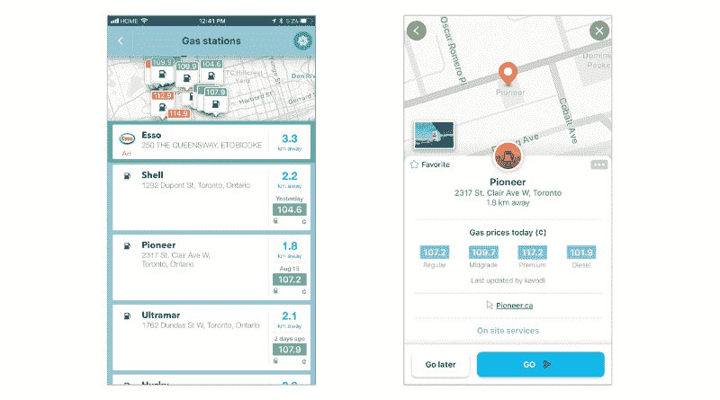

Apart from a recent minor redesign, nothing has changed since 2015.

Waze 还提供许多地方的燃油价格。与其出色的导航体验不同，燃油数据相当不准确。

我做了一个快速调查，想知道为什么司机不用这个功能。这些假设是:

*   查找加油站的元素隐藏在菜单深处，使用起来不直观。
*   Waze 显示上次更新燃油价格时的标签。很高兴知道。然而，当你在任何地方看到“几天前更新”时，这几乎肯定是社区贡献薄弱的信号。如果人们没有做出足够的贡献来使它可用，为什么人们会信任和使用它呢？

#### **8。GasBuddy**

这里有一个大的——GasBuddy。它成立于 2000 年，目前拥有 6500 万用户。它在美国和加拿大开展业务。它最近在澳大利亚推出。

当谈到美国和加拿大市场时，他们的数据相当惊人——特别是因为这些数据是从众包社区和其他来源收集的。然而，他们的应用程序在可用性和性能上失败了。

在进行研究和观察人们执行可用性任务时，我发现:

*   许多不熟悉这款应用的用户甚至无法完成一件简单的事情，比如设定一个地点的方向。完成这项任务需要敲七下。

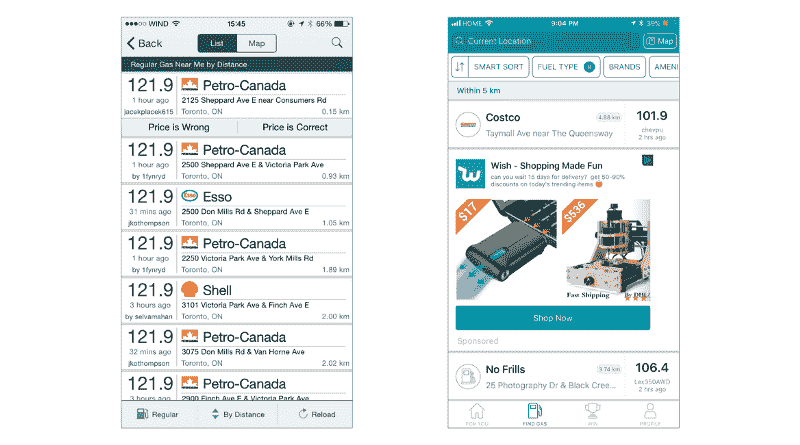

GasBuddy list view 2015/2017\. “Improvements” include more buttons, less readable text and colossal ad banners.

*   大多数司机没有使用默认的列表视图，而是立即切换到地图视图。问题是列表视图上的信息不是很清楚。很难理解加油站在哪个方向。它可能距离很近，但由于交通、困难的十字路口、U 形转弯或十几个停车标志，可能需要更长的时间。
*   总的来说，用户界面相当混乱和令人分心。信息架构在某些地方缺乏逻辑。恼人的广告消耗蜂窝数据和屏幕空间。从远处看不清的元素和微小的按钮使得人们很难在不太关注智能手机的情况下执行任务。

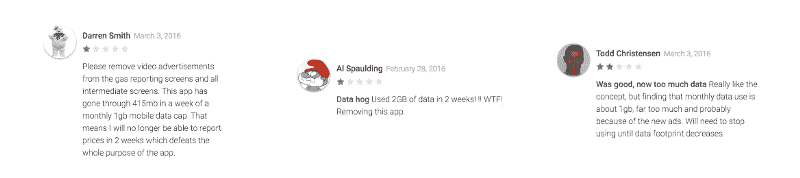

Users complain about ads, but GasBuddy keeps pushing more of them.

*   GasBuddy 和许多其他竞争对手都表示，司机可以用他们的应用程序省钱——这是真的。但是不清楚这个人在加油站存了多少钱，因为没有存款指标。该应用程序显示价格较低的位置，但不显示一段时间内使用该应用程序的价值。
*   用户可以通过将提交价格获得的应用内积分兑换到参赛作品中来赢得每天 100 美元的汽油。然而，获胜的几率大约是 6500 万分之一。尽管如此，它看起来对用户参与度和保持度很有效。

#### 9.储蓄跟踪器

有许多应用程序可以收集车辆的统计数据并跟踪各种费用。它们中的大多数都需要大量的工作来输入数据，无论是手动操作几十个字段，还是扫描带有不可靠文本和字段识别的收据。这些应用程序的视觉部分令人不快，而且“令人害怕”——正如大多数司机的反应。

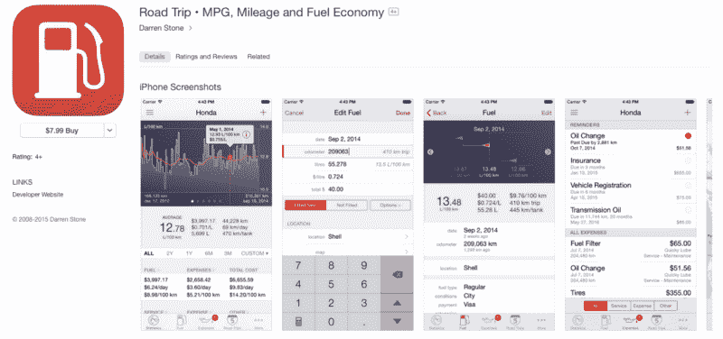

A typical UI for an average mileage tracker.

另一方面，汽车监控也有解决方案，像[自动](https://www.automatic.com/)。它们各有利弊，但最大的问题是它们的操作需要一个特殊的适配器，这是一项额外的投资。

在那一点上，在我做了研究和用户测试后，画面很清晰——市场上有一个利基市场，我可以用一个新产品来填补它。

### **设计加油量**

我想创造一个包含可用性最佳实践的产品。与此同时，它消除了用户在这一领域使用其他应用程序时遇到的棘手问题。

我不想创建“又一个寻找加油站的应用程序”我想要一个对我们未来生活有更大影响的产品。

我将跳过几十个迭代、草图和线框，直接进入最终的 MVP 构建，它已经被潜在用户成功地测试过了。

以下是竞争对手的一些关键改进:

#### 1.涵盖**全球燃料价格**的单一应用

我说的是后 MVP 阶段。但是，为了便于扩展，必须事先开发数据库架构。

起初，这似乎不是一个挑战。

我需要解决任何社交网络的问题:没有内容=没有用户，没有用户=没有内容。

在这种情况下，内容是带有燃料类型的泵位置、当前的天然气价格和用户评论。为了快速获取这些内容，我们收集了市场上能找到的所有东西，并构建了一个我们称之为“脏数据库”的东西。

尽管有很多公开的数据，但都是一团乱麻。一些资源提供了清晰的 API，其他的只有 Excel 电子表格。然后，我们需要找到一种方法来提取数据并使其可用。

另一个问题是不同地区的品牌列表和辛烷值的差异。北美和欧洲以不同的方式计算辛烷值。北美的 87 像欧洲的 95，那里的 NA 的 91 更像 E 的 98，以此类推。

老实说，把所有的东西放在一个屋檐下花了一段时间。

最后我们有了数据，但它是不准确的。幸运的是，燃料价格变化如此之快，以至于不管价格是一天前的还是一周前的，它仍然是错误的。因此，我们非常接近 Waze 和谷歌地图的准确性。

#### 2.清晰的用户界面和简单的应用导航

在车里使用智能手机有多不安全，手持设备的价格有多高，都无关紧要。人们仍然在开车时使用手机。他们要么拿着手机，要么把手机放在仪表板上。

作为设计师，我们的工作是构建组织良好、易于使用的功能，并考虑使用我们产品的所有可能方式。我们必须确保人机工程学最大限度地减少干扰，不伤害最终用户。

大文本，更大的接触点，清晰的屏幕流，智能通知，没有广告。这些只是我谨记在心的一些标准。

说到导航，Fuelhunt 应用程序由 4 个屏幕组成:

*   **主屏幕**
    查找加油站
*   **添加屏幕**
    添加内容
*   **活动**
    查看用户和好友的公开活动
*   **个人资料**
    查看所有用户的活动和统计数据

#### **3。超快速泵搜索**

主要应用程序的作用是找到一个最佳的加油站，并为该站设定方向。流程经过优化，可在 10 秒内完成这项任务。

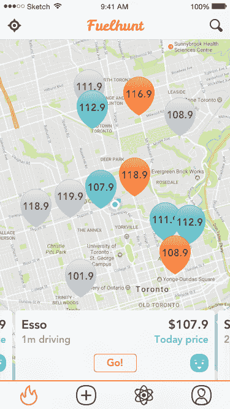

Main screen

在启动该应用程序时，它会显示地图视图，显示泵的位置，并使用距离、用户的移动方向、价格和评论分数的组合，预先选择最佳的加油选项。不需要中间滤网或额外的分接头。

底部的横幅包含司机此刻需要的所有信息:品牌、汽油价格、价格的“当前”指示以及评级表情符号。

不显示到该位置的距离，而是提供行驶时间。交通和道路状况可能会发挥更大的作用。

获取路线的按钮总是可见的，这使得设置路线更快。这使得 GasBuddy 的七次敲击减少到一次。

所有定位针都根据时间相关性进行颜色编码:

*   如果是今天更新的，则为绿色，这是最准确的。
*   橙色，如果它们是昨天更新的话——有点相关。
*   如果是估计值，则为灰色—所有较旧的数据和从第三方来源收集的数据。

在定价数据不准确的情况下，这种方法更有效。它让用户关注数据的准确性。

Waze 通过价格等级来标记位置，绿色代表低价，红色代表高价。这个绿色便宜的加油站可能有旧的价格，可能比红色更贵，但是有最新的价格。

选择谷歌地图作为地图提供商，而不是原生的苹果地图，增加了更好的世界覆盖范围和一个手指缩放。这在车上很方便。

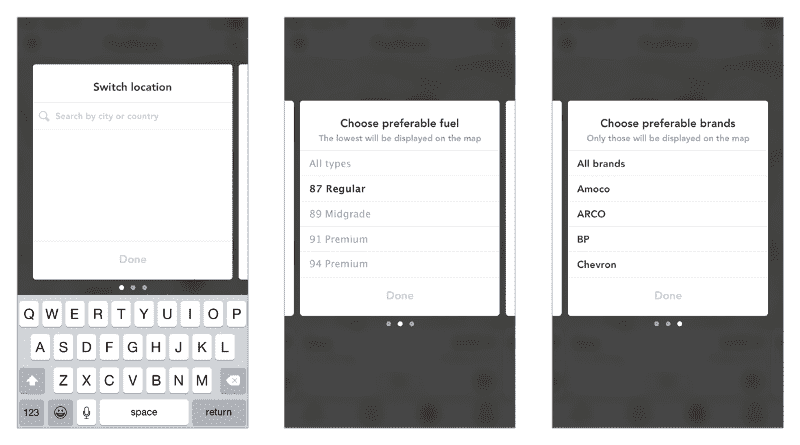

Search filters

过滤器是一个很少使用但很有用的功能。它们隐藏在搜索功能下。这不仅使整个用户界面更加整洁，而且使用户能够创建个性化地图，并显示用户需要的品牌和燃料类型。

#### 4.不良**位置规避**

研究表明，几乎没有人会在去加油站之前阅读评论。这是我们自发做的事情。我们开车，觉得有必要，看到一个加油站，然后加油。

Bad station alert

人家还一直写评论。如果出了问题，许多司机会分享他们的负面反馈。在这种情况下，司机事先不会知道任何事情，但他可能会在第二天或一个月后感受到劣质燃油的后果。

为了解决这个问题，设计了一个通知系统，以便在该位置出现问题时提醒驾驶员。

#### **5。用户贡献的简单内容提交**

有一个按钮可以让司机很容易地进行新的提交。他们可以提供一个价格更新，填补数据或新的审查。无论用户在哪个屏幕上，它总是在标签栏上可见。

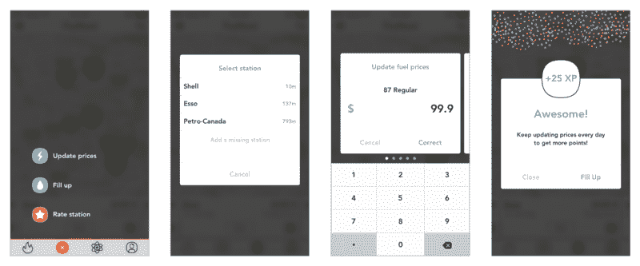

Submitting fuel prices

如果燃油价格更新，应用程序会要求司机输入加油数据。同样，在添加了加油数据后，它会请求价格更新。

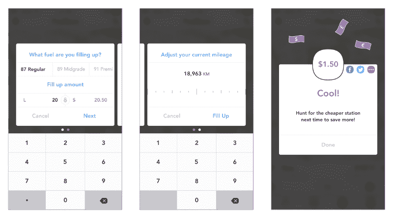

Submitting fill up info

与竞争对手只说用户用他们的应用程序节省不同，Fuelhunt 立即展示了在加油站节省的金额。每次加满油后，Fuelhunt 会立即计算本地加油站之间的价格差异，并向用户提供明确的价值。

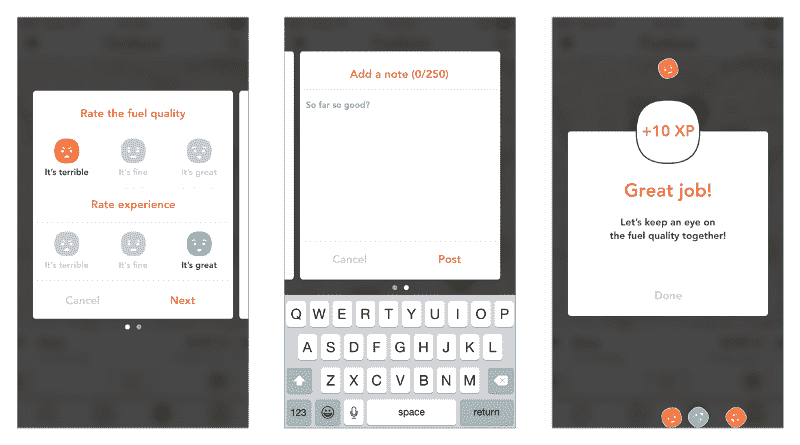

Submitting a review

有时用户提交评论需要花费很多精力。我用一个燃料质量和总体体验评估以及一个可选的描述使它变得简单。

#### **6。活动和统计跟踪器**

活动屏幕显示用户和朋友的公共活动，如赚取的积分、节省的金钱和撰写的评论。

经过测试，我们就是否在应用程序中包含该功能进行了辩论。尽管如此，我还是想看看观众会有什么反应。我也想让 Fuelhunt 变得更加社会化。所以它进入了 MVP。

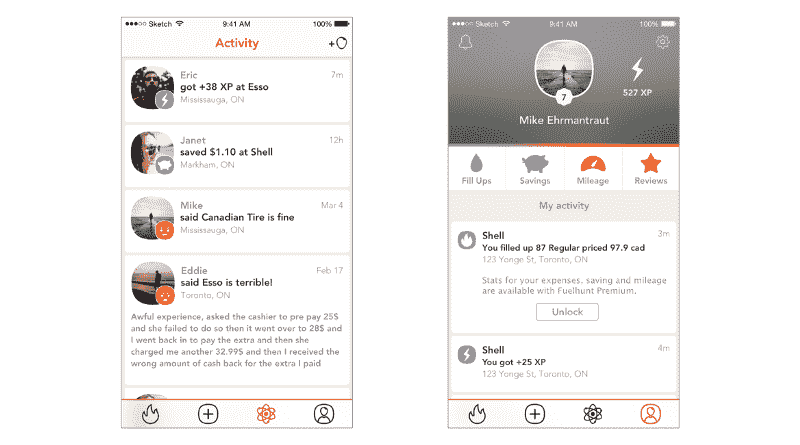

Activity and profile screens

配置文件屏幕仅包含用户的内容。用户可以看到按时间段划分的各种统计数据:

*   花在汽油上的钱和燃烧的燃料量
*   节省的资金相当于节省的里程
*   车辆本身的里程和油耗

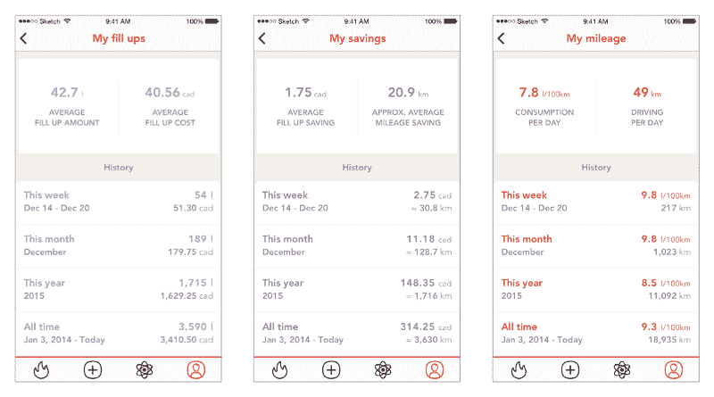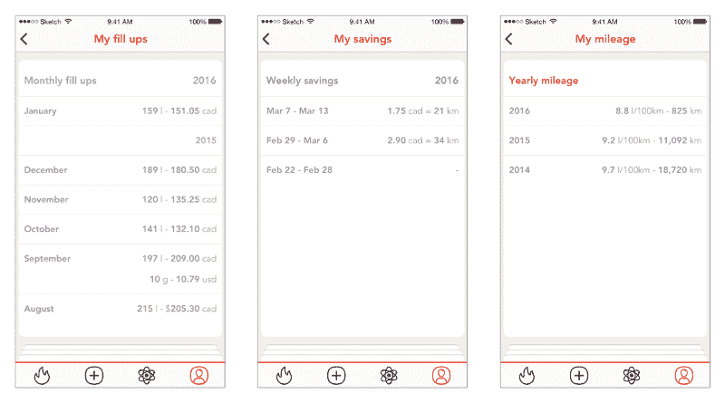

Statistics tracker

这种追踪器可以用于许多目的，从了解你的汽车和钱包的状态到简化商务旅行的计算和填写税务表格。但是主要的思想已经被保留到将来的版本中。

#### **7。用户参与和 m**one 化的游戏化机制

游戏化被用在很多产品中，但有时做得不对。通常，它有利于顶级用户，而无论新手有多优秀，他们都难以超越。顶级用户通常会获得更多的关注、喜欢和好处。

Fuelhunt 的游戏化旨在消除新用户的障碍，让所有人平等竞争。

对于每一份价格报告和书面评论，用户都可以获得积分。那些连续活跃一定天数的人获得足够的点数来免费兑换高级功能。一旦他们成为不活跃的用户，他们就失去了这种优势，需要重新开始。

#### *8。*MVP 后的增长

已经做得够多了。该应用的路线图在当时看起来非常有趣，有许多很酷的功能，但我认为有两个重要的里程碑:

首先，**全球扩张** —这是建立大数据公司的关键要素。为什么这很重要？

我有一个愿景，有了这样的数据，自动驾驶汽车将能够从 A 点开到 B 点，并足够聪明地为自己做决定。

他们可以设定最佳路线，并考虑交通、路况、燃料水平以及在哪里最有效地加油。这就是未来。

第二，我开始这一切是为了尝试用我们今天拥有的技术减少碳足迹。而不需要额外投资的驱动程序和安装额外的小工具。

为了做到这一点，我想扩展 Fuelhunt 的数据库，包含迄今为止发布的所有车型及其城市、公路和综合油耗。然后与我的用户的真实数据进行比较，以确定驾驶效率低下。如果燃烧的汽油比需要的多，就给用户更新建议，改善他们的驾驶习惯。

### **胜负**

哪里出了问题？

1.  团队就是一切
    拥有合适的合作伙伴和团队成员至关重要。但是让开发人员作为核心团队在同一个房间里也很重要，这样才能快速迭代和执行。
    最后我和海外的开发商一起建了这个项目，这给整个过程带来了很多障碍。在我意识到一些团队成员不适合这种文化之前，已经太晚了，我们为替换他们付出的代价已经太高了。
2.  **增值问题**
    尽管所有的研究和用户验证都表明产品和市场是匹配的，但我仍然心存疑虑。
    从第一天开始，我花了太多时间试图完善体验，而不是发布 MVP，获得反馈，并继续迭代。
3.  **我用完了现金**
    从一开始，我就不想用众筹或任何其他投资机会来筹集资金。我想坚持用自己的钱来为这个项目承担更多的责任。比如，如果我失败了，我会失去我自己的钱。我做到了。下次我会做些不同的事情吗？肯定是的。
4.  **个人问题**
    有时候，当你需要选择个人生活还是事业时，这种情况就会发生。我试图平衡两者。我失去了对项目的关注，让分心来控制我。等我意识到的时候已经太晚了。

我学到了什么？

创业被认为是能带来快速学习的激烈经历。我获得了很多设计 Fuelhunt 的经验，担任了比我作为全职员工可能担任的更多的角色。

令人兴奋的部分是从我以前的市场营销背景中获得了帮助我进入产品设计职业的知识。这是一次我可以回顾的经历，以建立更有意义的东西。

关闭一家初创公司通常被视为一件糟糕和悲伤的事情。对我来说，这只是下一次冒险之前的一章。

我目前正在多伦多寻找职业机会，作为一名 UX/产品设计师贡献自己的力量。随时[联系我](mailto:hello@dnovykov.com)。