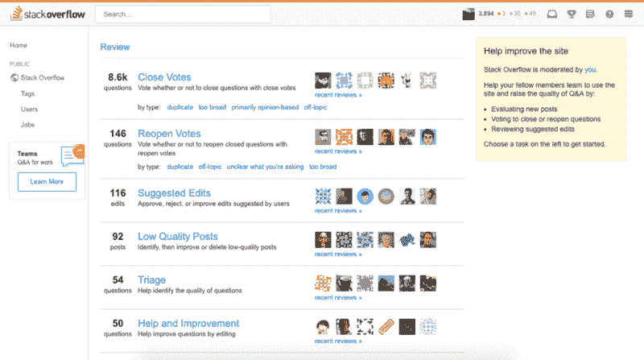
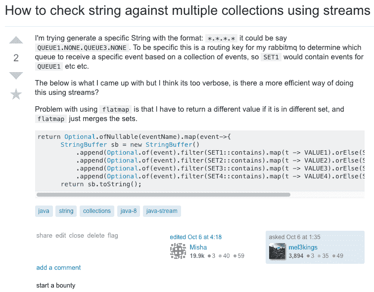

# StackOverflow 帐户如何确保您在知名开发商会议中获得一席之地

> 原文：<https://www.freecodecamp.org/news/how-a-stackoverflow-account-can-secure-you-a-seat-at-the-recognised-developer-table-cc782e1c84de/>

梅尔乔尔·塔特隆哈里

# StackOverflow 帐户如何确保您在知名开发商会议中获得一席之地

The screenshot was taken from [StackExchange.com](https://stackexchange.com/sites)

我还没见过没听说过 StackOverflow 的开发者。当我们被困在试图解决一个编程问题时，这就是我们大多数凡人的去处。有时问题仅仅是缺少我们正在实现的开源软件的文档。

但是根据我多年的经验，我学到的是，并不是所有的开发人员都知道一个强大的 StackOverflow 帐户的价值。

[Personal StackOverflow account (top 7% this year)](https://stackoverflow.com/users/2023728/mel3kings?tab=profile)

以上是我个人的 StackOverflow 账号。我已经给出了 156 个答案，进而接触了大约 200 万开发者，使我在 StackOverflow 的所有用户中排名前 7%。

这并不是一项容易的任务，截至今天(2018 年 12 月 1 日)撰写本文时，大约有[970 万用户，1700 万个问题和 2600 万个答案](https://stackexchange.com/sites)。

如果你尝试过在 StackOverflow 中提交答案，你很快就会意识到这不是一个简单的任务——你不能用半生不熟的解决方案来回答随机的问题。该论坛的工作方式是，人们投票选择实际相关的、对他们正在解决的问题有帮助的答案。

拥有 970 万用户，要确保你的回答对任何人都有帮助，真的是一个相当大的挑战。一个问题一发布，就有数十个开发者在徘徊着回答这个问题，希望得到投票，从而支持他们各自的个人资料。然而，这种回答问题的“狂野西部”风格也可能适得其反，因为用户可以选择否决任何质量差的答案。

### 有什么好处，为什么要这么麻烦？

想象一下，每个人都在申请一家特定的公司，每个人在工作经验方面都是平等的。它不一定是一家知名的大公司，它可以很容易地只是附近的一个模范工作场所。每个人都想申请那里。

假设公司发放股票期权，工作安排灵活，办公设施包括臭名昭著的台球桌、豆袋和免费食物。典型的理想技术办公室！

招聘人员搜索你的名字，发现你是 StackOverflow 论坛中所有工程师中排名前 10%的人。如今，大多数招聘人员都知道像 StackOverflow 这样的在线社区，你认为谁会是他们的敲门砖呢？拥有一个**强大的** **在线形象就像是锦上添花**，大多数时候至少能保证你获得一次初步面试。

当然，我并不是说所有在网络论坛上得分高的开发者都是高水平的。有些人刚刚回答了一个困难的问题，并从一个非常具体的主题中收集了他们所有的投票。然而，一旦你挖掘了用户的个人资料，这很容易被发现。

我不能代表 StackOverflow 的其他成员说什么，但是有一些公司不会给我一个在线编码考试，而是直接进行最后的面试。有几家公司主动联系我，邀请我参加面试，即使我并没有打算找新工作。

在实际面试中，技术面板可以更宽大一些，知道你达到了 200 万开发者。这反过来会让你对你所做的事情更有信心，并且证明你在软件工程领域的地位。

就我个人而言，这也帮助了我参与全球竞争。我出生在菲律宾，现在在澳大利亚悉尼落脚，去过英国和新加坡。

我觉得我也需要强调这一点，但是仅仅有一个 SO 帐户并不能保证什么，但是它可以作为你编码能力的补充。

### 向前支付

我知道你现在在想什么——你只是想知道如何改善你自己的账户。我对建立一个强有力的形象的主要建议是，试着真诚地帮助其他开发者。

我这么说是什么意思？嗯，有这样的例子，你被一个问题卡住了，不管你怎么努力，网上似乎都没有解决你的问题的办法。这正是你正在寻找的利基，有可能几个程序员也遇到了这个问题。

在论坛中有数百万个问题[仍然没有答案，其中一些你**将**能够解决。这可能是由于经验，其他人只是纯粹的偶然事件，但肯定有一些问题，你将能够自己解决。](https://stackoverflow.com/unanswered)

通常的做法是，你自己解决了那个问题，然后继续你的一天，并感到有成就感。这忽略了那些仍在痛苦中哭泣，试图找出如何解决相同问题的众多开发人员。本质上，你只需要花几分钟的时间写一段像样的文章，展示问题是如何解决的，就这样。

如果你只是想想其他的开发者，一旦你已经想通了就留下一个答案，那么就已经种下了一颗种子，可以帮助你扩大你的在线个人资料。随着时间的推移向前传递。不要仅仅为了增加你的可信度而加入——其他开发者会很快知道，而你将会遭到大量的反对票。

### 没有愚蠢的问题

这个标题不能从字面上理解。但是，归根结底，只要问题确实有效，社区往往会做出积极的反应。

另一种建立个人资料的方法是向社区提出真实的问题。这通常是一条更难走的路。论坛上已经有了这么多问题，要问一个没有答案的问题并不容易。

StackOverflow 的工作方式是，问题和答案由开发人员自己提供，但是特权被授予那些已经达到一定数量的特殊信用的人。获得这一特权的开发人员最感兴趣的是在网站上保留高质量的问题。因此，新手在网站上复制和粘贴他们的家庭作业/作业很容易被发现，这些问题被否决，永远不会公开。

Here is the page where I get to review existing questions/answers if they are indeed worth being published. (Screenshot was taken using my [personal account](https://stackoverflow.com/users/2023728/mel3kings))

问题通常可以分为两类，理论性的和技术性的。

根据定义，理论问题是没有具体答案的问题，因此这些问题取决于选择回答的人的意见。理论问题往往有被版主关闭的可能性，因为没有人真的想在论坛上进行在线辩论。

一个很好的例子就是使用哪种编程语言。虽然这是一个有效的问题，但它取决于回答的人的观点，因为 Java 开发人员肯定会回答 Java，等等。

作为安慰，对于那些好奇想知道答案的人来说，你仍然可以得到分数。这是我的一个[问题](https://stackoverflow.com/questions/17181292/java-ee-containers-vs-web-containers)，它已经收集了很多观点——大约 29k 个观点——并且，反过来，得到了很多投票。我是几年前写的，当时我真的找不到使用 Java 企业版容器和使用 Web 容器的可靠对比。当时已经有很多关于 Java EE 容器和 Web 容器的文档，但是没有一个是关于并排处理它们之间的差异的。

另一方面，技术问题需要你写下你已经尝试过的和所有需要的技术细节。如果你只是想找到一个答案，而没有做适当的研究，社区马上就知道了。

一个很好的例子就是我之前提出的关于优化一些代码的问题。虽然我已经有了一个答案，但我只是想知道是否有替代方案，如果你愿意，可以进行某种在线代码审查。下面是一个好的技术问题的例子，包括一个好的标题、描述和所有的细节。

Components of a good question (Screenshot taken from my [personal account](https://stackoverflow.com/users/2023728/mel3kings)).

以上是一个解剖学很好的问题的例子。这个标题准确地描述了我想弄明白的事情。这个描述包含了我想要完成的事情的细节，也包括了我已经尝试过的事情。示例代码格式正确。

只要你很好地描述了你实际上想要弄清楚的东西，以及你已经尝试过的东西，人们很有可能会给你一个体面的答案，并投票支持这个问题。

虽然提问是获得更多分数的一条途径，但我不建议仅仅为了提问而提问。这样做的一个很好的理由是真正的兴趣，学习并为社区做贡献。问一些你知道在网上不容易找到的问题会给下一个试图解决同样问题的开发者留下线索。

### 答案，答案，答案

我不会深究太多关于给理论和技术问题一个好答案的细节，因为它们在本质上与上面的相似。不要给出你已经尝试过的例子，而是给出你正在提供的答案的具体例子。我将把例子[留在这里](https://stackoverflow.com/questions/3327425/when-to-use-amazon-cloudfront-or-s3/41953371#41953371)和[留在这里](https://stackoverflow.com/questions/4279420/does-use-of-final-keyword-in-java-improve-the-performance/17335215#17335215)。除了已经提到的理论/技术类别之外，在提供答案方面还有其他利基。

> “它在我的机器上工作”——每一个活着的开发者

如果你是一名开发人员，或者仅仅是与 IT 部门一起工作过，你可能会听到这样一句话:“它在我的机器上工作”。

特定于操作系统的问题可能是最大的子类别之一。StackOverflow 里面大概有 50K [个类别/标签](https://data.stackexchange.com/stackoverflow/query/172362/get-all-tags#resultSets)，光是 [MacOS](https://stackoverflow.com/questions/tagged/macos) 就有 10k 左右的 OS 相关问题，更不用说编程语言+ OS 相关的问题了。

假设您的`npm install` 在 Linux 上运行，但不能在 MacOS 上运行。那已经是节点和 OS 相关的问题了。想象一下所有语言和操作系统环境的所有排列。有时候甚至 ide 也被扔进[组合](https://stackoverflow.com/questions/40245370/npm-is-installed-using-nvm-but-intellij-doesnt-know-about-it)！难怪会有成千上万的问题被问及。

另一个利基是向第三方集成商提供指导。我们以前都见过它——一个缺少文档的好 API。这里有一个很好的[问题](https://stackoverflow.com/questions/19877246/nodemailer-with-gmail-and-nodejs)关于如何与 Google 集成使用 Node 发送电子邮件。你可能会认为这是一个简单的改变，或者会有很好的文档记录，对吗？仅这个问题就有 80000 次浏览，这意味着大约有 80000 名开发人员不容易根据 Node 和 Google 提供的标准文档找到答案——他们不得不求助于在线论坛。

论坛中的利基市场多得我都数不过来。目前有 2600 万个问题，一定会有尚未被发现和回答的领域。我只提到了几个来帮助你开始，你甚至不需要像乔恩·斯基特一样优秀就可以开始为在线社区做贡献。

> “伟大的工作不是靠力量而是靠毅力完成的。”——塞缪尔·约翰逊

和任何投资一样，它不会马上生效。可能需要几个月甚至几年的时间来播下你的种子并留下答案。但是，在你意识到这一点之前，你已经在社区中有了一个稳固的存在，以及随之而来的所有好处。