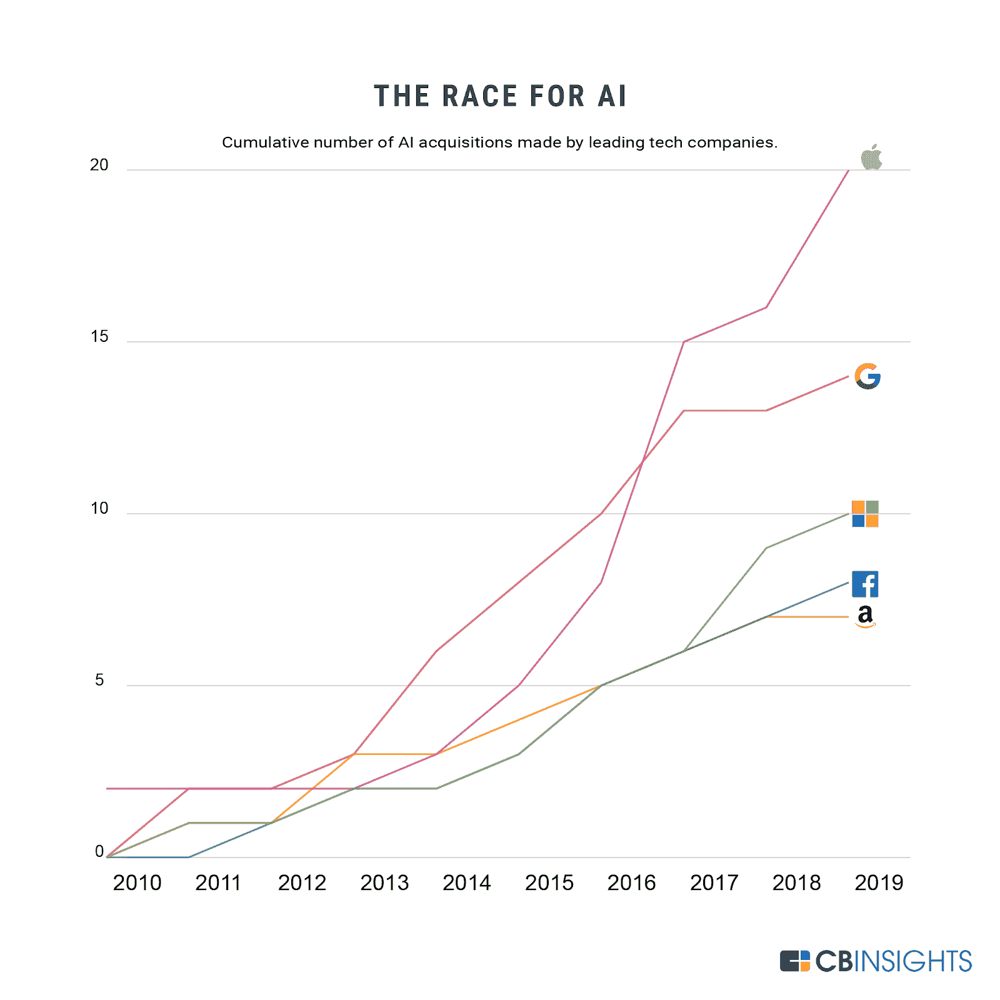
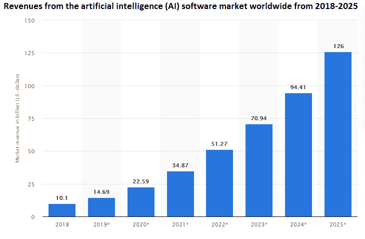

# 如何以及为什么将人工智能融入 Web 开发

> 原文：<https://www.freecodecamp.org/news/how-ai-boosts-website-development/>

顶级科技行业巨头正在以多种方式利用人工智能技术。亚马逊、微软、脸书、谷歌和苹果等公司一直在积极收购这项技术。

**Image Source-**[https://www.cbinsights.com/research/top-acquirers-ai-startups-ma-timeline/](https://www.cbinsights.com/research/top-acquirers-ai-startups-ma-timeline/)

那么，到底是什么让 AI 在科技行业如此受欢迎呢？

你知道 AI 在 web 开发中的作用吗？

AI 的未来是怎样的？

它如何影响 web 开发过程？它能增加收入吗？

我很确定所有这些问题现在都在你脑海中闪过。为了帮助回答这些问题，我在这篇文章中展示了人工智能的所有重要优势。所以，仔细阅读这篇博客，你就会知道 AI 在 2020 年的重要性和作用。

## 人工智能在社会中的作用

人工智能在吸引观众的电影中得到了展示。它描绘我们世界未来的方式经常在今天变成现实。人工智能的影响从本质上重新定义了现代生活。

机器学习和人工智能正在整个技术世界传播，并将在未来几年继续传播。这对网站开发和设计有直接的影响。下面，我简要地陈述了人工智能的角色。

人工智能的作用可以概括如下:

*   这是现代世界的一项基本技术，它建立在你可以“让机器扮演你的角色”的假设之上。例如，生产、回收、开发、设计、运输、基础设施生产等等都可以由机器而不是人类来控制。
*   它强调开发像人类一样行动的聪明和智能的机器。例如，人工智能机器可以帮助医生从图像中识别疾病，它可以控制空中和地面交通，等等。
*   它通过改善社交倾听、数据分析和面部识别来创建强大的人际关系，从而提升用户体验。这使得公司能够在高级和私密的层面上了解他们客户的行为。
*   它内置了虚拟机器人和创新技术，像人类一样提供高效的功能。比如亚马逊 Echo，俗称 Alexa，是亚马逊开发的虚拟助手。

## 了解人工智能的未来

人工智能是目前世界上最热门的技术。据技术专家称，在未来几年，人工智能将影响近 90%的客户沟通。

### 下面列出了一些支持人工智能美好未来的观点:

*   人工智能的采用将改变所有商业行业的工作性质。例如，从机器人汉堡厨师 Flippy T1 到 Bingo Box——两者都完全实现了在中国的无人操作。当然还有亚马逊 Go，无收银超市。根据 IBM 的数据，到 2021 年，85%的零售产品和 79%的消费产品旨在使用人工智能来规划供应链。
*   当一个企业和它的客户互动时，人工智能将开始以不同和更先进的方式提供帮助。它将完成对从社交媒体、网络矩阵和系统矩阵收集的数据的预测分析。所有这些都有助于创造高质量的产品和服务。
*   越来越多的企业将使用人工智能来改善其网站的用户体验。UX 功能可以改善用户对网站和应用程序的体验。

## 网络开发中的人工智能

今天，有一个网站是强制性的所有商业利基市场。人工智能在重塑网页设计和开发方面发挥着至关重要的作用。

根据 Statista 的报告，人工智能的收入预计将在 2025 年达到 1260 亿美元。

从医疗保健、制造业和酒店到每一项数字服务，人工智能无处不在。这是因为许多网络开发公司已经开始开发人工智能网站。

## 对每个在线企业家来说至关重要的互联网基本事实

1.  2020 年全球用户将达到 45.4 亿，相当于 50%的普及率。
2.  38%的人会离开内容或布局不吸引人的网站。
3.  75%的客户根据网站设计来决定一个企业的可信度。
4.  用户花 0.5 秒形成对一个网站的看法。
5.  88%的在线客户不太可能因为糟糕的用户体验而再次光顾。

所有这些因素都表明，数十亿消费者基于网页设计和用户友好的网站界面来决定一家企业的可信度。

AI 甚至已经成为 web 开发世界不可或缺的一部分。想知道怎么和为什么？然后让我们在下面仔细看看它对 web 开发平台的重大贡献。

## 人工智能如何为网络开发做出贡献

### 聊天机器人——更好的回复预测

人工智能在聊天机器人中的主要用途是通过更好的回复预测来增加业务销售。正如我们所知，聊天机器人会预测用户查询的正确反应和回应。

数据加密、行为分析和多因素认证等人工智能技术为聊天机器人通信提供了最大的安全性。同样，该技术可以用于开发高级网站或网络设备，以强大的方式将人类行为与技术联系起来。

### 更好的用户体验

在数字化时代，各行业遵循以客户为中心的方法来推动利润并获得竞争优势。客户体验已经成为现代商业世界的中心。

虽然技术进步正在推动消费者行为，但人工智能带来了独特的动力，并已成为转型冠军。

它有一些高级的 UX 特性，开发者可以实现并改善网站的 UX/用户界面体验。

采用人工智能的网站可以更好地识别客户的需求。认知分析和环境都是开发一个有影响力的网站的最佳途径。它让你更好地了解你的潜在客户以及他们对你的产品和服务的感受。

此外，您可以执行统计分析来预测用户在您的网站上的体验。这样就减少了错误，你从市场上获得了想要的价值和用户体验。

最重要的是，人工智能网站可以根据最终用户的兴趣，以正确的方式处理任何规模的信息和数据。

### 对语音搜索的需求增加

2016 年谷歌助手推出后，基于语音的搜索在市场上盛行。这要归功于人工智能技术，它可以根据你的声音进行控制。

Siri、Alexa、Google Home 和 Cortana 等虚拟助手的现实世界例子使用 AI 来识别和响应语音命令。

其实施背后的核心理念是客户体验的便利化。他们发现在网上交谈和搜索更方便。

作为一名网络开发者，如果你想统治未来的市场，语音搜索的适应性是你工具包中必不可少的附件。如果我们检查一下统计数据，那么 [58%的消费者](https://www.brightlocal.com/research/voice-search-for-local-business-study/)已经在使用语音搜索功能查找当地企业的信息。

在这里，人工智能变成了 web 开发的一个关键元素，在客户和网站之间提供一致的语音通信。在不久的将来，每个企业都会投资 it。

### 营销

这就是人工智能应用机器学习的地方，两者合作进行营销预测。这些预测提供了以下见解:

1.  顾客下一步打算买什么？
2.  客户不喜欢哪些产品？
3.  客户用来浏览你的网站的媒介和设备是什么？
4.  顾客购买你的产品的理想时间是什么时候？

由于以上几点，我们可以说，人工智能在客户和企业之间架起了一座桥梁。人工智能技术是营销人员必须在其营销分析技术中采用的东西，以实现更好的结果，并可能增加企业的投资回报率。

## 结果

如你所见，在 web 开发中应该经常使用 AI，以获得更好的效果。人工智能支持的机器学习程序可以帮助你开发一个优秀的网站，为你的公司提供多种用途，并帮助你吸引用户。

这意味着开发人员需要投入大量的精力，因为人工智能已经成为网络世界非常需要的技术。雇佣一个网络开发人员并获得一个支持人工智能的高级网站——你的企业会感谢你的。