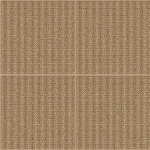
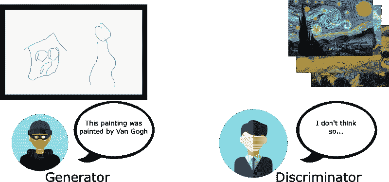
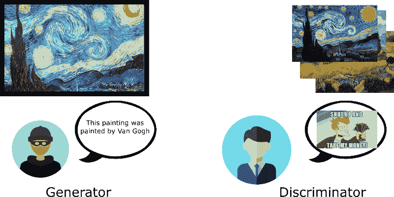
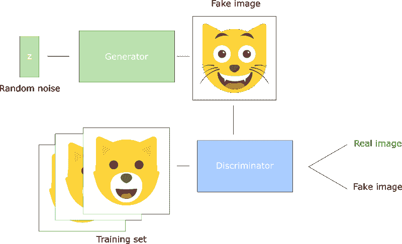
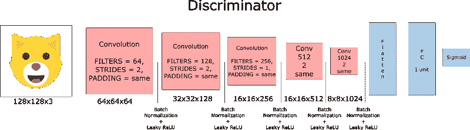
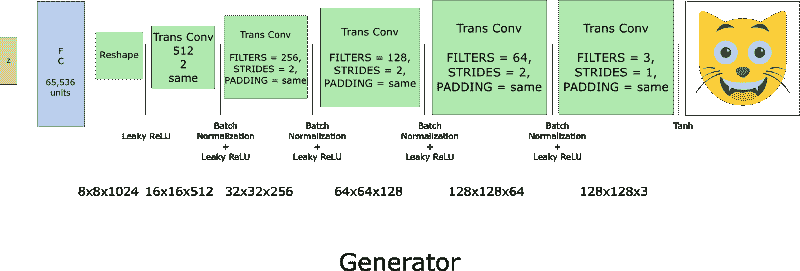
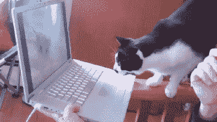

# 人工智能如何学习生成猫的图片

> 原文：<https://www.freecodecamp.org/news/how-ai-can-learn-to-generate-pictures-of-cats-ba692cb6eae4/>

托马斯·西蒙尼尼

# 人工智能如何学习生成猫的图片


Example of cats generated by our DCGAN

2014 年 Goodfellow 等人的研究论文[生成对抗网](https://arxiv.org/pdf/1406.2661.pdf) (GAN)是生成模型领域的突破。

首席研究员 Yann Lecun 自己称对抗性网络是“过去二十年里机器学习中最酷的想法。”

今天，由于这种架构，我们将建立一个人工智能，生成逼真的猫的图片。多棒啊。！



DCGAN during training

要查看完整的工作代码，请参见[我的 Github 库](https://github.com/simoninithomas/CatDCGAN)。如果你在 Python、深度学习和 Tensorflow 以及 CNN(卷积神经网络)方面已经有一些经验，这将会有所帮助。

如果你是深度学习的新手，请查看这个优秀的系列文章:

[**机器学习好玩！**](https://medium.com/@ageitgey/machine-learning-is-fun-80ea3ec3c471)
[*世界上最简单的机器学习入门*medium.com](https://medium.com/@ageitgey/machine-learning-is-fun-80ea3ec3c471)

### 什么是 DCGAN？

深度卷积生成逆向串行网络(或 DCGAN)是一种深度学习架构，它生成类似于训练集中数据的输出。

该模型用卷积层代替了生成对抗网络模型的全连接层。

为了解释 DCGAN 的工作原理，我们用艺术专家和造假者的比喻。

伪造者(又名“发电机”)试图制造假的梵高画作，并冒充真品。


Criminal icon made by Roundicon from [www.flaticon.com](http://www.flaticon.com "Flaticon")

另一方面，艺术专家(又名“鉴别者”)试图利用他们对真正梵高画作的了解来抓住造假者。



随着时间的推移，艺术专家越来越善于发现假画，造假者也越来越善于造假。



正如我们所见，DCGANs 由两个相互竞争的独立深度神经网络组成。

*   生成器是一个伪造者，试图产生看似真实的数据。它不知道真实的数据是什么，但它会从另一个模型的反馈中学习调整。
*   鉴别器是一个检查员，试图确定什么是伪造的伪造数据(通过与真实数据进行比较)，同时试图不在真实数据上产生假阳性。该模型的输出结果将用于发电机的反向传播。



DCGAN illustration

*   生成器获取随机噪声向量并生成图片。
*   该图片被输入鉴别器，鉴别器将训练集与生成的图像进行比较。
*   鉴别器返回一个介于 0(伪图像)和 1(真实图像)之间的数字。

### 让我们创建一个 DCGAN！

现在，我们准备创建我们的人工智能。

在这一部分中，我们将关注模型的主要元素。如果你想检查整个代码，使用笔记本[这里](https://github.com/simoninithomas/CatDCGAN/blob/master/Cat%20DCGAN.ipynb)。

#### 输入

这里，我们创建输入占位符:inputs_real 用于鉴别器，inputs_z 用于生成器。

注意，我们使用两个学习率，一个用于生成器，一个用于鉴别器。

DCGANs 对超参数非常敏感，因此精确调整它们非常重要。

#### 鉴别器和发生器

我们使用`tf.variable_scope`有两个原因。

首先，我们希望确保所有变量名称都以 generator / discriminator 开头。这将有助于我们以后训练这两个网络。

其次，我们希望重用这些具有不同输入的网络:

*   对于生成器:我们将训练它，但训练后也从它那里采样假图像。
*   对于鉴别器:我们需要在假的和真实的输入图像之间共享变量。



The discriminator

现在让我们创建鉴别器。请记住，它将真实或虚假的图像作为输入，并输出一个分数。

一些技术评论:

*   原理是在每个卷积层将滤镜大小翻倍。
*   不建议使用下采样。相反，我们只使用步长卷积层。
*   我们在每一层(除了输入层)使用批量归一化，因为它减少了协方差偏移。要了解更多信息，请查看这篇[伟大的文章](https://towardsdatascience.com/batch-normalization-in-neural-networks-1ac91516821c)。
*   我们利用泄漏 ReLU 作为激活函数，因为它有助于避免消失梯度效应。



然后，我们创建发电机。请记住，由于转置卷积层，它将随机噪声向量(z)作为输入，并输出假图像。

这个想法是，在每一层，我们把过滤器的尺寸减半，把图片的尺寸加倍。

已经发现，使用 tanh 作为输出激活函数，发生器的性能最佳。

#### 鉴频器和发电机损耗

因为我们同时训练发电机和鉴别器，所以我们需要计算两个网络**的*损耗。***

我们希望鉴别器在“认为”一个图像是真的时输出 1，对于假图像输出 0。因此，我们需要设置损失来反映这一点。

鉴别器损耗是真实和伪造图像的损耗之和:

```
d_loss = d_loss_real + d_loss_fake 
```

`d_loss_real`是鉴别器预测一幅图像是假的，而实际上它是一幅真实图像时的损失。其计算方法如下:

*   使用`d_logits_real`和标签都是 1(因为所有真实数据都是真实的)
*   `labels = tf.ones_like(tensor) * (1 - smooth)` 我们使用标签平滑:这意味着将标签从 1.0 稍微减少到 0.9 ，以便帮助鉴别器更好地进行归纳。

`d_loss_fake`是当鉴别器预测一幅图像是真实的，而实际上是一幅假图像时的损失。

*   使用`d_logits_fake`和标签都是 0。

发电机损耗再次使用来自鉴别器的`d_logits_fake`。这次标签都是 1，因为生成器想糊弄鉴别器。

#### 优化者

计算损耗后，我们需要分别更新发生器和鉴别器。

为此，我们需要通过使用`tf.trainable_variables()`来获取每个部分的变量。这将创建一个我们在图表中定义的所有变量的列表。

#### 培养

在这里，我们实现了培训功能。

这个想法相对简单:

*   我们每五个时期保存一次模型。
*   每训练十批，我们会在图像文件夹中保存一张图片。
*   我们正在显示`g_loss , d_loss`和每 15 个时期生成的图像。这是因为一个简单的原因:Jupyter 笔记本可以错误，如果太多的图片显示。
*   或者，我们可以通过加载保存的模型直接生成真实的图像(这样可以节省你 20 个小时的训练)。

#### 如何运行它

你不能在你的个人电脑上运行这个——除非你有自己的图形处理器或者准备等上 10 年！

而是必须使用云 GPU 服务，比如 AWS 或者 FloydHub。

我个人用微软 Azure 和他们的[深度学习虚拟机](https://azuremarketplace.microsoft.com/en-us/marketplace/apps/microsoft-ads.dsvm-deep-learning)训练了这个 DCGAN 20 个小时。

声明:我和 Azure 没有任何业务关系。我喜欢他们出色的客户服务！

如果你在虚拟机上运行它有困难，请点击这里的这篇优秀文章。

就这些了，希望这篇教程有所帮助！

如果您已经改进了模型，请不要犹豫提出拉取请求。



如果你有任何想法，评论，或者想让我看看你的结果，欢迎在下面评论或者给我发邮件:hello@simoninithomas.com，或者发微博给我 [@ThomasSimonini](https://twitter.com/ThomasSimonini) 。

如果你喜欢我的文章，请点击？所以其他人会在媒体上看到这个。别忘了跟着我！

干杯！