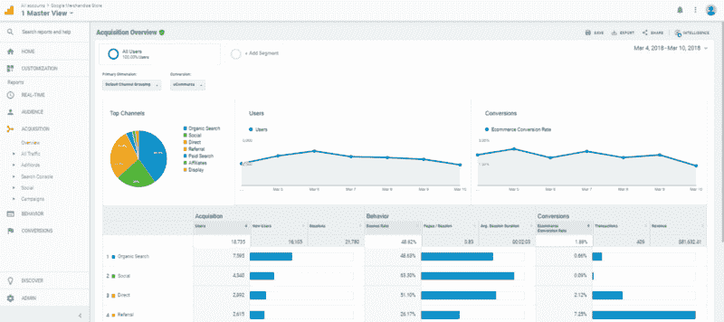
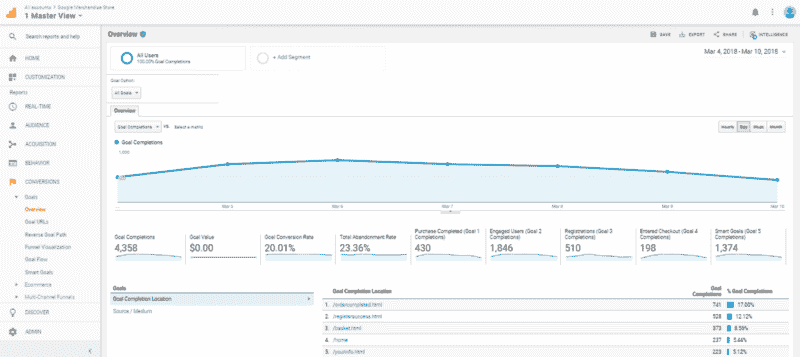
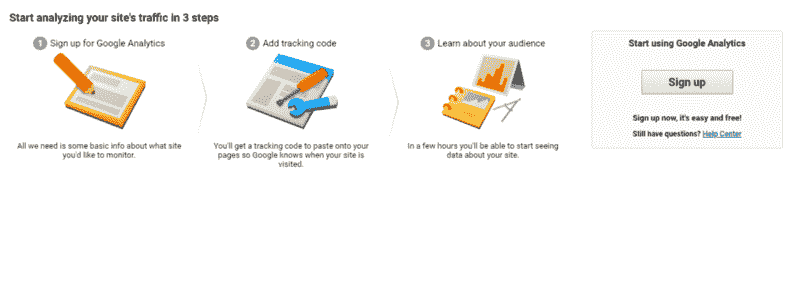
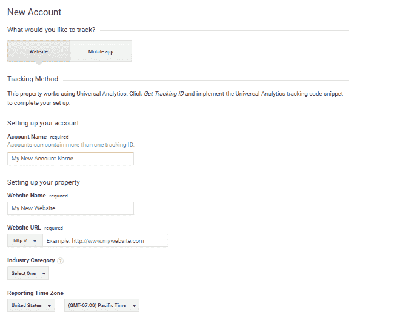
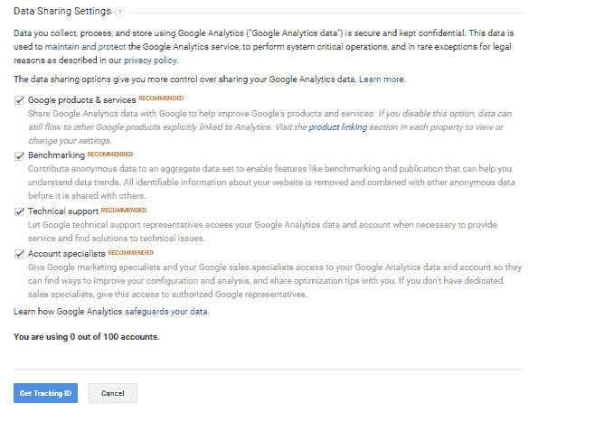
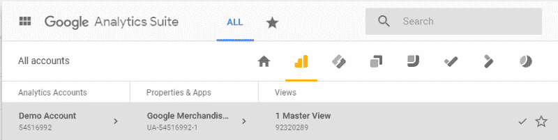
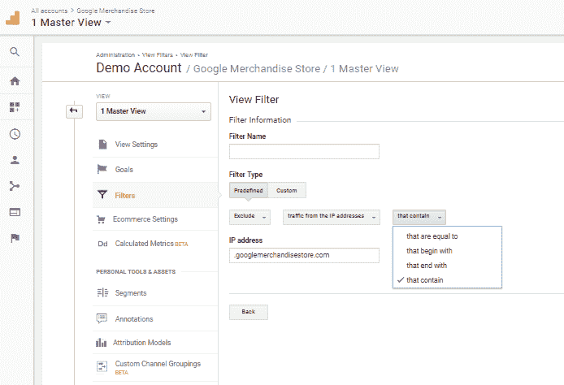
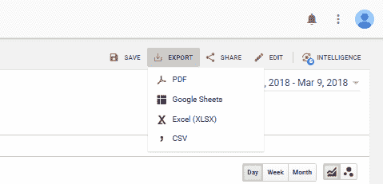
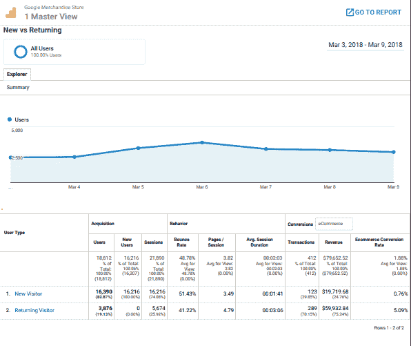

# 如何(以及为什么)开始使用谷歌分析

> 原文：<https://www.freecodecamp.org/news/how-and-why-to-get-started-with-google-analytics-153dc35b7812/>

朱莉娅·布尔若斯

### 什么是谷歌分析？

从本质上讲，谷歌分析是监控网站使用的首选解决方案。虽然它经常与 Google Adwords 结合使用，用于电子商务和改善网站用户体验，但它足够灵活和强大，任何拥有网站的组织都可以使用。事实上，你不需要高超的编码技术来利用谷歌分析。

因此，本指南主要针对那些不认为自己或自己的主要职业是技术的人。它将只触及谷歌分析入门的基本要素。

### 谷歌分析能为我做什么？

你的组织有可能会出现在网络上。谷歌分析收集并呈现了大量的数据。根据您的需求，原始数据被整理成各种报告。适用于您的组织的数据驱动的洞察力将取决于您的站点和组织的目标。即使你的目标还没有确定，谷歌分析也有对大多数组织有用的领域。

谷歌分析还可以帮助你识别网站的潜在问题。例如，如果网站的移动用户存在性能或可用性问题。

#### 收购概述

收购概述回答了如下问题:网站获得了多少流量？你的网站的来源或最高流量是什么？你的目标交谈率是多少？新用户和老用户的细分是什么？

这在检查随时间的变化时特别有用。比较几周或几个月会让你对一段时间内的站点性能有更好的了解。

courtesy of Google Analytics Demo Site

#### 行为概述

有些页面对您的组织来说比其他页面更重要。在“行为概述”页面上，单个页面的性能将帮助您确定哪些页面带来的流量最大。它还将为您提供网站技术性能的概述，如跳出率。

courtesy of Google Analytics Demo Site

如果您从事电子商务工作，主页、产品页面、搜索结果、购物车、结帐和感谢页面等页面将是您网站上需要跟踪的关键页面。

然而，如果你是一个博物馆，你可能想跟踪教育，展览和编程的网页。你也可能对定位地理感兴趣，以便更好地了解你的目标受众。博物馆，以及餐馆，餐车和咖啡馆，将希望优先考虑本地搜索优化。

#### 转换概述

对于业务影响报告，有必要配置目标或电子商务交易。谷歌分析不会自动为你建立目标。可以在“查看”下的管理面板中为您的站点建立目标目标的定义非常广泛，可以是电子商务交易，也可以是从提交或预订中获取线索。

有价值的目标说明了网站页面的优势和劣势。转换概述将使您能够深入了解您的目标转换，并更多地了解您的客户路径。

courtesy of Google Analytics Demo Site

### 如何——基础知识

那么如何开始呢？

登录 [Google Analytics](https://www.google.com/analytics/#?modal_active=none) 创建您的账户。在右上角，如果您没有帐户，请登录或创建一个帐户。

courtesy of courtesy of Google Analytics Demo Site

然后选择网站或手机应用程序。您将提供帐户名，通常是您的企业名称。然后设置网址。选择 [HTTP](https://en.wikipedia.org/wiki/Hypertext_Transfer_Protocol) 或 HTTPS——如果您的站点在 HTTP 和 HTTPS 之间切换，从 HTTP 开始。

然后选择一个行业类别。这是重要的一步，因为它使谷歌能够为你的网站设定基准，并将你的网站的表现与同行业的其他网站进行比较。

courtesy of Google Analytics Demo Site

然后选择报告国家和时区。虽然这不是一个关键问题，但请考虑将您选择的时区永久化。虽然可以更改，但不能追溯更改数据。检查所有东西，因为这些资源会变得非常宝贵。你可以阅读“阅读更多”来了解谷歌如何使用你的数据。

courtesy of Google Analytics Demo Site

接下来，选择“获取跟踪标识”。查看条款和服务，并选择“我接受”。

现在，您将安装您的跟踪标签。选择“跟踪信息”，然后选择“跟踪代码”。跟踪代码是一个独特的代码片段，你需要复制并粘贴到你的网站的每一页，你想被谷歌分析跟踪。

在 HTML 页面上的`<he` ad >下方复制您的跟踪代码。然后去“谷歌标签管理器”您可以选择链接了解更多信息。点击“状态”。在这里，谷歌会让你知道你是否正在接收数据。

**注意:**
以下是如何在你的 [Wordpress 页面上安装谷歌分析追踪标签。](http://www.wpbeginner.com/beginners-guide/how-to-install-and-setup-google-tag-manager-in-wordpress/)

以下是如何将谷歌分析跟踪代码安装到你的 [HubSpot 页面](https://knowledge.hubspot.com/articles/kcs_article/cos-general/how-do-i-put-my-google-analytics-code-onto-my-new-landing-pages)上。

#### 创建视图

courtesy of Google Analytics Demo Site

最佳实践是您创建的第一个“视图”是一个主视图。主视图包含未过滤的分析历史，有点像备份。

#### 创建过滤器

谷歌在将你的数据呈现在你的报告中之前会对其进行过滤。首先，最重要的过滤是将你自己和你的员工排除在数据之外。您不希望自己的数据与用户的数据一起出现。

为自己创建一个排除了 [IP 地址](https://en.wikipedia.org/wiki/IP_address)的过滤器。如果你不知道你的 IP 地址，只需在谷歌上搜索“我的 IP 地址是什么？”。您需要排除您和您的员工用于工作的每台计算机的 IP 地址。这些需要单独添加。

从管理面板中，选择“默认视图”。从下拉菜单中，选择“添加过滤器”并给它一个名称(如排除雇员)。接下来，您可以选择预定义过滤器或自定义过滤器。

courtesy of Google Analytics Demo Site

一个预定义的过滤器作为你想要做的模板。选择“预定义”并从下拉菜单中选择。选择“仅排除或包括”。在这种情况下，您将从 IP 地址中选择流量，然后选择适当的表达式。输入要排除的数据，如 IP 地址。然后“保存。”

从现在开始，默认视图中的所有数据都将排除被该过滤器排除的任何数据，但不会排除历史数据。

添加多个滤镜是很常见的。然而，过滤器顺序很重要。过滤器顺序会影响后续结果。滤波器顺序很重要，因为一个滤波器的输出会成为下一个滤波器的输入。浏览过滤器，查看与您组织的目标最相关的内容。

**注意**:如果你想包含/排除两件事，你实际上是在创建一个“或”过滤器。转到筛选字段，然后选择筛选模式。键入要排除的第一个术语，然后键入管道符号(|)和第二个术语。

#### 输出

谷歌分析使打印或分享你的分析报告变得非常容易。在右上角，您可以选择打印或共享您的报告。也可以保存和编辑。

courtesy of Google Analytics Demo Site

courtesy of Google Analytics Demo Site

### 走向

Google Analytics 提供了大量的报告以及数据分段选项，这超出了本文的范围。查找最符合您需求的报告。

随着 Google Analytics 360 套件的推出，以前的 Google Analytics for premium 用户，Google 的分析只会变得更加先进。Google Analytics 360 提供分析数据，公司可以使用这些数据来跟踪投资回报(ROI)和营销指标。

### 进一步阅读

要深入了解谷歌分析，请阅读[谷歌网页设计者和开发者分析](https://www.wpbeaverbuilder.com/google-analytics-web-designers-developers/)。

对于初学者的教程可以在[谷歌初学者分析](https://analytics.google.com/analytics/academy/course/6)上找到。

如果你是编码新手，我推荐[妈妈们可以:Code](https://www.momscancode.com/) 和 [CodeNewbie](https://www.codenewbie.org/) 。

在 [Twitter](https://twitter.com/JuliaBourbois) 上关注我。