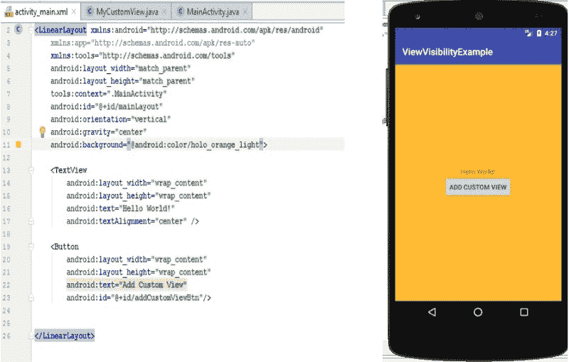

# 如何以及为什么使用 Android 可视性监听器

> 原文：<https://www.freecodecamp.org/news/how-and-why-to-use-android-visibility-listeners-971e3b6511ec/>

Android UI 是由视图构建的，在常规应用程序中，通常有几个视图。为了找出用户当前正在查看哪个视图，您需要安装**可见性监听器**。

请阅读以下内容，了解用于确定视图可见性状态的不同选项。

### 如何变得可见

为了让我们的侦听器工作，我们必须首先确保在布局层次结构中找到我们的视图。发生这种情况有两种方式:

1.  您的视图已经是布局的一部分，因为它是在 XML 文件中定义的
2.  您动态地创建了一个视图，您需要使用 addView 方法添加它

```
public void addView (View child, ViewGroup.LayoutParams params)
```

child is the View you want to add and LayoutParams are the layout parameters(I.E. width, and height)

视图的可见性状态为整数类型，可以有以下三个选项之一:

1.  **可见(0)** -视图对用户可见
2.  **不可见(4)** -视图对用户来说是不可见的，但是仍然占据布局中的空间
3.  **消失(8)** -视图不可见，不占用布局空间

一旦进入我们的布局层次结构，有几个本地选项可以帮助我们知道视图的可见性何时发生了变化。

#### [视野改变](https://developer.android.com/reference/android/view/View.html#onVisibilityChanged(android.view.View,%20int))

```
protected void onVisibilityChanged (View changedView, int visibility)
```

当视图或视图祖先的可见性改变时，触发此方法。可见性的状态可以在可见性参数中找到。

#### [onWindowVisibilityChanged](https://developer.android.com/reference/android/view/View.html#onWindowVisibilityChanged(int))

```
protected void onWindowVisibilityChanged (int visibility)
```

当视图的包含窗口改变了它的可见性时，这个方法被触发。这并不保证你的视图所在的窗口对用户是可见的，因为它可能会被另一个窗口遮住。

### 可见性监听器在运行

为了查看这两个侦听器的运行情况，让我们创建一个简单的项目。我们将有一个文本视图和按钮的 LinearLayout。我们将使按钮的点击动作将我们的自定义视图添加到布局中。



我们的自定义视图:

```
package com.tomerpacific.viewvisibility;

import android.content.Context;
import android.graphics.Color;
import android.util.Log;
import android.view.View;
import android.widget.LinearLayout;
import android.widget.TextView;

import static android.view.Gravity.CENTER;

public class MyCustomView extends LinearLayout {

    private final String TAG = MyCustomView.class.getSimpleName();

    public MyCustomView(Context context) {
        super(context);
        this.setBackgroundColor(Color.GREEN);
        this.setGravity(CENTER);
        TextView myTextView = new TextView(context);
        myTextView.setText("My Custom View");
        addView(myTextView);
    }

    @Override
    public void onVisibilityChanged(View changedView, int visibility) {
        super.onVisibilityChanged(changedView, visibility);

        Log.d(TAG, "View " + changedView + " changed visibility to " + visibility);
    }

    @Override
    public void onWindowVisibilityChanged(int visibility) {
        super.onWindowVisibilityChanged(visibility);

        Log.d(TAG, "Window visibility changed to " + visibility);
    }

}
```

最后，我们主要活动中的代码:

```
package com.tomerpacific.viewvisibility;

import android.support.v7.app.AppCompatActivity;
import android.os.Bundle;
import android.view.View;
import android.widget.Button;
import android.widget.LinearLayout;

public class MainActivity extends AppCompatActivity {

    private Button addCustomViewBtn;

    @Override
    protected void onCreate(Bundle savedInstanceState) {
        super.onCreate(savedInstanceState);
        setContentView(R.layout.activity_main);

        addCustomViewBtn = (Button) findViewById(R.id.addCustomViewBtn);

        addCustomViewBtn.setOnClickListener(new View.OnClickListener() {
            @Override
            public void onClick(View view) {
                LinearLayout mainLayout = (LinearLayout) findViewById(R.id.mainLayout);
                MyCustomView myCustomView = new MyCustomView(getApplicationContext());
                myCustomView.setLayoutParams(new LinearLayout.LayoutParams(
                    LinearLayout.LayoutParams.MATCH_PARENT, 
                    LinearLayout.LayoutParams.WRAP_CONTENT));

                mainLayout.addView(myCustomView);
            }
        });
    }
}
```

We attach an OnClick Listener to the button

当我们运行应用程序并按下按钮时，我们得到:

[https://giphy.com/gifs/8JZA6Djt7DmYpEXj2h/html5](https://giphy.com/gifs/8JZA6Djt7DmYpEXj2h/html5)

您可以在这里获得示例项目[。](https://github.com/TomerPacific/MediumArticles/tree/master/ViewVisibility)

#### [ViewTreeObserver](https://developer.android.com/reference/android/view/ViewTreeObserver)

这是一个本机对象，它有大量的侦听器，这些侦听器会被通知视图树的各种可见性更改。一些值得注意的突出问题是:

*   [OnGlobalLayoutListener](https://developer.android.com/reference/android/view/ViewTreeObserver.OnGlobalLayoutListener.html)
*   [无电梯侦听器](https://developer.android.com/reference/android/view/ViewTreeObserver.OnWindowAttachListener.html)
*   [OnWindowFocusChangeListener](https://developer.android.com/reference/android/view/ViewTreeObserver.OnWindowFocusChangeListener.html)

要附加 ViewTreeObserver，您需要执行以下操作:

```
LinearLayout linearLayout = (LinearLayout) findViewById(R.id.YOUR_VIEW_ID);

ViewTreeObserver viewTreeObserver = linearLayout.getViewTreeObserver(); 
viewTreeObserver.addOnGlobalLayoutListener (new ViewTreeObserver.OnGlobalLayoutListener() { 

    @Override 
    public void onGlobalLayout() {
        linearLayout.getViewTreeObserver().removeOnGlobalLayoutListener(this); 
        //TODO Add Logic
    } 
});
```

removeOnGlobalLayoutListener requires API > 15

行`linearLayout.getViewTreeObserver().removeOnGlobalLayoutListener(this)` 确保侦听器只会被调用一次。如果您想继续监听更改，请移除它。

如果您有任何意见或建议，请随时告诉我。