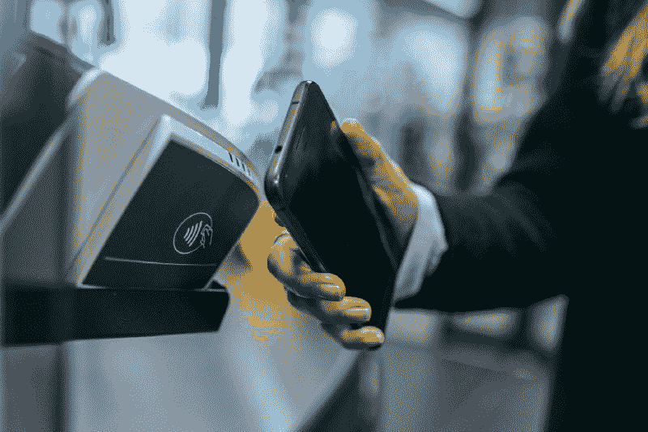
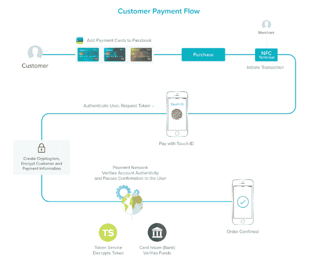
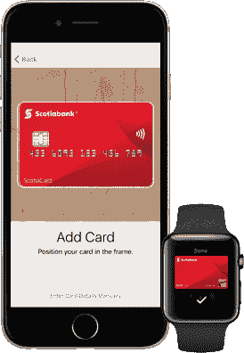
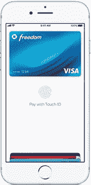
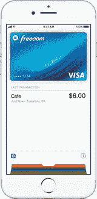

# Apple Pay 的幕后运作方式

> 原文：<https://www.freecodecamp.org/news/how-apple-pay-works-under-the-hood-8c3978238324/>

杜明杜布迪卡

# Apple Pay 的幕后运作方式

Photo by [Jonas Leupe](https://unsplash.com/photos/0IVop5v4MMU?utm_source=unsplash&utm_medium=referral&utm_content=creditCopyText) on [Unsplash](https://unsplash.com/search/photos/mobile-terminal?utm_source=unsplash&utm_medium=referral&utm_content=creditCopyText)

你用 Apple Pay 吗？你有没有想过 Apple Pay 交易是如何进行的？在这篇文章中，你将了解 Apple Pay 是如何端到端工作的。

由于移动支付提供的便利性和安全性，它已经变得非常流行。再也不用随身携带塑料卡，也不用担心会丢失(真是松了一口气！).

在这篇文章中，我将讨论 Apple Pay 的一般工作原理，以及它在物理 POS 终端上使用时的具体工作原理。我还将简要讨论一下安全性的好处。

在开始之前，让我们先熟悉一些基本术语。

#### 安全元素

安全元素(SE)是在谈论 Apple Pay 时提到的东西，所以我们需要了解它是什么。

根据[全球平台](https://www.globalplatform.org/mediaguideSE.asp):

> 安全元件(SE)是防篡改平台(通常是单芯片安全微控制器),能够根据一组明确的可信机构提出的规则和安全要求安全地托管应用及其机密和加密数据(例如密钥管理)。

Apple Pay 使用 SE 来存储与令牌化卡相关的秘密信息(我们稍后会谈到这一点)。

在 iPhone 6 之后的 iPhone 和 Apple Watch 中，SE 被嵌入到设备的近场通信(NFC)芯片中。这在支付终端用于通过 NFC 执行交易。SE 在 Apple Pay 交易期间模拟支付卡。

#### 标记化

支付行业越来越多地采用令牌化流程。在这里，我们将尝试理解标记化的基础。

以下是来自维基百科的关于标记化技术的简明描述:

> **令牌化**在应用于数据安全时，是指用不敏感的对等物(称为令牌)替换敏感数据元素的过程，该对等物没有外在的或可利用的意义或价值。令牌是通过令牌化系统映射回敏感数据的引用(即标识符)。从原始数据到令牌的映射使用的方法使得令牌在没有令牌化系统的情况下不可逆转

在信用卡和 Apple Pay 的上下文中，**令牌化**用于将主账号(PAN，或信用卡号)替换为令牌。代币看起来像普通的信用卡号，但它不是原始的 PAN。令牌化阻止在交易过程中使用原始卡号。

代币本身没有任何意义，如果代币被盗，对罪犯来说毫无价值。如果您有令牌，则没有算法来导出主帐号。这使得犯罪分子无法从令牌逆向工程出主账号。

如果你想了解更多，点击[这里](https://en.wikipedia.org/wiki/Tokenization)查看维基百科上关于标记化的文章。

下图描述了 Apple Pay 的交易流程。我们将在接下来的章节中逐步讨论这些。

ymedialabs.com

### 将卡添加到 Apple Pay

[http://www.iphoneincanada.ca](http://www.iphoneincanada.ca)

通过扫描卡片或提交卡片信息，可以将卡片添加到 Apple Pay。然后这些信息被提交到苹果服务器。

Apple 将收到的卡信息发送到相关的卡网络(Visa、MasterCard、AmericanExpress、Discover 等)。然后，卡网络向发行银行验证卡信息。

验证之后，充当 [TSP](https://www.slideshare.net/bellidcom/what-is-a-token-service-provider-52887269) (令牌服务提供商)的卡网络创建令牌(在 Apple Pay 的上下文中称为 DAN 或设备账号)和令牌密钥。此 DAN 是使用令牌化生成的，而不是实际的卡号。

之后，这些信息被发送回苹果服务器。设备从 Apple 服务器接收到这些信息后，会将其保存在设备的安全元素(SE)中。

### 使用 Apple Pay 发起交易

support.apple.com

当您在 POS 终端使用 Apple 设备进行支付时，该设备会与终端通信以启动交易。Apple Pay 使用 EMVCO 的[非接触式规范](https://www.emvco.com/emv-technologies/contactless/)与终端进行通信。如果终端不支持 EMV 非接触式，Apple Pay 会退回到使用非接触式 MSD(磁条数据)模式。

#### EMV 非接触模式

当使用 EMV 无接触模式时，苹果设备根据 EMV 无接触[规范](https://www.emvco.com/emv-technologies/contactless/)与终端通信。设备上的安全元件使用令牌、令牌密钥、金额和与交易相关的其他信息为每笔交易生成一个**动态密码**。然后，该动态密码与令牌(DAN)、交易金额和处理交易所需的其他信息一起被发送到支付处理器。

#### 无接触 MSD 模式

无接触 MSD 的存在是为了支持仍然不能使用 EMV 无接触模式进行处理的终端。大多数终端仍然使用非接触式 MSD 模式运行。让我们更深入地了解一下使用非接触式 MSD 模式的交易是如何进行的。

MSD，或磁条数据，是老卡存储卡的细节。数据以**磁道**的形式存储在磁条卡中。磁条卡最多可以有 3 个磁道，每个磁道(磁道 1、磁道 2、磁道 3)有不同的格式。请点击[此处](https://en.wikipedia.org/wiki/ISO/IEC_7813)了解赛道数据的更多信息。

在 Apple Pay 非接触式 MSD 模式中，track2 数据格式用于将卡数据传输到支付处理器，然后支付处理器与卡网络进行通信。

让我们来看一些 Apple Pay 交易中从终端发送到处理器的跟踪数据示例。

370295292756481=220672716078290600047

以上是从终端接收的跟踪数据的示例，该数据是在支付网关捕获的。

让我们一段一段地理解这些数据，

*   用黄色突出显示——这是设备账号或 DAN(此处的 DAN 示例来自美国运通信用卡。您可以验证银行识别号(BIN)，或信用卡号的前 6 位数字，此处[为](https://www.bincodes.com/bin-checker/)。
*   以蓝色突出显示-这是信用卡到期年和月(年/月)
*   用粉色突出显示-这是服务代码。点击[此处](https://atlassian.idtechproducts.com/confluence/display/KB/Credit+Card+Service+Code+Chart++)了解更多相关信息。
*   以紫色突出显示-这部分数据由卡网络自行决定。在 Apple Pay 的情况下，这被用作**动态卡验证值(CVV)。**

我们了解到，在 EMV 模式下，会生成一个动态密码。这里的**动态 CVV** 扮演了密码的角色。这是使用令牌密钥和其他交易相关数据生成的(类似于生成**动态密码**)。

上面显示的跟踪数据与交易金额一起发送给[收单机构](https://en.wikipedia.org/wiki/Acquiring_bank)。收单机构根据 [BIN](https://www.investopedia.com/terms/b/bank-identification-number.asp) 将该信息转发给相关的卡网络(Visa、MasterCard 等)。

### Apple Pay 交易的完成

当卡网络收到交易请求时，它会识别它是实际的卡号还是令牌化的卡号。如果它被令牌化(Apple Pay 交易就是这种情况)，卡网络使用他们的**令牌密钥**的副本来验证密码(或动态 CVV)(卡网络在这里充当 [TSP](https://www.slideshare.net/bellidcom/what-is-a-token-service-provider-52887269) )。

在一些其他附加验证之后，卡网络对 DAN 进行去令牌化，并获得原始 PAN(主账号)。

该交易请求连同原始 PAN 一起发送给[发卡行](https://www.thebalance.com/credit-card-issuer-959984)(发行信用卡的银行或金融机构)。发行者授权交易并发回最终到达 POS 终端的响应。

耶！交易完成！

support.apple.com

### 重放事务请求

传统卡交易的最大问题之一是重放过去交易请求的能力([重放攻击](https://en.wikipedia.org/wiki/Replay_attack))。如果您重新发送相同的事务请求，另一个事务将使用相同的数据完成。

使用 Apple Pay，这种情况不会发生(直接在终端上使用 EMV 卡时也是如此)。每个交易请求只能使用一次。动态密码(MSD 模式下的动态 CVV)确保了这一点。对于每笔交易，都会生成一个只能使用一次的新密码(并且只在特定时间段内有效)。

### 结论

在本文中，我们对 Apple Pay 交易流程进行了概述。我将在下一篇文章中讨论 Google Pay。

#### 参考

*   [http://www . gmarwaha . com/blog/2015/01/03/apple-pay-an-attempt-to-demystify-take-2/](http://www.gmarwaha.com/blog/2015/01/03/apple-pay-an-attempt-to-demystify-take-2/)
*   [https://www.emvco.com/emv-technologies/contactless/](https://www.emvco.com/emv-technologies/contactless/)
*   [http://msrtron.com/blog-headlines/blog-card-data](http://msrtron.com/blog-headlines/blog-card-data)
*   [https://www . slide share . net/bellidcom/what-a-token-service-provider-52887269](https://www.slideshare.net/bellidcom/what-is-a-token-service-provider-52887269)

#### 在你走之前！

如果你喜欢这篇文章，欢迎鼓掌！