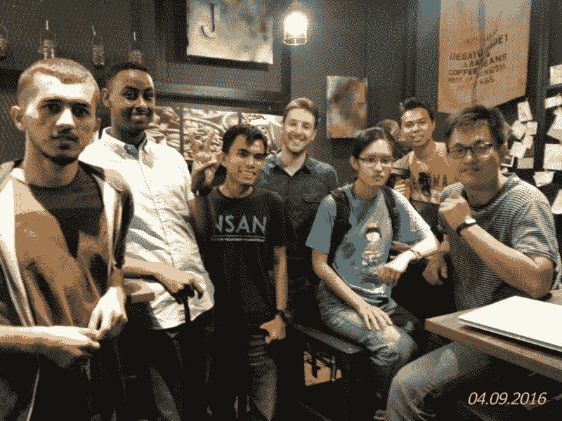

# 更好的设计如何避免周日的奥斯卡灾难

> 原文：<https://www.freecodecamp.org/news/how-better-design-could-have-prevented-sundays-oscars-disaster-b8eb2f589965/>

这里有三个值得你花时间的链接:

1.  为什么排版很重要——尤其是在奥斯卡颁奖典礼上
2.  我如何建立一个全自动的系统，从亚马逊上重新进货我厨房的咖啡( [5 分钟阅读](http://bit.ly/2muEQ0Q)
3.  客户端与服务器端渲染:为什么不全是黑白的( [6 分钟阅读](http://bit.ly/2lXPkT0))

### 想到这一天:

> “任何傻瓜都会使用电脑。很多人都是这样。”—特德·纳尔逊

### 今日趣事:

### 今日学习小组:

[吉隆坡自由代码营](http://bit.ly/2m9Z9j7)

编码快乐！

–昆西·拉森，自由代码营的老师