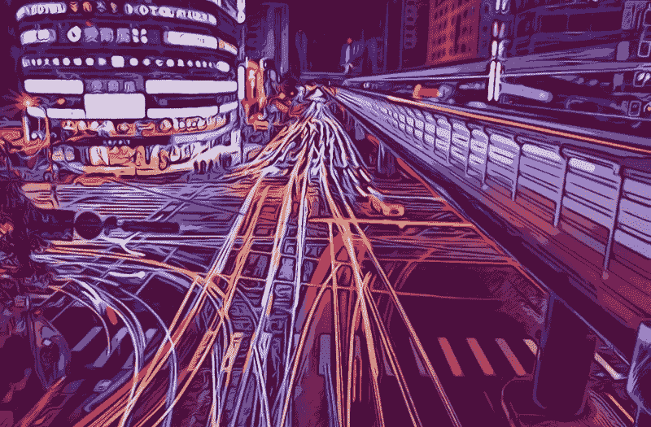
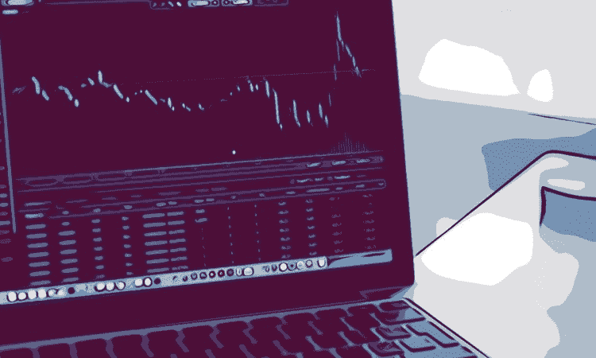
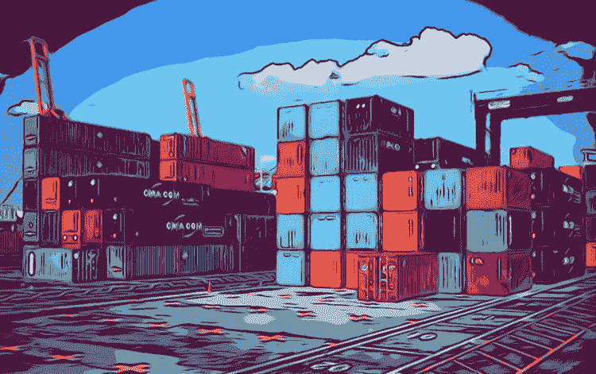

# 大数据和位置智能如何改变世界

> 原文：<https://www.freecodecamp.org/news/how-big-data-location-intelligence-is-changing-the-world-181ef8bf097f/>

作者詹姆斯·埃文

# 大数据和位置智能如何改变世界

毫无疑问，智能手机数量的爆炸式增长已经改变了我们所知道的世界。传感器和互联设备数量的增加产生了海量数据。这正被用来改变我们的生活方式。

物联网，位置数据，[位置智能](https://www.tamoco.com/location-data/)，大数据。不管你给它起了什么名字，很难否认各种行业的潜力

现在很明显，精确的位置数据可以提供对离线世界前所未有的洞察力。越来越多的企业意识到移动位置数据的价值及其在全球范围内的影响。

随着我们远离[不可靠的数据集](https://www.tamoco.com/blog/location-data-location-intelligence)，传感器驱动的精确数据集正占据中心舞台。这种精确的数据有许多用途。但是我想看看一些具有最大破坏性影响的。

### 商业智能

通过使用数据来观察趋势的能力并不新鲜。基于人们在线下世界的活动，以接近实时的方式做到这一点的能力。

位置智能揭示了经常被忽略的大数据集之间的关系。它将这些见解转化为可操作的商业智能。从会议室到店面，帮助做出明智的决策。

从与大型连锁场馆竞争的小酒吧，到与在线大公司竞争的小零售商，这些企业正在通过使用这种大数据来制定商业战略，从而获得宝贵的见解。

事实是，移动位置数据现在已经足够成熟，可以解决小型企业和大型企业面临的许多问题。让我们来看几个:

**金融服务** —通过大数据集了解客流量对于金融行业来说是[有价值的。移动设备数据有助于在正式报告之前预测收入和其他 KPI。这有助于投资决策。](https://www.tamoco.com/blog/big-data-finance-industry-analytics/)

**零售** — [大数据可以帮助小型和大型零售商](https://www.tamoco.com/blog/big-data-retail-analytics/)。通过移动设备数据了解商店访问以及客户行为，对零售行业产生了许多积极的影响。这些见解有助于为商业决策提供信息，如商店布局、营业时间、人员配备等。

### 基础设施和规划

我们都听说过智能城市这个术语。我们倾向于认为，这不仅仅是添加一些数据点，并在前面加上“智能”一词。事实上，还不止这些。我们正朝着人口众多的城市中心前进，并渴望实现无人驾驶汽车。大数据是开启这一真正智能未来的关键。

移动设备数据的增加为理解城市如何运转提供了更好的机会。它有助于创建反映这一点的系统和基础设施。

结合城市中不断增加的联网设备，中央规划机构现在拥有了一套工具，可以为许多不同领域的决策提供信息。

移动位置数据有助于更好地了解哪里对公共基础设施的需求最大。例如，我们可以检查移动设备位置数据，以了解城市中自行车最多的道路。当计划在哪里实施新的自行车路线时，这些信息是精确的和无价的。

交通和拥堵也是如此。在日益拥挤和污染的大城市，了解如何缓解交通问题是很重要的。了解交通流量以及在哪里建设新的道路结构或引入新的低排放区，对于建设能够维持当前人口增长水平的智能城市至关重要。

大数据正在对此类规划产生巨大的积极影响。由于移动设备数据和位置智能的准确性和独特性，它正在改变世界各地城镇的决策方式。

### 营销和广告

大数据和营销从来都是相辅相成的。营销人员总是希望利用数据集来提高广告的效率和效果。使用大数据创建量身定制的相关受众并不是一种新的做法。

但是移动位置数据允许营销商和广告商将数字广告与消费者离线时的行为联系起来。了解消费者如何在线下世界移动有助于营销人员变得更加有效。它帮助营销者向消费者提供更多的个人广告。

位置智能正在扰乱消费者生命周期的许多阶段。它把网络上的分析能力带到了现实世界。

### 分割

移动设备数据有助于构建人们如何移动和行为的复杂图像。这有助于广告商建立复杂的客户档案。品牌最终理解了顾客去的地方，以及他们如何与周围的物质世界互动。

这远比其他受众细分方法有效。这是因为一个人的位置往往比他们在电脑上搜索或坐在沙发上浏览手机时更能表明意图。

这使得营销人员能够准确识别消费者在购买过程中的位置。此外，它允许他们以更详细的级别来完成这项工作。

### 个性化

大数据在营销和广告方面的一个重大突破是提高大规模个性化的能力。

位置数据让品牌通过了解顾客的情况变得更有帮助和人性化。这个概念并不新鲜，但是这个空间中数据集的准确性和不断增长的规模使得交流变得更加个人化。

位置有助于在客户实际兑换时提供促销。它让“顾客也买了”的体验到达现实世界的零售店。通过这种方式，大数据正在为线下问题提供数字化解决方案。位置智能是根据一个人对现实世界的独特体验来定制品牌传播。

### 客户体验

大数据改善了客户体验。位置智能有助于自动寻路、订购、协助和队列管理。了解一个人的物理位置有助于改善许多领域的游客体验。

体育场、度假村、机场和交通枢纽都会改善在这些地方花费时间和金钱的人们的体验。这可能是基于位置的售票方式——你走上火车买票。或者它可能在你的位置订购食物和饮料。

大数据和位置智能在改善客户体验方面仍有巨大的应用空间。

### 属性

正如我们所见，移动设备数据已经将许多数字生活方式与线下消费者行为联系起来。这项技术革新营销和广告空间的另一种方式是通过[属性](https://www.tamoco.com/blog/marketing-attribution-customer-journey-mapping-location)。

传统上，许多广告商在衡量线下广告对线下 KPI 的影响时都是盲目的。

但是移动设备位置数据正在填补空白。例如，当一个人站在户外广告前时，位置智能可以理解。然后，它可以测量这些人中有多少人在商店内或特定实物产品前被看到。

将两者联系起来，为营销人员提供了一种准确的方法来衡量线下广告库存的影响和投资回报率。它还允许他们衡量数字广告对线下目标的影响。这些事情以前是不可能确定的。但是大数据改变了广告的衡量方式。

### 阿肯色州

如果 AR 真的要实现它的承诺，它将不得不依赖复杂的数据集和准确的位置智能。

随着 AR 越来越突出，它的应用将从好玩的游戏转向有用的生产力应用。随着 AR 的发展，它作为一种通过内容和广告接触观众的方式的使用将会增长。像以前的营销活动一样，它将通过使用大数据和位置智能来改进。

当用户在现实世界中移动时，AR 将需要大量准确和实时的位置数据才能正常工作。

### 优化供应链

大数据和位置智能正在影响希望优化供应链的组织。

位置智能在供应链中的明显应用在于理解和跟踪交货和供应的能力。它已经被用来生成数据集，可以优化和改善这些服务。

但是位置智能不仅仅是帮助企业优化流程。这有助于他们了解对产品的需求。历史上有很多人建造一些东西，希望人们想要它，结果却发现他们并不需要。

大数据帮助制造业优化的另一种方式是帮助它调整运输类型、装货地点或销售地点。

随着位置数据的兴起，这些见解现在由来自线下世界的信息推动。以前无法获得或滞后的洞察力现在可以实时获得。这是扰乱供应链运作的核心问题。

### 隐私和透明度

像往常一样，对于新的破坏性活动，焦点集中在这些新技术的责任上。理应如此。事实上，大数据领域的企业需要更加透明地了解数据集的来源。

仅仅勾选一个框并开始收集和汇总个人数据是不够的。为了清理数据供应链，还需要做更多的工作。需要将更多的控制权交给用户。

通过这种方式，我们有责任向用户传达大数据和位置智能的价值。它在全球范围内产生了巨大的积极影响，这也是保护隐私的更多理由。