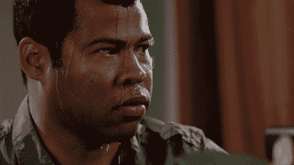
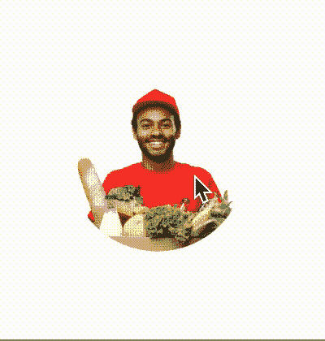
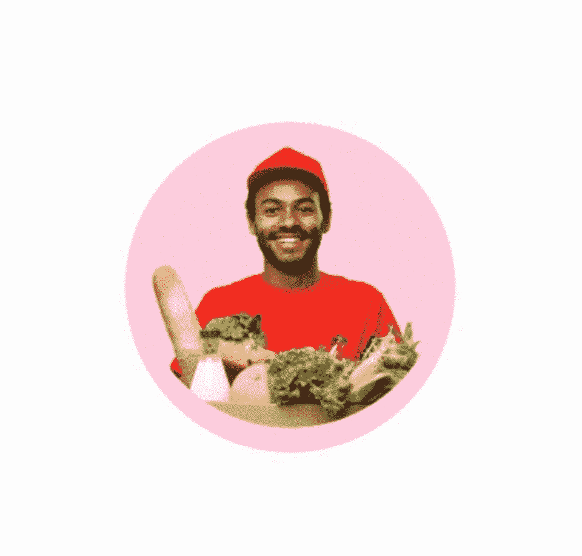
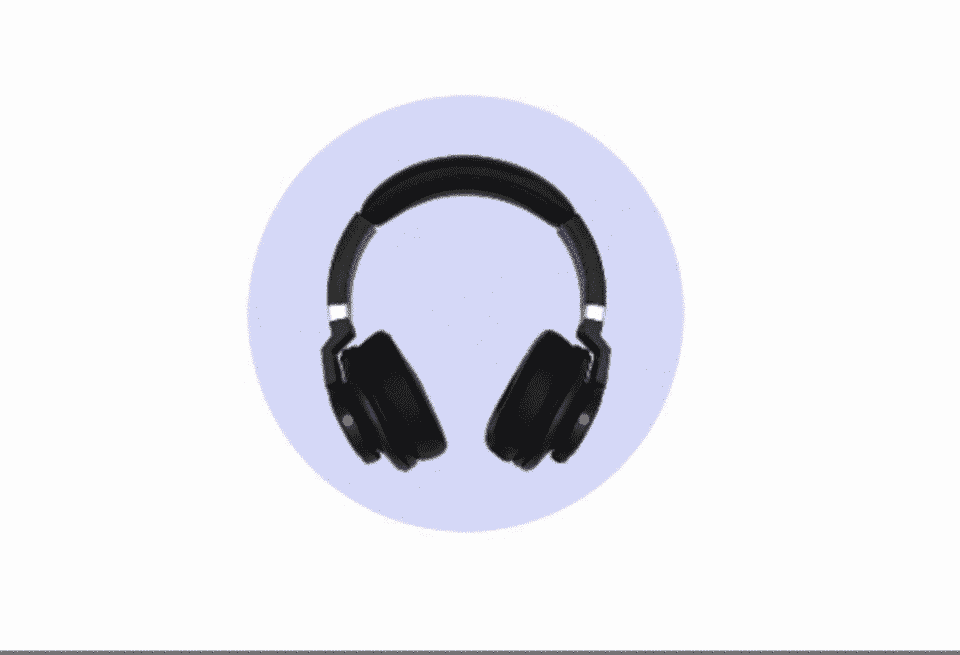
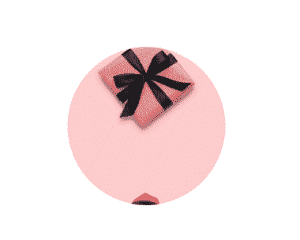
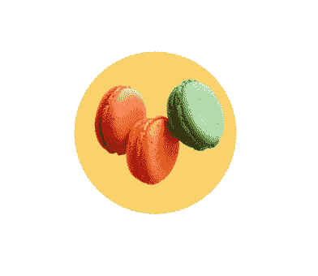

# CAAnimation 如何帮助我克服创作动画的恐惧

> 原文：<https://www.freecodecamp.org/news/how-ca-animation-conquered-my-fear-of-animations/>

本文重点介绍在 iOS 中使用 CA 动画制作流畅的动画。

在我使用 iOS 的最初几天，每当有设计师走过来，要求在他们正在开发的应用程序中添加一些动画时，我都会非常紧张。



Craaaaap

我曾经认为设计动画很容易，但是从另一方面来说，实现它是一项非常困难的任务。

我将从 Google、StackOverflow 和我的同行那里获得实现的帮助。在这个过程中，我产生了对动画的恐惧，总是试图避开它们。但是有一天一切都变了。

## 寻找动画

有一次，我必须在一个视图中制作一系列图像的动画。那么我的第一步是什么？很明显，StackOverflow！

第一个链接得到了代码。

```
let image_1 = UIImage(named: "image-1")!
let image_2 = UIImage(named: "image-2")!
let image_3 = UIImage(named: "image-3")!
let images = [image_1, image_2, image_3]
let animatedImage = UIImage.animatedImage(with: images, duration: 2.0)
imageView.image = animatedImage
```



看起来很简单，对吗？如果事情这么简单，我就不会写这篇文章了。

这是需要的动画:



End Goal

很明显，我离它很远。我被卡住了。我怎么能在那个动画中做这么多的定制并同步它们呢？

然后同事让我试试 [CAAnimation](https://developer.apple.com/documentation/quartzcore/caanimation) 。我读到了它，并在一个示例项目中尝试了它。令我惊讶的是，它真的很强大，很容易使用。

## 什么是核心动画？

核心动画帮助您执行多个动画，几乎不占用 CPU。它给了你很高的帧速率和许多定制，你可以用很少的代码来使用。

你可以在这里的文件中找到更多细节:[https://developer.apple.com/documentation/quartzcore](https://developer.apple.com/documentation/quartzcore)

我能够在几个小时内完成一个基本的实现:

```
func addAnimation(firstImageView: UIImageView, secondImageView: UIImageView) {
        let basicAnimation1 = getBasicAnimation(withInitialPostion: centerPosition, finalPos: finalPosition)
        firstImageView.layer.add(basicAnimation1, forKey: "position")        
        let basicAnimation2 = self.getBasicAnimation(withInitialPostion: self.initalPosition, finalPos: self.centerPosition)
        secondImageView.layer.add(basicAnimation2, forKey: "position")
        self.addNextImage(forImageView: firstImageView)
    }
    func getBasicAnimation(withInitialPostion initialPos: CGPoint, finalPos: CGPoint) -> CABasicAnimation {
        let basicAnimation = CABasicAnimation(keyPath: "position")
        basicAnimation.fromValue = NSValue(cgPoint: initialPos)
        basicAnimation.toValue = NSValue(cgPoint: finalPos)
        basicAnimation.duration = 1
        basicAnimation.isRemovedOnCompletion = false
        basicAnimation.fillMode = CAMediaTimingFillMode.forwards
        basicAnimation.timingFunction = CAMediaTimingFunction(name: CAMediaTimingFunctionName.easeInEaseOut)
        return basicAnimation
    }
```



CA Basic Animation

对于这个实现，我使用了**cabasicamation**。

类帮助你在两个值之间动画化一个层属性(可以是背景颜色，不透明度，位置，比例)。你只需要给出一个开始和结束的值，剩下的就交给你了。动画在下一个运行循环中立即开始，更详细的描述见这里的。

### 现在，回到我们的问题。

为了实现这一点，我采用了两个图像视图，并向它们添加了两个独立的图像。然后我继续用 CAAnimation 一个接一个地制作它们的动画。

你可以在这里找到源代码[。](https://gist.github.com/agammahajan1/e9b550f0275418459982246d1ee905d5)

如果你检查最后一张 gif，你会发现有什么不对劲。在礼品盒的第一个图像消失之前，耳机短暂闪烁，然后图像上移。

为什么会这样？

这是因为一旦我们将动画添加到图像视图中，我们就将下一个图像添加到该视图中(第 5 和第 6 行):

```
private func addAnimation(firstImageView: UIImageView, secondImageView: UIImageView) {
    let basicAnimation1 = getBasicAnimation(withInitialPostion: centerPosition, finalPos: finalPosition)
    firstImageView.layer.add(basicAnimation1, forKey: "position")    
    let basicAnimation2 = self.getBasicAnimation(withInitialPostion: self.initalPosition, finalPos: self.centerPosition)
    secondImageView.layer.add(basicAnimation2, forKey: "position")
    self.addNextImage(forImageView: firstImageView)
}
```

在这里，我们正在努力解决如何在动画中同步两个图像的问题。但是 CAAnimation 总有解决的办法。

### CA 交易

CA 事务帮助我们同步多个动画。它确保所有我们捆绑在一起的动画都在同一时间开始。

另外，你可以给你的动画一个完成块，当一个包中的所有动画都完成时，这个块就会被执行。

你可以在这里了解更多[。](https://developer.apple.com/documentation/quartzcore/catransaction)

```
private func addAnimation(firstImageView: UIImageView, secondImageView: UIImageView) {
    CATransaction.begin()
    CATransaction.setCompletionBlock {
        self.addNextImage(forImageView: firstImageView)
    }
    let basicAnimation1 = getBasicAnimation(withInitialPostion: centerPosition, finalPos: finalPosition)
    firstImageView.layer.add(basicAnimation1, forKey: "position")
    CATransaction.commit()

    let basicAnimation2 = self.getBasicAnimation(withInitialPostion: self.initalPosition, finalPos: self.centerPosition)
    secondImageView.layer.add(basicAnimation2, forKey: "position")
}
```

你从写`CATransaction.begin()`开始。然后，写下所有你想同步的动画。最后，调用`CATransaction.commit()`，它将启动块中的动画。

让我们看看现在我们的动画是什么样子的:



CA Transaction

我需要做的最后一件事是给动画添加弹簧效果。幸运的是，CAAnimation 也有一个解决方案。

### CA Spring 动画

> 当 CA Spring 动画被添加到一个层中时，会给它一个类似弹簧的效果，使它看起来像被弹簧拉向一个目标。
> 
> 层离目标越远，朝向它的加速度越大。
> 
> 它允许控制基于物理的属性，如弹簧的阻尼和刚度。–[文件](https://developer.apple.com/documentation/quartzcore/caspringanimation)

你可以从苹果文档中了解更多:[https://developer . Apple . com/documentation/quartz core/caspringanmation](https://developer.apple.com/documentation/quartzcore/caspringanimation)

让我们将其实现到我们现有的代码中:

```
private func getSpringAnimation(withInitialPostion initialPos: CGPoint, finalPos: CGPoint) -> CASpringAnimation {
    let basicAnimation = CASpringAnimation(keyPath: "position")
    basicAnimation.fromValue = NSValue(cgPoint: initialPos)
    basicAnimation.toValue = NSValue(cgPoint: finalPos)
    basicAnimation.duration = basicAnimation.settlingDuration
    basicAnimation.damping = 14
    basicAnimation.initialVelocity = 5
    basicAnimation.isRemovedOnCompletion = false
    basicAnimation.fillMode = CAMediaTimingFillMode.forwards
    return basicAnimation
}
```



Voila

我的工作已经完成了。

总之，以下是使用 CA 动画的一些优点:

*   它们易于使用和实施
*   有许多自定义可用
*   可以同步多个动画
*   几乎零 CPU 使用率

这些只是其中的几个优点。可能性是无限的。

现在，每当需要制作动画时，我都有信心设计和实现它们。我希望你读完这篇文章后也有同感。请随意留下任何建议或反馈。