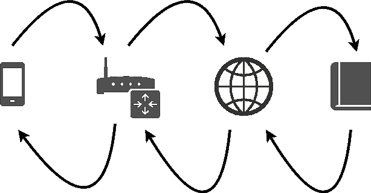

# 你的手机如何打开 medium.com——我会让门卫和图书管理员来解释。

> 原文：<https://www.freecodecamp.org/news/how-can-your-phone-open-medium-com-62ec36b1429f/>

安德里亚·赞恩

# 你的手机如何打开 medium.com——我会让门卫和图书管理员来解释。

嘿，你注意到刚才发生了什么吗？你点击了一个链接，现在你正在阅读这篇文章。但是你有没有想过你的浏览器是怎么知道你点击的链接指的是这篇文章，这篇文章包含了这些文字？

这是一件如此普通的事情，以至于我们忘记了它，但它背后的机制却很迷人。在本文中，我们将使用真实世界的类比来探索它。

### 电脑如何交流

当您打开一个网站时，您的浏览器会向世界上某个地方的其他计算机请求数据，以便向您显示该页面(例如，您正在阅读的文本)。

这种询问另一台计算机的行为与向朋友发送一封邮件(物理邮件，而不是电子邮件)并等待他的回复没有什么不同。

如果约翰想给布里特妮寄些邮件，他需要知道她的地址。在互联网世界里，我们有 IP 地址，而不是物理地址。他们的工作方式是一样的，只是用电脑代替了邮箱。

### 再给我讲讲这个 IP 的事情

在我们深入 IP 地址的细节之前，我想让你想象一下，你住在一个豪华的酒店里，有数百个房间和一个漂亮的门卫(不错吧？).

现在回到 IP 地址:你的标准 IP 地址是这样的:102.134.122.234。前 9 个数字是你入住的虚拟酒店的地址，后 3 个数字是你的房间。虽然虚拟酒店的地址是固定的，但你住的房间是由酒店选择的。

如果有人想给你发信息，他们需要知道酒店的地址和你的房间号。所以他们把信息送到酒店，然后门卫直接把它送到你面前。

虚拟酒店就像你家的 WiFi 网络。它的地址是由您的互联网提供商决定的，而您的房间号是由您的家用路由器决定的。

### 数字很复杂

你可能已经注意到，如果你想打开 medium.com，你不需要知道它的 IP 地址。这就是互联网变得比邮政服务更聪明的地方。

除了 IP 地址之外，还有一个将容易记忆的名称与 IP 地址相匹配的系统:域名系统。

最后，当你的手机想打开 medium.com 时会发生什么

*   电话将请求发送给门卫(路由器),并要求其将请求发送到 medium.com
*   路由器向可信机构(您的互联网提供商)询问 medium.com 的 IP 地址
*   然后，这个受信任的机构指的是一个认可顶级域名的全球组织(根服务器)。com，。我们，。组织，…)
*   根服务器然后询问负责该 TLD 的数字图书馆员
*   最后，图书管理员打开他的主记录，查找我们请求的网站，并以 IP 作为响应

最后，你的手机可以直接发送请求到媒体的地址(IP)。所有这一切都发生在不到十分之一秒的时间里。

### 我们会没有地址吗？

是的，我们将很快用完 IP 地址。但是不要惊慌，一个解决方案已经在实施了。

首先，我们必须后退一步:到目前为止，我一直在谈论 IP 地址，但我应该说 IP 版本 4。解决方案是 IP 版本 6，看起来更丑:2001:0db 8:0000:0042:0000:8a2e:0370:7334

这个字母数字怪物导致了天文数字数量的可能 IP，那么问题解决了吗？？。

### 在你离开之前

在这篇文章中，我们分析了你的手机如何理解 medium.com，但是链接的 HTTPS 部分呢？我又写了一篇关于它的文章:[用信鸽解释的 https】。](https://medium.freecodecamp.org/https-explained-with-carrier-pigeons-7029d2193351)

如果你喜欢这篇文章，别忘了你可以？多达 50 次。