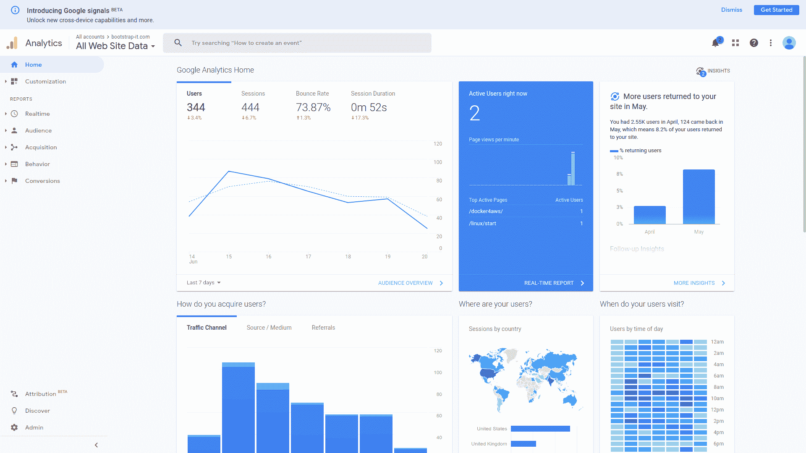

# 公司如何获取您的数据，以及他们可以用这些数据做什么

> 原文：<https://www.freecodecamp.org/news/how-companies-get-your-data/>

好奇在互联网上的一天中，你可能会暴露哪些个人甚至私人数据？用“各种”作为起点怎么样？

这里，改编自我的新书*[Keeping Up:backgrounds to all the big technology trends you can ' t ignore](https://www.amazon.com/Keeping-Up-backgrounders-technology-trends/dp/B08HGLPZMP)*，是一种按平台分解问题的范围和性质的方法。

## 金融交易

花点时间想象一下一个简单的网上信用卡购物包含了什么。您可能使用您的电子邮件地址作为帐户标识符和唯一的密码(希望如此)登录了该商家的网站。浏览了几个页面后，您可以将一个或多个商品添加到网站的虚拟购物车中。

当你得到你需要的一切，你将开始结帐过程，输入送货信息，包括街道地址和你的电话号码。你也可以输入商家发给你的积分卡的账号和你在营销邮件中收到的优惠券代码。

当然，关键的一步是输入你的支付信息。对于信用卡，这可能包括持卡人的姓名和地址、卡号、有效期和安全码。

假设商家的基础设施符合用于处理金融信息的支付卡行业数据安全标准(PCI-DSS)协议，那么这些信息被犯罪分子窃取和出售的可能性相对较小。但无论哪种方式，它仍将存在于商家自己的数据库中。

为了使这一切更加具体，要明白使用你的积分卡账户和优惠券代码可以传达很多关于你的购物和生活方式偏好的信息。更别提你之前的一些活动记录了。您的网站帐户带有联系信息和您的家庭位置。

至少在理论上，所有这些信息都可以被整合在一起，形成一个关于你作为消费者和公民的强有力的形象。

‌‌It's:由于这些原因，我个人更喜欢使用第三方电子商务支付系统，如 PayPal，因为这种交易不会在商家自己的数据库中留下我具体支付方式的记录。

## 设备

现代操作系统从头开始构建，以多种方式连接到互联网。他们通常会自动查询在线软件库以获取补丁和更新，并在出现问题时“请求”远程帮助。

一些性能诊断数据被在线发送和存储，这些数据有助于统计分析或错误诊断和修复。单个软件包可能独立于操作系统连接到远程服务器，以完成自己的工作。

一切都很好。除了你可能很难确定你的设备和互联网之间来往的所有数据是否是你可以分享的东西。

你能知道私人文件和个人信息没有和其他数据一起被清除吗？您确信您的任何数据都不会意外地进入您无法控制的意外应用程序中吗？

为了说明这个问题，我会向你推荐由数字助理驱动的设备，如亚马逊的 Alexa 和谷歌助理(“OK Google”)。根据定义，数字助理使用的麦克风会不断监听他们的关键词(“Alexa……”)，任何人在设备范围内说的任何话都会被记录下来。

至少其中一些对话还被记录并储存在网上，事实证明，其中一些最终被为供应商工作的人听到了。至少在一个案例中，无意中录下的对话被用来给谋杀嫌疑犯定罪(并不是说我们反对给杀人犯定罪)。

亚马逊、谷歌和这一领域的其他公司都意识到了这个问题，并正在努力解决这个问题。但是他们不太可能完全解决这个问题。请记住，便利、安全和隐私不能很好地结合在一起。

现在，如果你认为来自电脑和平板电脑的可以被追踪和记录的信息令人毛骨悚然，那就等着听恒温器和灯泡吧。

随着越来越多的家用电器和工具成为“智能家居”系统的一部分，越来越多的性能数据流将随之产生。

而且，正如已经在多个现实世界的应用程序中所展示的那样，所有这些数据都可以通过编程来解释，以揭示关于家中正在发生什么以及谁在做什么的重要信息。‌‌

## 移动设备

你有没有在旅途中停下来，拿出你的智能手机，在电子地图上查找方向？你当然有。

嗯，地图应用程序正在使用您当前的位置信息，并向您发送有价值的信息，但与此同时，您也发回了一些同样有价值的信息。那会是什么样的信息？

我曾经读到过德国一个淘气的家伙，他借了几十部智能手机，放在一辆儿童手推车上，然后慢慢地把手推车拉到一条空荡荡的城市街道中间。没过多久，谷歌地图就报告了一次严重的交通堵塞，而实际上并没有。

谷歌地图应用程序怎么会比你更了解你当地的交通状况呢？为他们的系统提供信息的一类重要数据是通过持续监控他们能接触到的每一部活跃的安卓手机(包括你的安卓手机)的位置、速度和移动方向获得的。

就我个人而言，我很欣赏这项服务，我不太介意我的数据被使用的方式。但我也意识到，有一天，这些数据可能会以与我的利益严重冲突的方式被使用。称之为计算风险。

当然，谷歌和苹果这两个最流行的移动操作系统的创造者得到的不仅仅是基于 GPS 的移动信息。他们与其他一些行业参与者一起，也在处理我们所有搜索引擎活动的记录，以及运动和健康监测应用程序返回的数据。

换句话说，如果他们决定这样做，许多科技公司可以毫不费力地编写描述我们精确运动、计划和健康状况的档案。从那以后，想象这些数据的所有者预测我们在未来几周和几个月可能会做什么并不是一个巨大的飞跃。

## 网络浏览器

我们大多数人使用网络浏览器进行日常的互联网互动。总的来说，网络浏览器是相当神奇的创造。他们经常充当一个强大得不可思议的礼宾员，给我们带来人类所有的财富，甚至不费吹灰之力。

但是，我相信你已经预料到了，所有的权力都是有代价的。

为了体验一下你的浏览器自由分享的关于你的信息，看看下图所示的谷歌分析页面。

‌‌This 仪表盘显示了一个直观的摘要，描述了过去七天里我自己的[bootstrap-it.com 站点](https://bootstrap-it.com/)的所有访问。从收集的数据中，我可以看到:

*   我的访客来自世界的哪个角落
*   当白天他们倾向于访问
*   他们在我的网站上花了多长时间
*   他们访问了哪些页面
*   他们在来我的网站之前离开了哪个网站
*   有多少游客会再次光顾
*   他们运行的是什么操作系统
*   他们使用的是何种设备外形规格(即台式机、智能手机或平板电脑)
*   他们所属的人口群组(性别、年龄组、收入组)

除此之外，web 服务器自己的日志可以报告详细信息，特别是与每个访问者相关的具体 IP 地址和精确时间。

这意味着，无论何时你的浏览器连接到我的网站(或任何其他网站)，它都会给我的网络服务器提供大量的信息。谷歌只是把它收集起来，以一种花哨、容易消化的格式呈现给我。

顺便说一句，我充分意识到，让谷歌收集我网站用户的所有信息，我也是问题的一部分。我郑重声明，我确实对此感到有点内疚。

此外，网络服务器能够实时“观察”你在做什么，并“记住”你上次访问时做了什么。

解释一下，你有没有注意到在一些网站上，就在你点击离开页面之前，一个“等等！走之前！”弹出消息？服务器可以跟踪你的鼠标移动，当他们“太接近”关闭标签或移动到不同的标签时，他们会显示弹出窗口。

类似地，许多网站会在你的电脑上保存名为“cookies”的小数据包这种 cookie 可能包含会话信息，这些信息可能包括购物车中以前的内容，甚至是您的身份验证状态。目标是在多次访问中提供方便和一致的体验。但是这些工具可能会被滥用。

最后，像操作系统一样，浏览器也会与提供它们的厂商进行无声的交流。获得使用反馈可以帮助提供商了解最新的安全和性能问题。但是独立的测试表明，在许多情况下，更多的数据被“带回家”,这似乎是不恰当的。

## 网站互动

尽管我在我的“保持”一书中更深入地讨论了这个问题，但我应该在这里强调至少几个特别相关的问题。比如，网站喜欢让你注册额外的增值服务。

他们将向您发送的简讯和产品更新可能是完全合法的，并且确实提供了巨大的价值。但他们还是会来交换你的一些私人联系信息。只要你意识到这一点，我已经完成了我的工作。

一个很好的例子就是你贡献给社交媒体平台的数据，比如 Twitter、脸书和 LinkedIn。你可能认为你只是在与你的关系和追随者交流，但实际上远不止如此。

以一个神奇而可怕的软件 Recon-ng 为例，它被网络安全专家用来测试一个组织的数字漏洞。一旦您为其配置了有关您的组织的一些基本信息，Recon-ng 就会前往互联网，搜索任何可用于穿透您的防御或对您造成伤害的公开信息。

例如，你确定外人不可能对你的开发人员工作的软件环境有足够的了解而对你造成任何伤害吗？或许你应该看看你在 LinkedIn 上发布的一些招聘广告中的“所需资格”部分。或者您的开发人员可能在 Stack Overflow 站点上发布的问题(或答案)呢？

每一篇文章都讲述了一个故事，而且不缺少爱读故事的聪明人。

像 Recon-ng 这样的软件可以帮助你识别潜在的威胁。但这只是强调了你有责任首先避免公开你的数据。

底线呢？微笑。你被监视了。

在我的[Keeping](https://www.amazon.com/Keeping-Up-backgrounders-technology-trends/dp/B08HGLPZMP)一书中，有更多快速、有趣、可访问的技术背景知识。看一看。