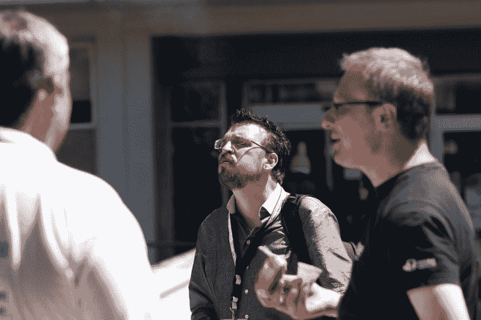

# 会议发言人如何获得报酬

> 原文：<https://www.freecodecamp.org/news/how-conference-speakers-get-compensated-93b49fd370f1/>

空白

# 会议发言人如何获得报酬

在处理最近一系列关于为活动补偿演讲者的电子邮件时，我意识到更多的人应该知道演讲者补偿是如何处理的，特别是如果你想组织一场活动。

也就是说，这是一个相当敏感的话题，所以我会尽量轻描淡写。我将主要谈论典型的非公司软件会议。我还在欧洲和美国的私人/企业活动上发表演讲，这是另一回事。

*Me after giving a talk in Lisbon, Portugal. The cocky air was probably unintentional. [Photo by Rafael Garcia-Suarez](https://www.flickr.com/photos/rgarciasuarez74/3794820418)*

### **不同类型的扬声器**

在一次会议上，与会者分为几组，但我将只介绍常规发言人和特邀发言人。

常规发言人通常是在会议上提交演讲并被接受的人。虽然补偿各不相同，但唯一的标准是免除出席费。其他形式的补偿可能是演讲者的晚餐，“仅限演讲者”的赠品，或者其他额外津贴，比如你在 OSCON 看到的专业摄影师的作品。

一个固定的演讲者*可能*已经定了一个教程，那些人通常会得到部分(或全部)教程费用，而*可能*会支付他们的旅行和酒店费用。这一点似乎更“命中或错过”取决于会议。话虽如此，[我公司的培训课程](https://allaroundtheworld.fr/training)通常是在企业环境中进行的，我对会议培训没什么好说的。

然后，你有邀请，或“客人”发言人。这些是会议用来推销自己的演讲者。会议不仅提供了一系列有趣的话题和一个与你所在领域的其他人交流的机会，像查尔斯·斯特罗斯这样强大的演讲嘉宾也很有吸引力。或者如果你看过[达米安·康威](http://www.oscon.com/oscon2014/public/schedule/speaker/4710)的演讲，你*就知道*为什么人们想去看他。我也很幸运地成为会议的主题发言人。

### **演讲嘉宾**

如上所述，我经常被邀请在会议上发言，比如在保加利亚的一次会议上做第一天的主题演讲。我当然没有达米安·康威(Damian Conway)或查尔斯·斯特罗斯(Charles Stross)那样的魅力(尽管我上次在美国 OSCON 的演讲得到了 [5 颗星的评价，我还不算太差)，但尽管如此，我还是做了一些主题演讲，或者被邀请成为“特邀嘉宾”当你被邀请参加一个会议时，事情就会发生一些变化。](http://www.oscon.com/oscon2014/public/schedule/detail/33557)

如果我参加所有被邀请的活动，我很难见到我的家人，我的生意也会受到影响；我*不可能*参加所有我被邀请的活动。Rachel Nabors 在最近的播客中讨论了[演讲如何帮助或伤害你的业务](http://ladiesintech.com/podcast-rachel-nabors/)，她表示，她参加的每个会议平均会损失 3000 美元。我发现，如果你把一次伟大演讲的所有准备时间和我将离开的天数都算进去，这个数字实际上是偏低的(我的旅行特别痛苦，因为我住在法国西南海岸的一个小镇上，没有机场)。

至于我自己，我经常在 Perl 活动上发言，在前面提到的电子邮件主题中，有人声称，除了几个例外，受邀参加非公司软件会议的演讲者不会因为这些活动而获得报酬。这是一个误解。受邀参加上述活动的演讲者通常不收取*演讲费*。

顶级演说家可以赚很多钱，但对于这些会议来说，就没那么多了。需要澄清的是:**我从未为 Perl 活动**索要演讲费。Perl 社区给了我很多，我试图回报他们。我在那里有很多朋友，这也很有帮助。如果一个 Perl 事件想*给*我一笔演讲费，并且我认为这不会伤害他们，我会接受，但是我从来没有把这作为我演讲的先决条件。

当我在其他会议/活动上发言时，我会根据具体情况做出决定。对于一个快速的鼓舞人心的讲话或对我以前讲过的话的一个新的看法，这是相当容易的。如果我被要求为一个特定的事件写一些特别的东西，那会改变整个游戏计划。

不做公开演讲的人通常不知道这有多费力。如果我要做一个关于战略敏捷商业实践、设计 OO 系统、或数据库设计、甚至是“如何移居国外”的演讲，其中涉及到大量的研究，如果我做得不好，听众会把我生吞活剥。当我做对了之后，我必须让它变得既有趣又有趣。哦，把它放在任何有空的时间段。这是一项艰巨的工作，即使我只是做一个激励性的演讲。

然而，如前所述，除非我决定要做一名全职演说家，否则在我开始损害我的业务之前，我只能参加这么多的活动(如前所述，这不仅仅是收入损失)。这就是为什么当我被邀请参加会议时，我会要求旅行和住宿来抵消成本。当我说“住宿”时，我很乐意睡在别人的空房间里。我很清楚许多会议都是在预算紧张的情况下进行的，我也不想打破预算。

相反，我将这些活动视为营销，无论我产生什么样的成本，我的公司都会按此进行预算。营销的好处超过了会议本身的成本，只要你对参加的会议保持谨慎。

### **给会议组织者的一些建议**

一个聪明的会议会自己安排演讲者的航班和酒店，而不是让演讲者自己决定。是的，提前安排所有这些对你来说是更多的工作，但有少数发言者伤害了四星级酒店和商务舱航班的会议，其费用是会议没有预料到的。

演讲者可能甚至没有意识到他们正在引起一个问题，但尽管如此，它确实发生了，并能决定会议是否能覆盖他们所有的债务。对于私人活动，我们已经基本上停止了将机票和酒店分开计费(除非被要求),因为很多企业也受到了影响。

同样有趣的是，有很多人要求进行新的会谈。对于新的会谈，我们不会在最后一刻匆匆拼凑一张幻灯片。我们花了大量的时间写材料、练习、掌握时间、剪辑幻灯片、写新的幻灯片、当我们意识到必须删掉我们最喜欢的笑话时咒骂等等。观看我在基辅发表的关于敏捷公司的演讲，你会感觉到其中包含了多少工作。

即使演讲者已经讲过一次，也没有人会讲第二次:我们对听众做出反应，更新我们的材料，在演讲中强调不同的观点。即使这个演讲已经被上传到网上，也很少有人会从头到尾看完。因此，如果你邀请我们，但你付不起我们的工资，这通常是可以的，但要知道，从中获得一个全新的谈话是一个额外的奖励。

### **总之**

对于大多数会议来说，大多数发言人只得到会议费用的免除和一些特殊的赠品。对于规模较小的非营利会议，特邀演讲人通常没有报酬，但他们的差旅费和住宿费通常会包括在内。对于大型会议和企业活动，特邀演讲人通常会收取演讲费，具体数额因活动和演讲人而异。

较小的会议通常只向少数名人提供演讲费，因为这是会议通常能负担的全部费用。提供辅导的人通常会得到部分辅导费作为补偿(OSCON 只提供区区 500 美元的酬金)。

在这些会议上，一些知名人士不收取演讲费，但一些人的需求如此之高，以至于他们需要这些费用来抵消其主营业务的损失。

[*这是一篇来自 LinkedIn 热门帖子*](https://www.linkedin.com/pulse/20140731092421-4973136-how-do-conference-speakers-get-compensated) *的更新。*

Curtis "Ovid" Poe 经常在欧洲和美国的公共和私人活动中担任演讲嘉宾。如果您想让他在活动中发言，请发送电子邮件至 allaroundtheworld dot fr 询问信息。