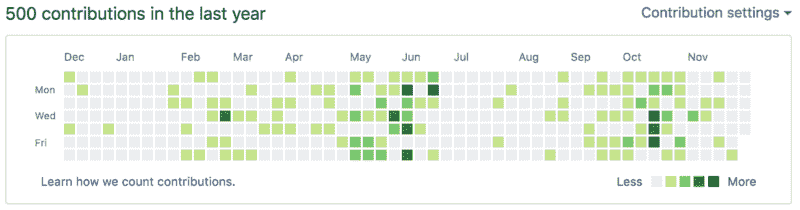
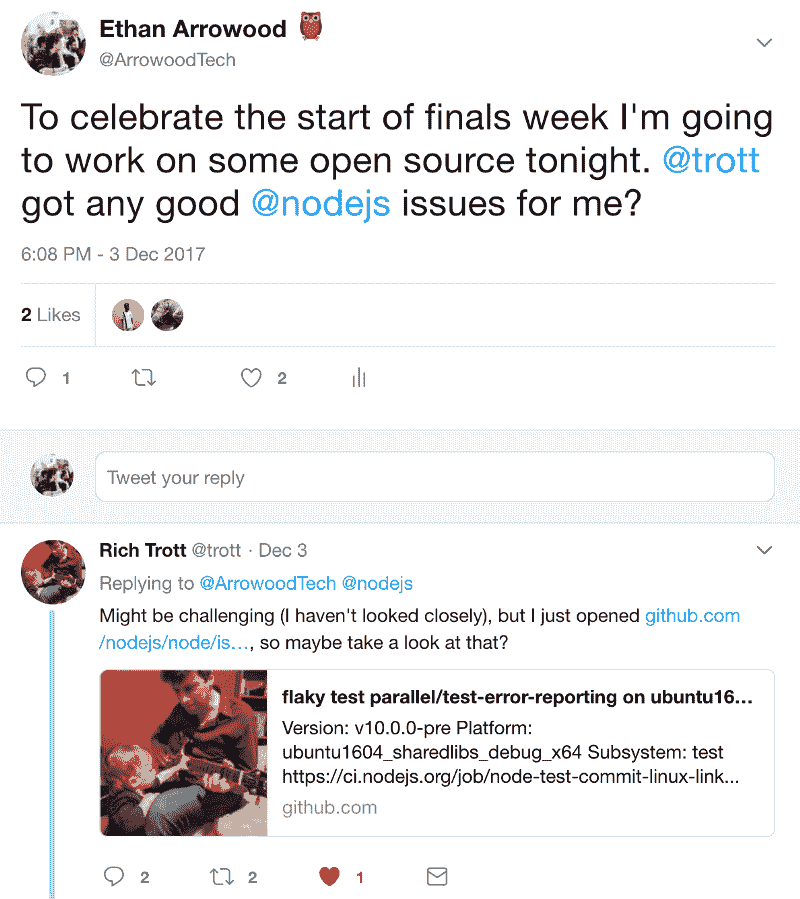
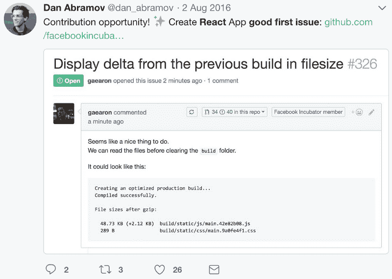
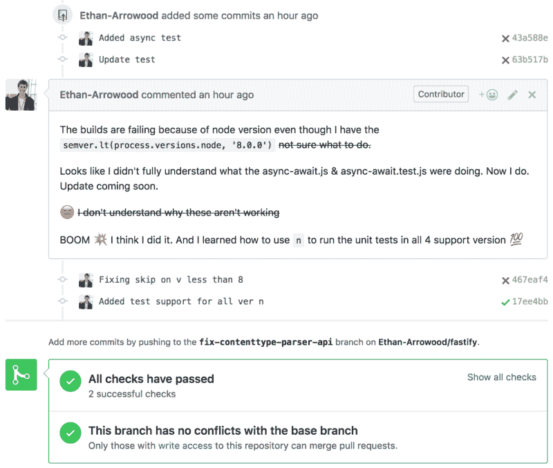

# 为开源做贡献帮助我在微软找到了一份实习工作。这就是它如何帮助你的。

> 原文：<https://www.freecodecamp.org/news/how-contributing-to-open-source-can-help-you-achieve-a-software-engineering-internship-5c13841452cd/>

> “通过实现导致 z 的 Y 来完成 X”.
> —《破解编码访谈》的作者盖尔·拉克曼·麦克道尔

当我在去年秋天面试软件工程实习时，我的开源贡献帮助我脱颖而出。

Me (Ethan Arrowood) attending a presentation hosted by [Accelerate Innovation & Entrepreneurship Center](http://blogs.wit.edu/accelerate/)

#### 我是谁？

我是马萨诸塞州波士顿市温特沃斯理工学院的二年级学生，主修计算机科学，辅修应用数学和商业管理。

我主要的编程语言是 JavaScript (Node.js & React.js)和 Java。我还熟悉 Python、R、SQL、NoSQL、MySQL、Firebase、HarperDB 和 MongoDB。

### 技术面试

你可以找到[所以](https://medium.com/@nickciubotariu/ace-the-coding-interview-every-time-d169ce1fd3fc) [很多](https://www.cio.com/article/2383000/careers-staffing/careers-staffing-how-to-prepare-for-and-ace-the-technical-interview.html) [资源](http://www.crackingthecodinginterview.com/) [关于](https://www.forbes.com/sites/quora/2016/04/15/what-are-the-best-ways-to-prepare-for-a-technical-interview/#425e778147d4) [如何](https://www.themuse.com/advice/how-to-prep-for-your-technical-interview-advice-from-a-hiring-manager) [准备](https://www.quora.com/How-do-I-prepare-for-a-software-engineering-job-interview)[准备](http://codingbat.com/java)[技术](https://hackernoon.com/10-technical-interview-tips-67bf962efaa0) [面试](https://hackernoon.com/technical-interviewing-for-people-who-suck-at-algorithms-96178d389a83)。所有这些都会告诉你去研究你的数据结构和算法，并且绝对不要忘记那个可爱的大 O 符号。有些文章还会告诉你要有副业，放在一个很棒的虚拟作品集里。我想和你分享另一件让你脱颖而出的事情，那就是**为开源项目做贡献**。

### 为开源做贡献

A snapshot of my GitHub contributions this past year*

我的许多采访都是从讨论我对 freeCodeCamp 课程和指南项目的贡献以及一些更高级别的 Git 概念开始的，比如处理合并冲突、精选提交以及在挤压期间管理提交历史。

加入 freeCodeCamp 开源社区极其容易。这里有非常活跃的 [Gitter 聊天室](https://gitter.im/FreeCodeCamp/Contributors)和大量正在开发的[令人兴奋的](https://github.com/freeCodeCamp/freeCodeCamp) [项目](https://github.com/freeCodeCamp/guides)。如果你正在寻找一个简单的开源开发入门，加入 Gitter 聊天室，你甚至可以在那里看到我！

另一个流行的采访话题是我的开源项目。我的第一个 NPM 模块， [harperdb-nodejs-driver](https://www.npmjs.com/package/harperdb-nodejs-driver) ，是一个非常常见的讨论话题。通过开发，我学到了很多东西，比如单元测试、代码覆盖、部署脚本、分支管理和自动构建。它仍然需要一些工作，但它向我介绍了许多利基开源开发实践。

最后，在几乎每一次采访中，我都被问到对 React.js、Node.js 和 Fastify 项目的贡献。为更大的项目做贡献可能是困难的，但也不是不可能的，事实上，当新的贡献者想要为他们的项目做贡献时，很多开发人员都很喜欢！下面，我已经分解了我是如何参与这三个项目的。

#### 节点. js

我对 Node.js 项目的第一次贡献是在 2016 年 10 月，当时我参加了在德克萨斯州奥斯汀举行的 Node.js 交互式北美会议 Node.js Code & Learn。我只是一名一年级学生，我的大学帮助支付了部分旅费。这次会议是一次令人难以置信的经历，以至于我今年在加拿大温哥华又参加了一次。我在 Node.js 项目上有多个合并的 pull 请求，大部分来自 Code & Learn 事件。最近，我一直在尝试拓展和寻找其他开放的问题。

A Twitter screenshot of me reaching out for open Node.js issues. Shoutout to the incredible [Rich Trott](https://twitter.com/trott)!

#### React.js

React.js 是我最喜欢的框架。学习起来很有趣，用它来构建应用程序更有趣。更重要的是，React 社区是我参与过的最好的社区之一。我最大的开发人员榜样之一， [Dan Abramov](https://twitter.com/dan_abramov) ，在 React.js 开源社区中非常活跃，我有机会与他在多个问题上直接合作。

我已经能够通过做以下两件事来发现未解决的 React 问题:

1.  跟踪 React 存储库并查看每个打开的问题。如果我认为这是我能处理的事情，我会问我是否能处理它，并在开始之前看看我是否应该有任何其他好的信息。
2.  我在 Twitter 上关注尽可能多的 React 贡献者，关注新的、令人兴奋的项目以及任何公开的问题。有时丹会发布“好的第一期”推文！

Good First Issue tweet by [Dan Abramov](https://twitter.com/dan_abramov/status/760464663071121408)

其他一些令人敬畏的 React 开发人员包括:

[索菲·阿尔珀特](https://twitter.com/sophiebits) [瑞安·弗洛伦斯](https://twitter.com/ryanflorence) [塞巴斯蒂安·马克贝奇](https://twitter.com/sebmarkbage) [布莱恩·沃恩](https://twitter.com/brian_d_vaughn)
[安德鲁·克拉克](https://twitter.com/acdlite) [迈克尔·杰克逊](https://twitter.com/mjackson) [卡西迪·威廉姆斯](https://twitter.com/cassidoo) [肯特·多兹](https://twitter.com/kentcdodds)

也可以看看这个由丹自己整理的清单。

还有许多令人难以置信的 React 项目，包括 React Router、Redux、React Native、React VR 和 Create React App。

#### Fastify

Fastify 是一个用于 Node.js 的快速、低开销的 web 框架。它的灵感来自于 Express 和哈比神等项目。由[托马斯·德拉·维多瓦](https://twitter.com/delvedor)和[马特奥·科里纳](https://twitter.com/matteocollina)创作。在 2017 年 Node.js Interactive 北美会议期间，我被介绍给了这个项目，在那里我遇到了 Matteo。马特奥鼓励我一头扎进这个项目。他还分享了一些贡献和学习新事物的惊人技巧:

*   不要害怕失败
    有时候你会把事情做错，或者你根本不具备完成一件事情的技能。这是完全没问题的，许多项目维护人员会在那里支持你，给你指路。
*   **你学习新事物的唯一途径是走出去**
    当我第一次为 Fastify 做贡献时，我对后端服务器知之甚少。从那个项目的工作中，我增加了许多新技能，并且对后端生态系统有了更好的理解。

Seriously. Don’t be afraid of making mistakes. They happen all the time and you will learn from them!

### 结论和带走

面试是一次令人兴奋的经历，对每个人来说都是不同的。开源软件是一个不断发展的社区，“GitHub 接触了 2400 万开发人员，他们在 6700 万个存储库中工作”( [GitHub](https://octoverse.github.com/) )。

尽可能利用你的技能和经验。不要怕[犯错](https://twitter.com/ArrowoodTech/status/938924445422546944)(写这篇文章中途我犯了一个！)，并确保[向他们](https://github.com/facebook/react/pull/11652#issuecomment-350139060)学习。即使开源世界可能看起来很可怕，勇敢一点，记住还有其他开发者支持你！

*我的贡献图在 7 月和 8 月比较稀疏，因为夏天我是一名夏令营辅导员，没有花太多时间(如果有的话)在笔记本电脑上。我会鼓励每个人每隔一段时间抽时间休息一下，我保证这不会影响你的进步，而且会让你感觉精神焕发！

如果您有任何问题，请随时联系 Twitter。

你也可以在 [GitHub](https://github.com/ethan-arrowood) 上找到我，并查看我的[网站](https://ethanarrowood.com/)？

快乐编码？祝你自己的面试好运！？