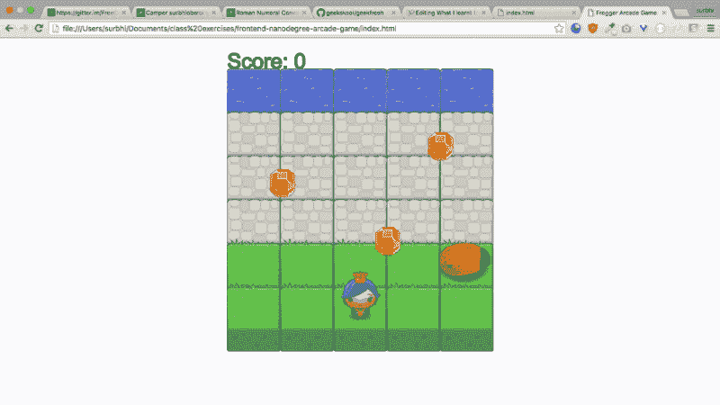
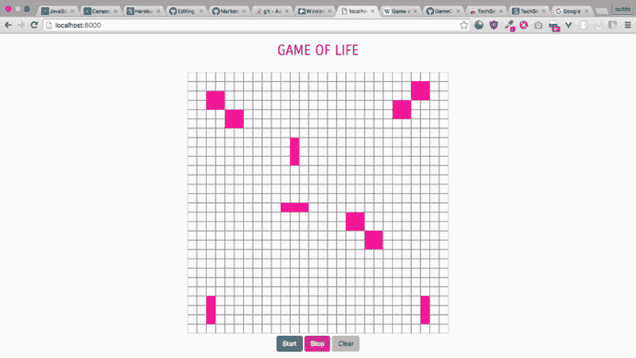

# 构建 HTML5 画布游戏如何帮助我学习编程

> 原文：<https://www.freecodecamp.org/news/how-creating-simple-canvas-games-helped-me-6eef839f450e/>

作者:苏尔比·奥贝罗伊

# 构建 HTML5 画布游戏如何帮助我学习编程

Image credit: DIY.org

像许多 9 岁的孩子一样，我们家有了电脑后，我做的第一件事就是在上面安装游戏。放学后，我和哥哥会在爸爸妈妈回家把我们赶走之前，为谁该去玩而争吵。

随着我的成长，我的兴趣从游戏转向了阅读。然后前几天朋友给我看了他手机上的超级马里奥。就这样，我又迷上了游戏。

那一刻我有了一个想法:为什么不创造一个游戏呢？现在我正在用[免费代码营](http://www.freecodecamp.com)学习编码，我也许可以创建一个基本的游戏。但是我不知道从哪里开始。所以我开始谷歌搜索。

我发现了 canvas API，以及如何用它来创建基本的游戏。我上了 Udacity 的 HTML5 画布课程。我花了三天时间才最终理解了画布的概念。

课程结束后，我仍然觉得我需要一个教程来教我如何从零开始一步一步地构建一个游戏，所以我照着做了。这向我揭示了我仍然迷失在面向对象编程的一些基础上，所以我在 Udacity 上找到了另一门面向对象 JavaScript 的课程。

这是相当密集，需要一些时间来消化。有些视频我得看两遍才能看懂。但最终，我看完了所有的视频，来到了最后一章，你终于创建了一个游戏。这个课程的好处是他们已经提供了一个游戏框架。

这个游戏叫做“青蛙过河”，在这个游戏中，一个精灵必须穿过一条满是虫子的小路，并且不能碰到任何虫子。精灵也可以收集宝石来获得额外的分数。

首先，我分叉他们的 GitHub 回购。已经创建了一些文件——比如在使用 Yeoman 这样的生成器时 JavaScript 被分成三个文件:app.js、engine.js 和 resources.js。我所要做的就是填充预先编写好的函数。由于这些函数已经被命名，我对传递哪些参数和创建哪些循环有了一个大致的概念。

任何游戏都有三个重要的方面:

1.  **游戏循环** —它不断重复一个过程，这样游戏就不会停止，除非你调用函数停止。
2.  **渲染** —从后端作品中获取线索，并在前端显示精灵(在本例中使用画布)。
3.  **更新** —根据指定的移动更新精灵的位置。

对于多年从事编码工作的人来说，这似乎很容易，但是从头开始需要很大的耐心。

经过相当多的头脑风暴和修复错误，游戏的工作。尽管这很简单，但我创造了一个游戏，那种纯粹的快乐是巨大的。

我的游戏是这样的:

这是我在 GitHub 上的代码:

[**surbhioberoi/frontend-nano degree-arcade-game**](https://github.com/surbhioberoi/frontend-nanodegree-arcade-game)
[*在 GitHub 上创建账号，为 frontend-nano degree-arcade-game 开发做贡献。*github.com](https://github.com/surbhioberoi/frontend-nanodegree-arcade-game)

这个游戏可以通过多种方式改进，比如使用随机输入。这里，我对位置进行了硬编码，这不是一个好的做法。我正在学习以更好的方式做事，第一步是承认存在更好的方式。

周末的时候，我又练习了一些油画，很有趣！我在 [JSfiddle](https://jsfiddle.net/) 上创作了一些简单的东西——只要是我脑海中闪现的任何可以使用画布的东西。

我现在想创造更多的东西。我听说过康威的生活游戏。最初，我认为创建它真的很难。尽管我怀疑自己能否成功，但我还是开始思考这个问题。

在犯了许多愚蠢的错误之后，我学到了关于编码的两件非常重要的事情:**永远不要惊慌！**一切皆有可能——只需找出方法。**永远不要马上开始写代码。**花点时间思考，在一张纸上勾画出你的数据和功能。首先尝试手动解决问题，就像没有计算机一样。如果您遵循这种方法，编写代码应该总是最后一步，因为知道首先要编码什么是很重要的。

在我的笔记本上，我写下了我的函数、数据和我认为会是我的输入的内容。我首先创建了画布，然后开始创建生活游戏的网格。

老实说，当事情没有按照你期望的方式运行时，这是令人沮丧的，但当它最终运行时，所有的烦恼都是值得的。创造东西的感觉很好，当那些东西是可玩的游戏时就更好了。

创建这个游戏的挑战部分是弄清楚如何使网格区域可点击。这真的让我很激动，但我最终想出了一个办法:使用偏移坐标。

生活的游戏是这样的:

这是我在 GitHub 上的代码:

[**surbhioberoi/gameof life**](https://github.com/surbhioberoi/GameOfLife)
[*gameof life——康威的人生游戏*github.com](https://github.com/surbhioberoi/GameOfLife)

我在创造新事物时经常面临的问题是害怕自己做不到。我通过学习创造游戏克服了这种恐惧。

此外，我认为在前端渲染后端是最难的部分，这真的让我害怕。但是现在我也开始克服这个挑战了。

我发现创作游戏是练习编程最有趣的方式，因为我一直喜欢玩游戏。游戏帮助我以一种有趣的方式学习编程，我认为这是学习新事物的最好方式。

HTML5 Canvas 真的很牛逼，一旦掌握了，用起来很方便。仅仅用这一种元素就能创造出如此多的东西，真是令人着迷。

现在，我不知道你是否喜欢玩游戏。如果有什么东西你更喜欢，试着去创造它。当你创造了自己真正喜欢的东西，你就能克服无法创造的恐惧。这仍然会很难，但是你会从中受益，享受额外的好处，比如之后可以玩一个新游戏。最棒的部分——成就感——会一直等着你，不管创作过程需要多长时间。

*最初发表于[surbhioberoi.com](http://surbhioberoi.com/how-creating-simple-canvas-games-helped-me/)。*