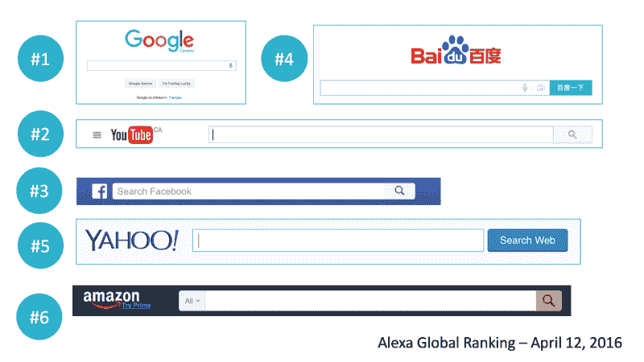
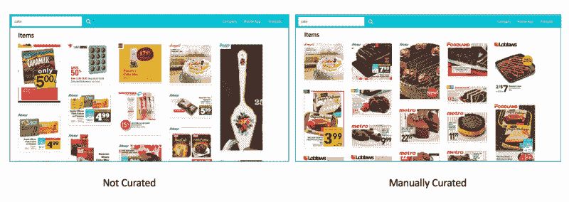
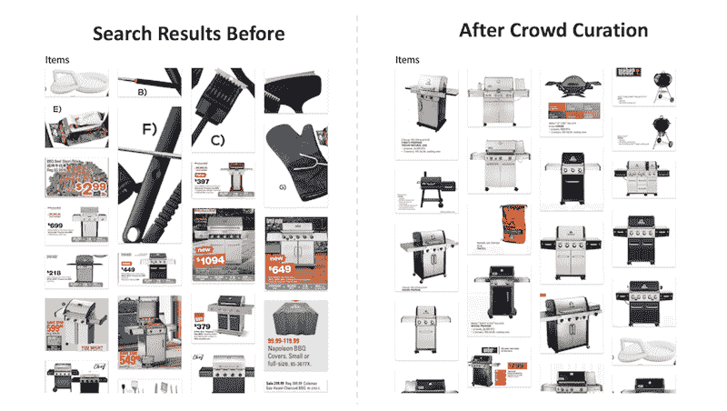
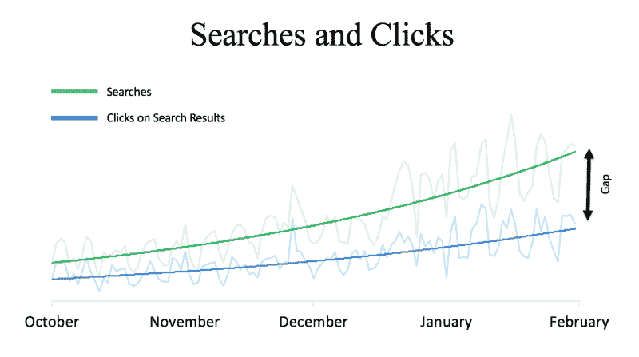
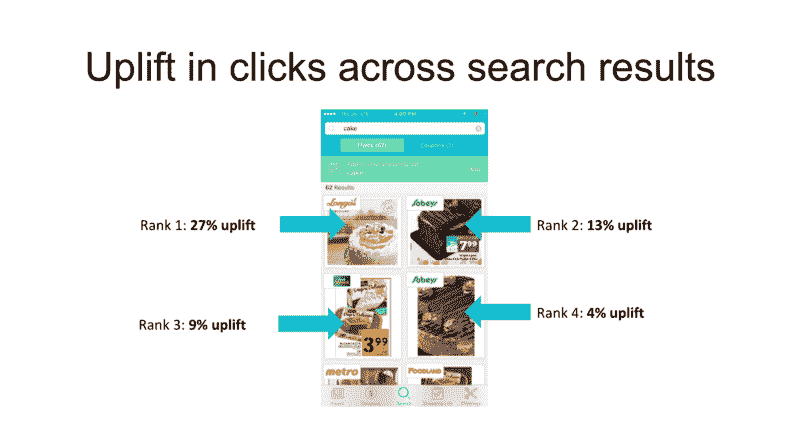

# 群体监管如何将我们的搜索质量提高了 27%

> 原文：<https://www.freecodecamp.org/news/how-crowd-curation-improved-our-search-quality-by-27-84d500e751bc/>

作者:thanesh sunstar

# 群体监管如何将我们的搜索质量提高了 27%

你的平台越大，搜索就变得越重要。如果你运行一个像我们这样的内容密集型平台，正确的搜索就更加重要了。

从数百万——可能是数十亿——的记录中检索相关信息不是一项简单的任务。搜索的问题是如此复杂，以至于它有自己的专门解决这个问题的学科，叫做*信息科学*。

Top 6 websites showing the importance of search

世界上访问量最大的六个网站都在其导航面板中有一个突出的搜索栏。脸书、YouTube 和亚马逊都选择将搜索栏放在它们的商标旁边，这凸显了搜索对这些平台的重要性。世界头号网站谷歌最初就是围绕这个单一的问题——搜索——建立的。

### **搜索即导航**

搜索是人们在平台上发现内容的主要方式。很少有人会真正花时间去了解你的平台的层次结构。在每一个类别中，都有许多其他平台在争夺你的用户的时间，所以无论如何，这些层级是不断演变的。

你上一次使用*菜单栏*是什么时候？或者甚至使用过*高级搜索过滤器*？除非你强迫用户使用这些，否则他们自然会远离这些。因此，如果用户通过搜索发现你的内容不够容易，他们就会失去兴趣，继续前进。

### ***策展搜索结果***

当搜索结果与用户无关时，他们不会采取下一步行动，也不会点击任何结果。监管有助于提高搜索结果的相关性。

我的公司 Flipp 从零售商那里获取每周通告，并使它们可以被搜索到。以下是当你在 Flipp 上搜索“蛋糕”时，*非策划*和*人工策划*结果的区别:

Not curated search results VS manually curated search results

手动整理是一个人实际检查每一个搜索词，然后手动安排结果排序的过程。很明显，我们手动管理的版本向用户展示了一组更干净、更相关的搜索结果。

您可以自动化手动监管的某些方面，但这仍然是一项资源密集型任务。

### ***进入人群策展***

虽然手动监管是一个很好的开始方式，但它不是一个可扩展的解决方案。我们需要更好的方法。

这就是人群管理发挥作用的地方。它利用群体的[智慧](https://en.wikipedia.org/wiki/Wisdom_of_the_crowd)对搜索结果进行排序。

一个简单的方法是查看用户点击最多的项目，然后将它们提升到搜索结果的顶部。这里有一个搜索结果的例子，包括在人群管理前后的查询“bbq ”:

Crowd curation of the search term “bbq”

正如你所看到的，测量一个项目的点击数并基于此对结果进行排序会产生更好的搜索结果。但由于我们应用程序中的项目每天都在变化，我们的搜索结果需要定期调整。我们保持搜索结果的新鲜，这样过期的交易就会消失，更新的、更有“新闻价值”的交易就会出现在顶部。

我们必须确保新的传单项目不会受到旧项目的惩罚，旧项目获得了更多的印象，因此获得了更多的点击。这给我们的开发团队带来了其他有趣的挑战。

移动平台上的搜索也略有不同。因为屏幕尺寸较小，我们还必须考虑视窗中实际显示的内容。

用户更有可能点击显示在顶部(折叠上方)的项目，而不是他们必须向下滚动到的列表中更靠下的项目(折叠下方)。如果用户确实努力向下滚动来找到一个项目，那么当我们改进搜索结果的排序顺序时，也必须考虑到这一点。

### ***测量搜索质量***

搜索引擎最重要的衡量标准是其搜索结果的质量。在这里，搜索和点击之间的差距正在扩大，搜索变得越来越糟糕:

Searches VS Clicks

我们使用[点击率](https://en.wikipedia.org/wiki/Click-through_rate)*——点击特定项目的用户与查看这些搜索结果的总用户的比率——来衡量我们搜索引擎的有效性。*

*我们还使用[贴现累积收益](https://en.wikipedia.org/wiki/Discounted_cumulative_gain)来衡量我们的排名算法的质量。*

*一个简单的方法来形象化“提升”——结果的改善——是测量在搜索结果的每个排名产生的额外点击。我们由此得出结论,**通过使用群体监管，我们看到第一个结果的点击量增加了 27%。***

*大部分点击都转向了排名靠前的位置，这证明我们已经提高了搜索结果的质量和相关性。*

*

Uplift in clicks across search results* 

*是的，我们的算法也考虑了一个项目在搜索中存在的时间。*

*例如，如果一份通知在周三被投递，那么随着时间的推移，该通知中的项目的“新闻价值”将会降低，从而赋予比周三更近投递的传单中的项目更大的重要性。我们用点击量来平衡这个。*

*换句话说:*

**项目排名=公式(项目年龄，点击量)**

*这样，我们能够在一定程度上减轻[赢家通吃](https://en.wikipedia.org/wiki/Winner_takes_all)的影响。*

*在 Flipp，我们希望用户体验是神奇的。我们是一家数据驱动型公司，不断查看数据，寻找改善数百万用户生活的新方法。搜索只是我们应用这一原则的一个领域，但它是一个重要的领域。*

**我是塔内什，是 [Flipp](https://flipp.com/) 的高级产品经理。我在 [Flipp 工程博客](http://eng.flipp.com/using-crowd-curation-to-enrich-search/)上发表了另一个版本。如果你对重塑人们购物的方式感兴趣，看看我们目前的[招聘信息](https://corp.flipp.com/jobs)。**