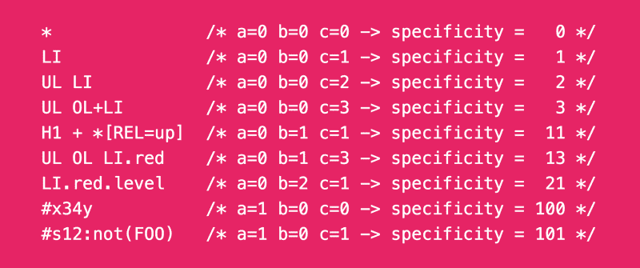

# CSS 特异性如何在浏览器中工作

> 原文：<https://www.freecodecamp.org/news/how-css-specificity-works-in-the-browser-3a7504176eda/>

迈克尔·奥祖梅纳

# CSS 特异性如何在浏览器中工作



很多人发现 CSS 真的很难。他们把这归咎于很多原因，比如他们不理解 CSS 或者 CSS 不好或者其他原因。但是大多数人发现 CSS 很难，因为他们没有花时间真正学习它。如果你正在读这篇文章，那很可能是因为你有兴趣在 CSS 方面变得更好，这太棒了！

#### 什么是 CSS 特异性？

你是否曾经写了一种风格，但它不起作用，所以你添加了`!important`(或者不添加)但它仍然不起作用？所以你看了一下 Devtools，却发现某处的其他风格正在覆盖你的风格？

这就是 CSS 的特殊性！它是浏览器如何选择你的竞争选择器应用于一个元素。当您的浏览器看到两个或更多的选择器匹配同一个元素，并且选择器中有冲突的规则时，它需要一种方法来确定将哪个规则应用于该元素。它的方式是通过这个叫做“CSS 特异性值”的东西。

在我们深入研究 CSS 特异性之前，您需要**注意**这些事情:

1.  只有当多个选择器影响同一个元素时，CSS 特异性才是重要的。当属性值冲突时，浏览器需要一种方法来确定将什么样式应用于匹配的元素，而 CSS 特异性就是这种方法。
2.  当两个或多个匹配选择器具有相同的特异性值时，浏览器会选择“最近”的匹配选择器，即出现在匹配选择器列表底部的选择器。下一点解释了什么是“匹配选择器列表”。
3.  浏览器通过组合网页上的所有样式并过滤掉所有与“当前样式”元素不匹配的样式来形成“匹配选择器列表”。样式表中的第一个选择器位于列表的顶部，最后一个选择器位于列表的底部。
4.  元素上的`style`属性比样式表中的选择器具有更大的特异性值，除非样式表选择器中有`!important`。
5.  使用`!important`(在某些情况下被认为是不好的做法)会改变选择器的特异性。当两个选择器的特异性相等时，带有`!important`的选择器获胜。当他们都有`!important`时,“最近”的选择器获胜。

#### 特异性值。

既然我们已经排除了这些问题，我们现在可以讨论浏览器如何确定选择器的特性值。

选择器的特殊性可以表示为一个 3 位数的字符串，用连字符(或任何您想要的字符)分隔:“2–4–1”。第一个数字是存在的`ID`选择器的数量，第二个是存在的类选择器、属性选择器和伪类的数量，第三个是存在的类型选择器和伪元素的数量。例如:

```
#red.blue // 1-1-0
```

```
#green // 1-0-0
```

```
div.yellow#red // 1-1-1
```

```
.red.blue.yellow // 0-3-0
```

#### 确定最“具体”的

为了确定哪个选择器更具体，您可以比较这三个值。

假设你有`1 - 1 - 1`和`0 - 3 - 0`，就像上两个例子，你需要确定哪一个更具体。您首先比较最后的值`1`和`0`，在这种情况下`1`获胜。这意味着在这一点上`div.yellow#red`具有更大的特异性值…但是我们还没有完成值的比较。

接下来，你比较第二个值`1`和`3`，`3`再次获胜。在这一点上`.red.blue.yellow`具有更大的特异性值，但是我们还没有完成。

最后，我们比较第一个值，`1`和`0`，`1`胜出，因此 `div.yellow#red`比`.red.blue.yellow`更具特异性。

这就是浏览器如何决定一个选择器的 CSS 特异性，这也很好地解释了为什么没有几个类选择器可以覆盖一个`ID`选择器。

#### 小警告

我想谈谈三个“问题”:

1.  前面，我提到了特殊性值的三个数字序列中的第二个数字*“是类选择器、属性选择器和存在的伪类的数量”*，这在所有情况下都是正确的，除了当它是我们正在讨论的`:not()`伪类时。当它是`:not()`伪类时，我们不去计算它，我们干脆忽略它。但是它里面的选择器也没有被忽略，它们被正常计数。
2.  CSS 特异性理解选择器的“形式”。这意味着当你有`*[id="yellow"]`和`#yellow`时，前者被视为属性选择器(事实也是如此),尽管它们基本上选择的是相同的东西。
3.  通用选择器`*`本身不计入选择器的特异性值。在上面的观点中，选择器的`[id="yellow"]`部分才是真正重要的。

#### 结论

我希望这篇文章易于理解，并帮助您更好地理解 CSS 特异性是如何工作的。现在你可以开始观察风格，并且能够判断一种风格有多“特别”。

如果不是这样，你有任何问题或反馈，我很高兴在评论区或 twitter 上与你讨论。

如果你喜欢这篇文章，记得留下一两个或五十个掌声。