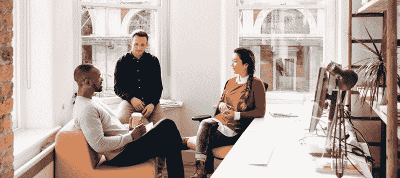

# 产品设计决策是如何做出的

> 原文：<https://www.freecodecamp.org/news/how-design-decisions-are-made-c18201c052d1/>

坦纳·克里斯滕森

# 产品设计决策是如何做出的

最近，在脸书一个名为[设计师协会](https://www.facebook.com/groups/designguild/permalink/570148766495733/?comment_id=570162419827701&reply_comment_id=570973443079932&ref=notif&notif_t=group_comment&notif_id=1461980120073616)的设计师团体中，一位名叫玛丽娜·坎德拉的年轻设计学生问道，为什么许多现代设计看起来如此糟糕或“倒退”，就像题外话一样。特别是优步、苹果或脸书等大型科技公司的设计。

你不必[阅读所有最新的标题](http://fortune.com/2016/02/11/uber-new-logo-jpmorgan/)或者浏览 Dribbble 上无数[主动提供的重新设计来理解这个问题。对于许多人来说，不管是不是设计师，看到一个新设计的本能反应通常是:那是*愚蠢的*。](https://dribbble.com/search?q=facebook+redesign)

这里面的问题是，设计不是美化事物的过程。设计师不是为了让东西看起来漂亮而获得报酬的。是的，手艺当然是工作的一部分，但它不是工作的一部分。

做出设计决策时，有许多工作在幕后进行。超乎你的想象。

对于像优步和脸书这样的公司，或者今天的任何大公司来说都是如此。这些公司的设计需要从研究、实验、迭代、实验室或小组测试到真实世界测试的一切。这些步骤中的每一步都可能花费几周到几个月的时间，花费在研究、概念化和测试上的时间反映了设计决策的潜在影响。设计任务越大，需要的时间就越长。

对于业余设计师和普通的简或乔来说，看到像优步的标志或 Instagram 或脸书的新设计这样的设计项目，仅凭直觉做出反应是很常见的。“这看起来比以前更糟了！怎么会有人懂这个？！他们在想什么？这是可怕的设计。”

事实上，这些是比设计想要处理的更多的表面反应。

设计的目的并不总是让某样东西看起来很好，甚至比以前更好。这些设计过程是关于*解决一个问题*。

好的设计能解决问题。

有时问题是顾客认为你的品牌比他们所支付的要低，这稀释了公司的价值。其他时候，问题是你创建的平台本身比它生产或托管的内容更重要。或者一个主要的功能被隐藏了，或者大量的新功能挤满了界面，或者你和你的团队认为合理的东西对于在现实世界中使用产品的人来说是非常混乱的。

其他时候，还有一些普通设计师可能永远不会意识到的问题:例如，扩展一个网站以适应地球上几乎每个人的需求。这是一个很难解决的问题，对大多数人来说也是一个同样难以理解的问题。

我自己在脸书的经历就是一个很好的例子。大多数设计师会说脸书极其丑陋(作为一名设计师，我倾向于同意这一点)。然而，脸书并不一定要看起来非凡才能工作出色。作为一名脸书产品设计师，这是我最引以为豪的:设计一个产品供全世界使用是一个非常非常困难的问题，然而脸书却做得相当好。

考虑一下在脸书工作的设计师可能会遇到的一些问题:每个单词、每个按钮都需要翻译成数百种语言，这就产生了布局间距等主要障碍。根据您所处的位置，内容会反转屏幕的两侧(从左到右的文本与从右到左的文本)。在世界上的某些地方，某些类型的内容是非法的，占位符或法律术语必须动态地放在它的位置上。一些人在他们 700 美元的 iPhone 上使用脸书，有无限的数据计划，而另一些人在 5 美元的翻盖手机上使用，每个月只有 1mb 的数据可用。有些人的互联网连接速度比其他人慢 1000 倍，这意味着像图像和应用程序大小这样的事情真的很重要

最优秀的设计师不仅会考虑项目的目标(比如从应用程序中实时流出的能力)，还会考虑他们必须在其中工作的限制以及他们必须解决的问题。不仅如此，我们日常遇到的大部分设计过程应该是关于确定要解决的问题是否是一开始就要解决的*正确问题。*如果不是:我们如何着手识别真正的问题？

因此，虽然很容易看到一个设计，并认为它很丑，或跛脚，或跑题，但现实是，有很多，很多，很多，很多决策和考虑发生在幕后，导致了最新的设计。

如果设计背后的团队做得很好，他们已经测试、试验并验证了他们的工作，足以让像你或其他设计师这样的人最终看到它。

这并不意味着设计已经完成，但它确实意味着已经“做得足够”来满足任何主要的关注。

为了更好地评估设计工作，你可以做的一件事是后退一步，想想负责人试图解决的所有情况。我在上面列出了一些我们在脸书遇到的例子，但是我相信你可以想出更多你自己的例子。

在判断设计之前，你应该问这样的问题:

*   这试图解决什么问题？
*   为谁解决？如果不是我，那是谁？
*   这个设计在考虑那些人可能会遇到哪些问题或场景？
*   设计的限制是什么？
*   约束呢？

最后，作为额外的精神食粮，考虑一下人们就是不喜欢改变这一事实。变化带来了我们最不想面对的挑战。但是变化是不可避免的，虽然新的设计一开始会感觉奇怪或不友好，但我们不可避免地会适应它们，因为…嗯，时间就是这样。