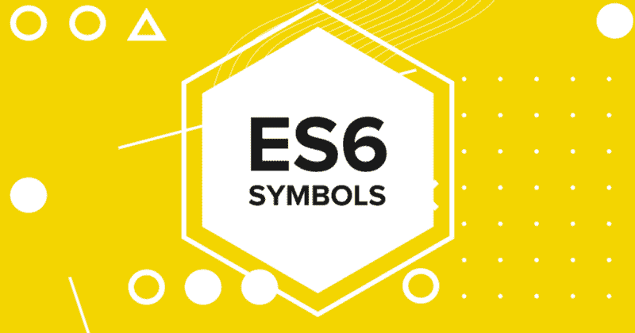

# JavaScript 符号的快速概述

> 原文：<https://www.freecodecamp.org/news/how-did-i-miss-javascript-symbols-c1f1c0e1874a/>

作者瓦利·沙阿

# JavaScript 符号的快速概述



Symbols — JS Primitives

#### 标志

符号是 ES6 中新引进的[](https://developer.mozilla.org/en-US/docs/Glossary/Primitive)****类型。符号是完全唯一的标识符。就像它们的原始对应物(**数字**、**字符串**、**布尔**)一样，它们可以使用返回符号的工厂函数`Symbol()`来创建。****

```
**`const symbol = Symbol('description')`**
```

****每次调用工厂函数时，都会创建一个新的唯一符号。可选的字符串值参数是打印符号时显示的描述性字符串。****

```
**`> symbol
Symbol(description)`**
```

****由`Symbol()`返回的每个符号都是唯一的，所以每个符号都有自己的身份:****

```
**`> Symbol() === Symbol()
false`**
```

****如果您对其中一个符号应用`typeof`操作符，您可以看到这些符号是基本的——它将返回一个新的特定于符号的结果:****

```
**`> typeof symbol
'symbol'`**
```

#### ******用例:符号作为非公共属性的键******

****每当 JavaScript 中有继承层次时，就有两种属性(例如，通过类创建，一种纯粹的原型方法):****

*   ******公共**属性被代码的客户端看到****
*   ******私有**属性在组成继承层次结构的部分内部使用(如类、对象)。****

****出于可用性的考虑，公共属性通常有字符串键。但是对于带有字符串键的私有属性，偶然的名称冲突会成为一个问题。所以，符号是个不错的选择。****

****例如，在下面的代码中，符号用于私有属性`_counter`和`_action`:****

```
**`const _counter = Symbol('counter');
const _action  = Symbol('action');
class Countdown {
    constructor(counter, action) {
        this[_counter] = counter;
        this[_action] = action;
    }
    dec() {
        let counter = this[_counter];
        if (counter < 1) return;
        counter--;
        this[_counter] = counter;
        if (counter === 0) {
            this[_action]();
        }
    }
}`**
```

****请注意，符号只能防止名称冲突，而不能防止未经授权的访问。您可以通过以下方式找出对象的所有属性键，包括符号:****

```
**`const obj = {
  [Symbol('my_key')]  : 1, 
   enum               : 2, 
   nonEnum            : 3
};

Object.defineProperty(obj, 'nonEnum', { enumerable: false }); // Making 'nonEnum' as not enumerable.

// Ignores symbol-valued property keys:
> Object.getOwnPropertyNames(obj)
['enum', 'nonEnum']

// Ignores string-valued property keys:
> Object.getOwnPropertySymbols(obj)
[Symbol(my_key)]

// Considers all kinds of keys:
> Reflect.ownKeys(obj)
[Symbol(my_key),'enum', 'nonEnum']

// Only considers enumerable property keys that are strings:
> Object.keys(obj)
['enum']`**
```

#### ****我们真的需要符号吗？****

****当您的需求是以下情况之一时，请使用符号:****

*   ******Enum:** 允许你定义带有语义名称和唯一值的常量。****

```
**`const directions = {
  UP   : Symbol( ‘UP’ ),
  DOWN : Symbol( ‘DOWN’ ),
  LEFT : Symbol( ‘LEFT’ ),
  RIGHT: Symbol( ‘RIGHT’ )
};`**
```

*   ******名称冲突:**当您想要防止与对象中的关键点发生冲突时****
*   ******Privacy:** 当你不希望你的对象属性是可枚举的****
*   ******协议:**定义如何迭代一个对象。
    例如，想象一下像`dragula`这样的库通过`Symbol.for(dragula.moves)`定义一个协议。您可以在任何 DOM 元素的`Symbol`上添加一个方法。如果一个 DOM 元素遵循该协议，那么`dragula`可以调用`el[Symbol.for('dragula.moves')]()`用户定义的方法来断言该元素是否可以被移动。****
*   ******知名符号:**除了用户自定义符号，JavaScript 还有一些内置符号。这些代表了在< ES5 中没有向开发者公开的内部语言行为。更多信息 [****此处****](https://developer.mozilla.org/en-US/docs/Web/JavaScript/Reference/Global_Objects/Symbol#Well-known_symbols) ****。********

#### ****结论****

**`Symbols`在 JavaScript 中可以给对象提供访问级别的唯一性。对所有开发人员来说，对它们和它们的各种用例有一个基本的了解是值得的。**

**`code = **co**ffee + **de**veloper`**