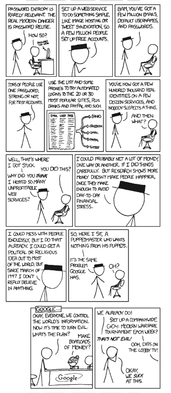
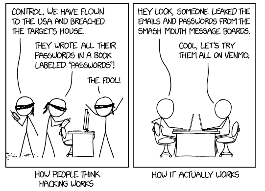

# 有人是怎么得到我的密码的？

> 原文：<https://www.freecodecamp.org/news/how-did-someone-get-my-password-2/>

你有没有收到过一封[‘sextortion](https://www.forbes.com/sites/zakdoffman/2019/08/05/200m-email-addresses-held-by-sextortion-attackers-is-yours-on-their-list/#4214f11f67e4)’[的电子邮件](https://www.cnbc.com/2019/06/17/email-sextortion-scams-on-the-rise-says-fbi.html)告诉你，你的电脑被黑客入侵了，并警告你，如果你不付钱，他们将向你的整个联系人名单发布私密视频？邮件中是否包含了你的旧密码，作为他们的声明是真实的“证据”？你想知道他们是怎么得到你的密码的吗？

## 什么是网络钓鱼？

据统计，这可能是来自网络钓鱼电子邮件。2018 年，全球 93%的违规行为始于网络钓鱼或伪装攻击。

钓鱼邮件极其常见，而且非常有效。他们使用恐惧和羞耻(在色情邮件或“男性增强广告”中)、急迫感(我的老板现在就需要这个！)，或者贪婪(我赢了新车？？).

它们也可以通过文本消息(短信)、语音(视频)、电子邮件(网络钓鱼)和社交媒体网络钓鱼发送。

人们适应得越多，黑客的反应就越快——他们的策略也在不断演变。

通常网络钓鱼邮件包含一个链接或附件。一旦您点击链接或打开附件，他们可能会在您的设备上安装恶意软件，或诱骗您将您的凭据输入到一个虚假的网站(看起来就像真实的网站)。恶意软件将检查是否可以利用未打补丁的漏洞，以便在您的系统上安装更多的恶意软件(然后可以窃取密码，安装键盘记录器来记录您的所有击键，从而记录您的密码！–以此类推)。

一旦黑客窃取了您的凭据，他们就可以做一些事情，比如泄露您的个人财务数据或帐户信息，或者如果这发生在您公司的设备上，他们就可以泄露您的客户的信息。

网络钓鱼完全值得拥有自己的文章，所以如果你对学习如何钓鱼感兴趣，请查看这篇文章。

## 如何阻止网络钓鱼对您的影响？

防御网络钓鱼也很困难。作为个人，你能做的最好的事情是在打开电子邮件时小心谨慎——警惕那些利用你的情绪、要求你快速做出决定或看起来好得不真实的电子邮件。

留意不寻常的发件人(你能认出给你发邮件的人吗？这是他们以前用过的同一个电子邮件地址吗？)，或者意外的链接或附件。如果您不确定电子邮件是否合法，请通过不同的通信方法确认它是发件人的。

您还应该使用防病毒和端点保护软件。付费版本比免费版本更好，因为它会随着新恶意软件的识别而更新。但是免费版本通常比没有要好。我喜欢笔记本电脑的 Malwarebytes。

安全团队将使用大量工具:

*   试图减少到达用户收件箱的网络钓鱼和垃圾邮件的电子邮件过滤机制，
*   SPF、DKIM 和 DMARC 等措施有助于提供电子邮件来源真实性的认证，
*   用户意识培训，
*   和端点保护机制。

端点保护机制的范围从简单的防病毒到安装在每台设备上的代理。这些将试图阻止已知的恶意软件运行，识别异常行为，并通过警告安全运营团队或强制程序退出来阻止恶意程序运行。

这样，即使电子邮件通过了过滤器，用户也不会注意到任何错误，终端保护将阻止恶意软件对机器造成实际损害。

## 不然别人怎么会知道我的密码？

通常，当黑客入侵一家公司时，他们会出售他们在黑网上获得的用户名和密码。

> **Surface Web:** 你能在谷歌或其他流行的搜索引擎上找到的东西。这大概就是你所认为的互联网的大部分。与深层网络相比，这只是“在线”信息的很小一部分。

> Deep Web: 在线信息，但谷歌和其他流行的浏览器无法对其进行索引(搜索)。这是诸如包含在政府或大学数据库中的信息。这些信息通常隐藏在付费墙或其他限制机制之后。

> **暗网:**暗网需要某种浏览器才能访问，比如“TOR 浏览器”。虽然不是全部，但其中一些内容是非法的。这通常是犯罪分子聚集在论坛上交谈、出售非法服务和商品的地方，有时生活在专制政权下的活动分子也聚集在一起交流。

如果您在不同的网站之间重复使用密码和用户名(特别是因为您的电子邮件可能被用作许多网站的用户名)，黑客可能已经拥有了您的用户名和密码。

[https://xkcd.com/792/](https://xkcd.com/792/)

然后，黑客会执行一种叫做“凭据填充”的操作。凭据填充是指攻击者将这些用户名和密码插入一个自动化的“帐户检查器”,该检查器基本上在互联网上的许多不同网站上尝试用户名/密码组合，从社交媒体登录到银行帐户。如果密码有效，黑客现在就可以访问账户，并可以清空账户、出售数据等。

为了更好的描述，请查看下面 XKCD 的漫画。

[https://xkcd.com/2176/](https://xkcd.com/2176/)

## 如何防范凭据填充？

不要重复使用您的密码。使用类似于 1 [密码](https://1password.com/)或 [LastPass](https://www.lastpass.com/solutions/business-password-manager) 的密码管理器。 [KeePass](https://keepass.info/) (在我看来)不太用户友好，但它是免费的！

密码管理器可以安全地存储你的密码，通常有浏览器扩展和应用程序，所以他们可以自动填充你的密码。另外，这样你只需要记住一个主密码。但是您的主密码现在允许访问您的所有其他密码，所以请确保它非常安全！

它们还可以帮助你自动生成非常强的密码，有些甚至有保险库，让你可以存储其他敏感信息(银行账户详情，保险信息等)。).

我个人使用 1Password，因为我喜欢家庭帐户选项-如果您的家庭中有人被锁定，其他人可以重置他们的帐户密码(但无法访问您的个人保险库)。

您也可以使用[我被 pwn 了吗](https://haveibeenpwned.com/)来设置免费提醒。该网站收集数据泄露的信息，并为消费者提供使用这些信息来保护自己的能力。您可以导航到顶部的“通知我”选项卡，并输入您的电子邮件地址。

确认您输入的电子邮件地址(该地址将提供您当前的暴露情况)后，该网站将在您的电子邮件涉及数据泄露的任何时候向您发送电子邮件。也就是说，该网站被警告的任何违规行为–他们的覆盖范围非常好，但没有一个单一的来源会包含每个泄露的数据违规行为。这样，您只需更改受影响的密码，而不必担心它会影响您的任何其他帐户。

如果你在为一个大型组织做安全工作，企业密码管理软件(上面列出的提供这些服务的公司)是一个很好的主意，还有强密码策略(要求你的员工使用足够强的密码)。我被 Pwned 了吗？还有一项服务，允许域名所有者监控涉及域名上任何电子邮件的违规行为(而且是免费的！).

## 黑客还有什么途径获取密码？

还有一些其他的可能性——肩膀冲浪，或者基本上看着你输入密码——尽管这不太可能，因为这个人必须亲自看着你。

然后是窃取已经写下的密码，或者只是在照片中可见的[写下的密码的照片。同样，这比上述任何选项都不太可能，因为它通常来自有针对性的攻击(与机会犯罪相比，这种攻击本来就不太常见)。](https://www.businessinsider.com/hawaii-emergency-agency-password-discovered-in-photo-sparks-security-criticism-2018-1)

避免这两种情况非常简单——不要让别人看到你输入密码，也不要写下你的密码。请改用密码管理器！如果你必须写下来，把它放在别人不太可能找到或偶然发现的地方。我建议卫生棉条的底部。比你显示器上的便利贴安全多了。

## 好像真的很容易被黑。我应该担心吗？

关于黑客，要记住的最重要的一点是，没有人想做比他们必须做的更多的工作。例如，闯入你的房子偷你的密码笔记本比从世界的另一端发送钓鱼邮件要困难得多。如果有更简单的方法来获取你的密码，那可能是一个邪恶的演员首先会尝试的。

这意味着启用基本的网络安全最佳实践可能是防止被黑客攻击的最简单的方法。事实上，微软[最近报告](https://www.zdnet.com/article/microsoft-using-multi-factor-authentication-blocks-99-9-of-account-hacks/)说，仅仅启用双因素认证就能阻止 99.9%的自动攻击。

因此，启用 2FA，使用密码管理器为每个帐户自动生成长的、复杂的、唯一的密码，并且在点击之前要三思！避免点击粗略或意外的链接和附件，并保持警惕。

[https://xkcd.com/538/](https://xkcd.com/538/)