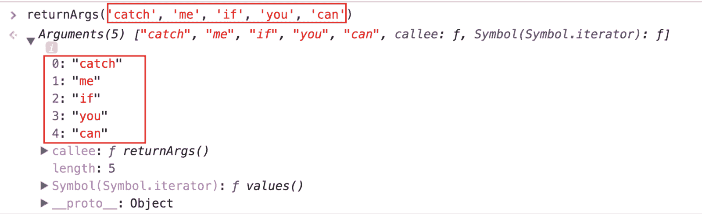
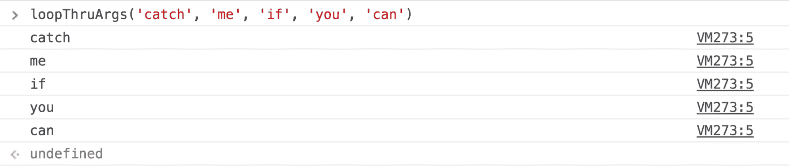
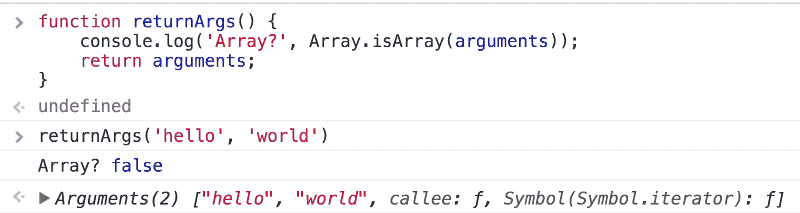
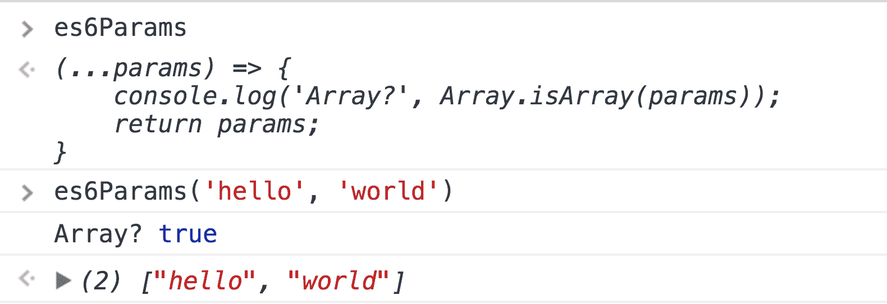
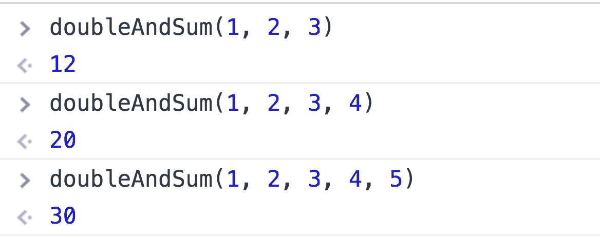
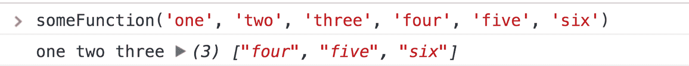
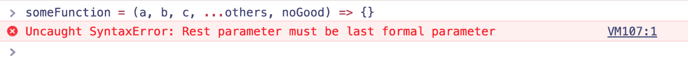
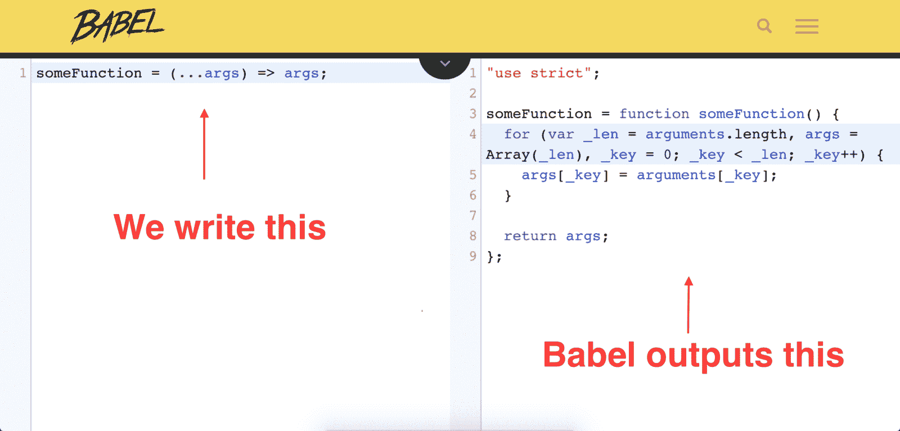

# JavaScript rest 参数的实际工作方式

> 原文：<https://www.freecodecamp.org/news/how-do-javascript-rest-parameters-actually-work-227726e16cc8/>

[我的上一篇文章](https://medium.com/@yazeedb/how-do-object-assign-and-spread-actually-work-169b53275cb)详细介绍了 **spread** 语法和`Object.assign`，但出于时间的考虑，忽略了**其余参数**。然而，我确实觉得它们值得仔细观察。

让我们从值得信赖的 MDN 文档开始:

> rest 参数语法允许我们将不定数量的参数表示为一个数组。

最后一部分“作为一个数组”很有趣，因为在 ES6 arrow 函数之前，我们使用了`arguments` **对象**。它是一个像一样的数组- *，但实际上并不是一个数组。*

示例:

```
function returnArgs() {
  return arguments;
} 
```



我们看到`arguments`有索引，所以它是可循环的:

```
function loopThruArgs() {
  let i = 0;

  for (i; i < arguments.length; i++) {
    console.log(arguments[i]);
  }
} 
```



但它不是一个数组。



让我们对比一下使用 **rest** 参数的函数:

```
es6Params = (...params) => {
  console.log('Array?', Array.isArray(params));
  return params;
}; 
```



它只是一个数组，意味着我们可以在它上面使用任何的`Array`方法！

让我们写一个函数，**将**加倍，**将**与你给它的每个参数相加。

```
double = (x) => x * 2;
sum = (x, y) => x + y;

doubleAndSum = (...numbers) => numbers.map(double).reduce(sum, 0); 
```



在使用 **rest** 之前，您可以在函数中命名任意多的参数。

```
someFunction = (a, b, c, ...others) => {
  console.log(a, b, c, others);
}; 
```



但是它必须是指定的最后一个，因为它抓住了你的论点的其余部分。？



我想我们知道引擎盖下发生了什么，但让我们彻底。看看[babeljs.io/repl](https://babeljs.io/repl)，在这里你可以编写 ES6+代码，并实时将其传输到 ES5。



那是一个整洁的小功能，让我们扩展它并添加注释。

```
someFunction = function someFunction() {
  var _len = arguments.length;

  // create an array same length
  // as the arguments object
  var args = Array(_len);
  var i = 0;

  // iterate through arguments
  for (i; i < _len; i++) {
    // assign them to
    // the new array
    args[i] = arguments[i];
  }

  // and return it
  return args;
}; 
```

既然 Babel 为我们写了一个老派的函数，它就可以访问`arguments`对象！`arguments`有索引和一个`.length`属性，这是我们创建它的完美克隆所需要的。

这就是为什么我们可以在 **rest** 参数上使用像`map`、`filter`、`reduce`这样的数组方法，因为它创建了一个`arguments`的数组克隆。

玩得开心休息！