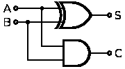
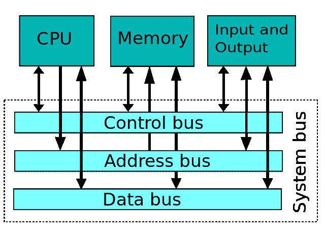
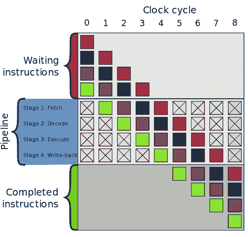

# CPU 是如何工作的？

> 原文：<https://www.freecodecamp.org/news/how-does-a-cpu-work/>

CPU，也称为微处理器，是计算机的心脏和/或大脑。让我们深入计算机的核心，帮助我们高效地编写计算机程序。

> *“工具通常比机器简单；它通常用手来操作，而机器通常由动物或蒸汽驱动*

*–*查尔斯·巴贝奇**

******电脑**** 是一种 ****机器**** 主要由电力驱动，但其灵活性和可编程性帮助实现了工具的简单性。**

****CPU**** 是计算机的心脏和/或大脑。它执行提供给它的指令。它的主要工作是执行算术和逻辑运算，并协调指令。在深入讨论主要部件之前，让我们先来看看 CPU 的主要组件是什么以及它们的作用是什么:

### 处理器的两个主要组件

*   *****控制单元—CU*****
*   *****算术逻辑单元—ALU*****

#### 控制单元—铜

控制单元 CU 是 CPU 的一部分，帮助协调指令的执行。它告诉我们该做什么。根据指令，它帮助激活连接 CPU 和计算机其他不同部分的电线，包括 ****ALU**** 。控制单元是 CPU 接收指令进行处理的第一个部件。

有两种类型的控制单元:

*   硬连线 ****控制单元**** 。
*   可编微程序**控制单元。**

******硬连线**** 控制单元是硬件，需要改变硬件来增加修改它的工作方式，其中作为 ****微程序**** 控制单元可以被编程来改变它的行为。硬连线 CU 在处理指令时更快，而微程序更灵活。**

#### **算术逻辑单元**

**算术和逻辑单元 ALU 顾名思义做所有的算术和逻辑计算。ALU 执行加法、减法等运算。ALU 由执行这些操作的逻辑电路或逻辑门组成。**

**大多数逻辑门接受两个输入，产生一个输出**

**下面是半加法器电路的一个例子，它接受两个输入并输出结果。这里 A 和 B 是输入，S 是输出，C 是进位。**

**

Half source: [https://en.wikipedia.org/wiki/Adder_(electronics)#/media/File:Half_Adder.svg](https://en.wikipedia.org/wiki/Adder_%28electronics%29#/media/File:Half_Adder.svg)** 

### **存储—寄存器和内存**

**CPU 的主要工作是执行提供给它的指令。大部分时间要处理这些指令，需要数据。一些数据是中间数据，一些是输入，另一些是输出。这些数据和指令存储在以下存储器中:**

#### **登记**

**寄存器是一小组可以存储数据的地方。一个寄存器是由 ****锁存器**** 组合而成。 ****锁存器**** 又称 ****触发器**** 是存储 1 位信息的 ****逻辑门**** 的组合。**

**锁存器具有两条输入线，即写入和输入线以及一条输出线。我们可以使写线对存储的数据进行改变。当写线被禁用时，输出总是保持不变。**

**

An SR latch, constructed from a pair of cross-coupled [NOR](https://en.wikipedia.org/wiki/NOR_gate "NOR gate") [gates](https://en.wikipedia.org/wiki/Logic_gate "Logic gate")** 

**CPU 有寄存器来存储输出的数据。发送到主存储器(RAM)会很慢，因为它是中间数据。该数据被发送到通过 ****总线**** 连接的其他寄存器。寄存器可以存储指令、输出数据、存储地址或任何类型的数据。**

#### **内存(RAM)**

**Ram 是以优化方式排列和压缩在一起的寄存器的集合，以便它可以存储更多的数据。RAM(随机存取存储器)是易失性的，当我们关闭电源时，它的数据会丢失。由于 RAM 是用于读/写数据的寄存器的集合，所以 RAM 接受 8 位地址的输入、用于要存储的实际数据的数据输入以及最终的读和写使能器，该使能器如同锁存器一样工作。**

### **什么是说明**

**指令是计算机可以执行的粒度级计算。CPU 可以处理各种类型的指令。**

**说明包括:**

*   **算术如 ****加**** 和 ****减******
*   **逻辑指令如 ****、**、**、**或**、**、**非**、********
*   数据指令如******输入********输出********加载**** ， ****存储******
*   **控制流指令如 ****转到**** ， ****如果…转到**** ， ****调用**** ， ****返回******
*   **通知 CPU 程序已经结束 ****停止******

**使用汇编语言向计算机提供指令，或者由编译器生成指令，或者用一些高级语言解释指令。**

**这些指令在 CPU 内部是硬连线。ALU 包含算术和逻辑，而控制流由 CU 管理。**

**在一个 ****时钟周期**** 计算机可以执行一条指令，但现代计算机可以执行多条指令。**

**计算机能够执行的一组指令称为 ****指令集**** 。**

### **CPU 时钟**

******时钟周期******

**计算机的速度是由其时钟周期决定的。它是计算机每秒工作的**个时钟周期的数量。单个时钟周期非常小，大约为 250 * 10 *-12 秒。时钟周期越高，处理器越快。****

****CPU 时钟周期以 gHz 为单位( ****千兆赫**** )。1gHz 等于 10 ⁹赫兹( ****赫兹**** )。一赫兹意味着一秒。所以 1 千兆赫意味着每秒 10 个⁹周期。****

**时钟周期越快， ****CPU**** 能执行的指令越多。时钟周期= 1/时钟速率 CPU 时间=时钟周期数/时钟速率**

**这意味着，为了提高 CPU 时间，我们可以通过优化提供给 CPU 的指令来提高时钟频率或减少时钟周期数。一些处理器提供了增加时钟周期的能力，但由于是物理变化，可能会过热，甚至冒烟/着火。**

### **指令是如何执行的**

**指令按顺序存储在 ****RAM**** 中。对于一条假设的 CPU 指令由****【OP】****代码(操作码)和 ****内存或寄存器地址**** 组成。**

**一个控制单元内有两个寄存器 ****【指令寄存器(IR)**** 加载指令的操作码和 ****指令地址寄存器**** 加载当前执行指令的地址。CPU 内部还有其他寄存器，用于存储存储在指令最后 4 位地址中的值。**

**让我们举一个把两个数相加的指令集的例子。以下是说明及其描述:**

******第一步—加载 _A 8:******

**指令最初保存在 RAM 中，比如说<1100 1000>。前 4 位是 op 码。这决定了指令。该指令是 ****取**** 到控制单元的 ****IR**** 。指令 ****解码**** 为 load_A，这意味着它需要将地址 1000 中的数据加载到寄存器 A，该地址是指令的最后 4 位。**

******第二步—加载 _B 2******

**与上面类似，这将内存地址 2 (0010)中的数据加载到 CPU 寄存器 b。**

******第三步**** ****—加 B A******

**现在下一个指令是将这两个数相加。这里，CU 告诉 ALU 执行加法运算，并将结果保存回寄存器 a。**

******第四步—商店 _A 23******

**这是一组非常简单的指令，有助于将两个数相加。**

**我们已经成功添加了两个号码！**

#### ****总线****

**CPU、寄存器、存储器和 IO 设备之间的所有数据都通过总线传输。为了将数据加载到刚刚添加的存储器中，CPU 将存储器地址放入地址总线，将求和结果放入数据总线，并在控制总线中启用右信号。这样，在总线的帮助下，数据被加载到内存中。**

**

Photo src: [https://en.wikipedia.org/wiki/Bus_(computing)#/media/File:Computer_system_bus.svg](https://en.wikipedia.org/wiki/Bus_%28computing%29#/media/File:Computer_system_bus.svg)** 

#### **隐藏物**

**CPU 也有机制将指令预取到它的缓存中。众所周知，一个处理器一秒钟内可以完成数百万条指令。这意味着从 RAM 中取出指令比执行指令花费的时间要多。因此，CPU 缓存预取一些指令和数据，以便快速执行。**

**如果高速缓存和操作存储器中的数据不同，该数据被标记为 ****脏位**** 。**

#### ****指令流水线****

**现代 CPU 在指令执行中使用 ****指令流水线**** 进行并行化。获取、解码、执行。当一条指令处于解码阶段时，CPU 可以处理另一条指令进入提取阶段。**

**

photo source: [https://en.wikipedia.org/wiki/Instruction_pipelining#/media/File:Pipeline,_4_stage.svg](https://en.wikipedia.org/wiki/Instruction_pipelining#/media/File:Pipeline,_4_stage.svg)** 

**当一个指令依赖于另一个指令时，这就有一个问题。因此处理器以不同的顺序执行不相关的指令。**

#### **多核计算机**

**它基本上是不同的 CPU，但有一些共享资源，如缓存。**

### **表演**

**CPU 的性能取决于它的执行时间。性能= 1/执行时间**

**假设一个程序执行需要 20 毫秒。CPU 的性能是 1/20 = 0.05 毫秒相对性能=执行时间 1/执行时间 2**

**考虑 CPU 性能的因素是指令执行时间和 CPU 时钟速度。因此，要提高程序的性能，我们要么需要提高时钟速度，要么需要减少程序中的指令数量。处理器的速度是有限的，而现代的多核计算机每秒可以支持数百万条指令。但是如果我们写的程序有很多指令，这将降低整体性能。**

******大 O 符号**** 决定了给定输入对性能的影响。**

**在 CPU 中做了很多优化，以使它更快，尽可能多地执行。在编写任何程序时，我们都需要考虑减少提供给 CPU 的指令数量将如何提高计算机程序的性能。**

* * *

**同样发布在 Milap Neupane 博客上的还有:[CPU 是如何工作的](https://milapneupane.com.np/2019/07/06/how-does-a-cpu-work/)**