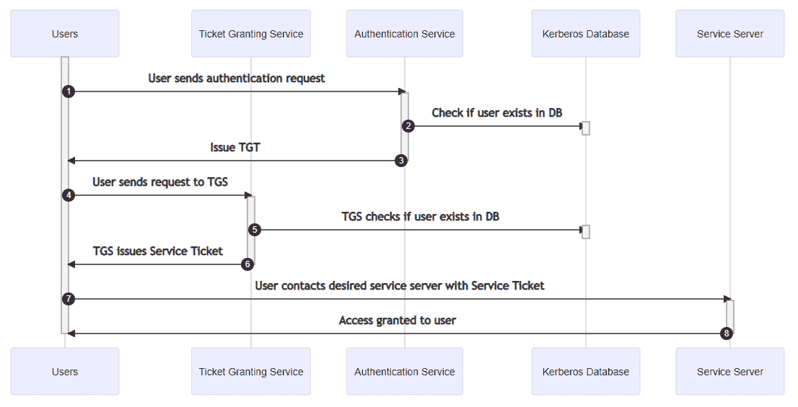

# Kerberos 是如何工作的？验证协议解释如下

> 原文：<https://www.freecodecamp.org/news/how-does-kerberos-work-authentication-protocol/>

在本文中，我们将了解什么是 Kerberos，它是如何工作的，以及使用这种身份验证协议的各种利弊。

## 什么是 Kerberos？

你有没有想过，当你在工作中输入用户名和密码，然后神奇地访问文件服务器、电子邮件服务器和其他资源时会发生什么？很有可能，您正在使用 Kerberos！

Kerberos 旨在通过将密码置于不安全的网络之外来保护您的凭证免受黑客攻击，即使在验证用户身份时也是如此。

最简单地说，Kerberos 是一种用于客户机/服务器应用程序的身份验证协议。它旨在通过不安全的网络提供安全的身份验证。

该协议最初由麻省理工学院在 20 世纪 80 年代开发，并以神话中守护冥界的三头犬 Cerberus 命名。后来，微软对其进行了改进，将其包含在 Windows 2000 中，以取代 NTLM 的协议，并且该协议仍然是 T2 的开源协议。

如果需要在采访中快速总结 Kerberos vs NTLM，最简洁的描述如下:

> NTLM 在客户端和服务器之间使用三次握手，在系统之间发送凭据，而 Kerberos 则避免通过网络发送凭据

## 使用 Kerberos 进行身份验证

通过 Kerberos 进行身份验证需要使用**密钥分发中心(KDC)** 。这通常是作为 Active Directory 域服务(AD DS)的一部分在所有域控制器(DC)上运行的服务。它包含以下组件:

1.  **认证服务(AS)** :在用户最初尝试访问服务时对其进行认证
2.  **票据授予服务(TGS)** :根据存储在数据库中的信息将用户与服务服务器(例如，文件服务器)连接
3.  **Kerberos 数据库**:存储 id 和密码的地方，通常是 LDAP 服务器或活动目录环境中的安全帐户管理器(SAM)数据库。

Kerberos authentication workflow

### Kerberos 身份验证过程解释

当用户通过身份验证服务请求访问服务时，他们在本地输入用户名和密码，并发送以下信息:

1.  安全标识符(SID)
2.  所请求服务的名称(例如 example.cool.hat)
3.  用户的 IP 地址
4.  票证授予票证的预期寿命(TGT)。默认值为 10 小时，可以通过组策略进行更改

如果用户存在于数据库中，身份验证服务会发出票证授予票证(TGT)。发送回用户的第一条消息包含:

1.  安全标识符(SID)
2.  TGS 身份证
3.  时间戳
4.  用户的 IP 地址
5.  TGT 一生
6.  TGT
7.  会话密钥

此消息之后，将发送另一条消息，其中包含:

1.  TGS 身份证
2.  时间戳
3.  会话密钥

用户将 TGT 和所请求服务的 Kerberos ID 一起发送到 TGS。另一个消息被发送，它包含“认证符”，由用户 ID 和时间戳组成，用用户的会话密钥加密。

如果 TGS 在 Kerberos 数据库中找到用户的信息，它将用两条消息响应用户。第一条消息将包含以下信息，用服务器的秘密服务密钥加密:

1.  服务票
2.  用户的 ID
3.  用户的 IP 地址
4.  有效期
5.  服务会话密钥

用用户的会话密钥加密的第二个消息(例如，在加锁的盒子中的加锁的盒子，其中用户只能打开第一个盒子)将包含服务会话密钥。

用户在两个消息中将服务票和服务请求一起发送给所请求的服务。第一条消息将是上一步的第一条消息(用服务器的秘密服务密钥加密)。第二条消息将包含一个带有更新时间戳的新验证器，用用户的会话密钥加密。

服务服务器使用自己的秘密密钥解密票据，以检索用户的会话密钥，该密钥用于解密验证者。如果之前消息中的用户 ID 匹配，它将向用户发送一条用用户的会话密钥加密的消息，并在新的验证器中找到时间戳，以确认服务的身份。

### Kerberos 加密

在 Active Directory 域控制器上创建新帐户时，您会得到一个用户名和密码。

Kerberos 客户端然后添加一个称为 salt 的字符串——一个用于提高凭证随机性的唯一字符串——以及 Kerberos 版本号。在大多数配置中，salt 是用户的用户名。然后，它通过 string2Key 函数运行这两个值，该函数将返回共享秘密。

在工作站上，用户将通过提供用户名和密码来请求访问服务(例如登录到机器)。本地 Kerberos 客户端将执行与 DC 相同的步骤来获得共享密钥。如果该密码与存储在 DC 上的密码匹配，用户就可以登录。

## Kerberos 的优势

与以前的身份验证技术相比，Kerberos 提供了几个好处，例如:

*   明文密码永远不会发送到 KDC
*   所有事件的简单透明和审计
*   针对 KDC 的验证在票证的有效期内只发生一次
*   单点登录是 Kerberos 最大的直接好处之一，它允许用户输入一次凭证，然后无需干预就可以继续更新他们的票证
*   支持多因素身份验证(MFA)
*   通信链的两端都必须经过身份验证

## Kerberos 安全漏洞

既然我们知道了 Kerberos 是如何工作的，那么理解其实现中固有的潜在漏洞就很重要，尤其是在微软对 Kerberos 的专有扩展中。

您可以使用本地工具监控日志来检测这些攻击中的大多数，但是知道要查找什么是很重要的。这一节将从较高的层次概述针对 Kerberos 系统的各种攻击。

### 金票攻击

金券是伪造的 Kerberos 密钥分发中心。您可以为 Active Directory 中不存在的帐户创建可用的 Kerberos 票证。

要获得黄金入场券，攻击者需要对 Active Directory 林或域的域/本地管理员访问权限，一旦入场券创建，默认有效期为 10 年！

如果您认为有人创建了未经授权的金券，那么您需要重置 Kerberos 服务帐户 krbtgt。虽然这并不难，但是这个过程有几个关键步骤。

因为 Active Directory 存储所有帐户的旧密码和当前密码，所以您必须重置 krbtgt 帐户两次。但是第二次重置应该仅在等待第一次密码重置后的最大用户票证生命周期之后发生**。微软提供了一个方便的脚本来帮助解决这个[问题。](https://gallery.technet.microsoft.com/Reset-the-krbtgt-account-581a9e51)**

### 银票攻击

银票类似于金票，但没有金票的广泛管理权限。

攻击者通常只能访问应用程序上的单个服务，并且攻击者必须从计算机的 SAM 或本地服务帐户获取合法用户凭据。

使得这些攻击非常难以检测的是伪造银票(例如使用服务帐户密码散列)不需要与 DC 进行任何通信。

### 后门万能钥匙恶意软件攻击

在后门万能钥匙恶意软件攻击中，攻击者通常已经破坏了域控制器并成功执行了金券攻击。

该恶意软件向 LSASS 注入一个主密码，该密码将对域中的任何帐户起作用。当帐户验证时，恶意软件将检查注入的主密码哈希，如果匹配，将验证用户，而不管用户的真实密码。合法用户仍然可以使用他们的正常凭据登录。

### 通过哈希攻击

这是一种技术，攻击者获得用户的 NTLM 密码哈希，然后将哈希传递给 NTLM 身份验证。

这是因为系统实际上并不验证用户的密码，而是验证密码的散列。这种攻击只对使用 NTLM 身份验证的交互式登录有效。

### 把票递过来

在这种攻击中，威胁参与者通过伪造一个假的 TGT 来创建一个假的会话密钥。攻击者将把它作为有效凭证提供给服务。

为了执行这种攻击，攻击者必须获得对会话密钥的访问权。为了执行这种攻击，攻击者将从 LSASS 进程的内存中获取 Kerberos 票证，然后将窃取的 TGT 注入到他们自己的会话中，这将让他们采用窃取的 TGT 的身份和权限。

### 越过哈希

结合传递哈希和传递票证，攻击者使用一个被破坏的哈希来获得一个 Kerberos 票证，他们可以使用该票证来访问资源。

如果您需要 Kerberos 身份验证(如果 NTLM 被禁用以到达您的目标，但只有一个受损的哈希),这通常很有用。

### Kerberoasting

当域帐户被配置为运行服务(例如，Internet 信息系统、MSSQL 等)时。)，服务主体名称用于将服务与登录帐户相关联。

如果用户想要访问资源，他们会收到一个 Kerberos 票据，该票据由运行该服务的帐户的 NTLM 密码哈希签名。然后，黑客可以离线破解这个散列，并使用它来获得访问权限。

*域中任何拥有有效 TGT 的用户都可以使用 SPN* 为任何服务请求 TGS——不需要花哨的凭证或访问权限！请注意*除了确保服务账户的密码足够复杂之外，没有其他的修补程序。*

为了检测这种攻击，您的 *only* native 选项是监视事件 ID 4769，并寻找 0x17 - user to user krb_tgt_reply 的票据加密类型。你可以在这里找到更多关于检测 Kerberoast 攻击[的信息。](https://www.trustedsec.com/blog/art_of_kerberoast/)

### 重放攻击

如果攻击者窃取了从用户发送到服务的数据包，就发生了重播攻击，攻击者可以使用该数据包在不知道用户凭据的情况下获得对服务的访问权限。

这通常是低风险的，并且通过系统检查分组的时间戳来减轻，任何早于或与先前分组相同的时间戳都被拒绝，以及任何与服务器时间不同步超过 5 分钟的时间戳。

## 如何防御对 Kerberos 的攻击

既然我们对刚才讨论的攻击感到害怕，那么让我们深入研究一些技术来防御对 Kerberos 基础设施的攻击。

### 记录和监控

攻击者在发行金券时通常会使用假的或空白的帐户/域名，因为在发行有效券时，这些帐户/域名不必是真实的。

您可以在 DC 日志中搜索不存在的用户或域的事件 id **4769** -服务票证请求。对于银票攻击，您可能想要搜索事件 id **4769** 来查找任何使用 RC4 加密的服务票请求，类型设置为 0x17。

### 补丁！

确保您的系统是最新的。这不仅有助于阻止许多利用工具的工作，而且专门修补 [CVE-2014-6324](https://www.varonis.com/blog/microsoft-fixes-kerberos-silver-ticket-vulnerability/) 将解决允许银票成为域管理员的漏洞。

### 将管理和服务帐户设置为“敏感且无法委派”

此设置将防止攻击者将其被攻击的帐户委托给其他服务或计算机，限制他们在您的环境中横向移动的能力。

### 不要将计算机帐户添加到管理员组

作为管理组成员的计算机帐户(如“AD Backups ”)可被利用来获取银票，并允许攻击者通过向帐户添加新权限来保持在 Active Directory 中的持久性。

### 在保护模式下运行本地安全机构子系统服务(LSASS)

LSASS 负责为用户提供单点登录服务，并托管许多插件，如 NTLM 认证和 Kerberos。

凭证被呈现给这些插件中的每一个，在 LSASS 的内存空间中产生一个单向散列和票据，它在用户会话期间保持不变。

当作为[受保护的进程](https://itm4n.github.io/lsass-runasppl/)运行时，LSASS 只能被数字签名的二进制文件访问(其中大多数攻击工具不是，尽管有一些旁路方法可用)。

这可以通过以管理员身份打开注册表编辑器，在*HKLM \ SYSTEM \ current Control set \ Control \ LSA*添加一个名为 **RunAsPPL** 值为 **1** 的 DWORD 并重启系统来设置。

**重要提示:**如果您使用的是*第三方认证模块*，它必须满足这里列出的要求:[配置额外的 LSA 保护|微软文档](https://docs.microsoft.com/en-us/windows-server/security/credentials-protection-and-management/configuring-additional-lsa-protection#protected-process-requirements-for-plug-ins-or-drivers)。

如果你使用的是*安全启动/UEFI* ，你不能通过更改注册表项来禁用设置，你必须遵循微软在这里列出的具体说明:[配置附加 LSA 保护|微软文档](https://docs.microsoft.com/en-us/windows-server/security/credentials-protection-and-management/configuring-additional-lsa-protection#to-disable-lsa-protection)。

### 对 TGS 实施特权属性证书(PAC)身份验证

特权属性证书包含有关用户特权的信息。伪造的 PAC 可以指示 TGS 向用户授予他们无权获得的额外特权——并且因为在微软的实现中 krbtgt 帐户被禁用并且不被使用，所以密钥不会改变。

启用后，PAC 验证可确保根据 Active Directory 检查系统用户身份验证的 PAC 的有效性。你可以以管理员身份打开注册表编辑器(**regedit.exe**)，将*HKLM \系统\当前控制集\控制\LSAKerberosParameters* 键设置为 **1** 来启用这个功能。

### 最小特权原则

确保整个环境中的用户帐户只能访问履行其职能所需的服务、组和资源。这减少了攻击面，并有助于在帐户遭到破坏时防止进一步的破坏。

### 对管理帐户、本地帐户和服务帐户使用强而唯一的密码

理想情况下，管理帐户的密码应该超过 14 个字符。然而，SPN 帐户最好应该有更长的密码以提高安全性——最好是 25 个字符或更多。

基于主机的 SPN 具有安全的 128 个字符的密码，每 30 天更改一次，但默认情况下，用户帐户 SPN 通常不会过期，并且会重复使用弱密码，因为这使得管理更加简单。

### 启用 Windows Defender 凭据保护(域控制器上除外)

Windows Defender 凭据保护通过保护 NTLM 哈希、TGT 和其他凭据来防止传递哈希或传递票证等攻击。它通过利用基于虚拟化的安全性和“隔离的 LSA”流程来存储和保护机密。

只有受信任的特权应用程序和进程才能访问这些信息。你可以在这里找到更多信息: [Windows 10 设备卫士和凭证卫士揭秘——微软技术社区](https://techcommunity.microsoft.com/t5/iis-support-blog/windows-10-device-guard-and-credential-guard-demystified/ba-p/376419)。

### 禁用 RC4 加密

RC4-HMAC 是一个已知的不安全的加密套件，你应该禁用它，如果可能的话。

*   在存在信任的域信任中启用 AES 支持
*   如果适用，对 Azure AD SSO 帐户强制实施 AES256
*   翻转 Kerberos 解密密钥
*   通过组策略禁用 RC4-HMAC

**重要提示:**由于 Windows 的身份验证方式以及需要修改此设置的众多位置，禁用 RC4 时会遇到许多“问题”。确保在申请前彻底研究和计划*。*

*这里有一些有用的文档可以帮助你:*

*   *棘手的问题得到了解答:我能在 Windows 10 上禁用 Kerberos 的 RC4 Etype 吗？*
*   *[在 Active Directory 中禁用 RC4 的经验教训](https://syfuhs.net/lessons-in-disabling-rc4-in-active-directory)*

## *结论*

*看，这并不坏——Kerberos 可以很有趣！Kerberos 通常是任何企业网络中考虑最少但最关键的组件之一。防御者必须了解该协议的工作原理，以及各种可用的攻击和防御手段。现在去征服吧！*

## *进一步阅读*

*   *[Kerberos，活动目录的秘密解码器环–活动目录安全](https://adsecurity.org/?p=227)*
*   *[Kerberos 协议解释|身份&访问管理](https://iam.uconn.edu/the-kerberos-protocol-explained/)*
*   *[Kerberos 认证 101:了解 Kerberos 安全协议的要点-Redmondmag.com](https://redmondmag.com/articles/2012/02/01/understanding-the-essentials-of-the-kerberos-protocol.aspx#:~:text=The%20SALT%20string%20is%20the,secret%20key%20on%20the%20client.&text=The%20user%20and%20the%20Authentication,communicate%20using%20the%20shared%20secret.)*