# String.padStart 实际上是如何工作的？

> 原文：<https://www.freecodecamp.org/news/how-does-string-padstart-actually-work-abba34d982e/>

[在之前的](https://medium.com/@yazeedb/youtube-durations-in-4-lines-of-javascript-e9a92cea67a4)中，我分享了我对`padStart`的使用，优雅地替换了大量的`if`语句。这个神奇的方法让我疯狂。我简直不敢相信它的存在。

### 它的作用

[Mozilla 开发者网络(MDN)文档](https://developer.mozilla.org/en-US/docs/Web/JavaScript/Reference/Global_Objects/String/padStart):

> `padStart()`方法用另一个字符串填充当前字符串(如果需要，可以重复)，这样得到的字符串就达到了给定的长度。从当前字符串的开始(左侧)应用填充。

保持**将一串**前置到**另一串**上，直到满足**目标长度**为止。

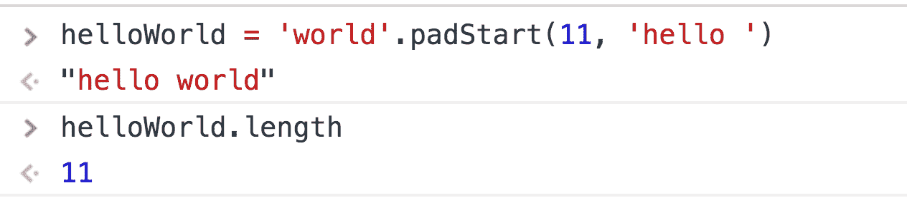 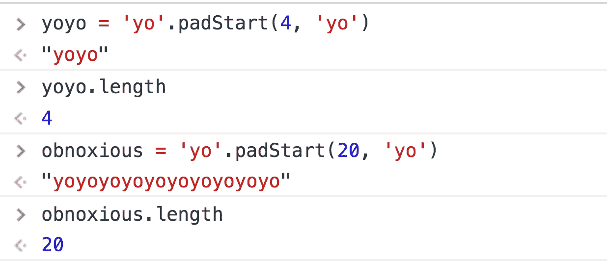

如果长度已经小于原始字符串的长度，则什么都不会发生。

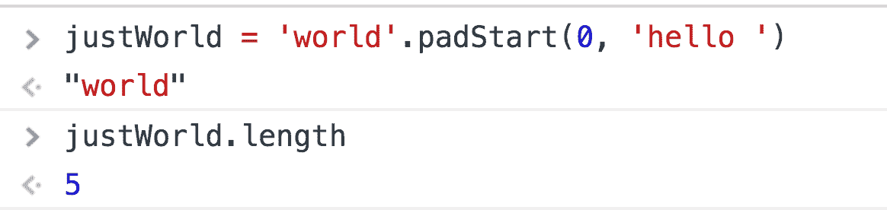

由于`padStart`返回一个字符串，我们可以链接它的方法。

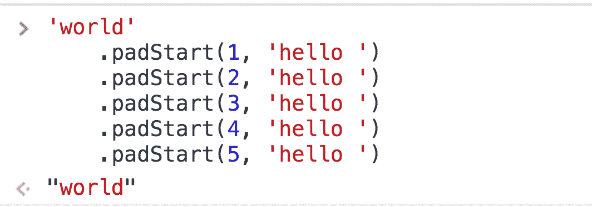

看到了吗？1，2，3，4，5 都小于等于`world`的长度 5，所以`padStart`什么都不做。

### 浏览器支持

不幸的是，支持目前是“咩”

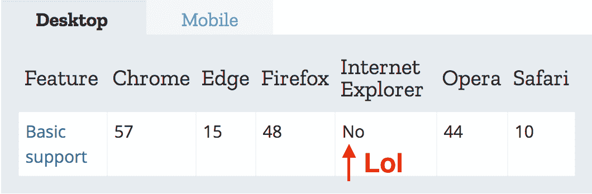桌面支持移动支持

您可以使用 [babel-polyfill](http://babeljs.io/#polyfill) 或[MDN](https://developer.mozilla.org/en-US/docs/Web/JavaScript/Reference/Global_Objects/String/padStart#Polyfill)的 polyfill。

这是 MDN 的 polyfill。

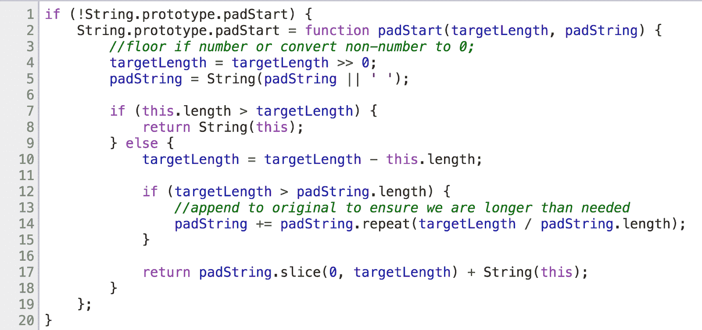

### 一些有趣的地方:

*   **原型**(1 号线和 2 号线)
*   **按位运算符**(第 4 行)
*   `padString.repeat`(第十四行)
*   `padString.slice`(第十七行)

如果你愿意的话，我可以一步一步来？

第 1 行和第 2 行并没有那么糟糕:“如果浏览器不支持`padStart`，让我们创建自己的`padStart`并添加它”(简单地说就是填充)。

检查方法的浏览器支持的一种常见方式是检查其对象的原型。由于`padStart`是一个字符串方法，所以它应该存在于`String.prototype`上。

我的旧版 Safari 不支持`padStart`。

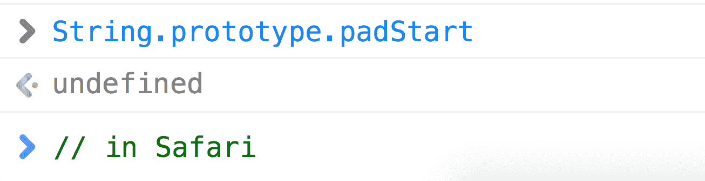我的 Safari 的 padStart 支持

但是我的 Chrome 和 Firefox 有。

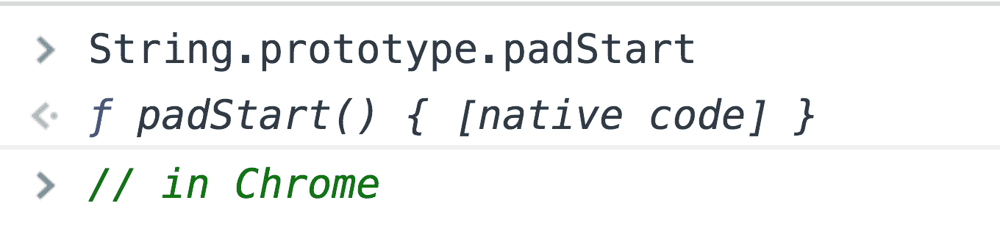 Chrome padStart 支持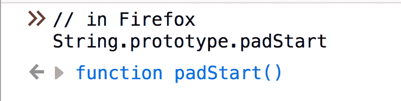 Firefox padStart 支持

考虑一下 1 号线的安全检查

```
if (!String.prototype.padStart) {
} 
```

在我以前的 Safari 中，`if`语句只会返回`true`。它在 Chrome/Firefox 中返回`false`，所以不会发生多填充。


继续，第 2 行创建了一个名为`padStart`的新函数，并将其分配给`String.prototype.padStart`。由于 JavaScript 的继承模型，任何后来创建的字符串都可以使用`padStart`。

这个函数有两个参数

1.结果字符串应该有多长？

2.我们用什么填充它？

让我们用`debugger`语句来点缀这段代码。

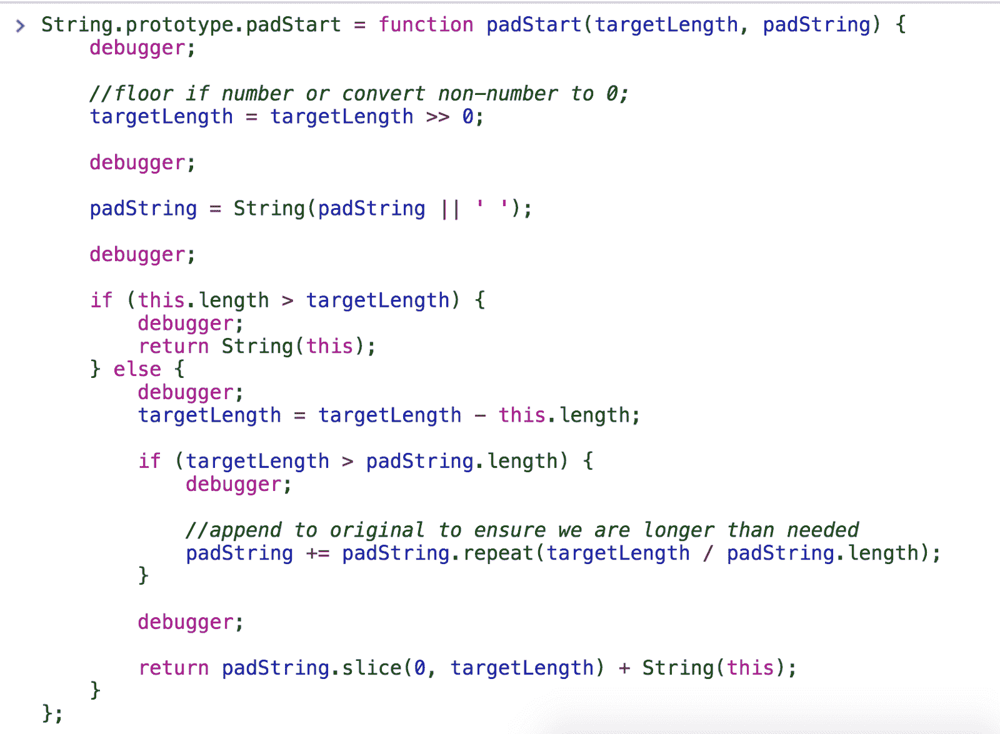

我还从第 1 行中删除了那个`if`语句，所以即使是原生的`String.prototype.padStart`也会被这个函数覆盖——如果你想在 Chrome 中调试，这很有用。

孩子们，不要在生产中覆盖原型！

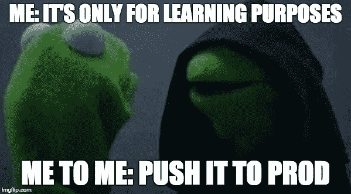

使用我们最初的例子

```
'world'.padStart(11, 'hello '); 
```

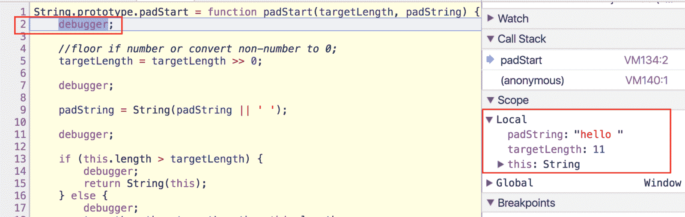

看看 2 号线。我们看到`targetLength`和`padString`进入了我们的函数。还没有疯狂，但它即将到来。我避开 5 号线已经够久了。

### 按位运算符

第 5 行上面的注释简要描述了它的用途:“如果`targetLength`是一个数字，就向下取整。如果不是数字，就设为 0”。

位运算符使这成为可能。

`targetLength >> 0;`

这个运算符`>>`被称为[符号传播右移](https://developer.mozilla.org/en-US/docs/Web/JavaScript/Reference/Operators/Bitwise_Operators#Right_shift) (LOLWUT？).
你用两个数字

`a >> b`

**这有什么作用:**

1.  `a`被转换成二进制([详情在此](https://developer.mozilla.org/en-US/docs/Web/JavaScript/Reference/Operators/Bitwise_Operators#Signed_32-bit_integers))。
2.  二进制`a`得到*右移* `b`次。

我们的`targetLength`是 11——也就是二进制的 1011(如果你不相信我，这里有一个[转换器](https://www.binaryhexconverter.com/binary-to-decimal-converter)？).

转换成二进制的一个副作用是数字被四舍五入，大多数非数字变成 0。

试试下面的例子

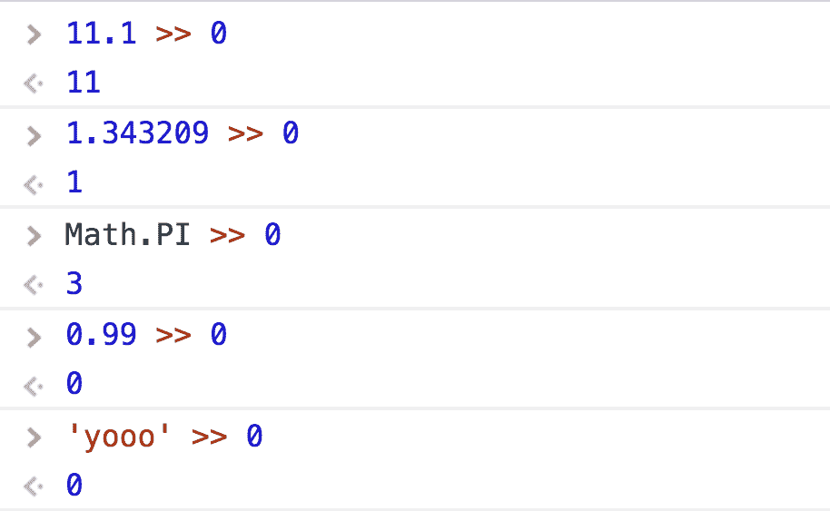

看到了吗？分数变成了整数。非数字变成 0，有一个明显的例外…

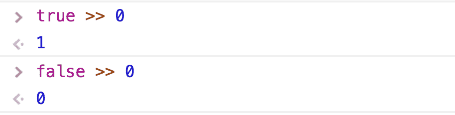

二进制只是 1 和 0，对吗？这些 1 和 0 代表“开”和“关”开关—`true`和`false`。`true`的二进制形式是 1，`false`的二进制形式是 0。记住这一点。

所以现在我们已经“净化”了，我们开始右移。

右移意味着您将每一位向右移动`n`次。就是这样。

这里有一张`11 >> 1`的 PowerPoint 可视化图(我忘了 PowerPoint 实际上有多棒了)。

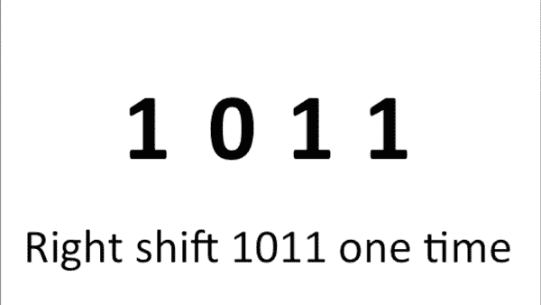

把 11 变成 1011，右移 1 次。你的最终结果是 101，也就是二进制的 5。


但是我们的代码说`targetLength >> 0`。

### 所以我们右移 0 次…

右移 0 次的全部意义在于滥用将`targetLength`转换成二进制的副作用。我们实际上不想改变任何东西，因为那会改变价值。

### 继续前进

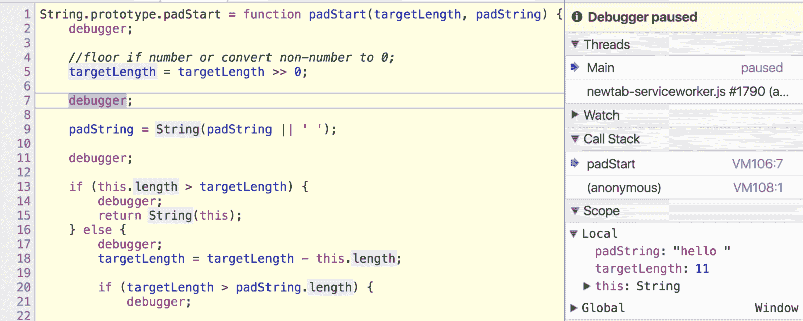

现在跳到第 7 行的`debugger`。`targetLength`已消毒。**下一个！**

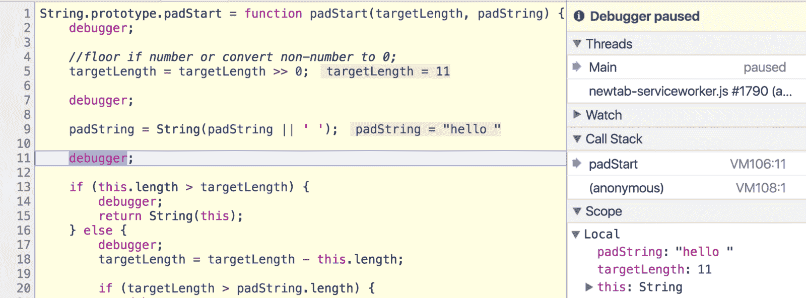

**第 11 行。**

```
padString = String(padString || ' '); 
```

如果我们不提供一个`padString`参数，它默认为一个空格。我实际上直到现在才注意到。

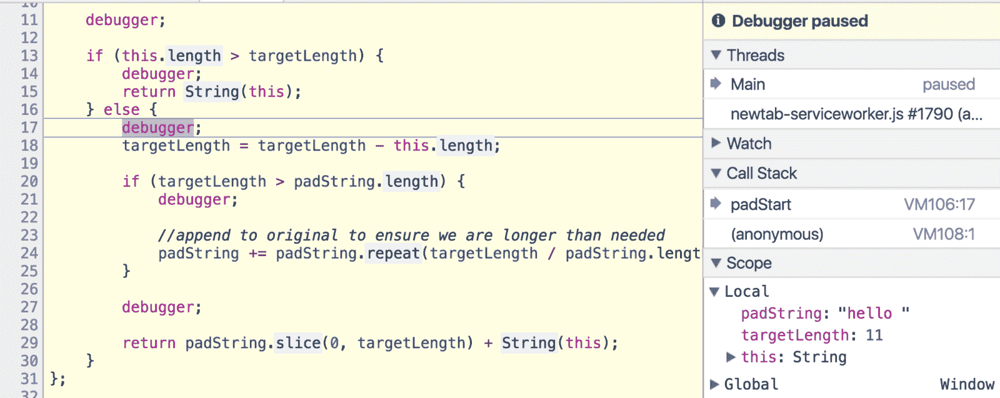

**第 17 行。**

注意第 13 行是如何进行另一个安全检查的，“如果原始字符串的长度大于`targetLength`，不要做任何事情。只需返回原字符串"

这是有道理的，因为如果我们的`targetLength`是 1，但字符串已经是 10 个字符，有什么意义呢？我们之前已经演示过了

```
// just returns 'world'
'world'.padStart(0, 'hello '); 
```

第 18 行通过从原始字符串长度中减去`targetLength`来确定我们还需要多少*个*字符。在这种情况下，我们需要 6 个。

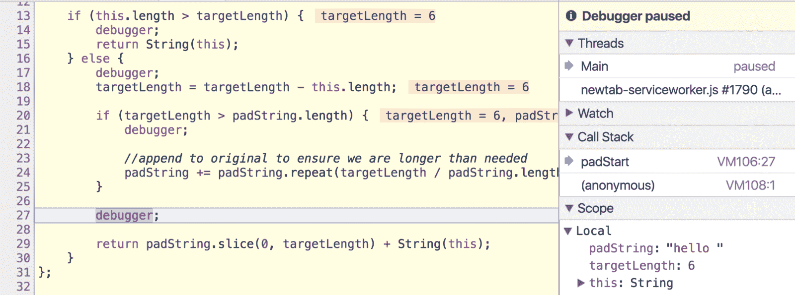

**第 27 行。**

我们跳过了第 20 行的那条`if`语句，因为`targetLength`和`padString.length`恰好是相同的，但是我们很快会再讨论它。

现在，我们就停在 29 号线前面。我们分手吧。

```
padString.slice(0, targetLength); 
```

古老的好方法。

[**MDN 文档**](https://developer.mozilla.org/en-US/docs/Web/JavaScript/Reference/Global_Objects/String/slice) :

> `slice()`方法提取字符串的一部分，并将其作为新字符串返回。

它是基于索引的，所以我们从`padString`的索引 0 开始，获取等于`targetLength`的字符数。这有点像

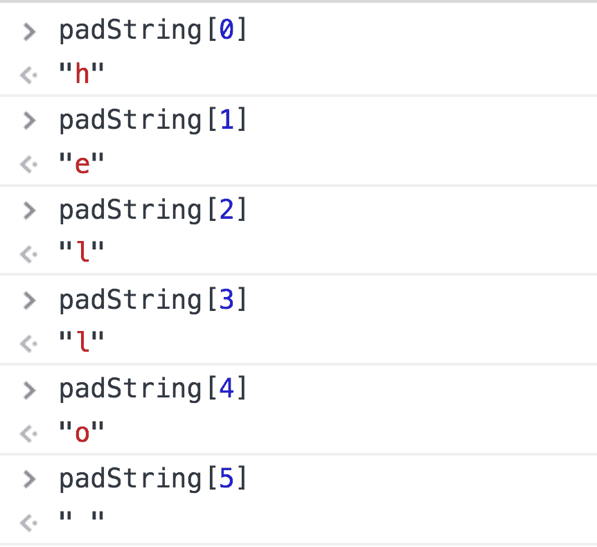

返回与原始字符串组合的切片`padString`，就完成了！

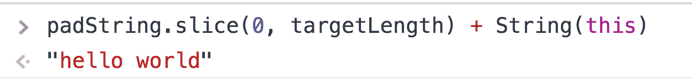

### *差不多了*搞定了

我通常会在这里结束，但是我们还没有研究第 20 行的`if`语句。为了确保这次我们成功了，让我们试试另一个更早的例子

```
'yo'.padStart(20, 'yo'); 
```

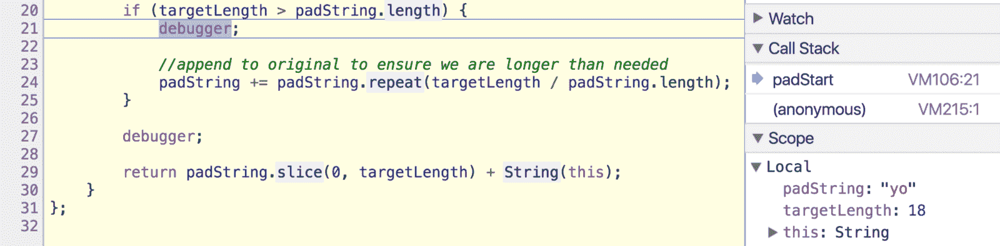

我跳到了第 20 行，因为我们已经知道到目前为止发生了什么。

`if (targetLength > padString.length)`

`targetLength`为 18，`padString`为`'yo'`，长度为 2。
18 > 2、那么接下来呢？

```
padString += padString.repeat(targetLength / padString.length); 
```

记住，`padStart`返回一个*切片* `padString` +原字符串。如果你想用`'yo'`填充`'yo'`直到 20 个字符长，你必须重复很多次。这就是逻辑发生的地方，使用`padString.repeat`。

[**MDN 文档**](https://developer.mozilla.org/en-US/docs/Web/JavaScript/Reference/Global_Objects/String/repeat) :

> `repeat()`方法构造并返回一个新的字符串，该字符串包含调用它的字符串的指定数量的副本，这些副本连接在一起。

所以它复制/粘贴了字符串`n`次。

为了找出我们需要多少次重复，用`targetLength`除以`padString.length`。

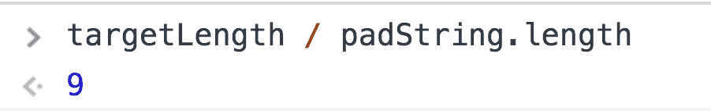

重复`'yo'` 9 次，得到一串 18 个字符长的`'yo'`。加上你原来的`'yo'`，你最后的总数是 20 个字符。

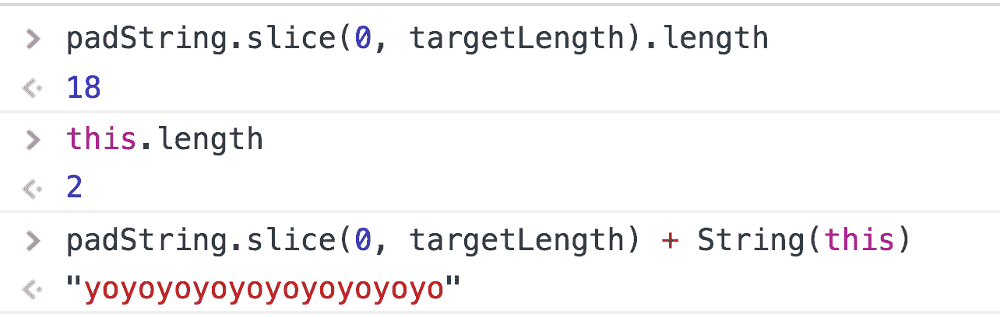

任务完成。下次见！