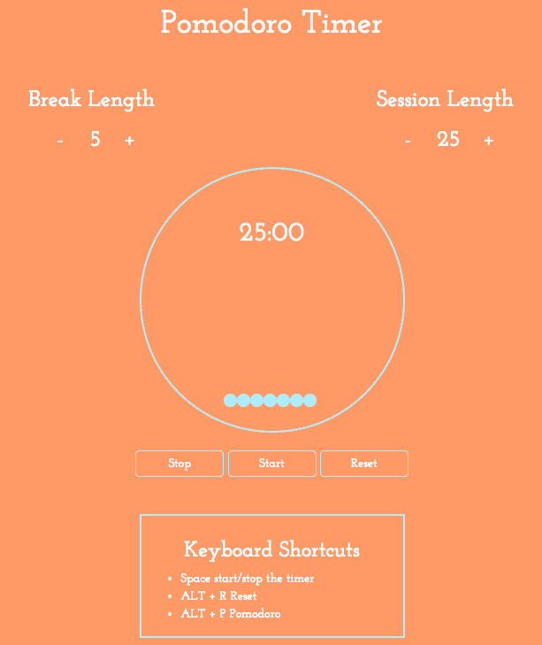
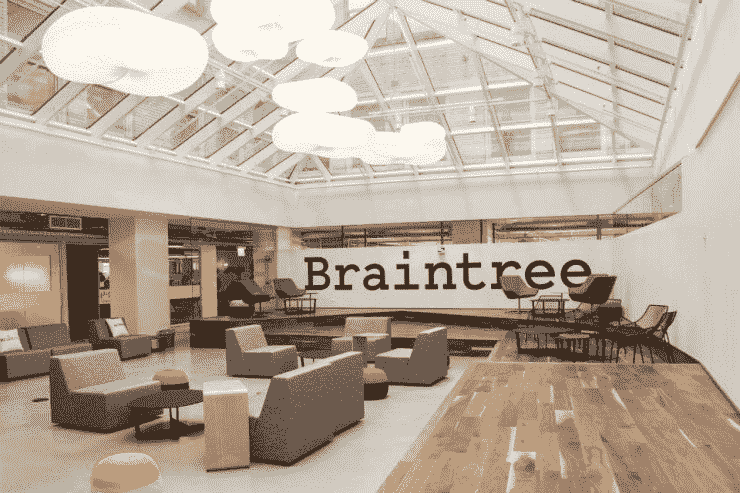

# 我是如何通过做自己喜欢的事情获得顶级技术实习的

> 原文：<https://www.freecodecamp.org/news/how-doing-something-i-love-landed-me-a-top-tier-tech-internship-fe78d8b74e48/>

泰勒·米利曼

# 我是如何通过做自己喜欢的事情获得顶级技术实习的

photo by [Rezaul Karim](https://unsplash.com/@reza565)

爱上编码大概一年了。从那以后，我建立了无数的项目，完成了超过 1000 个小时的在 T2 自由代码营的课程，并接受了我在 T4 布伦特里的第一份实习工作。

虽然许多人没有付出太多努力就取得了类似的成功，但我认为有必要指出的是，我目前在巴克内尔大学主修化学工程，这是一所一直排在计算机科学前 50 名之外的学校。

一年多前，我第一次参加技术面试。招聘人员来自微软，他正在举行公开的校园面试。我记得我坐下来接受采访时，对他会问我的问题完全是天真的。

简单介绍了一下之后，他问我，“你如何反转一个链表？”

我停顿了一下，试图抑制我的紧张，然后给了他我含糊不清，显然是捏造的答案。几分钟后，招聘人员感谢我的时间。

我离开的时候，既为浪费了他的时间感到尴尬，又为我刚刚经历的事情感到兴奋。

我简直不敢相信。他们实际上关心我的编码技术能力！

这是如此令人耳目一新，以至于公司能够关注我的平均绩点、我上的哪所学校，以及我在行为问题上与你沟通的能力。我面试的公司似乎并不在乎我主修化学工程。他们只是想看看我是否会编码。

从那里我开始工作。在接下来的一个月里，我发出了近 100 份申请。我愿意抓住任何可能的机会。

截至 1 月，我除了收到普通的拒绝邮件，什么也没收到。一次采访都没有！

但我真的不能责怪他们。我是一名化学工程专业的学生，我唯一的相关经历是选修了两门计算机科学的入门课程。所以我决定最好的选择是接受学校化学工程系的一个暑期研究职位。

photo by [Sai Kiran Anagani](https://unsplash.com/@iamkiran)

在外面，我觉得我要放弃了。但实际上，我对编程的热情加倍了。在我脑海中，我发誓明年会有所不同。

寒假期间，我在 Udemy 上学习了一门 Android 编程课程。我开始在计算机科学课程上投入更多的时间。暑假一到，我就去参加比赛。

### 投入工作

我从一年前就知道，为了获得面试机会，我需要自己做一些项目。我也知道我需要擅长编码和算法问题，这样我才能通过技术面试。

我使用了一个简单但有效的模式来改进我欠缺的地方:

1.  设定一个与你想学的东西相关的目标。
2.  找到该科目的最佳学习资源(在您的预算范围内)。
3.  制定一个一致的时间表来利用这些资源。
4.  利润。

对我来说，去年夏天的一个真实例子是这样的:

1.  构建高质量的网络应用组合
2.  免费代码营是免费的，非常棒
3.  每天编码，要么在早上，要么在晚饭后

One of my earlier projects, a [pomodoro clock](http://twmilli.github.io/pomodoro/)

我用类似的方法来提高我的技术面试技巧，用[破解编码面试](https://www.amazon.com/Cracking-Coding-Interview-Programming-Questions/dp/0984782850/ref=sr_1_1?ie=UTF8&qid=1481228995&sr=8-1&keywords=cracking+the+coding+interview)、【Pramp.com】和[Leetcode.com](https://leetcode.com/)。

### 每天编码

在这个夏天，我几乎每天都写代码。大多数时候，我醒来时会想到我当前的项目，对我将要开发的功能感到兴奋。但是肯定有一些例外。

> "业余爱好者坐着等待灵感，我们其余的人只是起身去工作."

> 斯蒂芬·金

在这些日子里，我通常会强迫自己编码至少 30 分钟。30 分钟后的大部分时间里，我都沉浸其中，并乐于继续下去。但如果没有，我完全允许自己停下来，在剩下的晚上远离电脑。

我还特意在每个周六或周日与朋友一起在校外大自然中度过。正如卡尔·纽波特在《深度工作》中所说的那样，远离科技，在大自然中呆上一段时间已经被证明具有恢复活力的效果。

The article didn’t seem complete without a sweaty picture of me doing a headstand in the alps

同样值得注意的是，我在盛夏从工作和编程中抽出两周时间，和家人一起去阿尔卑斯山远足度假。

从五月底到现在，我已经把代码推送到我的 [GitHub](https://github.com/twmilli) 超过 250 次了。

### 《狩猎》

到夏天结束时，我已经建立了 21 个新的前端网站来炫耀。我知道我有机会得到实习机会。但是由于化学工程在我的简历中名列前茅，我害怕我没有机会了。

我刷了刷简历炫耀我的新项目，得到了关于 [/r/cscareerquestions](https://www.reddit.com/r/cscareerquestions/) 的反馈。我制作了一个[电子表格](https://docs.google.com/spreadsheets/d/15BjTUNgeKBznDpKjsvMWYfs1FkivRM0H2uZkaE7cICs/edit?usp=sharing)来记录我申请了哪里，以及我的申请状态。

8 月 20 日，我晕头转向地向贝尔维迪尔贸易公司发出了我的第一份申请。这似乎太早了，但我不会像去年那样犯申请太晚的错误。

An entertaining “zombie shooter” game I built with a few friends

一周后，他们给了我一个编码挑战。我得了 a。

几天后，我们安排了一次电话采访。

第二天，我订了一张去芝加哥的机票，参加我的第一次现场面试。

面试的前一天晚上，我只睡了不到 4 个小时——既出于期待，又担心错过早上 8 点的航班。

当我赶到办公室开始面试时，我遇到了几个同一天参加面试的学生。我扫描了他们的姓名标签:卡内基甜瓜，康奈尔，和 UMichigan。我真的属于这里吗？

第二天下午，我接到一个从芝加哥打来的电话。他们想出价。

连续第二个晚上，我几乎睡不着——这次是因为兴奋。就在几周前，我还担心找不到实习的地方。现在才九月中旬，我已经有了一份工作。

但是我还没说完。我最近读了 Haseeb Qureshi 关于 T2 薪资谈判的文章，我决定采纳他的建议。我给几个我梦想中的公司发了封邮件，告诉他们我刚刚收到了一份工作邀请，但是我更愿意为他们工作。

几天后，布伦特里的一名招聘人员回复了我的信息。类似的过程接踵而至:编码挑战->电话面试->又一次芝加哥之旅。

It didn’t hurt that the office was pretty sweet…

在从办公室回机场的出租车上，我接到了另一个电话。他们想延长报价。不久之后，我接受了邀请，并和他们协商在旧金山的办公室工作。

### 一路走来的经验教训

第一课:我没有得到实习机会，因为我是个天才，或者说是天生有天赋的程序员。我得到它是因为我付出了时间和努力。

一个对化学充满热情的非化学工程专业学生可能会经历与我的编码团队相似的过程，并成为一名比我更好的化学工程师。

如果你开始专注于你喜欢的事情，你将比其他人拥有巨大的优势。

第二课:不要害怕设定看似遥不可及的目标。

大胆的目标令人兴奋。当你采取行动达到目标时，你得到的快感将远远超过你可能达不到目标的负面影响。

即使你没有达到目标，你也会比其他方式走得更远。

第三课:尝试新事物。

一年前我完全没有想到我会爱上编程。

愿意抓住机会，尝试你舒适区之外的东西，你可能会找到你喜欢的东西。

### 我发现一些有用的资源

*   [软件工程日报](https://softwareengineeringdaily.com/)——我最喜欢的播客，用于跟踪软件领域的新趋势和话题。
*   詹姆斯·阿尔图彻的《选择你自己》
*   [深度工作](https://www.amazon.com/Deep-Work-Focused-Success-Distracted/dp/1455586692)由加州纽波特
*   [如何打入科技行业](http://haseebq.com/how-to-break-into-tech-job-hunting-and-interviews/)作者 Haseeb Qureshi
*   [CS75 哈佛讲座](https://www.youtube.com/watch?v=8KuO4r5CHjM&list=PLcSNwoY_zA3b9McOf2rDRinpzyt2hlHzC) —介绍互联网如何工作和可扩展性问题(对系统设计面试问题特别有用)。

非常感谢一路上帮助过我的所有人，感谢你们在百忙之中抽出时间阅读我的文章。

如果你喜欢，点击？所以其他人会在媒体上看到这个。

页（page 的缩写）s:如果你知道今年夏天旧金山有什么便宜的房子，或者你将会在这个地区，并且想要见面，请发电子邮件给我。