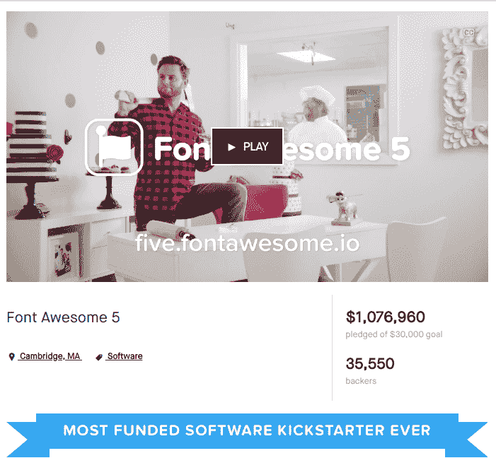

# Font Awesome 是如何成为 Kickstarter 上资金最多的软件项目的——以及我们能从中学到什么

> 原文：<https://www.freecodecamp.org/news/how-font-awesome-became-the-most-funded-software-project-on-kickstarter-9042897369c6/>

如果你不认识他们，以下是他们取得的一些不可思议的成就:

*   在那些在其平台上使用第三方字体脚本的网站中，Font Awesome 占有 20%的市场份额，仅次于谷歌字体，位居第二
*   它们是 Github 在 2012 年最受欢迎的新开源项目，目前在总项目中排名前十。
*   字体牛逼在 7300 多万网站上。根据创始人的说法，每 3 个新网站中就有 1 个使用字体 Awesome。
*   最后但同样重要的是，通过筹集 1，076，960 美元，Font Awesome 成为 Kickstarter 上[资金最高的软件项目](https://www.kickstarter.com/discover/categories/technology/software?sort=most_funded)，并在[开源](https://www.kickstarter.com/discover/advanced?tag_id=20&sort=most_funded&seed=2554470&page=1)项目中排名前三。

戴夫·甘迪和他的团队似乎已经做了一些正确的事情。

如果我们现实一点，很少有人(如果有的话)能达到 Font Awesome 的病毒式传播、知名度和成功。那么，你会从阅读他们是如何制作的过程中得到什么有用的信息吗？

确实非常喜欢！

好消息是，在启动或开发项目时，你可以应用一些简单而基本的经验，以增加你的想法被他人采纳的机会。

今天我将向你们展示字体 Awesome 是如何被 20%的网络用户使用的，这样你们就可以从这个策略中获得灵感来发展你们自己的项目。

想看看它是怎么工作的吗？

我们走吧！

### 第 0 步:变得独一无二

戴夫·甘迪将“字体真棒”作为一个激情项目。但他承认，还有更好的设计师和程序员。那么，如果他不是顶尖的 1%设计师和程序员，他是如何做出超越由更优秀的专业人士领导的项目的东西的呢？好吧，他只是综合了他属于前 25%的技能。

跟着我。

《呆伯特》的作者斯科特·亚当斯(Scott Adams)有一篇很棒的文章，他在文中解释了如何发展一份令人惊叹的职业:

> “如果你想要一个普通的成功生活，并不需要太多的计划。别惹麻烦，去上学，申请你可能喜欢的工作。但是如果你想要与众不同的东西，你有两条路:

> *1。在一件特定的事情上成为最好的。*

> *2。在两件或更多事情上变得非常优秀(前 25%)。*

> 第一个策略很难，几乎不可能。很少有人会在 NBA 打球或者出白金唱片。我不建议任何人去尝试。

> 第二个策略相当简单。每个人都至少有几个领域，通过努力，他们可以进入前 25%。就我而言，我比大多数人都画得好，但我算不上艺术家。我并不比那些永远成不了大器的普通单口喜剧演员有趣，但我比大多数人都有趣。神奇的是，很少有人能画得好，能写段子。这两者的结合使得我的作品如此罕见。当你加上我的商业背景，我突然有了一个话题，很少有漫画家不亲身经历就能理解。"

当我看到这个帖子时，我深受触动。这似乎正是戴夫·甘迪在创建“牛逼字体”时无意识遵循的策略:

> “我非常注重视觉效果。有很多视觉设计师比我好得多。(即使)我也非常专注于技术，(但)有人在技术上比我强得多。但对我个人来说，这种交集并不经常出现，所以这是我发挥自己的优势。”

所以你有它。你有哪 2-3 项技能让你名列前 25%？你能把这些结合起来创造出独一无二的东西吗？

如果你还没有，你想发展的 2-3 项技能是什么？即使你不是表现最好的 1%,他们能融合在一起互相支持吗？

就我而言，结出硕果的技能组合是知道如何写作并在其他出版物上发表，在开源社区建设和商业方面的经验和研究，以及对商业战略的深刻了解和经验。

它们中的每一个都不值得大书特书，因为它们在其他地方相对丰富。但是很难找到其他人能够提供所有这些技能。

**外卖:**

*   找出你拥有的 2 或 3 种可以融入你独特风格的技能，或者去发展那些可以帮助你为你热爱的项目做出贡献或者实现你梦想的技能。
*   开发辅助项目来磨练这些技能
*   主动向他人展示你的副业。一旦他们愿意付钱给你，你就找到了人们真正想要的东西。

### 第一步:挠痒痒，为开源火箭做贡献

让我们回到戴夫·甘迪身上。当他在一家不同的创业公司工作时，他正在寻找一组图标用于他的网站。虽然有一些像样的设置，他不喜欢他们的相机图标。因此，他开始向他的一位联合创始人抱怨，这些图标中没有一个看起来与他想要的足够相似:

> “它们用起来都很麻烦，而且太费力了[……]所以我的合作伙伴告诉我闭嘴，[…]不要打扰他，自己做就好了”。

所以他继续做这个图标，并决定做一整套。

此外，在之前的几个月里，他一直在使用 Twitter Bootstrap，并且非常喜欢它……除了 PNG 精灵:

> “它们只有两种颜色，我对这种设计不感兴趣。所以我决定做一个 drop 来代替 Bootstrap 的图标。由于其他图标字体似乎并不总是能很好地与屏幕阅读器兼容，我也想解决这个问题。”

这是他能做出的最好的决定之一。为一个发展非常迅速的平台解决问题。

当然，你无法提前知道什么会呈指数级增长，但是通过了解最新的技术，你可以感觉到什么在起作用，什么不起作用。如果你在开源项目的早期，你实际上可以解决许多其他人想要解决的一些最突出的问题。

他们做的下一个伟大的举动是让字体免费。这使得任何人都可以顺利地采用它并体验它的神奇之处。

我听到你问他们为什么这样做？

以下是戴夫对此的看法:

> “就我个人而言，我生活中的每一天都受益于开源。所以让 Font Awesome 开源对我来说是一个简单的决定。”

所以遵循他的个人价值观并回馈社会在商业上很有意义。事实证明，这对于整个项目来说是一个巨大的优势，并让它接触到许多愿意付钱给他们来开发字体 Awesome 的人。

#### **外卖:**

*   挠痒痒
*   为你喜欢的酷开项目做贡献，解决你认为缺乏的领域的问题
*   在开源中分享您的解决方案，这样您就可以从原始项目的社区中受益。这样你就可以开始建立自己的观众群
*   在社区所在的地方进行推广。在字体牛逼的情况下，他们在寻找开发者和网页设计师，所以他们去了黑客新闻。

### 第二步:与用户交谈，找到让它在财务上可持续的方法

鉴于 Awesome 经历的巨大牵引力，他们最终进入了著名的 YCombinator。他们认为最有价值的建议之一是:

> “与用户交谈。除非你和人们交谈，否则你无法确切知道他们想要什么”。

简单吧？

所以他们采纳了这个建议，让他们的访问者填写一份关于他们是谁以及他们如何使用牛逼字体的调查。6，000 人完成了这项历时 45 分钟的深入调查。一旦调查结束，从调查中有两个关键的收获:用户想要更多的图标，他们更喜欢 SVG 格式。

了解到人们会为更多的图标和使用 SVG 的现代化框架付费，帮助 Font Awesome 建立了他们的 Kickstarter 活动，并开始找到一条通往可持续发展的道路。对于一个开源项目来说，这从来都不是一件容易的事情。

现在，他们有一系列其他的[付费服务](https://fontawesome.com/pricing)从 60 美元/年开始，以获得开源图标之外的其他服务，如专用 CDN 服务(一组分布式服务器，提供互联网内容的快速交付)，以获得加载更快的图标，可编辑的 SVG，甚至更多的新图标和新图标包。

他们还通过向数百万网站设计者和开发者访问者提供广告来赚钱。

#### **外卖:**

*   一旦你获得了流量，不管是多还是少，调查你的用户，了解他们是谁，他们如何使用你的服务或产品，并找出他们还想要什么或他们还想要解决什么挑战
*   为了获得更多从开源项目中赚钱的想法，这里的是我喜欢使用的 Lars Zimmermann 的一个有用的备忘单。

### 步骤 3:让社区参与进来

所以一旦 Font Awesome 找到了让人们使用其服务的方法，并找到了愿意为此付费的用户，那么除了让人们容易使用之外，开源还有什么意义呢？

在他们的案例中，不是让人们帮助他们共同开发代码或更多的图标，因为他们不允许这样做。但是坦诚有助于他们得到想要帮助的人的参与。

他们逐渐建立了一个社区。有时候，这个社区里有些人会自发地做出贡献。

有一个关于一个叫 Jeremy 的意大利人的故事，他主动回答了 GitHub 上的许多问题，这些问题每天都在堆积，并对社区的其他人有所帮助。

因此，字体牛逼让人们帮助照顾社区，公开他们想要什么新图标的问题，并与他们一起验证新项目。

当你获得大量的流量时(在他们的情况下，每月有数百万的访问和数十万的用户)，这种客户支持真的可以帮助一个小团队专注于更具战略性的东西。

#### **外卖:**

*   允许人们做他们想做的事情。当他们碰巧对你有所帮助时，与他们互动，鼓励并经常认可他们所做的好事。你甚至可以每天或每周安排一点时间来审视正在发生的事情，并公开表彰你的社区正在发生的好事。

### 第四步:在你需要之前建立部落

人们经常提到 Kickstarter 作为创业者的验证工具。但这与事实相去甚远。在你考虑发起众筹活动之前，你的产品应该得到验证。

要在 Kickstarter 上做大，在你发布之前需要做大量的工作，例如构建你的故事、吸引社区、创建视频、打造合适的产品等等…

这和 Kickstarter 没有任何关系。

想象一下。你正在准备一个生日聚会，你在一周前就准备好了装饰品、活动等等，当日期到来时，你意识到你忘记了沿途结交想参加你聚会的朋友。所以派对开始了，你疯狂地在街上或市场上拦住人们，问他们是否愿意参加你的派对…派对在四个小时后结束，有两个人参加！

正如赛斯·戈丁[所说](https://www.thedominoproject.com/2012/06/why-kickstarter-campaigns-fail.html):

> “在你需要之前建立你的部落，给部落一些他们想要的东西，让他们很容易相信这真的有用。Kickstarter 看起来像是一条捷径。不是的。这是一个最大化器。”

这就是字体牛逼遵循的建议。

2014 年，一旦他们有了自己的部落，他们就启动了第一个 kickstarter 活动，主要是自制视频、副本和视觉效果。这第一次努力从 732 个支持者那里获得了 71，000 美元，这相当不错，特别是对于一个开源项目来说。

但是事实呢？

鉴于他们的服务拥有庞大而疯狂的用户群，他们可能会做得更好。

我通常建议那些开始他们的项目的人节省开支。我看到许多处于创业模式的人花费自己破产，因为有这个标志，视频或网站，他们必须有。

因此，建议是:“不要花任何东西，除非有人为你的服务付钱，并证明这种花费是合理的，或者除非投资可以自我增值，并且支付的费用超过它的成本。”

但是一旦你证明了你的用户喜欢你的产品，就像甘迪一样，你就应该谨慎地去做，不要再精打细算，什么都自己做了:

> “当人们参观你的项目时，你的视频是他们看到的第一样东西。但是 Kickstarter 视频很难制作。我们应该知道。几年前，我们为黑领带推出了 Kickstarter，这是一个多重图标集。我们自己编剧，导演，拍摄，剪辑。它显示了。视频质量很差，整个事情不得不被过度渲染，因为我们不知道如何做音频，背景音乐太糟糕了，我在镜头前很笨拙。很糟糕。尽管如此，该活动确实比我们的目标提高了 200%多一点，这太棒了。但是我们认识到，我们需要与真正知道如何制作非凡视频的人合作。

所以两年后，在 2016 年，他们继续组织新的 Kickstarter 活动。这次他们雇佣了一个专业团队。为了找到合适的视频制作人，他们去了 Videopixie，一个制作公司可以竞标你的业务的平台，并寻找那些更专注于讲述他们独特的故事而不是技术的人。他们最后去了诺克斯大街，诺克斯大街上的人发了一段视频，解释了这项服务的好处，这段视频非常有趣，足以让人们想要分享它:

[https://www.youtube.com/embed/CNoH3J7iSrA?feature=oembed](https://www.youtube.com/embed/CNoH3J7iSrA?feature=oembed)

这一次，该视频帮助该活动从 35，550 名支持者那里筹集了 1，076，940 美元，成为该平台上迄今为止获得资金和支持最多的软件和开源项目。

因此，15，000 美元的投资，这听起来像是花在一个视频上的一大笔钱，帮助他们比之前的活动多筹集了 1，000，000 美元。那是 66 倍多！

因此，如果你不是一个专业的沟通者，请优秀的专业人士帮助你做好媒体工作。但只有当你设法聚集了一个可以证明你做这种投资是合理的社区。

如果你想深入了解他们 Kickstarter 活动的本质细节，这里的是戴夫·甘迪解释这一切的文章。

#### **外卖**:

*   在你考虑创建一个众筹活动之前，找到你的第一批免费和付费用户，他们会帮你找到提供什么
*   如果你做对了前面的步骤，并且你有现金，用它来支付一个专业人士来帮助你讲述你的故事。在竞选期间有太多的事情要做，如果做得好，就会有回报
*   一旦你有了一个喜爱你的产品或服务的狂热部落，就把众筹作为一个最大化器来推出你的新产品，在你创造下一个大东西之前让人们来资助它

### 概括起来

Font Awesome 已经成为谷歌字体提供的两大字体服务之一，并成为 Kickstarter 上最成功的软件项目。以下是你可以根据他们的经验为你的项目量身定制的 5 个要点:

1.  找到并实践你独特的技能组合。不需要成为前 1%的天才。在两种或两种以上的技能中名列前 25%,混合使用它们，并且独一无二
2.  **贡献给别人的项目或者已经发展了自己受众的平台**。挠痒痒你可能需要改进这些项目，在开源上分享，从接触他们的观众中受益，并开始建立你的部落
3.  **一旦你有了自己的部落，调查他们，了解他们是谁，他们的需求，并找到对他们来说足够有价值的服务或产品来获得报酬**。
4.  **邀请您的社区提供帮助**。让他们做他们想做的任何事情，用他们可能需要的任何工具支持他们，并公开承认和促进他们的工作

如果你做到了所有这些，你就准备好利用众筹运动来最大化(T1)(但不是之前)**。**留出现金支付给专业摄影师、文案和制图师，他们能帮你比你更好地讲述你的故事。

*最初发表于[boldandopen.com](http://boldandopen.com/font-awesome-kickstarter/)。*