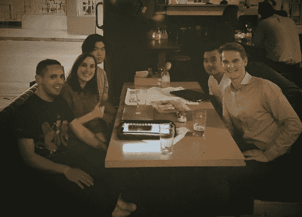
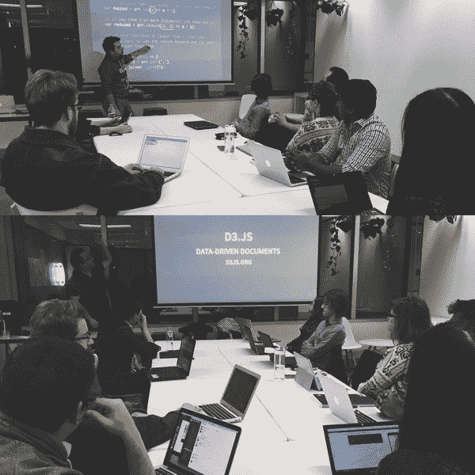
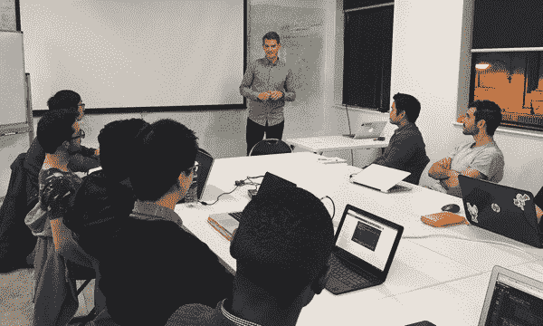
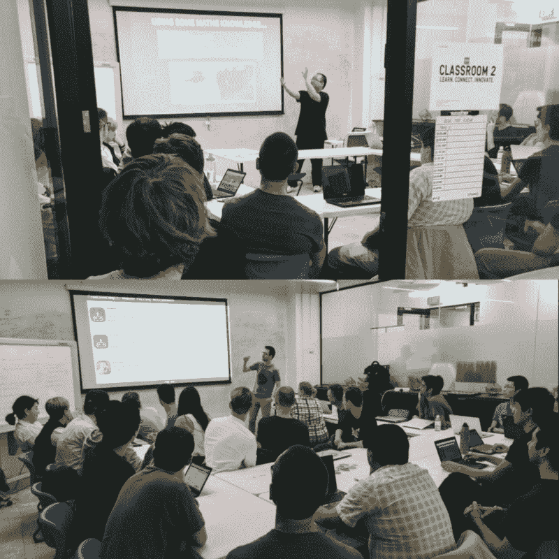

# 作为一名新的训练营毕业生，freeCodeCamp 如何让我脚踏实地

> 原文：<https://www.freecodecamp.org/news/how-free-code-camp-keeps-me-grounded-as-a-bootcamp-grad-fc08f880371/>

作者:LJ 肯沃德

# 作为一名新的训练营毕业生，freeCodeCamp 如何让我脚踏实地

[photo credit](http://www.effectsbay.com/wp-content/uploads/2013/07/Metric_Guitar_Pedalboard_2013_01.jpg)

过去的一年太疯狂了。是的，我从卡车司机转型为全职初级开发人员。但这不是那个故事。

这是我和一群来自自由代码营#Melbourne Meetup 的了不起的程序员度过的一年。

我们开了 13 次会。334 名营员加入了我们的 meetup.com 团队。

我们最低上座率:3 人(包括我)。我们最高上座率:33 人(包括我)。

我们的 Slack 小组收到了来自 66 个人的 2400 条消息。

我们进行了 12 次闪电式会谈:

*   马修·麦克对 D3 的介绍
*   Harry 介绍 ES6
*   杰克逊·贝茨的无密码认证
*   马克·波奇努拉介绍原子
*   介绍揭示。LJ Kenward
*   Trello x Pomello 项目组织和时间跟踪由 [Jackson Bates](https://www.freecodecamp.org/news/how-free-code-camp-keeps-me-grounded-as-a-bootcamp-grad-fc08f880371/undefined)
*   如何克服你对 Regex 的恐惧
*   Matthew Mack 的算法复杂性和大 O
*   杰克逊·贝茨为开源做出贡献
*   阿尼科的《斯坦契尔引论》
*   本·戴利的五分钟五分投球
*   开始使用 OBS Studio 录制视频 [Matthew Mack](https://www.freecodecamp.org/news/how-free-code-camp-keeps-me-grounded-as-a-bootcamp-grad-fc08f880371/undefined)

…和一场史诗般的圣诞表演。

简而言之，freeCodeCamp Melbourne Meetup 开始时规模很小，很一般，现在正在发展壮大。我个人被我周围的人激励和推动，自由代码营的成员是我所知道的最有激情的人。

### 开始的故事

2016 年 4 月 19 日，我们在澳大利亚墨尔本一家名为 1000 Bend 的酒吧举办了首届 freeCodeCamp #Melbourne meetup。我很早就到了，这样我就能订到一张大桌子，因为酒吧不允许你提前预定桌子。说我天真，但我不知道人们喜欢在星期二下班后去城里的酒吧喝酒！

我发现了一个两人桌，开始恐慌。我们有 9 个回复！最后，我鼓起勇气，提出如果我们可以交换桌子的话，请一对不错的夫妇喝几杯。幸运的是，他们是王牌，几杯龙舌兰酒后，我得到了一张桌子，至少有八个压扁的程序员！

几个勇敢的人闯了进来，发现了我是哪一个！我盯着每个我认为可能是程序员的人，这很奇怪，我很奇怪。

Talk about humble beginnings!

我很快意识到酒吧对编码来说很糟糕。

我经常带着耳机在酒吧和咖啡馆里玩笔记本电脑，但只是一个人。噪音和缺乏空间是可怕的。我们互相了解了一下，做了一些 Github 页面的东西。很酷。

第二次聚会是在中央商业区的维多利亚州立图书馆。它有巨大的空间和大桌子。但是我从来没有在图书馆学习过。我很快发现你不能预定桌子，找到空椅子就像在草地上偶然发现独角兽一样容易。

所以我不得不囤积椅子，当告诉人们我需要它们时，我感觉自己像个 A 级的混蛋。有人要来。我发誓。

最后，在 6 个回复者中，有 3 个人出现了。所以我把椅子扔了。

此时，我实际上正在参加一个编码训练营，所以我问他们是否可以接待我们。每两周举办一次聚会对我来说非常重要。我需要其他人的责任，我需要帮助，需要接触，所以这一切感觉纯粹是自私的！

当我们开始在训练营举办活动时，我们收到了 13-16 份回复，其中大部分都参加了！

我们以闪电谈话开始聚会，因为我们有一个私人空间和一台投影仪。马修用 D3 让我们惊叹。我的一个训练营同学 Harry 介绍了 ES6。我甚至还不知道 Git 和 GitHub 的基础知识。

Harry (top) talking about ES6, and Matthew giving an intro to D3 (bottom)

### 稍微休息一下

6 月，我从为期 3 个月的训练营毕业。耶！我一周又一周地知道校园里是否有我们聚会的地方，到现在为止，我被这些课程推向了找工作的狂热中。我不得不放弃我们的会面。*悲伤的脸*

然而，露营者仍然在编码。松弛组仍然有 peeps 聊天。脸书集团和 Meetup 集团仍然有人加入。

我在一家很棒的公司实习， [Xero 会计 app](https://www.freecodecamp.org/news/how-free-code-camp-keeps-me-grounded-as-a-bootcamp-grad-fc08f880371/undefined) 。他们后来给了我一个全职初级开发人员的职位，我欣然接受了！

Visiting the Xero office in San Fran on the Catalyst AU Trip

九月，我终于可以把时间放回 freeCodeCamp Meetup 了。当你找到工作时，学习并没有停止。其实感觉这才是真正开始的点！

### 备份和编码

作为组织者，获得一个永久的场地对我来说是使 meetup 成功的最重要的事情。没有场地，我个人觉得压力太大，坦白说，工作量太大。那只是我的现实。

我通过谷歌找到了一个名为[集体校园](http://www.collectivecamp.us/)的合作空间。原来他们已经扩展到兼职编程班，如[Code collection](http://codecollective.xyz/)，所以他们非常渴望加入！集体校园是我们的第一个官方赞助商，并愉快地继续主办我们每两个星期！

Nathan Gell (OG Meetup attendee from first photo) doing a “Success Story” Lightning talk, after landing his first coding job!

我们以杰克逊·贝茨关于无密码认证的闪电式演讲拉开了序幕。

杰克逊比我们大多数人在自由代码营课程中走得更远。他对自己的时间和知识很慷慨。他和 OG 成员[马修·麦克](https://twitter.com/matthras)已经成为闪电谈话和代码助攻的主要对象。你可以在 [#Open2017，](https://medium.freecodecamp.com/announcing-open2017-the-online-new-years-eve-event-for-developers-cf7bf57e6ac9) FCC 新年前夜直播上听 Jackson，或者在 [freeCodeCamp 论坛](https://forum.freecodecamp.com/)上找到他帮助世界各地的程序员。

[Nathan Gell](https://twitter.com/nathan_gell) 还分享了他获得第一份开发人员工作的成功故事——我们在当地的第一次成功！对于闪电，内森启发我们打印出他目前工作的原始招聘广告，圈出他实际拥有的技能(相对于公司说他们需要的技能)并分发出去。圈子不多。这对我们所有人都是一个很好的教训，无论如何都要抓住机会！

今年高中毕业的马克·P(Marc P)站起来介绍 Atom 编辑器。Marc 是一名常客，他很抱歉因为高中期末考试而错过了最近的聚会！考试，马克，可能更重要！

小心马克。他的[反人类卡](http://cardsagainstmac.herokuapp.com/)项目是 dope。再过三年多，当他大学毕业时，他将遥遥领先！

最近，我得到了一个绝佳的机会，通过一个非常酷的澳大利亚项目，名为 [StartUp Catalyst](http://startupcatalyst.com.au) ，我访问了三藩市，并与脸书、谷歌、Airbnb、Twitter 和其他一大批初创公司的人会面。那天晚上，杰克逊和内森开始主持聚会。

当我不在的时候，有人第一次来参加我的聚会，这有点奇怪。我觉得有人在我不在的时候来过我家，但我意识到他们在我不在的时候把这个地方变得稍微好了一点！

Our biggest meet up yet, Matthew on Big O and Jackson on Open Source, people flowing out the door! Not enough space, a good problem to have!

### 我如何管理聚会

我管理学习小组的方式可能和其他人有些不同。我很擅长动手。我认为自己是一个宴会女主人(和最棒的女主人！)我努力让每个人都感到受欢迎，我努力把其他人联系在一起。我也经常重复自己，当谈到鼓励人们提问时，我可能会站在“鼓励”和“欺负”之间的线上，让人们做轻松的谈话！\_(ツ)_/

### 所有的奖励

我不断地被我的编码营员同伴所激励和鼓舞。我的科技之路不是你传统的 FCC 故事。他们在街上大喊:“我参加了有偿训练营(“*叛徒*”)！*哈哈*，但是是营员让我脚踏实地。

对我来说，吃老本很容易。我得到了"工作"我正式成为初级开发员了。我的工作有助于我在工作中学习。他们提倡工作/生活平衡，他们不想让我把自己累垮。

太好了！我仍然需要被学习的人和工作之外的人包围，在这一点上失败感觉更容易一些。我发现自己需要和那些有动力和决心的人在一起，这是自由代码营员所独有的。

自由代码营员是敬业的、有灵感的、渴望的，他们在管理家庭、工作和生活的同时学习编码。他们帮助人们。他们合作。他们满怀激情地编码，并且有着令人惊讶的精确度。他们也是有趣、酷、友好的人，我很荣幸每两周能和他们见面一次！

感谢到目前为止参加的每一个人，以及全世界为 freeCodeCamp 社区做出贡献的所有人！我期待着 2017 年在#墨尔本与大家见面，并继续“编码和协作”。