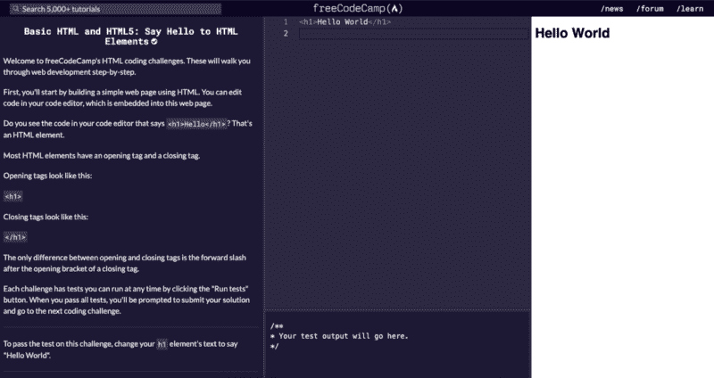

# freeCodeCamp 和#100DaysOfCode 挑战赛如何帮助我在不到一年的时间里获得了工作

> 原文：<https://www.freecodecamp.org/news/how-freecodecamp-and-100daysofcode-helped-me-get-hired-in-under-a-year/>

每周，我都会收到 freeCodeCamp 发来的电子邮件，里面讲述了一个人学习编程并获得梦想工作的故事。这些故事让我在追求自己梦想的工作时保持动力。

现在我只学了 11 个月的 JavaScript 就被录用了？我想分享我的故事，希望能激励其他人。

(**全披露**:2019 年 1 月开始 HTML/CSS/JavaScript 之前，我从大学就有一些 Python 的基础技能。没有什么高级的，但是一个很好的起点。)

作为一名开发人员，我成长的四大源泉是:

1.  自由代码营
2.  #100DaysOfCode
3.  我的导师
4.  网上群体

### 自由代码营

这是我去年一月作为一个新手开始学习 HTML、CSS 和 JavaScript 的地方。它一步一步地教你基础知识。

我从头开始:在空白页上说“你好，世界”。俗话说，“开始是最难的部分”，简单地说“你好”就让它变得容易了。

我学习了基本的 HTML 和 HTML5 教程，然后学习了基本的 CSS 教程。到目前为止，一切顺利。

我继续学习响应式网页设计课程，直到我完成了项目。

这是你实践新技能的地方。没有项目，就没有收获。

我坦白说。很艰难。但是你也有一个庞大的社区在背后帮助你度过难关。一些快速提示:

1.  **从看例子**开始。快速的谷歌搜索会告诉你其他人(新手和专业人士)是如何做他们的项目的。在这里获得一些想法。
2.  **勾画出来**。纸和铅笔是你的朋友。
3.  **关注用户故事**。每个项目都有一套必需的元素，为你提供一些结构(这是*伟大的*开始)。
4.  用谷歌搜索你心中的渴望。有经验的开发人员不会记住所有的东西——你当然不需要。[这是证据](https://www.freecodecamp.org/news/google-not-learn-not-why-searching-can-be-better-than-knowing-79838f7a0f06/)。
5.  **卡住了找其他教程**。抓不住一个概念？谷歌一下，再找一个教程。换个角度。然后再回来。

我顺利地完成了前四个响应式网页设计项目，然后是个人作品集项目。

我在这里花了很长时间，试图让它变得完美。我基本上停止了生活中其他事情的进展，把更多的时间投入到我的投资组合中。

我是说，这就是我展示作品的方式！

Photo by [Veri Ivanova](https://unsplash.com/@veri_ivanova?utm_source=medium&utm_medium=referral) on [Unsplash](https://unsplash.com/?utm_source=medium&utm_medium=referral)

我最终学习了 Bootstrap 来帮助提高响应能力，并且我大大提升了我的 HTML/CSS 技能。将技能付诸实践——这才是最重要的。

就这样，我获得了响应式网页设计认证。这么棒的感觉？

### #100DaysOfCode

我真的无法强调这个挑战在我的学习中扮演了多么重要的角色。没有它我不会被录用。

[#100DaysOfCode](https://www.100daysofcode.com/) 对于所有经验水平的开发者来说都是一个挑战。(psst…那就是说你。)

TL；DR——你连续 100 天每天编码 1 小时。做你喜欢的任何事情。只是代码。在一天结束时，在 GitHub 和 Twitter 上记录你的进展。

别担心——你可能会到处错过一天。生活就是这样。重要的是第二天要回去做。让它成为你日常生活的一部分。

很艰难。这真是太棒了。

Photo by [Tim Grouw](https://unsplash.com/@punttim?utm_source=medium&utm_medium=referral) on [Unsplash](https://unsplash.com/?utm_source=medium&utm_medium=referral)

100 天你在做什么？我从零开始为我的学生开发了一个网站。它给他们的作业评分，记录他们的成绩，跟踪他们的出勤情况，让他们给我发匿名消息。考虑到我以前从未建过网站，这花了 100 天的大部分时间。

在这个过程中，我获得了大量新技术的经验，比如 Node.js、Express.js、AJAX、用户认证、动态渲染、电子邮件协议、HTTPS 和 SQLite。我学习每一部分都是为了现实生活的需要。

同样是为了坐在后面的人——“为了现实生活的需要”。

为了学习而做事是很好的，但这通常不是目的。运用你的技能来解决现实生活中的问题是非常值得的。

如果你还没有接受这个挑战，那就去做吧。你会惊讶于你学到的东西。

有人说“新年决心”了吗？

(有趣的故事:我的妻子在我的#100DaysOfCode 期间感冒了，所以我也使用 Facebook Messenger API 构建了一个[简单的应用程序](https://github.com/brodyd795/sickWaterReminder)，每隔 15 分钟自动向她发送消息，让她多喝水。

她讨厌它。我喜欢？)

### 我的导师

自然，我经常被卡住。

在你跳过这一部分之前，想一想，“嗯，我没有导师，所以……”，你不需要私人导师(尽管这当然很好)。网上有很多人愿意帮助你。

去哪里找？

1.  堆栈溢出:这可能是显而易见的，但是你会惊讶这里回答了多少问题。当我有一个奇怪的 bug 时，我总是从这里开始。
2.  Reddit :我最近发现了几个子编辑，当你有一个在栈溢出上找不到的问题时，这些子编辑非常有用。 [r/learnprogramming](https://www.reddit.com/r/learnprogramming/) 和 [r/learnjavascript](https://www.reddit.com/r/learnjavascript/) 非常适合这个。
3.  [**freeCodeCamp 论坛**](https://www.freecodecamp.org/forum/) :又一个新手提问可以去的免审场所？
4.  再一次，很明显，有些频道比其他的更适合你，但是大多数时候你可以为你的下一个项目找到一个好的教程！我建议在开始之前为一个新项目查阅一些不同的教程——永远不知道谁的教学风格最适合你。
5.  最后但同样重要的是，如果你认识一个愿意回答你没完没了的问题的人(比如我曾经/曾经)，用脑力换咖啡。通常情况下，人们很高兴看到你学习。

我承认，我的导师和教授(一位俄罗斯计算机科学家——谁会想到呢？)对我迄今为止的成功起了极其重要的作用，但我在网上看到很多人没有导师，只能将就。我只是运气好。

### 网上群体

我进入 Twitter 纯粹是为了编程社区。人们如此热衷于学习编码和教授他人。这是巨大的鼓励来源，充满了学习机会。

我个人喜欢听@WellPaidGeek、@ossia、@kvlly、@js_tut、@cassidoo，当然还有@freeCodeCamp。

我还订阅了 Medium 的 news feed 和 Quora。插入一些你感兴趣的东西，享受一下涌入收件箱的文章。这可以让你看到人们正在写什么，以及这个领域正在发生什么。

重要的是，昆西·拉森每周从自由代码营发来的邮件。我喜欢这些。(报名[这里](https://www.freecodecamp.org/settings)！)

* * *

Photo by [Hunters Race](https://unsplash.com/@huntersrace?utm_source=unsplash&utm_medium=referral&utm_content=creditCopyText) on [Unsplash](https://unsplash.com/s/photos/interview?utm_source=unsplash&utm_medium=referral&utm_content=creditCopyText)

### 面试

我是怎么得到这份工作的？这里走几步。

首先，我去了我大学的招聘会。我带了一份展示我个人项目的简历，因为我没有任何正式的工作经验，我和大约 6 家公司谈过。

我问每位雇主的一个关键问题是:“现在我能学到什么来为这份工作做准备？”他们喜欢听到这些，我是真诚的。我会学我需要的任何东西。

几周后，我收到一封电子邮件，邀请我参加其中一家公司的全职面试。我不知道面试会怎么样，但我想试一试。

很轻松，很多关于我的职业变化和我的背景的话题。然后他们在我面前打开了我的 GitHub repos，从一些关于我代码的问题开始。我已经尽力了。

**我一定要强调的:**

1.  我喜欢被挑战。
2.  我想开发能帮助人们的应用。
3.  我热爱我正在做的事情，我有动力去追求它。

我猜进行得很顺利？？‍♂️

### 摘要

加入#100DaysOfCode。做你能用的项目。加入在线社区。申请工作(即使你还不符合工作描述——还没有)。保持动力。

如果你正在学习编程，并希望有一天能找到一份开发人员的工作，请记住:

> 我不是局外人。很多人都在学习编程，每天挑战自己，实现梦想。你也可以。