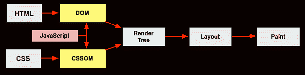
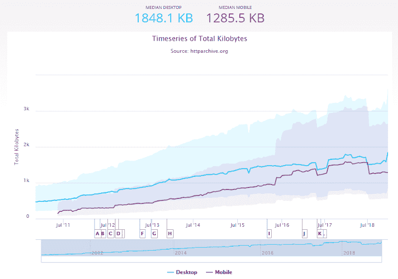
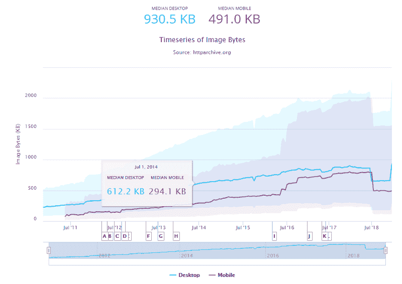
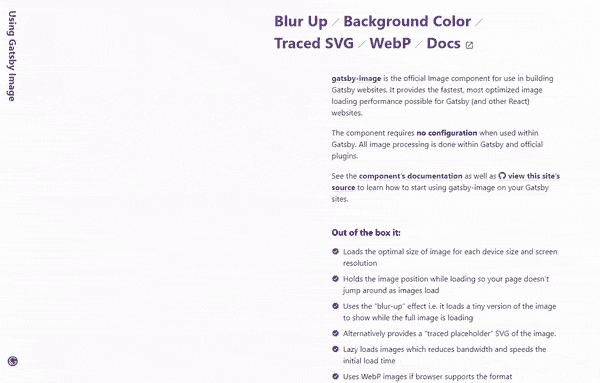

# 盖茨比跑得多快啊

> 原文：<https://www.freecodecamp.org/news/how-gatsby-is-so-blazing-fast-c99a6f2d405e/>

作者:栾奥兰多

# 盖茨比跑得多快啊

The first concept for the time machine in Back to the Future was a refrigerator. They decided to use DeLorean so children wouldn’t attempt to [imitate the film and get trapped inside](http://www.backtothefuture.com/delorean/creation).

性能极大地影响了用户体验。盖茨比建立了现成的快速网站。

在创建该工具时，他们注意到慢速网站在不同方面很慢，但快速网站在类似方面很快。所以在框架中烘焙优化方法产生了盖茨比。

从我的经验来看，盖茨比设立 [webpack](https://webpack.js.org/) 是为了打造最佳性能。Webpack 是许多前端项目使用的 JavaScript 模块捆绑器。

A big community develops Gatsby on GitHub, also contributing to the [logo design](https://github.com/gatsbyjs/gatsby/issues/408#issuecomment-245861049).

### 混合静态网站和动态应用

Gatsby 是一个使用 React 的静态网站生成器。它为你网站的每个页面创建 HTML 文件。

因此，在构建网站时，Node.js 将挂载 React 应用程序来创建 HTML 文件，其中包含每条路线的渲染内容。这是盖茨比的核心。

> “盖茨比预先构建了页面，而不是等到被请求时才生成页面”——gatsbyjs.org

让我们回顾一下基础知识，看看为什么这对性能很重要。

当用户通过 HTML 文件访问页面时，浏览器会呈现内容。在没有任何缓存或 JavaScript 的情况下，使用锚标记将在单击时加载另一个 HTML 文件。结果，用户可能不得不等待，或者更糟，在呈现内容时看到一个空白页。

在单页应用程序(SPA)出现之前，这是最传统的网页设计方式。

SPA 通过用 JavaScript 更新内容来呈现页面。更新比下载静态文件快多了。因为它们只加载一个 HTML 文件，并在用户交互时动态更新页面。

React 是一个为 SPA 处理视图层的库。像 React 这样的框架和库不知道渲染什么，除非一些 JavaScript 代码开始运行。因此，将它们构建为 SPAs 将极大地影响关键渲染路径。

Critical Rendering Path stalls the render while loading and executing JavaScript.

Gatsby 有一个 webpack 配置来为第一次渲染提供足够的内容:

*   **HTML** 标签
*   **JavaScript** 代码设置为[异步](https://developer.mozilla.org/en-US/docs/Web/HTML/Element/script#Attributes)，是用户交互所必需的，但不是第一次渲染所必需的
*   CSS 作为内联文件，所以不需要下载它们

### 代码分割和缓存

在构建页面时，Gatsby 可以看到页面需要哪些组件，并让 webpack 自动进行代码拆分。这通过设置[动态导入](https://webpack.js.org/guides/code-splitting/#dynamic-imports)来实现。

通过这种方式，浏览器将只请求页面所需的文件，而不是整个网站，从而加快了与页面交互的时间。

因此，只有当用户与链接交互时，其他页面的链接才会下载它们的文件，从而降低导航速度。

为了避免这个问题，Gatsby 的 webpack 配置应用了一种叫做[链接预取](https://developer.mozilla.org/en-US/docs/Web/HTTP/Link_prefetching_FAQ)的技术。

浏览器加载完页面后，会自动寻找具有预取属性的链接进行下载。然后，当用户单击一个链接时，该页面请求的文件很有可能已经在缓存中。

### 每个页面都是一个 React 应用程序

在静态网站中浏览页面仍然需要加载 HTML 文件，但对 Gatsby 来说不是——它们是 React 应用程序。

> “Gatsby 生成你网站的 HTML 页面，但也创建一个 JavaScript 运行时，一旦最初的 HTML 加载完毕，它就会接管浏览器”——gatsbyjs.org

另一个页面的每个锚定标签将通过[Reach Router](https://reach.tech/router)(React with accessibility 上构建路线的工具)成为一条路线。它看起来像是从一个 HTML 文件改变到另一个文件，而事实上，它是一个更新页面内容的 SPA。

### 图像优化

[HTTP Archive](https://httparchive.org/) 跟踪很多热门网站，页面请求的数据类型大多是图片。

[Total Kilobytes](https://httparchive.org/reports/page-weight#bytesTotal) — The sum of [transfer size](https://www.w3.org/TR/resource-timing-2/#dom-performanceresourcetiming-transfersize) of all resources requested by the page is around 1285.5 KB for mobile.

[Image Byte](https://httparchive.org/reports/page-weight#bytesImg)s — The sum of transfer size of all external images requested by the page is 491.0 KB for mobile.

优化图片可能是网站性能提升的最佳方式之一。

下载的字节数越少，意味着需要的带宽越少，因此浏览器可以更快地下载和呈现内容。这些是我们可以做的一些优化:

*   将大小调整到所需的相同空间
*   为桌面和手机生成不同分辨率的[响应图像](https://developer.mozilla.org/en-US/docs/Learn/HTML/Multimedia_and_embedding/Responsive_images#How_do_you_create_responsive_images)
*   移除元数据并应用压缩
*   应用延迟加载来加速初始页面加载
*   加载图像时显示占位符

这可能需要很多努力，盖茨比有一个解决方案:整个过程可以自动化。

与《盖茨比》中的许多工具一样， [gatsbyjs-image](https://www.gatsbyjs.org/packages/gatsby-image/) 由 GraphQL 提供支持。这个插件为下载设置了不同分辨率的图片。它创建一些缩略图并应用压缩。所有这些都在建筑的台阶上。

当加载图像时，一种“模糊化”技术会在 HTML 文件(或只是背景)中显示一个非常低质量的图像预览。编码 GraphQL 查询以创建自动化优化的所有工作都减少了。看看这个演示:

[Demo from Gatsby](https://using-gatsby-image.gatsbyjs.org/) for optimized performance with images. The “blur-up” technique is also used by Medium.

### 缩小和唯一的文件名

这些技术已经被流行的框架和库广泛使用，在 Gatsby 中没有太大的区别。

使用 webpack 构建时，默认情况下所有文件都被缩小为。因为浏览器不在乎漂亮的代码，所以为什么不把所有东西都写在一行呢？

通过在文件名上分配一个散列来构建时，文件是唯一的。如果有什么变化，文件会有一个新的名字。

这背后的原因是允许托管这些文件的服务器为浏览器缓存提供较长的持续时间。

所以当用户回来访问网站时，他们已经有了这些文件。文件中的更新将在构建时给出一个新的文件名。所以浏览器下载该文件，因为它与缓存中的文件不匹配。

### 更多资源及其他

Gatsby 关心性能优化，所以你不需要。

如果你对盖茨比在幕后是如何工作的更感兴趣，可以看看[文档](https://www.gatsbyjs.org/docs/behind-the-scenes/)。

我还推荐盖茨比团队的这个网络研讨会，[幕后:是什么让盖茨比变得伟大](https://www.gatsbyjs.com/behind-the-scenes/)。

我在 Udemy 上教[盖茨比，并和盖茨比一起开发了一家](https://www.udemy.com/gatsby-crie-seu-site-pessoal/)[公司的网站](http://upx.com)，以及我的[个人网站](http://luanorlandi.github.io)。

我在教导和传播盖茨比有多棒。[在 twitter 上关注我](https://twitter.com/luanorlandi)阅读更多关于科技和盖茨比的话题。