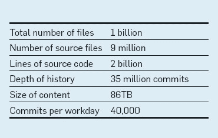
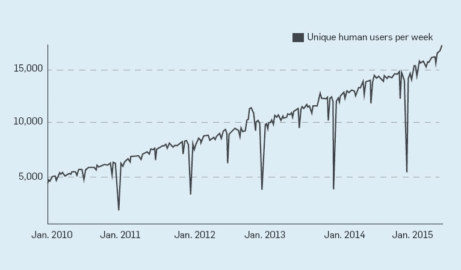
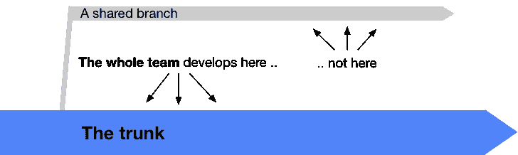
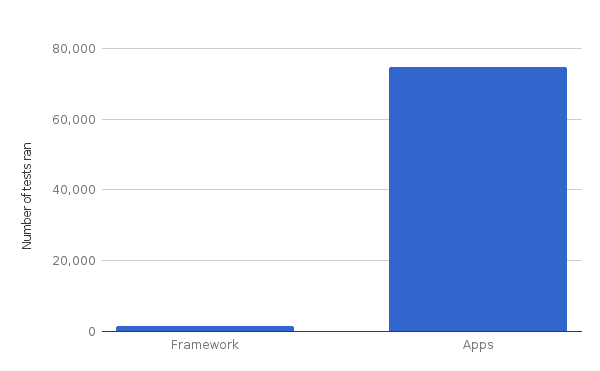
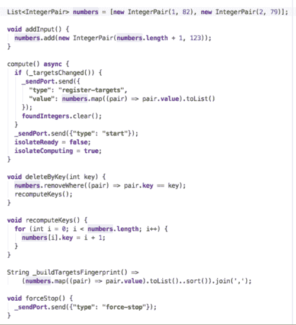
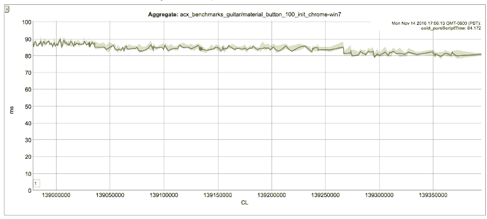
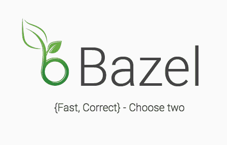

# 谷歌如何构建网络框架

> 原文：<https://www.freecodecamp.org/news/how-google-builds-a-web-framework-5eeddd691dea/>

菲利普·赫拉切克

# 谷歌如何构建网络框架

众所周知，谷歌使用一个单一的存储库来共享所有 20 亿行代码，并且使用基于主干的开发模式。

This is easily one of the largest single code repositories in the world. [Source](http://cacm.acm.org/magazines/2016/7/204032-why-google-stores-billions-of-lines-of-code-in-a-single-repository/fulltext).

对于公司外部的许多开发人员来说，这是令人惊讶和违反直觉的，但它确实工作得很好。(上面链接的文章给出了很好的例子，这里就不赘述了。)

> 谷歌的代码库由来自世界各国数十个办事处的 25，000 多名谷歌软件开发人员共享。在一个典型的工作日，他们提交 16，000 个代码库变更。([来源](http://cacm.acm.org/magazines/2016/7/204032-why-google-stores-billions-of-lines-of-code-in-a-single-repository/fulltext))

本文是关于在这种背景下构建开源 web 框架的细节。

‘Human users’ means software engineers committing code at Google. (As opposed to source generation tools.) [Source](http://cacm.acm.org/magazines/2016/7/204032-why-google-stores-billions-of-lines-of-code-in-a-single-repository/fulltext).

### 只有一个版本

当你在一个巨大的回购中使用基于主干的开发时，你只有所有东西的一个版本。这很明显。不过，在这里指出这一点仍然很好，因为这意味着——在谷歌——你不能拥有使用 AngularDart 2.2.1 的应用 FooBar 和另一个使用 2.3.0 的应用 BarFoo。两个应用程序必须在同一版本上，即最新版本。

Illustrative image taken from [trunkbaseddevelopment.com](https://trunkbaseddevelopment.com/).

这就是为什么谷歌人有时会说，谷歌的所有软件都处于风口浪尖。

如果你的整个灵魂尖叫“危险！”现在，这是可以理解的。生产代码依赖于库的主干(git 术语中的“master ”)听起来很危险。但是接下来会有一个剧情转折。

### 每次提交 74，000 次测试

AngularDart 定义了 1601 个测试([此处](https://github.com/dart-lang/angular2/tree/master/test))。但是当你在谷歌知识库中提交 AngularDart 代码的变更时，它也会为谷歌中依赖于框架的每个人*运行测试。目前，大约有 74，000 个测试(取决于你的改变有多大——一种启发式方法跳过系统知道你没有影响的测试)。*

多做几项检查是好事。

我只是做了一个只在 5%的时间里表现自己的更改，模拟了类似于更改检测重新插入验证算法中的竞争条件(我在 if statem ent 中添加了`&& random.nextDouble() >` .05 [)。当我运行 1601 次测试时，它没有在任何一次测试中出现。但是它确实破坏了一些客户端测试。](https://github.com/dart-lang/angular2/blob/v2.1.0/lib/src/core/change_detection/differs/default_iterable_differ.dart#L386)

然而，真正的价值在于，这些是对实际应用程序的测试。它们不仅数量众多，还反映了开发人员(不仅仅是框架作者)是如何使用框架的。这很重要:框架所有者并不总是正确地估计他们的框架是如何被使用的。

这也有助于这些应用程序的生产，每月有数十亿美元通过它们流动。框架作者在业余时间开发的演示应用程序和投入数十或数百人年的实际生产应用程序有很大的不同。如果网络在未来是相关的，我们需要更好地支持后者的发展。

那么，如果这个框架破坏了构建在它上面的一些应用程序，会发生什么呢？

### 你打破它，你修理它

当 AngularDart 的作者想要引入一个突破性的改变时，*他们必须去为他们的用户修正它*。由于谷歌的一切都存在于一个单一的回购协议中，所以很容易发现他们在破坏谁，并且他们可以立即开始修复。

AngularDart 的任何突破性变化也包括所有依赖于它的谷歌应用程序中对该变化的所有修复。因此，破损和修复同时进入回购——当然——在所有受影响方进行适当的代码审查之后。

我们来举个具体的例子。当 AngularDart 团队中的某个人做出了影响 AdWords 应用程序代码的更改时，他们会进入该应用程序的源代码并修复它。他们可以在这个过程中运行 AdWords 现有的测试，也可以添加新的测试。然后，他们将所有这些放入他们的变更列表，并请求评审。由于他们的变更列表涉及 AngularDart repo 和 AdWords repo 中的代码，系统自动要求来自这两个团队的代码审查批准。只有这样，才能提交变更。

这对于防止框架在真空中开发有明显的效果。AngularDart 框架开发人员可以访问用他们的平台构建的数百万行代码，他们自己也经常接触这些代码。他们不需要假设他们的框架是如何被使用的。(明显的警告是，他们只看到谷歌代码，而不是世界上所有使用 AngularDart 的 Workivas、Wrikes 和 StableKernels 的代码。)

不得不升级用户的代码也会减慢开发速度。没有你想象的那么多(看看 AngularDart 自 10 月以来的进步)，但它仍然会让事情变慢。这有好有坏，取决于你想从一个框架中得到什么。我们会回来的。

总之。下次有人在 Google [说](https://webdev.dartlang.org/angular/version)某个库的 alpha 版本已经稳定并投入生产，现在你知道为什么了。

### 大规模变化

如果 AngularDart 需要做一个重大的突破性改变(比如从 2.x 到 3.0)，而这个改变打破了 7.4 万个测试，那该怎么办？团队会去解决所有问题吗？他们会修改成千上万的源文件吗，其中大部分都不是他们创作的？

是的。

拥有一个[声音类型系统](https://www.dartlang.org/guides/language/sound-dart)的一个很酷的事情是你的工具可以更有用。例如，在 sound Dart 中，工具可以确定变量是某种类型的。对于重构，这意味着许多改变可以完全自动进行，不需要开发人员的确认。

当 Foo 类上的一个方法从`bar()`变为`baz()`时，你可以创建一个工具，遍历整个 Google 存储库，找到 Foo 类及其子类的*的所有实例，并将所有提到的`bar()`变为`baz()`。有了 Dart 的声音类型系统，你可以确定这不会破坏任何东西。如果没有声音类型，即使这样简单的改变也会给你带来麻烦。*

One keystroke and your code is formatted according to Dart [style guide](https://www.dartlang.org/guides/language/effective-dart/style#formatting). In fact, the guide states: “The official whitespace-handling rules for Dart are **whatever dart_style produces**.”

另一个有助于大规模更改的是 [dart_style](https://github.com/dart-lang/dart_style) ，dart 的默认格式化程序。Google 的所有 Dart 代码都是用这个工具格式化的。当您的代码到达审阅者手中时，它已经使用 dart_style 自动格式化了，所以对于是在这里还是那里放置换行符没有争议。这也适用于大规模重构。

### 性能指标

正如我上面所说，AngularDart 受益于它的从属测试。但这不仅仅是测试。谷歌对衡量其应用程序的性能非常严格，因此大多数(所有？)生产应用有基准测试套件。

因此，当 AngularDart 团队引入一个让 AdWords 加载速度慢 1%的变化时，他们在实现这个变化之前就知道了*。当团队[在 10 月份表示](https://www.youtube.com/watch?list=PLOU2XLYxmsILKY-A1kq4eHMcku3GMAyp2&v=8ixOkJOXdMo)自 8 月份以来 AngularDart 应用程序变小了 40%，变快了 10%时，他们并没有谈论一些合成的微型 TodoMVC 示例应用程序。他们谈论的是现实生活中的任务关键型生产应用，拥有数百万用户和数兆字节的业务逻辑代码。*

### 旁注:密封构建工具

你可能想知道:在 AngularDart 中引入了易剥落的 bug 之后，这个家伙是如何知道在庞大的内部存储库中运行哪些测试的？毫无疑问，他没有亲自挑选 74000 项测试，同样毫无疑问，他也没有在谷歌进行所有的测试。答案就在一种叫做巴泽尔的东西里。

在这种规模下，你不可能有一系列的 shell 脚本来构建东西。事情会变得不稳定并且极其缓慢。你需要的是一个密封的构建工具。

这个语境中的“秘术”与功能语境中的“[纯](https://en.wikipedia.org/wiki/Pure_function)”非常相似。您的构建步骤不能有副作用(如临时文件、路径更改等。)，并且它们必须是确定性的(相同的输入总是导致相同的输出)。在这种情况下，您可以随时在任何机器上运行构建和测试，并且您将获得一致的输出。不需要`make clean`。因此，您可以将您的构建/测试发送到构建服务器，并将它们并行化。

谷歌花了数年时间开发这样一个构建工具。去年它被开源为 [Bazel](https://bazel.build/) 。

由于有了这个基础设施，内部测试工具可以确定每个变更会影响哪些构建/测试，并在适当的时候运行它们。

### 这一切意味着什么？

AngularDart 的明确目标是在构建大型 web 应用程序的生产力、性能和可靠性方面做到一流。这篇文章有望涵盖最后一部分——可靠性——以及像 AdWords 和 AdSense 这样的任务关键型谷歌应用程序使用该框架的重要性。不仅仅是团队吹嘘他们的用户——如上所述，拥有大量内部用户使得 AngularDart 不太可能引入表面的变化。这使得框架更加可靠。

If this all sounds too business-y, you could check out my decidedly-non-business AngularDart projects like [Automatic Donald Trump](https://filiph.github.io/markov/) (Markov chain) or [Prime Finder](https://filiph.github.io/prime_finder/).

如果你正在寻找一个每隔几个月就进行重大检修并引入主要特性的框架，AngularDart 肯定不适合你。即使团队想以这种方式构建框架，我认为从这篇文章中可以清楚地看出他们不能。然而，我们真诚地相信，有一个不那么时髦但可靠的框架的空间。

在我看来，对开源技术栈的长期支持的最好预测是，它是主要维护者业务的一大部分。以 Android，dagger，MySQL，或者 git 为例。这就是为什么我很高兴 Dart 终于有了一个首选的 web 框架(AngularDart)、一个首选的组件库( [AngularDart 组件](https://pub.dartlang.org/packages/angular2_components))和一个首选的移动框架([Flutter](https://flutter.io/))——所有这些都用于构建业务关键的谷歌应用。

马坦·鲁瑞和凯西·沃尔拉斯对本文有贡献。]

*【在[上讨论】Reddit](https://www.reddit.com/r/webdev/comments/5t6f8o/how_google_builds_a_web_framework/) ， [HN](https://news.ycombinator.com/item?id=13614354) ，[推特](https://twitter.com/filiphracek/status/829991585756520448)。]*