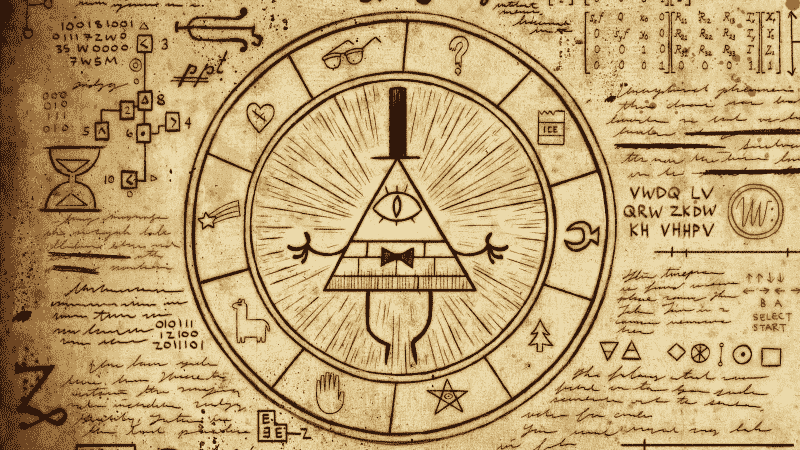

# “重力下降”如何帮助你教你的孩子密码学的基础知识

> 原文：<https://www.freecodecamp.org/news/how-gravity-falls-can-help-you-teach-your-kids-basics-of-cryptography-18e1c6f9ac39/>

卡米尔·图斯塔诺夫斯基

# “重力下降”如何帮助你教你的孩子密码学的基础知识

现在是周三晚上。我的两个儿子和女儿都准备好了。我按下播放键，我们开始了一段旅程，这段旅程将带我们走得比我们预想的还要远。

我们看了第一集[重力下降](http://www.imdb.com/title/tt1865718/)。视觉效果、人物、情节和幽默都是一流的，我们肯定想要更多，但是…我们在片尾发现了一些东西。一些我们没有预料到的事情。这使得观看这个系列更加有趣和吸引人。

一个`encrypted message`。

我们是这样破译密码的。我们自己做这件事很开心。没有在网上查过这些。如果我引起了你的兴趣，我建议你停止阅读，试着自己做这件事。然后你可以回头再来看我下面的解决方案和解释。

#### ZHOFRPH WR JUDYLWB 伊多夫

我们确信这是一个信息。从表面上看，我猜它是用某种替代密码加密的。

> 使用替换密码的加密基本上是根据某种一般规则用其他字母替换字母。解密是通过将此规则反向应用于加密文本来完成的。这种类型的密码已经不再使用，因为它们很容易被破解，例如使用[密码分析](http://practicalcryptography.com/ciphers/simple-substitution-cipher/#cryptanalysis)。你可以在这个[维基页面](https://en.wikipedia.org/wiki/Substitution_cipher)上找到更多细节。

起初，我们对这个故事太兴奋了，还没有把注意力集中在密码上。我们刚刚承认密码存在，但我们不知道如何解密。我以为我们以后会打破他们，但是…

一集过后，我儿子有了一个想法。他想看节目介绍。向后。我心想`why not`？你猜怎么着！当你倒着看的时候，你会听到隐藏的信息:

**三封回信**

嗯… `three letters back`。通常这没有任何意义。但是我们有不知道如何解码的密码。对我们来说，这非常有意义。

#### 你好，凯撒先生

> 凯撒密码是已知最早和最简单的密码之一。这是一种替代密码，明文中的每个字母在字母表中被“移位”一定的位置。例如，移位 1，A 将被 B 替换，B 将变成 C，依此类推。这种方法是以朱利叶斯·凯撒的名字命名的，他显然用这种方法和他的将军们交流。点击阅读更多[。](http://practicalcryptography.com/ciphers/classical-era/caesar/)

我从[这里](https://en.wikipedia.org/wiki/English_alphabet)为每个人打印了英文字母，开始解密:

`Z` → `W`因为如果我们将`3`字母从`Z`向后移动，我们会以`W`
`H`→`E`
……
`B`→`Y`因为如果我们将`1`字母向后移动，我们会在`A`结束，下一个`2`我们必须从字母表的末尾开始`count`，所以最后是`Y`

过了一会儿，我们知道了 ZHOFRPH WR JUDYLWB IDOOV 实际上是**欢迎来到重力瀑布。**

我的孩子喜欢它。

当他们正在解密 next 信息时，我想这是一个向他们展示我工作成果的好机会。这样他们更容易理解。

我开始新的`Swift Playground`是因为它提供了处理代码的很棒的方式。并开始编码。我写这个只是为了好玩，所以请不要评价？：

当人工解码完成后，我和孩子们一起坐在电脑前。我解释说，我的代码做的事情和他们解密消息时做的事情是一样的。但这不是手动完成的，而是自动完成的，可以多次使用。他们不理解代码，如果他们理解，我会很惊讶，但我很确定他们理解了`the idea`。

#### KZKVI QZN wrk kvi HZBH:“ZFFTSDCJTSTZWHZWFS！”

一切都很好，直到第七集。我们开始解码第一个单词:
`KZKVI` → `HWHSF`
哦哦，我们的运气用完了。很明显，密码已经变了。幸运的是，在我们为《T4》这一集解密的信息中有一个`clue`:

凯撒先生将于下周离开，T2 先生将代替

`Ceasar cipher` → `Atbash cipher`

#### 你好，阿特巴什先生

> Atbash 密码是一种具有特定密钥的替代密码，其中字母表的字母是颠倒的。即所有的“A”都用“Z”替换，所有的“B”都用“Y”替换，依此类推。它最初用于希伯来语字母表，但也可用于任何字母表。点击阅读更多[。Atbash 加密字符串甚至可以在圣经中找到。你可以在](http://practicalcryptography.com/ciphers/classical-era/atbash-cipher/)[这里](https://www.gotquestions.org/Atbash-code.html)了解更多。

这一次要多花一点时间，因为我们必须从头开始检查字符索引，然后从字母表的末尾开始查找带有这个索引的字母。我的孩子们再次手动解密:
`K` → `P`因为`K`的索引是`11`，当我们从字母表的末尾开始数`11`时，我们得到`P`
`Z`→`A`
`K`→`P`
`V`→`E`
`I`→`R`
`KZKVI`→`PAPER`这又有意义了。

几分钟后，我女儿走近我，问我她是否正确地解密了这条信息。她做到了。但这不是最有趣的。我注意到她在打印的字母页上写了些什么。在字母表索引`1, 2, 3, …, 26`的上方，她添加了反向索引号`26, 25, 24, …, 1`。

多亏了这个，她再也不用从字母表的末尾开始数了。我们程序员把这个叫做`optimization`。令我惊讶的是，她已经开始改进她的工具集，使工作变得更容易。
我再次准备了一小段能够解码信息的代码:

#### 14–5–24–20 21–16: “6–15–15–20–2–15–20 20–23–15: 7–18–21–14–11–12–5'19 7–18–5–22–5–14–7–5”

一切都很好，直到第一集`14.` 突然密码又变了。这次我们没有得到任何线索。或者只是错过了？

嗯……也许不完全没有任何`clue`。密文中最大的数字是`24`，最小的是`2`。字母表字母有从`1`到`26`的索引。在此基础上我们做了有根据的猜测:
`1`→`A`
`2`→`B`
……
`26`→`Z`

当`14–5–24–20`解码为`NEXT`时，我们知道我们的假设是正确的。

这有点烦人，因为我不想在解码时去掉任何字符。如果这对您不起作用，请删除不支持的`non-aplhanumeric-characters`或添加当前不支持的字符到`.replacingOccurrences`。如我所说。不评判？

#### 5–19–23–6–21–16 18–9–6 4–16–19 22–12–15–10–20–19–25–19

当我们试图解密第`20`集信息中的第一个单词时，我们又失败了。
`5–19–23–6–21–16` → `ESWFUP`

密码已更改。但是我们没有轻易放弃。`Hint`有一个加密的`clue`，说明如何解码这条信息。但是我把这个留给你。做这些东西太有趣了。

请注意，这个系列的`two seasons`用`mysteries and encrypted messages`填充。你不会觉得无聊。

#### 结局？

现在，当我知道我的孩子们喜欢玩加密时，我对`next step`有了一些想法。这肯定不是他们最后一次使用密码和加密信息。

感谢阅读！我希望我能让你对这个有点兴趣。如果你真的和你的孩子一起尝试，请添加评论。我很好奇这对你是否和对我们一样有趣。