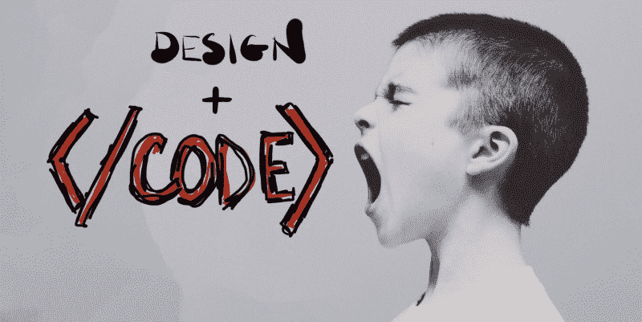
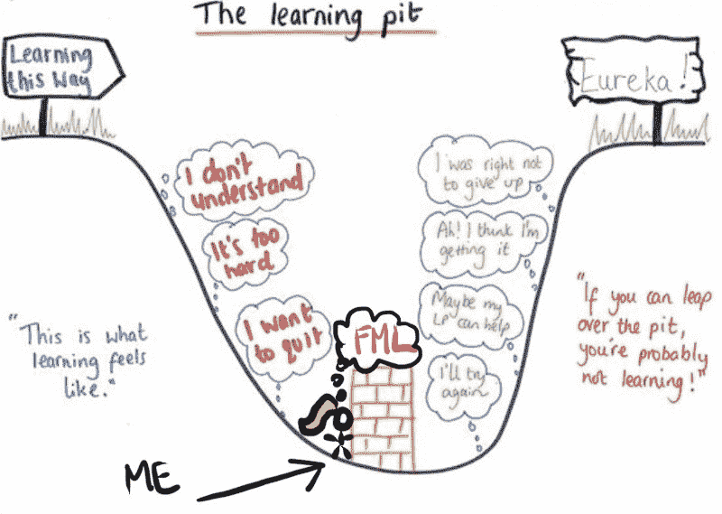
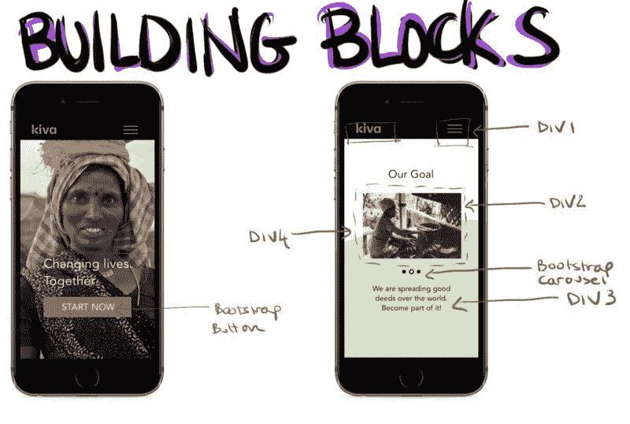

# 憎恨代码如何让我成为一个更好的设计师。

> 原文：<https://www.freecodecamp.org/news/how-hating-code-made-me-a-better-designer-a372f0a91c68/>

艾莉·沃格尔

Photo Credit: Jason Rosewell, Illustrations by Me

# 憎恨代码如何让我成为一个更好的设计师。

#### 从技术角度看产品设计

四个月前，我离开了 LinkedIn 在旧金山的轻松工作，去学习编程。

作为一名有抱负的设计师，我对网络产品是如何构建的一无所知。编码是追求这个目标的下一个合乎逻辑的步骤。

我开始我的密集编码训练营时，并不知道编程逻辑和标记之间的区别，而且我肯定无法告诉你客户端和服务器端代码之间的区别(甚至不知道这些术语是什么意思)。

不用说，学习曲线是痛苦的。

Source: Akoallana

现在，当我面试产品设计职位时，我意识到学习编码对我来说无疑是正确的决定。当我处理设计挑战时，我在剖析问题时，始终如一地充分认识到我的“编码帽”。以下是我从自己的经历中总结出的一些重要经验:

### **保持事情简单**

编码是关于编写干净、易读和功能性的程序，这些程序可以执行一系列微任务。总的来说，你试图解决的问题很大。

过去，在开始一个设计项目时，我会被自己设计的东西的模糊性所淹没。编码教会了我将每个问题分解成小块，作为单独的函数来执行。

现在，当我着手解决一个设计问题时，我会满怀信心地从整体着眼，一点一点地把这些碎片一点点地切掉。

**专业提示:**当你绘制线框时，把每个元素想象成一个组件。我已经开始从开发人员的角度进行设计，将每个组件都视为我的应用程序的构建块。

Responsive website redesign concept for Kiva. My partner and I broke down the design through developers eye, as we were making design decisions.

### **学习如何学习**

过去，当我面对一个我不确定答案的问题，或者被要求使用一项我还没接触过的技术时，我会立刻进入恐慌状态。

编程让我认识到，人脑不可能存储你需要用几十种语言或在多个操作系统上编写的所有信息。编程教你如何思考的基本原理。对于其他一切，有谷歌。

想在 iOS 中编程？学 PHP？或者设计一个聊天机器人？可能有人已经写了他们的经验，或者发表了他们对代码组件或设计元素的解决方案，供您参考。把需要做的事情分解开来，从那里开始你的研究。

### **同理心增强**

如果你不是来自计算机科学或技术研究领域，如工程或数学，学习基本数量的代码可以弥补这么多的差距。它可以提高你对什么是重要的理解，这样当你设计你的产品时，你可以从一个开发者的角度去思考。

> “对于设计师来说，最重要的是对工程师的工作方式产生共鸣，反之亦然，这样双方都可以理解对方的流程，高效地合作。”— [瑞安·斯科特](https://www.freecodecamp.org/news/how-hating-code-made-me-a-better-designer-a372f0a91c68/undefined)，高级设计师， [DoorDash](https://www.freecodecamp.org/news/how-hating-code-made-me-a-better-designer-a372f0a91c68/undefined)

### **为您正在使用的技术进行设计**

你很少会怀疑:这可能吗？学习各种语言和 web 框架的属性将有助于您理解您的范围内的可能性和局限性。

即使您仍然不确定交互是否可以实现，您的编码敏感性也会帮助您找到它。我第一次看到高级 CSS 和 JavaScript 时，我突然有了灵感，因为我发现了一个完整的交互库。

> “理解工程约束让我能够寻找有效的设计解决方案。”— [Elliot Dahl](https://www.freecodecamp.org/news/how-hating-code-made-me-a-better-designer-a372f0a91c68/undefined) ，产品设计师， [Pivotal Labs](https://www.freecodecamp.org/news/how-hating-code-made-me-a-better-designer-a372f0a91c68/undefined)

**亲提示:**做好功课。每种语言都有官方文档。在这之间，[栈溢出](http://stackoverflow.com/)，和谷歌搜索，你应该能够在你把你的设计展示给开发团队之前找到什么是可能的。

### **更好的沟通**

学习顺序编码可以教会你像工程师一样思考。像工程师一样思考可以搭建桥梁，形成稳固的沟通。

编码让你能够形成更全面的用户体验，并以一种技术驱动的思维会尊重的方式表达你的想法。

无数次的黑客马拉松和团队之后，我明白了一个创意的好坏取决于他们通过有效地表达他们的想法让别人分享他们的愿景的能力。编码帮助我进入了这个领域。

> 编码可能会令人恼火。直到你度过难关。然后是赋权。

我不再讨厌编码了。我确实喜欢它。但是无数次撕扯头发、敲打脑袋的挫折给我留下的伤痕如此深刻，以至于我将永远对与我一起工作的开发人员产生最强烈的共鸣。

通过这次经历，我明白了我不一定要成为一名开发人员才能像开发人员一样思考。如果你能专注于出色的设计，但又有与技术伙伴合作的沟通技巧，你就能让你的设计更上一层楼，成为一名出色的数码产品设计师。